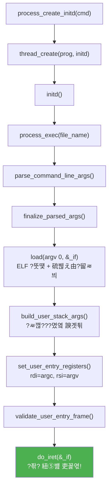

# PintOS ?꾨줈?앺듃 ?꾩쟾 遺꾩꽍

> **遺꾩꽍 湲곗? 釉뚮옖移?*: `codex/complete-system-call-features`
> **鍮꾧탳 ?€??*: `main` 釉뚮옖移?> **遺꾩꽍 ?쇱떆**: 2026-05-05

---

## 1. ?꾩옱 援ы쁽??湲곕뒫 踰붿＜

| # | 湲곕뒫 踰붿＜ | 援ы쁽 ?곹깭 |
|---|----------|----------|
| 1 | Alarm Sleep (timer_sleep) | ???꾨즺 |
| 2 | Priority Scheduling | ???꾨즺 |
| 3 | Priority Donation (Synchronization) | ???꾨즺 |
| 4 | Argument Passing | ???꾨즺 |
| 5 | System Call ?명봽??| ???꾨즺 |
| 6 | File Descriptor Table | ???꾨즺 |
| 7 | File 愿€??Syscall (open/close/read/write/create/remove/seek/tell/filesize) | ???꾨즺 |
| 8 | Process Wait / Exit | ???꾨즺 |
| 9 | Fork | ???꾨즺 |
| 10 | Exec | ???꾨즺 |
| 11 | Halt | ???꾨즺 |
| 12 | User Memory Validation | ???꾨즺 |
| 13 | MLFQS (Advanced Scheduler) | ??誘몄셿??|
| 14 | Virtual Memory (Project 3) | ??誘멸뎄??|

---

## 2. ?섏젙???뚯씪 紐⑸줉

| ?뚯씪 寃쎈줈 | ?섏젙???듭떖 ?⑥닔/援ъ“泥?| 臾댁뾿??諛붽엥?붿? | ??諛붽엥?붿? | ?곌껐 湲곕뒫 |
|-----------|----------------------|---------------|------------|----------|
| `include/threads/thread.h` | `struct thread`, `struct child_status` | wakeup_tick, priority donation ?꾨뱶, fd_table, children 由ъ뒪?? my_status, running_file 異붽? | alarm sleep, priority donation, ?뚯씪 ?쒖뒪?? ?꾨줈?몄뒪 愿€怨?異붿쟻???꾩슂 | ?꾩껜 |
| `threads/thread.c` | `init_thread()`, `thread_unblock()`, `thread_yield()`, `thread_set_priority()`, `thread_create()`, `cmp_priority()`, `try_preempt_current()`, `thread_recalculate_priority()` | priority ?뺣젹 ?쎌엯, donation ?ш퀎?? ?좎젏 ?먮떒, fd/children 珥덇린??| priority scheduling + donation + userprog 珥덇린??| Priority, Alarm, Userprog |
| `devices/timer.c` | `timer_sleep()`, `timer_interrupt()`, `sleep_list`, `thread_compare_wakeup()` | busy-wait ??sleep_list + block 諛⑹떇?쇰줈 蹂€寃?| CPU ??퉬 諛⑹? (alarm clock 援ы쁽) | Alarm Sleep |
| `threads/synch.c` | `sema_up()`, `lock_acquire()`, `lock_release()`, `cond_signal()` | priority 湲곕컲 waiter ?좏깮, donation 泥댁씤 ?꾪뙆, donation ?댁젣 | priority donation / priority-aware sync | Priority Donation |
| `userprog/syscall.c` | `syscall_handler()`, `sys_write/read/open/close/create/remove/seek/tell/filesize/exec/exit/halt/fork/wait`, ?좏슚??寃€???⑥닔??| 15媛??쒖뒪?쒖퐳 ?꾩껜 援ы쁽 + filesys_lock + ?좎? 硫붾え由?寃€利?| ?좎? ?꾨줈洹몃옩??而ㅻ꼸 ?쒕퉬?ㅻ? ?덉쟾?섍쾶 ?ъ슜?섍린 ?꾪빐 | Syscall ?꾩껜 |
| `userprog/process.c` | `process_exec()`, `process_fork()`, `process_wait()`, `process_exit()`, `process_create_initd()`, `initd()`, `__do_fork()`, `load()`, argument passing ?⑥닔?? `child_status_create/release()`, `duplicate_fd_table()` | 而ㅻ㎤?쒕씪???뚯떛, ?ㅽ깮 援ъ꽦, fork/wait/exit ?꾩껜 援ы쁽, child_status 湲곕컲 遺€紐??먯떇 ?숆린??| ?좎? ?꾨줈洹몃옩 ?ㅽ뻾???듭떖 ?앸챸二쇨린 愿€由?| Argument Passing, Fork, Wait, Exit, Exec |
| `include/userprog/process.h` | `ARG_MAX` 留ㅽ겕濡?| ARG_MAX 128 ?뺤쓽 異붽? | fd_table ?ш린?€ ?몄옄 ?쒗븳 ?듭씪 | ?꾩껜 |

---

## 3. 湲곕뒫蹂??곸꽭 遺꾩꽍

---

### 湲곕뒫 1: Alarm Sleep (timer_sleep)

#### 1) ??湲곕뒫???섎뒗 ???ㅻ젅?쒓? "N ???숈븞 ?좊뱾怨??띕떎"怨??붿껌?섎㈃, CPU瑜???퉬?섏? ?딄퀬 ?뺥솗??N???꾩뿉 源⑥썙二쇰뒗 湲곕뒫?대떎.

#### 2) ???꾩슂?쒖?
?먮옒 PintOS??`timer_sleep()`?€ busy-wait 諛⑹떇?댁뿀?? 猷⑦봽瑜??뚮㈃??怨꾩냽 ?쒓컙???뺤씤?섎땲 CPU瑜?100% 癒밸뒗?? ?닿구 "?좎옄??由ъ뒪?몄뿉 ?ｊ퀬 釉붾줉?쒗궓 ?? ?쒓컙???섎㈃ 源⑥슦湲? 諛⑹떇?쇰줈 諛붽퓭???쒕떎.

#### 3) ?섏젙???뚯씪
- `devices/timer.c` ???듭떖 援ы쁽
- `include/threads/thread.h` ??`wakeup_tick` ?꾨뱶 異붽?
- `threads/thread.c` ??`init_thread()`?먯꽌 `wakeup_tick = 0` 珥덇린??
#### 4) ?섏젙???⑥닔/援ъ“泥?
| ?⑥닔/援ъ“泥?| ??븷 |
|------------|------|
| `struct thread.wakeup_tick` | ???ㅻ젅?쒓? 紐?踰덉㎏ tick??源⑥뼱?섏빞 ?섎뒗吏€ ?€??|
| `sleep_list` (static, timer.c) | ?좎옄???ㅻ젅?쒕뱾??由ъ뒪?? wakeup_tick ?ㅻ쫫李⑥닚 ?뺣젹 |
| `thread_compare_wakeup()` | sleep_list ?뺣젹 鍮꾧탳 ?⑥닔 |
| `timer_sleep()` | wakeup_tick 怨꾩궛 ??sleep_list ?쎌엯 ??thread_block() |
| `timer_interrupt()` | 留?tick留덈떎 sleep_list ?욎そ ?뺤씤 ???쒓컙 ???ㅻ젅??unblock |

#### 5) ?ㅽ뻾 ?먮쫫

```
?ㅻ젅?쒓? timer_sleep(100) ?몄텧
  ??ticks <= 0?대㈃ 利됱떆 由ы꽩
  ???명꽣?쏀듃 鍮꾪솢?깊솕 (?먯옄??蹂댁옣)
  ??cur->wakeup_tick = ?꾩옱 tick + 100
  ??sleep_list??wakeup_tick 湲곗? ?ㅻ쫫李⑥닚 ?쎌엯
  ??thread_block() ???ㅻ젅??BLOCKED ?곹깭
  ???명꽣?쏀듃 蹂듭썝

(留?tick留덈떎 timer_interrupt ?ㅽ뻾)
  ??ticks++ ??thread_tick()
  ??sleep_list ?욎뿉?쒕???wakeup_tick <= ?꾩옱 ticks??寃??꾨?
    ??list_pop_front ??thread_unblock(t) ??try_preempt_current()
```

#### 6) ?듭떖 ?먮즺援ъ“
- `sleep_list`: ?뺣젹??留곹겕??由ъ뒪?? 媛€??癒쇱? 源⑥뼱???ㅻ젅?쒓? ?욎뿉 ?덉쓬
- `struct thread.wakeup_tick`: int64_t. 源⑥뼱???덈? tick 媛?
#### 7) 二쇱쓽????- sleep_list ?쎌엯怨?block?€ 諛섎뱶???명꽣?쏀듃 OFF ?곹깭?먯꽌 ?댁빞 ??(race condition 諛⑹?)
- timer_interrupt???명꽣?쏀듃 ?몃뱾???덉뿉???ㅽ뻾?섎?濡?thread_yield() ?€??intr_yield_on_return() ?ъ슜

#### 8) ?꾩옱 援ы쁽 ?곹깭: ???꾨즺

**愿€???뚯뒪??*: `alarm-single`, `alarm-multiple`, `alarm-simultaneous`, `alarm-zero`, `alarm-negative`, `alarm-priority`

> - ??以??붿빟: busy-wait瑜??놁븷怨?sleep_list + block/unblock 諛⑹떇?쇰줈 ?꾪솚
> - ?듭떖 ?⑥닔: `timer_sleep()`, `timer_interrupt()`
> - ?듭떖 援ъ“泥? `sleep_list`, `thread.wakeup_tick`
> - 吏꾩쭨 ?댄빐?댁빞 ?섎뒗 ?ъ씤?? ?명꽣?쏀듃 鍮꾪솢?깊솕 援ш컙?먯꽌 ?쎌엯+釉붾줉???먯옄?곸쑝濡?泥섎━?섎뒗 寃?
---

### 湲곕뒫 2: Priority Scheduling

#### 1) ??湲곕뒫???섎뒗 ???щ윭 ?ㅻ젅?쒓? ?ㅽ뻾 媛€?ν븷 ?? ?곗꽑?쒖쐞媛€ ?믪? ?ㅻ젅?쒓? 癒쇱? CPU瑜??곕룄濡?蹂댁옣?쒕떎.

#### 2) ???꾩슂?쒖?
?먮옒 PintOS??round-robin 諛⑹떇?대씪 ?꾧? 癒쇱? ?ㅽ뻾?좎? 紐⑤Ⅸ?? ?곗꽑?쒖쐞媛€ ?믪? ?ㅻ젅?쒓? 諛섎뱶??癒쇱? ?ㅽ뻾?섍쾶 ?댁빞 ?뚯뒪?몃? ?듦낵?????덈떎.

#### 3) ?섏젙???뚯씪
- `threads/thread.c`
- `threads/synch.c`

#### 4) ?섏젙???⑥닔

| ?⑥닔 | 蹂€寃??댁슜 |
|------|---------|
| `cmp_priority()` | priority ?대┝李⑥닚 鍮꾧탳 ?⑥닔 (?믪? 寃??욎뿉) |
| `thread_unblock()` | `list_push_back` ??`list_insert_ordered` (priority ?뺣젹) |
| `thread_yield()` | ready_list???꾩옱 ?ㅻ젅??蹂듦????뚮룄 `list_insert_ordered` ?ъ슜 |
| `thread_create()` | unblock ??`try_preempt_current()` ?몄텧 |
| `try_preempt_current()` | ready_list 理쒓퀬 priority > ?꾩옱 ?ㅻ젅?쒕㈃ ?좎젏 |
| `thread_set_priority()` | base_priority 媛깆떊 ??recalculate ???좎젏 ?먮떒 |
| `sema_up()` | waiters?먯꽌 理쒓퀬 priority ?ㅻ젅?쒕? 怨⑤씪 unblock |
| `cond_signal()` | condition waiters?먯꽌 理쒓퀬 priority ?ㅻ젅?쒕? 怨⑤씪 signal |

#### 5) ?ㅽ뻾 ?먮쫫

```
thread_create("A", 40, ...)
  ??init_thread ??priority=40
  ??thread_unblock(A) ??ready_list??priority ?쒖꽌?€濡??쎌엯
  ??try_preempt_current()
    ??ready_list 留???=理쒓퀬 priority)???꾩옱蹂대떎 ?믪쑝硫?
      ???명꽣?쏀듃 而⑦뀓?ㅽ듃硫?intr_yield_on_return()
      ???꾨땲硫?thread_yield()
```

#### 6) ?듭떖 ?먮즺援ъ“
- `ready_list`: priority ?대┝李⑥닚 ?뺣젹??由ъ뒪?? `list_pop_front`?섎㈃ 理쒓퀬 priority ?ㅻ젅??
#### 7) 二쇱쓽????- ready_list 議곗옉?€ ??긽 ?명꽣?쏀듃 OFF?먯꽌
- `thread_yield`?먯꽌???뺣젹 ?쎌엯 ?꾩닔

#### 8) ?꾩옱 援ы쁽 ?곹깭: ???꾨즺

**愿€???뚯뒪??*: `priority-change`, `priority-preempt`, `priority-fifo`, `priority-sema`, `priority-condvar`

> - ??以??붿빟: ready_list瑜?priority ?뺣젹濡??좎??섍퀬, ???ㅻ젅?쒓? ???믪쑝硫?利됱떆 ?좎젏
> - ?듭떖 ?⑥닔: `cmp_priority()`, `try_preempt_current()`, `thread_unblock()`
> - ?듭떖 援ъ“泥? `ready_list`
> - 吏꾩쭨 ?댄빐?댁빞 ?섎뒗 ?ъ씤?? ?쎌엯???뚮쭏???뺣젹, 爰쇰궪 ?뚮뒗 洹몃깷 pop_front

---

### 湲곕뒫 3: Priority Donation

#### 1) ??湲곕뒫???섎뒗 ????? priority ?ㅻ젅?쒓? lock???↔퀬 ?덇퀬, ?믪? priority ?ㅻ젅?쒓? 洹?lock??湲곕떎由??? ??? 履쎌쓽 priority瑜??쇱떆?곸쑝濡??щ젮??priority inversion 臾몄젣瑜??닿껐?쒕떎.

#### 2) ???꾩슂?쒖?
Priority inversion: ?믪? priority ?ㅻ젅??H)媛€ ??? priority ?ㅻ젅??L)???↔퀬 ?덈뒗 lock??湲곕떎由щ뒗?? 以묎컙 priority ?ㅻ젅??M)媛€ L蹂대떎 癒쇱? ?ㅽ뻾?섎㈃ H???곸썝??湲곕떎由????덈떎. Donation?쇰줈 L??priority瑜?H留뚰겮 ?щ젮二쇰㈃ ?닿껐?쒕떎.

#### 3) ?섏젙???뚯씪
- `include/threads/thread.h` ??donation 愿€???꾨뱶
- `threads/thread.c` ??`thread_recalculate_priority()`, `init_thread()`
- `threads/synch.c` ??`lock_acquire()`, `lock_release()`

#### 4) ?섏젙???⑥닔/援ъ“泥?
| ?대쫫 | ??븷 |
|------|------|
| `thread.base_priority` | ?먮옒 ?ㅼ젙???곗꽑?쒖쐞 (donation怨?臾닿?) |
| `thread.effective_priority` | donation 諛섏쁺???ㅼ젣 ?곗꽑?쒖쐞 |
| `thread.wait_on_lock` | ???ㅻ젅?쒓? ?꾩옱 湲곕떎由ш퀬 ?덈뒗 lock |
| `thread.donation_candidates` | ???ㅻ젅?쒖뿉寃?donation ?댁? ?ㅻ젅?쒕뱾??由ъ뒪??|
| `thread.donation_elem` | donation_candidates 由ъ뒪???곌껐???몃뱶 |
| `thread.in_donation_list` | donation 由ъ뒪?몄뿉 ?깅줉?먮뒗吏€ 異붿쟻 ?뚮옒洹?|
| `lock_acquire()` | donation 泥댁씤 ?꾪뙆 (理쒕? depth 8) |
| `lock_release()` | ?대떦 lock 湲곕떎由щ뜕 donor ?쒓굅 ??priority ?ш퀎??|
| `thread_recalculate_priority()` | max(base_priority, donations 理쒕?媛??쇰줈 priority 媛깆떊 |

#### 5) ?ㅽ뻾 ?먮쫫

```
?ㅻ젅??H(priority=40)媛€ lock_acquire(lockA) ?몄텧
lockA???ㅻ젅??L(priority=20)??蹂댁쑀 以?
  ??H->wait_on_lock = lockA
  ??H瑜?L->donation_candidates??異붽?
  ??泥댁씤 ?꾪뙆: L->effective_priority = max(L, H) = 40
    ??L->priority = 40 (?ㅼ?以꾨윭媛€ 蹂대뒗 媛?
    ??L?????ㅻⅨ lock??湲곕떎由ш퀬 ?덉쑝硫? 洹?lock??owner?먭쾶???꾪뙆 (depth < 8)
  ??sema_down() ??H??block

?섏쨷??L??lock_release(lockA)
  ??donation_candidates?먯꽌 lockA 湲곕떎由щ뜕 ?ㅻ젅??H) ?쒓굅
  ??thread_recalculate_priority(L) ??L->priority = base_priority(20)?쇰줈 蹂듦?
  ??sema_up() ??H媛€ unblock?섍퀬 ?ㅽ뻾
```

#### 6) ?듭떖 ?먮즺援ъ“

```
struct thread {
  int base_priority;           // ?먮옒 ?곗꽑?쒖쐞
  int effective_priority;      // donation 諛섏쁺???곗꽑?쒖쐞
  struct lock *wait_on_lock;   // 湲곕떎由щ뒗 lock
  struct list donation_candidates;  // ?섏뿉寃?donate???ㅻ젅??由ъ뒪??  struct list_elem donation_elem;   // 由ъ뒪???곌껐??  bool in_donation_list;            // 以묐났 ?깅줉 諛⑹?
};
```

#### 7) 二쇱쓽????- Nested donation: A?묪?묬 泥댁씤. depth ?쒗븳 8
- Multiple donation: ?щ윭 ?ㅻ젅?쒓? 媛숈? lock holder?먭쾶 ?숈떆??donate
- lock_release?먯꽌 ?대떦 lock 愿€??donor留??쒓굅?댁빞 ??(?ㅻⅨ lock??donor???좎?)

#### 8) ?꾩옱 援ы쁽 ?곹깭: ???꾨즺

**愿€???뚯뒪??*: `priority-donate-one`, `priority-donate-multiple`, `priority-donate-multiple2`, `priority-donate-nest`, `priority-donate-chain`, `priority-donate-sema`, `priority-donate-lower`

> - ??以??붿빟: lock holder?먭쾶 waiter??priority瑜?鍮뚮젮以섏꽌 priority inversion 諛⑹?
> - ?듭떖 ?⑥닔: `lock_acquire()`, `lock_release()`, `thread_recalculate_priority()`
> - ?듭떖 援ъ“泥? `donation_candidates`, `wait_on_lock`
> - 吏꾩쭨 ?댄빐?댁빞 ?섎뒗 ?ъ씤?? 泥댁씤 ?꾪뙆?€ lock蹂?donor 愿€由?
---

### 湲곕뒫 4: Argument Passing

#### 1) ??湲곕뒫???섎뒗 ??`"echo hello world"` 媛숈? 而ㅻ㎤?쒕씪??臾몄옄?댁쓣 ?뚯떛?댁꽌, ?좎? ?꾨줈洹몃옩 ?쒖옉 ??main(argc, argv) ?뺥깭濡??꾨떖?쒕떎.

#### 2) ???꾩슂?쒖?
?좎? ?꾨줈洹몃옩?€ main(int argc, char **argv)濡??몄옄瑜?諛쏅뒗?? OS媛€ ???몄옄?ㅼ쓣 ?좎? ?ㅽ깮??x86-64 ABI 洹쒖빟??留욊쾶 諛곗튂?댁쨾???꾨줈洹몃옩???뺤긽 ?숈옉?쒕떎.

#### 3) ?섏젙???뚯씪
- `userprog/process.c` ???듭떖 援ы쁽

#### 4) ?섏젙???⑥닔

| ?⑥닔 | ??븷 |
|------|------|
| `parse_command_line_args()` | strtok_r濡?怨듬갚 湲곗? ?좏겙 遺꾨━ ??argv[] 諛곗뿴 援ъ꽦 |
| `finalize_parsed_args()` | argc > 0, argv[0] != NULL 理쒖쥌 ?뺤씤 |
| `build_user_stack_args()` | ?좎? ?ㅽ깮??臾몄옄?? argv ?ъ씤?? NULL ?쇳떚?? fake return address 諛곗튂 |
| `set_user_entry_registers()` | intr_frame??rdi = argc, rsi = argv 二쇱냼 ?ㅼ젙 |
| `validate_user_entry_frame()` | rsp, rdi, rsi媛€ ?좏슚???좎? 二쇱냼?몄? 理쒖쥌 ?먭? |

#### 5) ?ㅽ뻾 ?먮쫫

```
process_exec("echo hello world")
  ??strlcpy濡?cmd_line 蹂듭궗
  ??parse_command_line_args(cmd_line, &argc, argv)
    ??"echo", "hello", "world" 遺꾨━ ??argc=3
  ??finalize_parsed_args(3, argv) ??OK
  ??load(argv[0]="echo", &_if) ??ELF 濡쒕뱶, ?ㅽ깮 留ㅽ븨
  ??build_user_stack_args(&_if, 3, argv, &argv_user_addr)
    ?좎? ?ㅽ깮 諛곗튂 (?꾨옒媛€ ??? 二쇱냼):
    ?뚢??€?€?€?€?€?€?€?€?€?€?€?€?€?€?€?€?€?€?€?€??USER_STACK (?믪? 二쇱냼)
    ??"world\0"           ??    ??"hello\0"           ??    ??"echo\0"            ??    ??(padding: 8諛붿씠???뺣젹) ??    ??NULL (argv[3])      ??    ??argv[2] 二쇱냼        ??    ??argv[1] 二쇱냼        ??    ??argv[0] 二쇱냼        ????argv_user_addr
    ??fake return (NULL)  ????rsp
    ?붴??€?€?€?€?€?€?€?€?€?€?€?€?€?€?€?€?€?€?€?€??  ??set_user_entry_registers: rdi=3, rsi=argv_user_addr
  ??validate_user_entry_frame: 理쒖쥌 寃€利?  ??do_iret(&_if) ???좎? 紐⑤뱶 吏꾩엯!
```

#### 6) ?듭떖 ?먮즺援ъ“
- `argv[]`: palloc_get_page濡??좊떦???꾩떆 諛곗뿴. 而ㅻ꼸 痢??ъ씤?곕뱾
- `arg_addrs[]`: build_user_stack_args ?대??먯꽌 ?곕뒗 ?좎? 痢?二쇱냼 諛곗뿴

#### 7) 二쇱쓽????- 8諛붿씠???뺣젹 ?꾩닔 (x86-64 ABI)
- ?ㅽ깮 ?ㅻ쾭?뚮줈??泥댄겕 (USER_STACK - PGSIZE ?댄븯濡??대젮媛€硫??ㅽ뙣)
- 臾몄옄?댁? ??닚(argc-1遺€??0源뚯?)?쇰줈 push
- palloc ?섏씠吏€??諛섎뱶???댁젣

#### 8) ?꾩옱 援ы쁽 ?곹깭: ???꾨즺

**愿€???뚯뒪??*: `args-none`, `args-single`, `args-multiple`, `args-many`, `args-dbl-space`

> - ??以??붿빟: 而ㅻ㎤?쒕씪?몄쓣 ?뚯떛?댁꽌 x86-64 ABI??留욊쾶 ?좎? ?ㅽ깮??諛곗튂
> - ?듭떖 ?⑥닔: `parse_command_line_args()`, `build_user_stack_args()`
> - ?듭떖 援ъ“泥? argv 諛곗뿴, intr_frame (rdi, rsi, rsp)
> - 吏꾩쭨 ?댄빐?댁빞 ?섎뒗 ?ъ씤?? ?ㅽ깮???꾩뿉???꾨옒濡??먮씪硫? ?뺣젹怨??쒖꽌媛€ ?뺥솗?댁빞 ??

---

### 湲곕뒫 5: System Call ?명봽??+ User Memory Validation

#### 1) ??湲곕뒫???섎뒗 ???좎? ?꾨줈洹몃옩??`syscall` 紐낅졊?대? ?ㅽ뻾?섎㈃, CPU媛€ 而ㅻ꼸 紐⑤뱶濡??꾪솚?섍퀬 `syscall_handler()`媛€ ?몄텧?쒕떎. ?ш린??syscall 踰덊샇瑜??쎄퀬, ?몄옄瑜?異붿텧?섍퀬, ?대떦 ?⑥닔瑜??ㅽ뻾???? 寃곌낵瑜??좎??먭쾶 ?뚮젮以€??

#### 2) ???꾩슂?쒖?
?좎? ?꾨줈洹몃옩?€ 吏곸젒 ?섎뱶?⑥뼱???뚯씪?쒖뒪?쒖뿉 ?묎렐?????녿떎. 而ㅻ꼸???듯빐?쒕쭔 媛€?ν븯?? ?쒖뒪?쒖퐳??洹?"李쎄뎄" ??븷???쒕떎.

#### 3) ?섏젙???뚯씪
- `userprog/syscall.c` ???꾩껜 援ы쁽

#### 4) ?섏젙???⑥닔

**?좎? 硫붾え由?寃€利??⑥닔??**

| ?⑥닔 | ??븷 |
|------|------|
| `is_valid_user_ptr(uaddr)` | NULL, 而ㅻ꼸 二쇱냼, 留ㅽ븨 ????二쇱냼 泥댄겕. bool 諛섑솚 |
| `validate_user_ptr(uaddr)` | is_valid_user_ptr ?ㅽ뙣 ??exit(-1) |
| `validate_user_buffer(buffer, size)` | 踰꾪띁 ?쒖옉~?? 紐⑤뱺 ?섏씠吏€ 寃쎄퀎 寃€利?|
| `validate_user_string(str)` | 臾몄옄?댁쓽 媛?諛붿씠?멸? ?좏슚?쒖? NUL源뚯? 寃€利?|
| `fail_invalid_user_memory()` | 怨듯넻 ?ㅽ뙣 寃쎈줈. sys_exit(-1) ?몄텧 |

**syscall_handler ?붿뒪?⑥튂:**

```c
void syscall_handler(struct intr_frame *f) {
    int sys_call = f->R.rax;  // syscall 踰덊샇
    switch (sys_call) {
        case SYS_WRITE: ... f->R.rdi, f->R.rsi, f->R.rdx ...
        case SYS_OPEN:  ... f->R.rdi ...
        // ... 珥?15媛?case
        default: sys_exit(-1);
    }
}
```

**?덉??ㅽ꽣 ???몄옄 留ㅽ븨 (x86-64 洹쒖빟):**

| ?덉??ㅽ꽣 | ?⑸룄 |
|---------|------|
| `rax` | syscall 踰덊샇 (?낅젰) / 諛섑솚媛?(異쒕젰) |
| `rdi` | 泥?踰덉㎏ ?몄옄 |
| `rsi` | ??踰덉㎏ ?몄옄 |
| `rdx` | ??踰덉㎏ ?몄옄 |

#### 5) ?ㅽ뻾 ?먮쫫

```
?좎? ?꾨줈洹몃옩: write(1, "hello", 5)
  ???쇱씠釉뚮윭由ш? rax=SYS_WRITE, rdi=1, rsi="hello", rdx=5 ?명똿
  ??syscall 紐낅졊???ㅽ뻾
  ??CPU媛€ MSR_LSTAR???깅줉??syscall_entry濡??먰봽
  ??而ㅻ꼸 ?ㅽ깮?쇰줈 ?꾪솚, intr_frame 援ъ꽦
  ??syscall_handler(f) ?몄텧
    ??f->R.rax == SYS_WRITE (10)
    ??sys_write(1, "hello", 5) ?몄텧
    ??validate_user_buffer("hello", 5) ???좏슚??寃€利?    ??fd==1?대?濡?putbuf("hello", 5) ???곕???異쒕젰
    ??return 5
  ??f->R.rax = 5 (諛섑솚媛??€??
  ???좎? 紐⑤뱶濡?蹂듦?
```

#### 6) ?듭떖 ?먮즺援ъ“
- `struct intr_frame` ??CPU ?덉??ㅽ꽣 ?곹깭瑜??대뒗 援ъ“泥? syscall 吏꾩엯/蹂듦? ???ъ슜
- `filesys_lock` ???뚯씪 ?쒖뒪???숈떆 ?묎렐 諛⑹????꾩뿭 lock

#### 7) 二쇱쓽????- ?좎?媛€ ?섍릿 ?ъ씤?곕? **諛섎뱶??* 寃€利앺빐???쒕떎. ???섎㈃ 而ㅻ꼸 ?⑤땳
- 寃€利??ㅽ뙣 ??exit(-1)濡??꾨줈?몄뒪 醫낅즺. 而ㅻ꼸?€ ?덈? 二쎌쑝硫?????- filesys_lock?쇰줈 ?뚯씪 愿€??syscall?€ 吏곷젹??
#### 8) ?꾩옱 援ы쁽 ?곹깭: ???꾨즺

> - ??以??붿빟: ?좎???syscall ?붿껌???덉쟾?섍쾶 而ㅻ꼸?먯꽌 泥섎━?섎뒗 愿€臾?> - ?듭떖 ?⑥닔: `syscall_handler()`, `validate_user_*()` ?쒕━利?> - ?듭떖 援ъ“泥? `intr_frame`, `filesys_lock`
> - 吏꾩쭨 ?댄빐?댁빞 ?섎뒗 ?ъ씤?? ?좎? ?ъ씤??寃€利앹씠 蹂댁븞???듭떖

---

### 湲곕뒫 6: File Descriptor Table + File Syscalls

#### 1) ??湲곕뒫???섎뒗 ??open, close, read, write, create, remove, seek, tell, filesize ???뚯씪 愿€???쒖뒪?쒖퐳 9媛쒕? 援ы쁽?쒕떎. 媛??꾨줈?몄뒪???먭린留뚯쓽 fd_table??媛€吏€怨? ?뚯씪???대㈃ fd(?뺤닔)瑜??뚮젮諛쏆븘 ?댄썑 read/write???ъ슜?쒕떎.

#### 2) ???꾩슂?쒖?
?좎? ?꾨줈洹몃옩???뚯씪???ㅻ（?ㅻ㈃ ?뚯씪 ?붿뒪?щ┰?곕씪??異붿긽?붽? ?꾩슂?섎떎. fd 0=stdin, fd 1=stdout, fd 2遺€???쇰컲 ?뚯씪.

#### 3) ?섏젙???뚯씪
- `include/threads/thread.h` ??fd_table, next_fd ?꾨뱶
- `threads/thread.c` ??init_thread()?먯꽌 珥덇린??- `userprog/syscall.c` ??9媛??⑥닔 援ы쁽

#### 4) ?섏젙???⑥닔/援ъ“泥?
```c
struct thread {
    struct file *fd_table[ARG_MAX];  // fd ??struct file* 留ㅽ븨. 128媛??щ’
    int next_fd;                      // ?ㅼ쓬 ?좊떦??fd ?뚰듃
};
```

| ?⑥닔 | ??븷 |
|------|------|
| `fd_alloc(file)` | fd_table?먯꽌 鍮??щ’(fd>=2) 李얠븘 file ?깅줉, fd 諛섑솚 |
| `find_file_by_fd(fd)` | fd濡?struct file* 議고쉶 |
| `sys_open(file_name)` | filesys_open ??fd_alloc ??fd 諛섑솚 |
| `sys_close(fd)` | file_close ??fd_table[fd] = NULL |
| `sys_read(fd, buf, size)` | fd==0: input_getc, fd>=2: file_read |
| `sys_write(fd, buf, size)` | fd==1: putbuf, fd>=2: file_write |
| `sys_create(file, size)` | filesys_create |
| `sys_remove(file)` | filesys_remove |
| `sys_filesize(fd)` | file_length |
| `sys_seek(fd, pos)` | file_seek |
| `sys_tell(fd)` | file_tell |

#### 5) ?ㅽ뻾 ?먮쫫 (open ??write ??close)

```
sys_open("test.txt")
  ??validate ptr, string
  ??filesys_lock ?↔린
  ??filesys_open("test.txt") ??struct file* 諛섑솚
  ??filesys_lock ?댁젣
  ??fd_alloc(file) ??fd_table[2] = file ??return 2

sys_write(2, "data", 4)
  ??validate_user_buffer("data", 4)
  ??find_file_by_fd(2) ??file
  ??filesys_lock ?↔린
  ??file_write(file, "data", 4)
  ??filesys_lock ?댁젣
  ??return 4

sys_close(2)
  ??find_file_by_fd(2) ??file
  ??filesys_lock ?↔린
  ??file_close(file)
  ??filesys_lock ?댁젣
  ??fd_table[2] = NULL
```

#### 7) 二쇱쓽????- fd 0, 1?€ stdin/stdout. ?リ굅???쇰컲 ?뚯씪濡??곕㈃ ????- open ?ㅽ뙣 ??file_close ?몄텧 ?꾩슂 (由ъ냼???꾩닔 諛⑹?)
- 紐⑤뱺 ?뚯씪 ?곗궛?€ filesys_lock?쇰줈 蹂댄샇

#### 8) ?꾩옱 援ы쁽 ?곹깭: ???꾨즺

**愿€???뚯뒪??*: `open-normal`, `open-missing`, `open-empty`, `close-normal`, `close-twice`, `read-normal`, `read-zero`, `write-normal`, `write-zero`, `create-normal`, `create-empty`, `create-long`, `remove-open`

> - ??以??붿빟: ?꾨줈?몄뒪蹂?fd_table濡??뚯씪 ?붿뒪?щ┰??愿€由? 9媛??뚯씪 syscall 援ы쁽
> - ?듭떖 ?⑥닔: `fd_alloc()`, `find_file_by_fd()`, `sys_open()`, `sys_write()`, `sys_read()`
> - ?듭떖 援ъ“泥? `thread.fd_table[128]`, `filesys_lock`
> - 吏꾩쭨 ?댄빐?댁빞 ?섎뒗 ?ъ씤?? fd 0/1 ?뱀닔 泥섎━, filesys_lock?쇰줈 吏곷젹??
---

### 湲곕뒫 7: Process Wait / Exit

#### 1) ??湲곕뒫???섎뒗 ??遺€紐??꾨줈?몄뒪媛€ ?먯떇??醫낅즺瑜?湲곕떎由ш퀬(wait), ?먯떇??醫낅즺????exit) 醫낅즺 ?곹깭瑜?遺€紐⑥뿉寃??꾨떖?쒕떎.

#### 2) ???꾩슂?쒖?
遺€紐④? ?먯떇???앸궇 ?뚭퉴吏€ 湲곕떎?ㅼ빞 ?섎뒗 ?곹솴??留롫떎. ?먯떇???뺤긽 醫낅즺?덈뒗吏€, ?먮윭濡?二쎌뿀?붿????뚯븘???쒕떎.

#### 3) ?섏젙???뚯씪
- `include/threads/thread.h` ??`struct child_status`, `thread.children`, `thread.my_status`, `thread.exit_status`
- `userprog/process.c` ??`process_wait()`, `process_exit()`, `child_status_create()`, `child_status_release()`
- `userprog/syscall.c` ??`sys_exit()`

#### 4) ?듭떖 援ъ“泥? child_status

```c
struct child_status {
    tid_t tid;                    // ?먯떇??tid
    int exit_status;              // ?먯떇??醫낅즺 肄붾뱶
    bool waited;                  // 遺€紐④? ?대? wait ?덈뒗吏€
    bool exited;                  // ?먯떇???대? 醫낅즺?덈뒗吏€
    bool fork_success;            // fork ?깃났 ?щ?
    struct semaphore fork_sema;   // fork ?숆린?붿슜
    struct semaphore wait_sema;   // wait ?숆린?붿슜
    int ref_count;                // 李몄“ 移댁슫??(遺€紐??먯떇 = 2)
    struct lock ref_lock;         // ref_count 蹂댄샇??lock
    struct list_elem elem;        // 遺€紐⑥쓽 children 由ъ뒪???곌껐??};
```

**??child_status媛€ 蹂꾨룄 援ъ“泥댁씤媛€?**
- ?먯떇 thread媛€ 癒쇱? 二쎌쓣 ???덈떎. 洹몃윭硫?thread 援ъ“泥닿? ?щ씪吏꾨떎.
- 洹몃옒??遺€紐⑥? ?먯떇??怨듭쑀?섎뒗 蹂꾨룄 硫붾え由?child_status)??醫낅즺 ?뺣낫瑜??€?ν븳??
- ref_count濡??꾧? 留덉?留됱쑝濡??곕뒗吏€ 異붿쟻?섍퀬, ?????앸굹硫?硫붾え由??댁젣.

#### 5) ?ㅽ뻾 ?먮쫫

**sys_exit ?먮쫫:**
```
sys_exit(0)
  ??curr->exit_status = 0
  ??printf("?꾨줈?몄뒪?대쫫: exit(0)")
  ??thread_exit()
    ??process_exit()
      ??close_running_file(curr)      // ?ㅽ뻾 以묒씤 ?뚯씪 ?リ린
      ??curr->my_status->exit_status = 0
      ??curr->my_status->exited = true
      ??sema_up(&my_status->wait_sema) // 遺€紐④? 湲곕떎由ш퀬 ?덉쑝硫?源⑥슦湲?      ??child_status_release(my_status) // ref_count--
      ???⑥? children??child_status??ref_count-- (怨좎븘 ?뺣━)
      ??fd_table ?꾩껜 ?リ린
      ??process_cleanup() // ?섏씠吏€ ?뚯씠釉??댁젣
    ??do_schedule(THREAD_DYING)
```

**process_wait ?먮쫫:**
```
process_wait(child_tid)
  ??children 由ъ뒪?몄뿉??tid ?쇱튂?섎뒗 child_status 李얘린
  ???녾굅???대? waited硫?return -1
  ??waited = true
  ???먯떇???꾩쭅 ??二쎌뿀?쇰㈃? sema_down(&wait_sema) ??釉붾줉
  ??(?먯떇??exit?섎㈃ sema_up?쇰줈 源⑥썙以?
  ??status = target->exit_status
  ??list_remove ??child_status_release
  ??return status
```

#### 7) 二쇱쓽????- 媛숈? ?먯떇???€??wait ??踰??몄텧?섎㈃ ??踰덉㎏??-1 諛섑솚 (waited ?뚮옒洹?
- 遺€紐④? 癒쇱? 二쎌쑝硫??먯떇??child_status ref_count媛€ 以꾩뼱?ㅺ퀬, ?먯떇??exit????理쒖쥌 ?댁젣
- exit_status 湲곕낯媛믪? -1 (鍮꾩젙??醫낅즺)

#### 8) ?꾩옱 援ы쁽 ?곹깭: ???꾨즺

**愿€???뚯뒪??*: `wait-simple`, `wait-twice`, `wait-killed`, `wait-bad-pid`, `exit`

> - ??以??붿빟: child_status 怨듭쑀 援ъ“泥?+ semaphore濡?遺€紐??먯떇 醫낅즺 ?숆린??> - ?듭떖 ?⑥닔: `process_wait()`, `process_exit()`, `sys_exit()`
> - ?듭떖 援ъ“泥? `struct child_status`, `thread.children`, `thread.my_status`
> - 吏꾩쭨 ?댄빐?댁빞 ?섎뒗 ?ъ씤?? ref_count 湲곕컲 硫붾え由?愿€由? ?꾧? 癒쇱? 二쎌뼱???덉쟾

---

### 湲곕뒫 8: Fork

#### 1) ??湲곕뒫???섎뒗 ???꾩옱 ?꾨줈?몄뒪???꾩쟾??蹂듭젣蹂몄쓣 留뚮뱺?? 遺€紐⑤뒗 ?먯떇 tid瑜?諛섑솚諛쏄퀬, ?먯떇?€ 0??諛섑솚諛쏅뒗??

#### 2) ???꾩슂?쒖?
Unix ?쒖뒪?쒖쓽 ?듭떖 媛쒕뀗. ?꾨줈?몄뒪瑜?蹂듭젣?댁꽌 ?ㅻⅨ ?묒뾽???쒗궗 ???덈떎.

#### 3) ?섏젙???뚯씪
- `userprog/process.c` ??`process_fork()`, `__do_fork()`, `duplicate_fd_table()`, `duplicate_running_file()`, `duplicate_pte()`

#### 4) ?듭떖 援ъ“泥?
```c
struct fork_args {
    struct thread *parent;           // 遺€紐??ㅻ젅???ъ씤??    struct child_status *child_status; // 怨듭쑀 ?곹깭
    struct intr_frame parent_if;     // 遺€紐⑥쓽 ?덉??ㅽ꽣 ?곹깭 蹂듭궗蹂?};
```

#### 5) ?ㅽ뻾 ?먮쫫

```
(遺€紐? process_fork("child", intr_frame)
  ??child_status_create() ??怨듭쑀 ?곹깭 ?앹꽦 (ref_count=2)
  ??fork_args ?좊떦, parent/child_status/parent_if ?명똿
  ??children 由ъ뒪?몄뿉 child_status 異붽?
  ??thread_create("child", PRI_DEFAULT, __do_fork, args)
  ??sema_down(&cs->fork_sema) ???먯떇??以€鍮꾨맆 ?뚭퉴吏€ ?€湲?
(?먯떇) __do_fork(args)
  ??parent_if 蹂듭궗 ??if_.R.rax = 0 (?먯떇??諛섑솚媛?
  ??current->my_status = cs
  ??pml4_create() ?????섏씠吏€ ?뚯씠釉?  ??pml4_for_each(parent->pml4, duplicate_pte, parent) ???섏씠吏€ 蹂듭궗
  ??duplicate_fd_table(parent, current) ??fd_table 蹂듭궗 (file_duplicate)
  ??duplicate_running_file(parent, current) ???ㅽ뻾 ?뚯씪 蹂듭궗
  ??cs->fork_success = true
  ??sema_up(&cs->fork_sema) ??遺€紐⑥뿉寃?"以€鍮??꾨즺" ?뚮┝
  ??do_iret(&if_) ???좎? 紐⑤뱶 吏꾩엯

(遺€紐?源⑥뼱??
  ??fork_success ?뺤씤
  ??return tid (?먯떇??tid)
```

#### 7) 二쇱쓽????- 遺€紐⑥쓽 intr_frame??fork_args??蹂듭궗?댁빞 ?쒕떎 (thread->tf???덈뒗 寃껋? 而ㅻ꼸 而⑦뀓?ㅽ듃)
- fd_table 蹂듭궗 ??file_duplicate ?ъ슜 (媛숈? ?뚯씪???낅┰??蹂듭궗蹂?
- fork ?ㅽ뙣 ??cs->fork_success = false ??遺€紐④? TID_ERROR 諛섑솚

#### 8) ?꾩옱 援ы쁽 ?곹깭: ???꾨즺

**愿€???뚯뒪??*: `fork-once`, `fork-multiple`, `fork-recursive`, `fork-read`, `fork-close`, `fork-boundary`

> - ??以??붿빟: ?섏씠吏€ ?뚯씠釉? fd_table, ?덉??ㅽ꽣 ?곹깭瑜?紐⑤몢 蹂듭궗?댁꽌 ?먯떇 ?꾨줈?몄뒪 ?앹꽦
> - ?듭떖 ?⑥닔: `process_fork()`, `__do_fork()`, `duplicate_pte()`, `duplicate_fd_table()`
> - ?듭떖 援ъ“泥? `struct fork_args`, `struct child_status`
> - 吏꾩쭨 ?댄빐?댁빞 ?섎뒗 ?ъ씤?? ?먯떇?€ rax=0, 遺€紐⑤뒗 rax=tid. fork_sema濡??숆린??
---

### 湲곕뒫 9: Exec

#### 1) ??湲곕뒫???섎뒗 ???꾩옱 ?꾨줈?몄뒪???꾨줈洹몃옩???덈줈???꾨줈洹몃옩?쇰줈 援먯껜?쒕떎. fork?€ ?щ━ ???꾨줈?몄뒪瑜?留뚮뱾吏€ ?딄퀬, 湲곗〈 ?꾨줈?몄뒪??肄붾뱶/?곗씠?곕? 援먯껜?쒕떎.

#### 2) ???꾩슂?쒖?
fork濡?蹂듭젣????exec?쇰줈 ?ㅻⅨ ?꾨줈洹몃옩???ㅽ뻾?섎뒗 寃껋씠 Unix???쒖? ?⑦꽩?대떎.

#### 3) ?섏젙???뚯씪
- `userprog/syscall.c` ??`sys_exec()`
- `userprog/process.c` ??`process_exec()`

#### 4) ?ㅽ뻾 ?먮쫫

```
sys_exec("ls -la")
  ??validate_user_string("ls -la")
  ??palloc_get_page ??copied_cmd??"ls -la" 蹂듭궗
  ??process_exec(copied_cmd)
    ???낅젰 寃€利?(NULL, 湲몄씠, 怨듬갚留?
    ??cmd_line 蹂듭궗 踰꾪띁 ?좊떦
    ??parse_command_line_args ??argc=2, argv=["ls", "-la"]
    ??finalize_parsed_args ??OK
    ??close_running_file(?꾩옱) ??湲곗〈 ?ㅽ뻾 ?뚯씪 ?リ린
    ??process_cleanup() ??湲곗〈 ?섏씠吏€ ?뚯씠釉??댁젣
    ??load("ls", &_if) ????ELF 濡쒕뱶, ???섏씠吏€ ?뚯씠釉?    ??build_user_stack_args ???좎? ?ㅽ깮 援ъ꽦
    ??set_user_entry_registers ??rdi=argc, rsi=argv
    ??validate_user_entry_frame ??理쒖쥌 寃€利?    ??do_iret(&_if) ?????꾨줈洹몃옩 ?쒖옉!
    ??NOT_REACHED
```

#### 7) 二쇱쓽????- exec?€ ?깃났?섎㈃ ?뚯븘?ㅼ? ?딅뒗??(NOT_REACHED)
- ?ㅽ뙣?섎㈃ -1 諛섑솚. ?섏?留??대? cleanup???곹깭?대?濡??꾨줈?몄뒪媛€ 二쎈뒗??- ?좎?媛€ ?섍릿 cmd_line 臾몄옄?댁쓣 而ㅻ꼸 ?섏씠吏€??蹂듭궗?댁빞 ?쒕떎 (process_cleanup?쇰줈 ?좎? ?섏씠吏€媛€ ?щ씪吏€誘€濡?

#### 8) ?꾩옱 援ы쁽 ?곹깭: ???꾨즺

**愿€???뚯뒪??*: `exec-once`, `exec-multiple`, `exec-arg`, `exec-missing`, `exec-bad-ptr`

> - ??以??붿빟: ?꾩옱 ?꾨줈?몄뒪???꾨줈洹몃옩?????꾨줈洹몃옩?쇰줈 援먯껜
> - ?듭떖 ?⑥닔: `sys_exec()`, `process_exec()`
> - ?듭떖 援ъ“泥? `intr_frame`
> - 吏꾩쭨 ?댄빐?댁빞 ?섎뒗 ?ъ씤?? cleanup ??load?대?濡?cmd_line??而ㅻ꼸??誘몃━ 蹂듭궗

---

### 湲곕뒫 10: Deny Write to Running Executable

#### 1) ??湲곕뒫???섎뒗 ???ㅽ뻾 以묒씤 ?꾨줈洹몃옩 ?뚯씪???€???곌린瑜?李⑤떒?쒕떎.

#### 2) ???꾩슂?쒖?
?꾨줈洹몃옩???ㅽ뻾 以묒씤???꾧뎔媛€ 洹??뚯씪???섏젙?섎㈃ ?ш컖???ㅻ쪟媛€ 諛쒖깮?????덈떎.

#### 3) 援ы쁽 ?꾩튂
- `process.c`??`load()` ??`file_deny_write(file)` ?몄텧 ??`thread->running_file = file`
- `process.c`??`close_running_file()` ???꾨줈?몄뒪 醫낅즺 ?먮뒗 exec ??`file_close()`濡?write deny ?댁젣
- `process_exit()`?먯꽌 `close_running_file(curr)` ?몄텧

#### 8) ?꾩옱 援ы쁽 ?곹깭: ???꾨즺

**愿€???뚯뒪??*: `rox-simple`, `rox-child`, `rox-multichild`


---

## 4. ?ㅼ씠?닿렇??
### A. ?꾩껜 援ъ“??
```mermaid
flowchart LR
    subgraph UserSpace["?좎? 怨듦컙"]
        UP["User Program\n(main, printf, open...)"]
    end

    subgraph KernelEntry["而ㅻ꼸 吏꾩엯??]
        SE["syscall_entry\n(?댁뀍釉붾━)"]
        SH["syscall_handler()\n(syscall.c)"]
    end

    subgraph SyscallFunctions["?쒖뒪?쒖퐳 ?⑥닔??]
        direction TB
        SF_FILE["?뚯씪 怨꾩뿴\nopen/close/read\nwrite/create/remove\nseek/tell/filesize"]
        SF_PROC["?꾨줈?몄뒪 怨꾩뿴\nfork/exec/wait\nexit/halt"]
    end

    subgraph ProcessLayer["?꾨줈?몄뒪 ?덉씠??]
        PE["process_exec()"]
        PF["process_fork()"]
        PW["process_wait()"]
        PX["process_exit()"]
    end

    subgraph ThreadLayer["?ㅻ젅???ㅼ?以꾨윭"]
        TC["thread_create()"]
        TY["thread_yield()"]
        TB2["thread_block()"]
        TU["thread_unblock()"]
        SCH["schedule()"]
        RL["ready_list\n(priority ?뺣젹)"]
    end

    subgraph SyncLayer["?숆린??]
        SEM["semaphore\nsema_up/down"]
        LCK["lock\nacquire/release"]
        DON["priority\ndonation"]
    end

    subgraph FileSystem["?뚯씪 ?쒖뒪??]
        FS["filesys_open/create\nfilesys_remove"]
        FL["file_read/write\nfile_seek/tell"]
        FLK["filesys_lock"]
    end

    subgraph Timer["?€?대㉧"]
        TS["timer_sleep()"]
        TI["timer_interrupt()"]
        SL["sleep_list"]
    end

    UP -->|"syscall 紐낅졊??| SE --> SH
    SH --> SF_FILE & SF_PROC
    SF_PROC --> PE & PF & PW & PX
    SF_FILE -->|"filesys_lock"| FLK --> FS & FL
    PE & PF --> TC
    TC --> TU --> RL
    TY --> RL
    RL --> SCH
    PW -->|"sema_down"| SEM
    PX -->|"sema_up"| SEM
    LCK --> SEM
    LCK --> DON
    TS --> SL
    TI -->|"留?tick"| SL
    SL -->|"?쒓컙 ?꾨떖"| TU
```

### B. ?⑥닔 ?몄텧 ?먮쫫??
#### B-1. ?꾨줈?몄뒪 ?ㅽ뻾 ?먮쫫



#### B-2. Syscall 泥섎━ ?먮쫫

```mermaid
flowchart TD
    USER["?좎?: write(1, buf, 5)"] --> ENTRY["syscall_entry\nCPU 紐⑤뱶 ?꾪솚"]
    ENTRY --> HANDLER["syscall_handler(f)"]
    HANDLER --> RAX{"f->R.rax\nsyscall 踰덊샇?"}
    RAX -->|"SYS_WRITE=10"| WRITE["sys_write(fd, buf, size)"]
    RAX -->|"SYS_OPEN=15"| OPEN["sys_open(name)"]
    RAX -->|"SYS_EXIT=1"| EXIT["sys_exit(status)"]
    RAX -->|"SYS_FORK=2"| FORK["process_fork()"]
    RAX -->|"SYS_WAIT=3"| WAIT["process_wait()"]
    RAX -->|"SYS_EXEC=4"| EXEC["sys_exec()"]
    RAX -->|"湲고?"| OTHER["..."]
    RAX -->|"default"| DEFT["sys_exit(-1)"]

    WRITE --> VAL["validate_user_buffer()"]
    VAL --> FD{"fd == 1?"}
    FD -->|"Yes"| PUTBUF["putbuf(buf, size)\n?곕???異쒕젰"]
    FD -->|"No"| FINDFD["find_file_by_fd(fd)"]
    FINDFD --> FWRITE["file_write()"]
    PUTBUF & FWRITE --> RET["f->R.rax = 諛섑솚媛?]

    style USER fill:#2196F3,color:white
    style RET fill:#4CAF50,color:white
```

#### B-3. Wait / Exit ?먮쫫

```mermaid
sequenceDiagram
    participant P as 遺€紐??꾨줈?몄뒪
    participant CS as child_status
    participant C as ?먯떇 ?꾨줈?몄뒪

    P->>CS: child_status_create() (ref=2)
    P->>C: thread_create() ??fork/exec

    Note over P: process_wait(child_tid)
    P->>CS: children?먯꽌 tid 李얘린
    P->>CS: waited = true

    alt ?먯떇 ?꾩쭅 ?ㅽ뻾 以?        P->>CS: sema_down(wait_sema) ??釉붾줉
        Note over C: ?먯떇 ?ㅽ뻾 以?..
        C->>CS: exit_status = N, exited = true
        C->>CS: sema_up(wait_sema)
        CS->>P: 遺€紐?源⑥뼱??    else ?먯떇 ?대? 醫낅즺
        Note over P: sema_down ????    end

    P->>CS: status = exit_status
    P->>CS: list_remove + child_status_release (ref--)
    C->>CS: child_status_release (ref--)
    Note over CS: ref==0?대㈃ palloc_free_page
```

#### B-4. Timer Sleep ?먮쫫

```mermaid
flowchart LR
    subgraph ?몄텧["timer_sleep(100)"]
        A1["?명꽣?쏀듃 OFF"] --> A2["wakeup_tick = now + 100"]
        A2 --> A3["sleep_list???쎌엯\n(?ㅻ쫫李⑥닚 ?뺣젹)"]
        A3 --> A4["thread_block()\nBLOCKED ?곹깭"]
        A4 --> A5["?명꽣?쏀듃 蹂듭썝"]
    end

    subgraph ?명꽣?쏀듃["timer_interrupt (留?tick)"]
        B1["ticks++"] --> B2["thread_tick()"]
        B2 --> B3{"sleep_list ??nwakeup <= ticks?"}
        B3 -->|"Yes"| B4["pop + unblock\n+ try_preempt"]
        B4 --> B3
        B3 -->|"No"| B5["??]
    end

    ?몄텧 -.->|"?쒓컙 寃쎄낵"| ?명꽣?쏀듃
```

### C. ?먮즺援ъ“ 愿€怨꾨룄

```mermaid
classDiagram
    class thread {
        tid_t tid
        char name[16]
        int priority
        int base_priority
        int effective_priority
        int64_t wakeup_tick
        lock* wait_on_lock
        list donation_candidates
        list_elem donation_elem
        bool in_donation_list
        uint64_t* pml4
        file* fd_table[128]
        int next_fd
        list children
        child_status* my_status
        int exit_status
        file* running_file
        intr_frame tf
    }

    class child_status {
        tid_t tid
        int exit_status
        bool waited
        bool exited
        bool fork_success
        semaphore fork_sema
        semaphore wait_sema
        int ref_count
        lock ref_lock
        list_elem elem
    }

    class fork_args {
        thread* parent
        child_status* child_status
        intr_frame parent_if
    }

    class initd_args {
        char* file_name
        child_status* child_status
    }

    class intr_frame {
        R.rax: syscall踰덊샇/諛섑솚媛?        R.rdi: ?몄옄1
        R.rsi: ?몄옄2
        R.rdx: ?몄옄3
        rsp: ?ㅽ깮?ъ씤??        rip: ?ㅼ쓬?ㅽ뻾二쇱냼
    }

    thread "1" --> "*" child_status : children 由ъ뒪??    thread "1" --> "0..1" child_status : my_status ?ъ씤??    thread "1" --> "0..128" file : fd_table 諛곗뿴
    thread "1" --> "0..1" lock : wait_on_lock
    thread "1" --> "*" thread : donation_candidates
    fork_args --> thread : parent
    fork_args --> child_status : child_status
    fork_args --> intr_frame : parent_if
    initd_args --> child_status : child_status
```

### D. ?섏젙 吏€??留?
```mermaid
flowchart TD
    subgraph Repo["PintOS Repository"]
        subgraph Headers["include/"]
            TH["threads/thread.h\n?륅툘 struct thread ?뺤옣\n?륅툘 struct child_status 異붽?\n?륅툘 wakeup_tick, donation,\n   fd_table, children ??]
            PH["userprog/process.h\n?륅툘 ARG_MAX ?뺤쓽"]
        end

        subgraph Threads["threads/"]
            TC2["thread.c\n?륅툘 init_thread 珥덇린??n?륅툘 priority ?뺣젹 ?쎌엯\n?륅툘 try_preempt_current\n?륅툘 recalculate_priority"]
            SY["synch.c\n?륅툘 lock_acquire donation\n?륅툘 lock_release donation ?댁젣\n?륅툘 sema_up priority ?좏깮\n?륅툘 cond_signal priority ?좏깮"]
        end

        subgraph Devices["devices/"]
            TM["timer.c\n?륅툘 sleep_list 異붽?\n?륅툘 timer_sleep block 諛⑹떇\n?륅툘 timer_interrupt 源⑥슦湲?]
        end

        subgraph Userprog["userprog/"]
            SC["syscall.c\n?륅툘 15媛?syscall 援ы쁽\n?륅툘 ?좎? 硫붾え由?寃€利?n?륅툘 filesys_lock\n?륅툘 fd_alloc/find"]
            PC["process.c\n?륅툘 argument passing\n?륅툘 process_exec ?꾩껜\n?륅툘 process_fork/wait/exit\n?륅툘 child_status 愿€由?n?륅툘 fd_table/running_file 蹂듭젣\n?륅툘 load() deny_write"]
        end
    end

    TH -.-> TC2
    TH -.-> SC
    TH -.-> PC
    TH -.-> TM
    TH -.-> SY
    PH -.-> PC

    style TH fill:#FF9800,color:white
    style SC fill:#F44336,color:white
    style PC fill:#F44336,color:white
    style TC2 fill:#2196F3,color:white
    style SY fill:#2196F3,color:white
    style TM fill:#4CAF50,color:white
```

---

## 5. ?꾩껜 援ы쁽 ?붿빟

### 吏€湲덇퉴吏€ 援ы쁽??寃?
| ?꾨줈?앺듃 | 湲곕뒫 | ?곹깭 |
|---------|------|------|
| Project 1 | Alarm Clock (timer_sleep) | ??|
| Project 1 | Priority Scheduling | ??|
| Project 1 | Priority Donation | ??|
| Project 2 | Argument Passing | ??|
| Project 2 | System Call ?명봽??| ??|
| Project 2 | File Syscalls (9媛? | ??|
| Project 2 | Process Lifecycle (fork/exec/wait/exit) | ??|
| Project 2 | User Memory Validation | ??|
| Project 2 | Deny Write to Executables | ??|

### ?꾩쭅 鍮꾩뼱 ?덈뒗 寃?
| 湲곕뒫 | ?곹깭 | 鍮꾧퀬 |
|------|------|------|
| MLFQS (Advanced Scheduler) | ??| `thread_set_nice`, `thread_get_nice`, `thread_get_load_avg`, `thread_get_recent_cpu` 紐⑤몢 TODO |
| Virtual Memory (Project 3) | ??| `lazy_load_segment`, VM??`setup_stack` 誘멸뎄??|

### ?뚯뒪???곌껐 ?뺣━

| ?뚯뒪???대쫫 | ?곌껐 湲곕뒫 |
|------------|----------|
| `alarm-single/multiple/simultaneous/zero/negative` | Alarm Sleep |
| `alarm-priority` | Alarm Sleep + Priority |
| `priority-change/preempt/fifo` | Priority Scheduling |
| `priority-sema/condvar` | Priority + Sync |
| `priority-donate-one/multiple/multiple2/nest/chain/sema/lower` | Priority Donation |
| `args-none/single/multiple/many/dbl-space` | Argument Passing |
| `halt` | sys_halt |
| `exit` | sys_exit |
| `create-normal/empty/long/exists/bound` | sys_create |
| `open-normal/missing/empty/null/twice` | sys_open |
| `close-normal/twice/bad-fd` | sys_close |
| `read-normal/zero/bad-fd/stdout` | sys_read |
| `write-normal/zero/bad-fd/stdin` | sys_write |
| `fork-once/multiple/recursive/read/close/boundary` | fork |
| `exec-once/multiple/arg/missing/bad-ptr` | exec |
| `wait-simple/twice/killed/bad-pid` | wait |
| `rox-simple/child/multichild` | Deny Write |
| `bad-read/write/jump` | User Memory Validation |
| `sc-bad-sp/bad-arg` | Syscall Validation |
| `multi-oom` | 醫낇빀 (fork+exec+wait+memory) |

### 諛쒗몴????留먰븯硫?醫뗭? ?듭떖 ?ъ씤??
1. **Alarm Clock**: busy-wait瑜??놁븷怨?sleep_list + block/unblock?쇰줈 CPU ?⑥쑉??2. **Priority Scheduling**: ready_list瑜???긽 priority ?뺣젹 ?좎?, ?쎌엯 ???뺣젹 + ?좎젏 ?먮떒
3. **Priority Donation**: nested(泥댁씤) + multiple(?ㅼ쨷) donation 紐⑤몢 吏€?? depth ?쒗븳 8
4. **Argument Passing**: x86-64 ABI 洹쒖빟??留욊쾶 ?좎? ?ㅽ깮??argc/argv 諛곗튂
5. **Syscall 蹂댁븞**: ?좎? ?ъ씤?곕? 3以?寃€利?NULL/而ㅻ꼸二쇱냼/留ㅽ븨?щ?). ?ㅽ뙣 ??exit(-1)
6. **child_status ?ㅺ퀎**: 遺€紐??먯떇 ?대뒓 履쎌씠 癒쇱? 二쎌뼱???덉쟾??ref_count 湲곕컲 怨듭쑀 援ъ“泥?7. **Fork**: ?섏씠吏€ ?뚯씠釉? fd_table, ?덉??ㅽ꽣 ?곹깭瑜??꾩쟾??蹂듭젣. fork_sema濡??숆린??8. **filesys_lock**: 紐⑤뱺 ?뚯씪 ?쒖뒪???묎렐??吏곷젹?뷀븯??race condition 諛⑹?

### 肄붾뱶 由щ럭?먯꽌 吏덈Ц諛쏄린 ?ъ슫 遺€遺?
1. **"fd_table??128媛쒕㈃ 異⑸텇?쒓??"** ??PintOS ?뚯뒪??踰붿쐞?먯꽌??異⑸텇. ?ㅼ젣 OS???숈쟻 ?좊떦
2. **"filesys_lock ?섎굹濡?異⑸텇?쒓??"** ???⑥닚?섏?留?蹂묐ぉ. ?ㅼ젣 OS??inode蹂?lock
3. **"fork?먯꽌 parent_if瑜???蹂듭궗?섎뒗媛€?"** ??thread->tf??而ㅻ꼸 而⑦뀓?ㅽ듃. ?좎? ?덉??ㅽ꽣 ?곹깭??syscall 吏꾩엯 ?쒖쓽 intr_frame???덉쓬
4. **"child_status??ref_count媛€ ??2?멸??"** ??遺€紐?children 由ъ뒪?? + ?먯떇(my_status ?ъ씤??. ????李몄“ ?댁젣?댁빞 free
5. **"donation depth 8 ?쒗븳?€ ??"** ??臾댄븳 泥댁씤 諛⑹?. PintOS ?뚯뒪?몃뒗 理쒕? 8?④퀎
6. **"process_exec?먯꽌 cleanup ??load ?ㅽ뙣?섎㈃?"** ???대? ?섏씠吏€ ?뚯씠釉??댁젣?? ?꾨줈?몄뒪 二쎌쓬. exec?€ ?뚯븘?????녿뒗 ?ㅻ━
7. **"validate_user_buffer?먯꽌 ?섏씠吏€ 寃쎄퀎 寃€?щ뒗 ??"** ??踰꾪띁媛€ ???섏씠吏€??嫄몄튌 ???덉쓬. 泥??섏씠吏€留?留ㅽ븨?섏뼱 ?덉쑝硫?以묎컙??page fault

