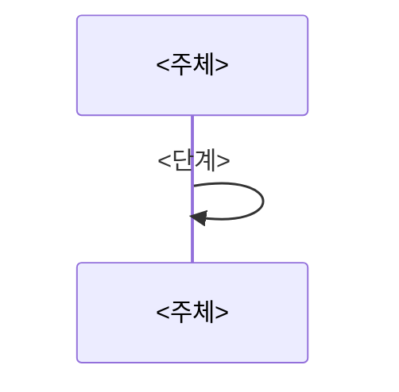
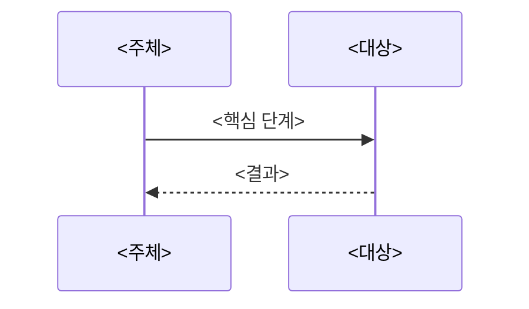

# <NN> — 기능 <번호>: <기능명>

## 1. 구현 목적 및 필요성
### 이 기능이 무엇인가
`<기능 정의>`

### 왜 이걸 하는가 (문제 맥락)
`<문제/필요성>`

### 무엇을 연결하는가 (기술 맥락)
`<관련 함수/자료구조/경계>`

### 완성의 의미 (결과 관점)
`<기능 완료 기준>`

## 2. 가능한 구현 방식 비교
- 방식 A: `<설명>`
  - 장점: `<...>`
  - 단점: `<...>`
- 방식 B: `<설명>`
  - 장점: `<...>`
  - 단점: `<...>`
- 선택: `<A/B>`

## 3. 시퀀스와 단계별 흐름

1. `<단계 1>`
2. `<단계 2>`
3. `<단계 3>`

## 4. 기능별 가이드 (개념/흐름 + 구현 주석 위치)
### 4.1 기능 A: <소기능명>
#### 개념 설명
`<핵심 개념>`

#### 시퀀스 및 흐름

1. `<흐름 1>`
2. `<흐름 2>`
3. `<흐름 3>`

#### 구현 주석 (보면 되는 함수/구조체)
- 위치: `<파일 경로>`
- 위치: `<파일 경로>`의 `<함수/구조체명>`

### 4.2 기능 B: <소기능명>
#### 개념 설명
`<핵심 개념>`

#### 시퀀스 및 흐름

1. `<흐름 1>`
2. `<흐름 2>`
3. `<흐름 3>`

#### 구현 주석 (보면 되는 함수/구조체)
- 위치: `<파일 경로>`
- 위치: `<파일 경로>`의 `<함수/구조체명>`

## 5. 구현 주석 (위치별 정리)

이 장은 **이 문서 주제 안에서 실제로 손대는 함수·구조체·분기·실패 경로마다** 구현 주석을 둔다.
4장의 소기능(4.1, 4.2, …)마다 대응하는 `5.N`이 있어야 하고, 한 소기능이 여러 구현 지점으로 나뉘면 `5.N.1`, `5.N.2`, … 로 쪼갠다.
구현자가 이 장만 보고 "어느 파일의 어느 함수에서 무엇을 추가해야 하는지" 바로 알 수 있어야 한다.
`01` 번대 **개요 문서**만 예외로, 큰 그림 전용이면 5장을 생략할 수 있되, 대신 하위 feature 문서의 5장으로 안내한다.

### 5.1 <기능/구현 묶음명>

#### 5.1.1 `<함수명()>`의 <구체 역할>
- 위치: `<파일 경로>`
- 역할: `<이 함수/분기/구조체가 맡는 책임>`
- 규칙 1: `<구현 조건>`
- 규칙 2: `<구현 조건>`
- 금지 1: `<하면 안 되는 구현>`

구현 체크 순서:
1. `<체크 1>`
2. `<체크 2>`
3. `<체크 3>`

#### 5.1.2 `<다른 함수명()>`의 <구체 역할>
- 위치: `<파일 경로>`
- 역할: `<이 구현 지점이 맡는 책임>`
- 규칙 1: `<구현 조건>`
- 규칙 2: `<구현 조건>`
- 금지 1: `<하면 안 되는 구현>`

구현 체크 순서:
1. `<체크 1>`
2. `<체크 2>`

### 5.2 <다음 기능/구현 묶음명>

#### 5.2.1 `<함수명()>`의 <구체 역할>
- 위치: `<파일 경로>`
- 역할: `<이 함수/분기/구조체가 맡는 책임>`
- 규칙 1: `<구현 조건>`
- 금지 1: `<하면 안 되는 구현>`

구현 체크 순서:
1. `<체크 1>`
2. `<체크 2>`

## 6. 테스팅 방법
- `<관련 테스트 1>`
- `<관련 테스트 2>`
- 실패 시 `<우선 점검할 함수/규칙>`
