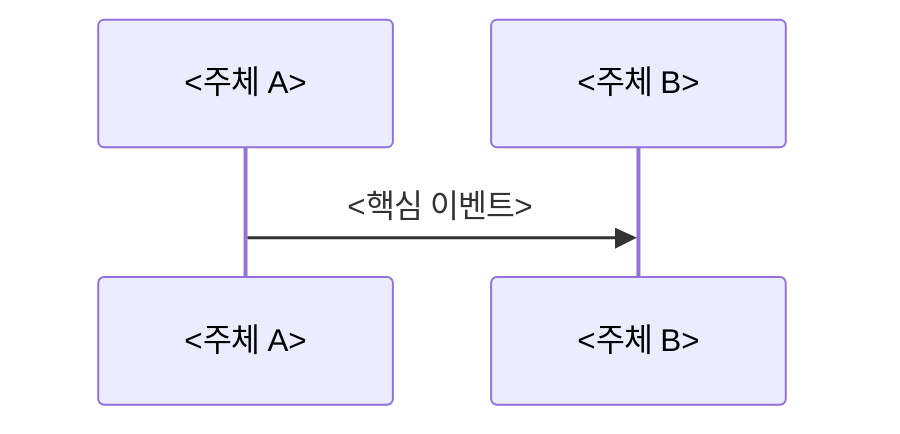

# 01 — <주제> 전체 개념과 동작 흐름

이 문서는 `<주제>`를 처음 볼 때 필요한 큰 그림을 잡기 위한 개요 문서입니다.  
핵심 개념과 실행 흐름이 어떻게 연결되는지 빠르게 이해하도록 구성합니다.

---

## 1) <주제>를 한 문장으로 설명하면

**"<한 문장 정의>"** 입니다.

핵심은 `<핵심 포인트>`까지 포함해 보는 것입니다.

---

## 2) 왜 필요한가 (문제의식)

`<기존 방식의 한계/실패 상황>` 때문에 `<주제>`가 필요합니다.  
이를 해결하려면 `<핵심 해결 전략>`이 필요합니다.

---

## 3) 동작 시퀀스와 단계별 흐름

시퀀스를 단계로 읽으면 다음과 같습니다.

1. `<단계 1>`
2. `<단계 2>`
3. `<단계 3>`

---

## 4) 반드시 분리해서 이해할 개념

- **정책/규칙 계층**: `<무엇을 결정하는가>`
- **구조/실행 계층**: `<어디서 어떤 자료구조로 동작하는가>`

이 경계를 섞으면 회귀가 크게 발생합니다.

---

## 5) 이 기능에서 자주 틀리는 지점

- `<자주 하는 실수 1>`
- `<자주 하는 실수 2>`
- `<자주 하는 실수 3>`

---

## 6) 학습 순서 (추천)

1. `<02-feature-...>`
2. `<03-feature-...>`
3. `<04-feature-...>`

---

## 7) 구현 전에 스스로 체크할 질문

- `<질문 1>`
- `<질문 2>`
- `<질문 3>`
