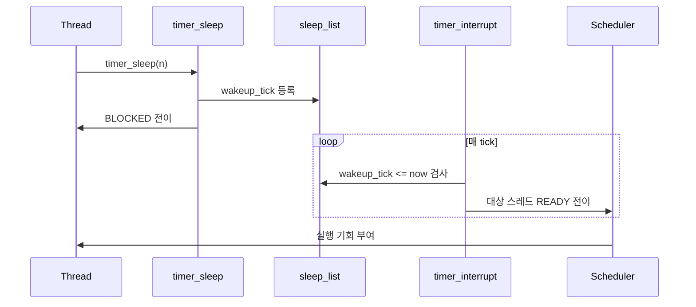

# 01 — Alarm Clock 전체 개념과 동작 흐름

이 문서는 Alarm Clock을 처음 볼 때 필요한 "큰 그림"을 잡기 위한 개요 문서입니다.  
코드를 바로 보지 않아도, 왜 이 기능이 필요하고 어떤 순서로 동작하는지 머릿속 시뮬레이션이 가능하도록 구성했습니다.

---

## 1) Alarm Clock을 한 문장으로 설명하면

**"스레드를 일정 시간 BLOCKED 상태로 재웠다가, 시간이 되면 READY 상태로 정확히 되돌리는 기능"**입니다.

핵심은 단순한 기다림이 아니라, 기다리는 동안 **CPU를 낭비하지 않는 것**입니다.

---

## 2) 왜 필요한가 (문제의식)

busy waiting(반복 루프)으로 시간을 기다리면, 스레드는 실제 일을 하지 않으면서 CPU를 계속 점유합니다.  
OS 입장에서는 비효율이고, 동시에 다른 스레드 실행 기회도 줄어듭니다.

Alarm Clock은 이 문제를 해결하기 위해:
- 기다리는 스레드를 `BLOCKED`로 내려 CPU를 양보하고
- 정확한 시점에 다시 `READY`로 올려
- 스케줄러가 공정하게 실행하도록 연결합니다.

---

## 3) 동작 시퀀스와 단계별 흐름

시퀀스를 단계로 읽으면 다음과 같습니다.

1. **잠들기 진입**  
   스레드가 `timer_sleep(ticks)`를 호출합니다.
2. **깨울 시점 등록**  
   `wakeup_tick = 현재 tick + ticks`를 계산해 `sleep_list`에 등록합니다.
3. **스레드 잠듦**  
   현재 스레드는 `BLOCKED` 상태로 전이됩니다.
4. **tick마다 깨움 판정**  
   `timer_interrupt()`가 매 tick마다 wake 조건(`wakeup_tick <= now`)을 검사합니다.
5. **READY 복귀 후 스케줄링**  
   조건을 만족한 스레드를 `READY`로 올리고, 실제 실행 순서는 scheduler가 결정합니다.

---

## 4) 반드시 분리해서 이해할 개념

- **Alarm의 책임**: 언제 깨울지 판단하고 `READY`로 올리는 것
- **Scheduler의 책임**: READY 중 누가 먼저 CPU를 받을지 결정하는 것

이 두 책임이 섞이면 priority 관련 버그가 자주 발생합니다.

---

## 5) 이 기능에서 자주 틀리는 지점

- `ticks <= 0`인데도 잠재우는 실수
- `sleep_list` 정렬이 깨져서 늦게 자는 스레드가 먼저 깨는 문제
- interrupt에서 한 스레드만 깨우고 종료해서 동시 wake 누락
- "깨웠으니 바로 실행돼야 한다"라고 오해하는 문제  
  (`READY` 전이와 `RUNNING` 전이는 다름)

---

## 6) 학습 순서 (추천)

큰 그림을 잡은 다음, 아래 순서로 내려가면 가장 이해가 잘 됩니다.

1. `02-feature-sleep-entry.md` — 스레드를 어떻게 잠재우고, 깨움 대상을 어떻게 정렬 관리하는가
2. `03-feature-wakeup-execution-on-tick.md` — tick마다 어떻게 실제로 깨우는가
3. `04-feature-scheduler-integration.md` — 깨운 후 스케줄러와 어떻게 맞물리는가

---

## 7) 구현 전에 스스로 체크할 질문

- `timer_sleep`는 CPU 양보를 보장하는가?
- wake-up 시점을 저장하는 규칙이 정렬 기준으로 명확한가?
- interrupt에서 "조건 만족 대상 모두" 처리하는가?
- Alarm과 scheduler의 책임 경계가 코드에서 분명한가?

이 네 질문에 답할 수 있으면, 구현은 "빈칸 채우기"에 가까워집니다.
