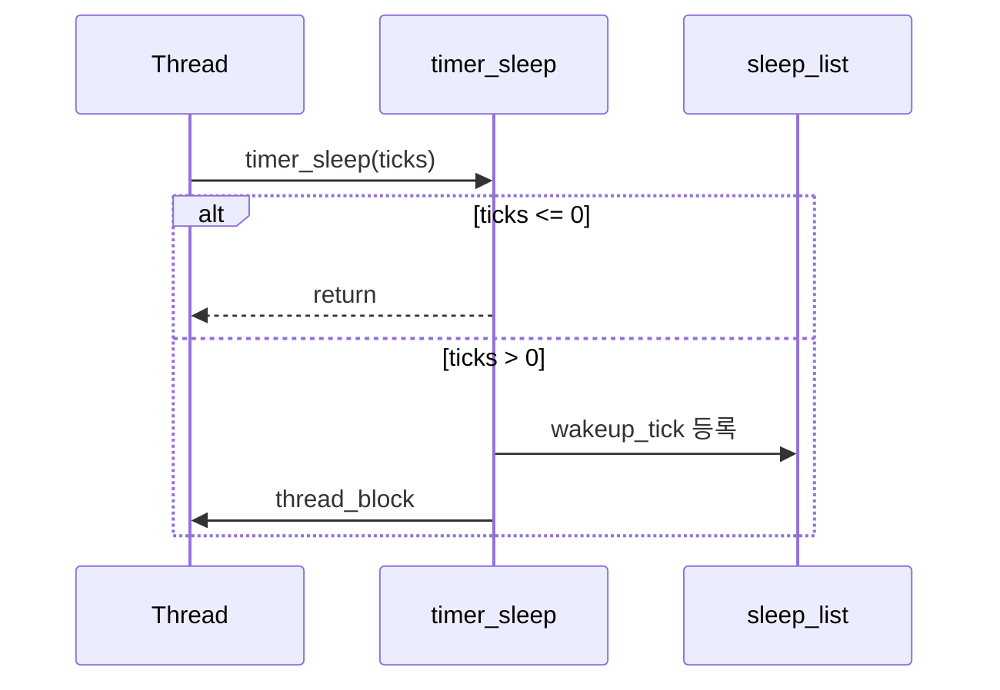

# 02 — 기능 1: 잠들기 진입과 깨움 대상 관리 (Sleep Entry + Target Management)

## 1. 구현 목적 및 필요성
### 이 기능이 무엇인가
`timer_sleep()` 호출 시 스레드를 sleep 상태로 진입시키고, `sleep_list`에 깨어날 시점을 정렬 등록해 이후 wake-up 대상이 정확히 선택되도록 만드는 기능입니다.

### 왜 이걸 하는가 (문제 맥락)
스레드를 "지연"시키는 기능은 Alarm의 시작점입니다. 이 단계에서 입력 처리(`ticks <= 0`)와 상태 전이가 틀리면 이후 모든 기능이 연쇄적으로 깨집니다.

### 무엇을 연결하는가 (기술 맥락)
`timer_sleep()`이 입력 계약을 처리하고, `wakeup_tick` 정렬 등록 후 `thread_block()`으로 상태를 BLOCKED로 내립니다.

### 완성의 의미 (결과 관점)
이 기능이 올바르면 CPU를 낭비하지 않고 정확한 시점까지 잠들게 하며, wake 대상 선택 기준도 항상 일관되게 유지됩니다.

## 2. 가능한 구현 방식 비교
- 방식 A: busy wait
  - 장점: 구현 단순
  - 단점: CPU 낭비, 과제 의도와 불일치
- 방식 B: block/unblock
  - 장점: 효율적, 기능 분리 명확
  - 단점: interrupt/리스트 정합성 관리 필요
- 방식 C: block/unblock + 정렬 리스트 유지
  - 장점: wake 대상 판정 효율적, 동시 wake 처리 안정적
  - 단점: 정렬 기준과 비교 함수 관리 필요
- 선택: C

## 3. 시퀀스와 단계별 흐름

시퀀스를 단계로 읽으면 다음과 같습니다.

1. 입력 계약 분기 (`ticks <= 0`)
2. 인터럽트 원자 구간 진입
3. `wakeup_tick = timer_ticks() + ticks`
4. `sleep_list` 등록
5. `thread_block()`
6. 인터럽트 상태 복원

## 4. 구현 주석 (구현 필요 함수 전체)

### 4.1 `sleep_list` 선언/소유 구현 주석
- 위치: `pintos/devices/timer.c` (전역 정적 변수)
- 역할: Alarm Clock에서 "잠든 스레드 집합"을 보관하는 핵심 자료구조를 제공한다.
- 규칙 1: `sleep_list`는 `static struct list sleep_list;` 형태로 타이머 모듈 내부에 선언한다.
- 규칙 2: 이 리스트에는 sleep 중인 스레드만 들어가고, ready/running 스레드는 포함하지 않는다.
- 규칙 3: 리스트 정렬 불변식은 `wakeup_tick` 오름차순으로 유지한다.
- 금지 1: 스레드를 sleep_list와 ready_list에 동시에 두지 않는다.

구현 체크 순서:
1. `timer.c`에 `sleep_list`를 모듈 내부 정적 변수로 선언한다.
2. 리스트 원소는 sleep 상태 스레드만 담도록 경계를 유지한다.
3. wakeup 기준 정렬 불변식(`wakeup_tick` 오름차순)을 문서와 코드에서 일치시킨다.

### 4.2 `timer_init()` 구현 주석
- 위치: `pintos/devices/timer.c`
- 역할: sleep 기능에서 사용할 `sleep_list`의 초기 상태를 보장한다.
- 규칙 1: `sleep_list`는 사용 전에 반드시 `list_init(&sleep_list)`로 초기화한다.
- 규칙 2: 이 초기화는 타이머 모듈 초기화 시점(`timer_init`)에 1회 수행한다.
- 규칙 3: 인터럽트 핸들러 등록 전에 리스트 초기화를 끝내 일관된 상태를 보장한다.
- 금지 1: 지연 초기화(lazy init)로 첫 `timer_sleep()` 호출 시점까지 미루지 않는다.

구현 체크 순서:
1. `timer_init()` 초기에 `list_init(&sleep_list)`를 수행한다.
2. 인터럽트 핸들러 등록 전에 리스트 초기화를 완료한다.
3. 중복 초기화로 리스트 상태가 깨지지 않는지 확인한다.

### 4.3 `timer_sleep()` 구현 주석
- 위치: `pintos/devices/timer.c`
- 역할: 현재 스레드를 sleep 경로에 등록하고 `BLOCKED` 상태로 전이한다.
- 규칙 1: `ticks <= 0`이면 상태를 바꾸지 않고 즉시 반환한다.
- 규칙 2: sleep 등록부터 block까지는 인터럽트 경합이 없도록 원자 구간에서 처리한다.
- 규칙 3: `wakeup_tick`은 "현재 tick + 요청 tick"으로 계산해 현재 스레드에 기록한다.
- 규칙 4: 현재 스레드는 `sleep_list`에 `wakeup_tick` 기준 오름차순으로 삽입한다.
- 규칙 5: 등록이 끝난 스레드는 `thread_block()`으로 `BLOCKED` 상태로 전이한다.
- 규칙 6: 함수 종료 전에 인터럽트 레벨을 원래 상태로 복원한다.
- 금지 1: busy wait(`thread_yield` 루프) 방식으로 지연 구현하지 않는다.

구현 체크 순서:
1. `ticks <= 0` 입력을 먼저 빠르게 반환한다.
2. 인터럽트를 비활성화하고 `wakeup_tick = timer_ticks() + ticks`를 계산한다.
3. `sleep_list`에 정렬 삽입한다.
4. `thread_block()`으로 현재 스레드를 BLOCKED로 전이한다.
5. 인터럽트 레벨을 원래 상태로 복원한다.

### 4.4 `thread_compare_wakeup()` 구현 주석
- 위치: `pintos/devices/timer.c`
- 역할: `sleep_list` 정렬 규칙(`wakeup_tick` 오름차순)을 유지하는 비교를 제공한다.
- 규칙 1: 비교 기준은 오직 `wakeup_tick` 값으로 한다.
- 규칙 2: 더 이른 tick에 깨어나야 할 스레드가 앞에 오도록 true/false를 반환한다.
- 금지 1: 비교 함수에서 priority 등 wakeup과 무관한 기준을 섞지 않는다.

구현 체크 순서:
1. 두 스레드의 `wakeup_tick`을 읽는다.
2. 더 작은 `wakeup_tick`이 앞에 오도록 반환값을 구성한다.
3. 동점 처리 정책이 전체 wake 루프와 충돌하지 않는지 확인한다.

### 4.5 범위 경계 메모 (02 -> 03 연계)
- `timer_interrupt()`의 wake-up 실행 상세는 `03-feature-wakeup-execution-on-tick.md`의 구현 범위다.
- 이 문서(02)에서는 `timer_sleep()`이 정렬/등록까지 정확히 수행해 03에서 head 기반 반복 깨우기가 가능하도록 만드는 것에 집중한다.

## 5. 테스팅 방법
- `alarm-zero`: `ticks==0` 즉시 반환 확인
- `alarm-negative`: `ticks<0` 즉시 반환 확인
- `alarm-wait`: sleep 진입과 등록 경로가 동작하는지 기본 확인

> `alarm-simultaneous`/wake 반복 처리 검증은 `03-feature-wakeup-execution-on-tick.md` 범위에서 다룬다.
