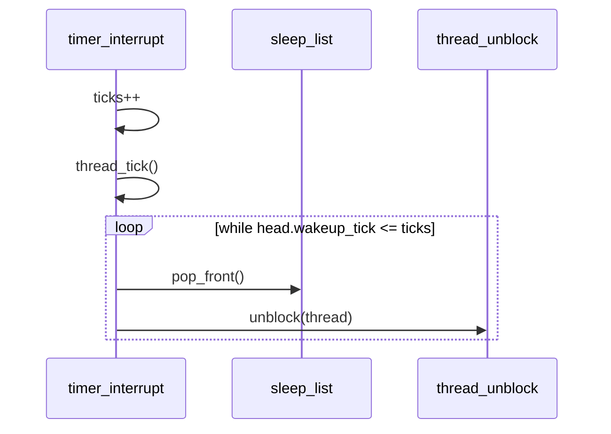

# 03 — 기능 2: tick 기반 깨우기 실행 (Wake-up Execution)

## 1. 구현 목적 및 필요성
### 이 기능이 무엇인가
매 timer tick마다 깨울 시점이 된 스레드를 찾아 `READY` 상태로 전이시키는 실행 기능입니다.

### 왜 이걸 하는가 (문제 맥락)
잠들기 등록만 있고 깨우기 실행이 없으면 스레드는 영구 BLOCKED가 됩니다. 이 기능은 "시간이 되었을 때 실제로 깨우는 단계"입니다.

### 무엇을 연결하는가 (기술 맥락)
`timer_interrupt()`가 전역 tick을 갱신하고, `sleep_list`의 조건 만족 스레드를 반복적으로 `thread_unblock()`합니다.

### 완성의 의미 (결과 관점)
동시 wake-up 케이스에서도 누락 없이 READY 전이가 일어나야 기능이 완성됩니다.

## 2. 가능한 구현 방식 비교
- 방식 A: 조건 만족 대상 1개만 처리
  - 장점: 구현 단순
  - 단점: 동시 wake 누락
- 방식 B: while 반복으로 전부 처리
  - 장점: 정합성 우수
  - 단점: 반복 조건 설계 필요
- 선택: B

## 3. 시퀀스와 단계별 흐름

시퀀스를 단계로 읽으면 다음과 같습니다.

1. tick 증가
2. `thread_tick()` 수행
3. `sleep_list` head 조건 검사
4. 조건 만족 스레드를 반복 unblock

## 4. 구현 주석 (구현 필요 함수 전체)

### 4.1 `timer_interrupt()` 구현 주석
- 위치: `pintos/devices/timer.c`
- 역할: 깨어날 시점이 된 스레드를 반복적으로 `READY` 상태로 복귀시킨다.
- 규칙 1: 인터럽트마다 전역 tick을 정확히 1 증가시킨다.
- 규칙 2: tick 증가 직후 `thread_tick()`을 호출해 스케줄러 tick을 동기화한다.
- 규칙 3: `sleep_list`의 head를 기준으로 wake 조건(`wakeup_tick <= 현재 tick`)을 검사한다.
- 규칙 4: 조건을 만족하는 스레드는 연속 구간 전체를 반복해서 깨운다.
- 규칙 5: 깨울 때는 리스트 제거 후 `thread_unblock()` 순서로 처리한다.
- 금지 1: 조건 만족 스레드를 1개만 처리하고 루프를 종료하지 않는다.

구현 체크 순서:
1. 인터럽트 진입 시 tick을 1 증가시킨다.
2. `thread_tick()`을 호출해 타임슬라이스 회계를 반영한다.
3. `sleep_list` head가 wake 조건을 만족하는 동안 반복한다.
4. 각 반복에서 `pop_front` 후 `thread_unblock()`을 수행한다.
5. 리스트 head가 조건을 벗어나면 루프를 종료한다.

### 4.2 `thread_unblock()` 연계 주석
- 위치: `pintos/threads/thread.c`
- 역할: interrupt 경로에서 전달된 sleep 스레드를 실행 가능 상태(`READY`)로 전이한다.
- 규칙 1: `timer_interrupt()`가 전달한 스레드는 `READY` 상태로 전이되어야 한다.
- 규칙 2: unblock은 실행 보장이 아니라 실행 가능 상태 전이임을 전제로 한다.
- 금지 1: `thread_unblock()`에서 wake 대상의 수면 메타데이터를 다시 조작하지 않는다.

구현 체크 순서:
1. interrupt 경로에서 전달된 스레드가 BLOCKED 상태인지 확인한다.
2. `thread_unblock()`으로 READY 전이를 수행한다.
3. 실행 순서 결정은 scheduler 정책에 위임한다.

## 5. 테스팅 방법
- `alarm-simultaneous`: 동일 tick 다중 깨움 검증
- `alarm-wait` (`multiple`): 누락 없는 반복 깨움 확인
