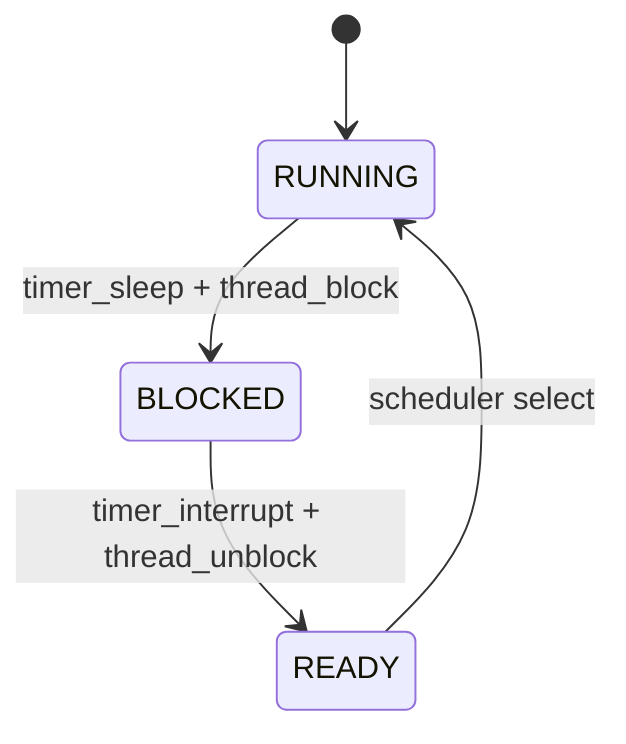

# 04 — 기능 3: 스케줄러 연계 (Scheduler Integration)

## 1. 구현 목적 및 필요성
### 이 기능이 무엇인가
Alarm이 깨운 스레드를 scheduler 규칙과 충돌 없이 실행 가능한 상태로 넘기기 위한 연계 기능입니다.

### 왜 이걸 하는가 (문제 맥락)
Alarm은 스레드를 깨우는 기능이지만, 실제 실행 순서를 잘못 다루면 priority 테스트에서 쉽게 깨집니다.

### 무엇을 연결하는가 (기술 맥락)
`thread_block/unblock`의 상태 전이와 scheduler의 ready queue 선택 규칙을 일관되게 맞춥니다.

### 완성의 의미 (결과 관점)
Alarm은 READY 전이까지만 담당하고, 실행 순서 결정은 scheduler가 담당하는 경계가 명확해집니다.

## 2. 가능한 구현 방식 비교
- 방식 A: Alarm 코드가 실행 순서까지 직접 개입
  - 장점: 당장 동작을 맞추기 쉬워 보임
  - 단점: 결합도 증가, 회귀 위험 큼
- 방식 B: Alarm은 상태 전이만, 스케줄러는 선택만 담당
  - 장점: 책임 분리 명확, 유지보수 용이
  - 단점: 초기 이해에 약간 시간 필요
- 선택: B

## 3. 시퀀스와 단계별 흐름

시퀀스를 단계로 읽으면 다음과 같습니다.

1. sleep 시 `BLOCKED` 전이
2. wake 시 `READY` 전이
3. 실행 결정은 ready queue 정책에 위임

## 4. 구현 주석 (구현 필요 함수 전체)

### 4.1 `cmp_priority()` 비교 함수
- 위치: `pintos/threads/thread.c` (static helper)
- 역할: `ready_list` 정렬 삽입에서 "높은 priority가 앞" 규칙을 정의한다.
- 규칙 1: 비교 기준은 `thread.priority`로 고정한다.
- 규칙 2: 높은 priority가 먼저 오도록 반환값을 구성한다.

### 4.2 `thread_unblock()` ready queue 삽입 정책
- 위치: `pintos/threads/thread.c`
- 역할: 깨운 스레드를 우선순위 규칙에 맞게 `ready_list`에 복귀시킨다.
- 규칙 1: `ready_list` 삽입은 단순 `push_back`이 아니라 `list_insert_ordered(..., cmp_priority, ...)`로 처리한다.
- 규칙 2: `THREAD_BLOCKED -> THREAD_READY` 전이는 기존처럼 인터럽트 비활성 구간에서 수행한다.

### 4.3 `thread_yield()`의 재삽입 정책
- 위치: `pintos/threads/thread.c`
- 역할: 현재 실행 스레드가 양보할 때도 ready queue의 priority 규칙을 깨지 않게 유지한다.
- 규칙 1: `curr`를 `ready_list`에 되돌릴 때도 `list_insert_ordered(..., cmp_priority, ...)`를 사용해 priority 순서를 유지해야 한다.
- 규칙 2: idle thread는 기존과 동일하게 ready queue 삽입 대상에서 제외한다.

### 4.4 `timer_interrupt()` 선점 트리거 구현
- 위치: `pintos/devices/timer.c` (`timer_interrupt()` wake 루프 이후)
- 역할: 인터럽트 핸들러에서 깨운 스레드가 현재 스레드보다 우선순위가 높을 때 선점 예약을 건다.
- 규칙 1: wake 루프에서 `thread_unblock(t)`를 호출한 직후, `t->priority > thread_current()->priority` 조건을 검사한다.
- 규칙 2: 위 조건을 만족한 스레드가 하나라도 있으면 `intr_yield_on_return()`을 호출해 인터럽트 복귀 시점 선점을 예약한다.
- 규칙 3: 인터럽트 컨텍스트에서는 `thread_yield()`를 직접 호출하지 않는다.

## 5. 테스팅 방법
- `alarm-priority`: READY 전이 이후 priority 반영 검증
- `alarm-simultaneous`: 다중 READY 전이 상황 정합성 검증
