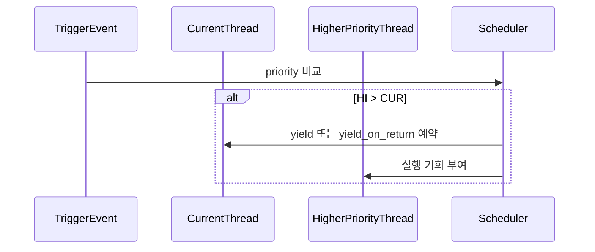

# 03 — 기능 2: 선점 트리거 경로 (Preemption Triggers)

## 1. 구현 목적 및 필요성
### 이 기능이 무엇인가
더 높은 priority 스레드가 준비되었을 때, 현재 실행 스레드를 적절한 시점에 양보시키는 선점 트리거 경로를 구성하는 기능입니다.

### 왜 이걸 하는가 (문제 맥락)
ready queue 정렬만으로는 즉시 실행 전환이 보장되지 않습니다. 트리거가 없으면 고우선순위 스레드가 불필요하게 지연됩니다.

### 무엇을 연결하는가 (기술 맥락)
`thread_unblock()`, `thread_set_priority()`, `thread_create()` 경로와 인터럽트 경로(`intr_yield_on_return`)를 연결합니다.

### 완성의 의미 (결과 관점)
고우선순위 스레드는 조건 만족 직후 가장 이른 안전 시점에 CPU 실행 기회를 얻습니다.

## 2. 가능한 구현 방식 비교
- 방식 A: 정렬만 유지하고 타임슬라이스에만 의존
  - 장점: 구현 단순
  - 단점: preempt 테스트에서 지연/실패 가능
- 방식 B: 이벤트 기반 선점 트리거 추가
  - 장점: 우선순위 반응성 우수
  - 단점: 컨텍스트별 호출 제약 고려 필요
- 선택: B

## 3. 시퀀스와 단계별 흐름

시퀀스를 단계로 읽으면 다음과 같습니다.

1. 선점 후보 이벤트(생성/unblock/priority 변경)를 감지한다.
2. 현재 실행 스레드와 새 READY 후보의 priority를 비교한다.
3. 컨텍스트 제약에 맞는 양보 경로를 선택한다.

## 4. 구현 주석 (구현 필요 함수 전체)

### 4.1 `thread_unblock()` 후 선점 판단
- 위치: `pintos/threads/thread.c`
- 역할: unblock된 스레드가 현재보다 높으면 즉시 선점 경로를 연계한다.
- 규칙 1: `thread_unblock()` 호출 컨텍스트를 고려해 안전한 양보 경로를 선택한다.
- 규칙 2: 인터럽트 컨텍스트에서는 `thread_yield()` 직접 호출을 피한다.

### 4.2 `thread_set_priority()` 구현 주석
- 위치: `pintos/threads/thread.c`
- 역할: 현재 스레드 priority 변경 직후 실행 자격을 재평가한다.
- 규칙 1: 현재 priority가 낮아져 더 높은 READY 스레드가 존재하면 `thread_yield()`를 호출한다.
- 규칙 2: donation이 활성화된 경우 base priority와 effective priority 정책을 분리해 적용한다.

### 4.3 `thread_create()` 연계 구현 주석
- 위치: `pintos/threads/thread.c`
- 역할: 새로 생성된 고우선순위 스레드가 불필요하게 지연되지 않도록 한다.
- 규칙 1: 생성 직후 READY 진입한 스레드가 더 높으면 선점 판단 경로를 수행한다.

### 4.4 `timer_interrupt()` 연계 구현 주석
- 위치: `pintos/devices/timer.c`
- 역할: 인터럽트 컨텍스트에서 unblock된 고우선순위 스레드에 대해 선점 예약을 건다.
- 규칙 1: wake 루프 중 고우선순위 대상이 하나라도 있으면 `intr_yield_on_return()`을 예약한다.
- 규칙 2: 인터럽트 핸들러 내부에서 `thread_yield()`를 직접 호출하지 않는다.

## 5. 테스팅 방법
- `priority-preempt`: 고우선순위 READY 직후 선점 반영 확인
- `priority-change`: priority 변경 후 즉시 재평가 확인
- `alarm-priority`: timer interrupt 경로 선점 예약 연계 확인
