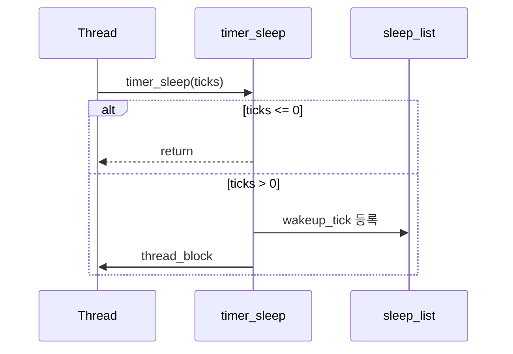

# 02 — 기능 1: 잠들기 진입 (Sleep Entry)

## 1. 구현 목적 및 필요성
### 이 기능이 무엇인가
`timer_sleep()` 호출 시 스레드를 sleep 상태로 진입시키고, 깨어날 시점 정보를 등록해 CPU를 양보하도록 만드는 진입 기능입니다.

### 왜 이걸 하는가 (문제 맥락)
스레드를 "지연"시키는 기능은 Alarm의 시작점입니다. 이 단계에서 입력 처리(`ticks <= 0`)와 상태 전이가 틀리면 이후 모든 기능이 연쇄적으로 깨집니다.

### 무엇을 연결하는가 (기술 맥락)
`timer_sleep()`이 입력 계약을 처리하고, `wakeup_tick` 등록 후 `thread_block()`으로 상태를 BLOCKED로 내립니다.

### 완성의 의미 (결과 관점)
이 기능이 올바르면 CPU를 낭비하지 않고 정확한 시점까지 잠들게 할 수 있습니다.

## 2. 가능한 구현 방식 비교
- 방식 A: busy wait
  - 장점: 구현 단순
  - 단점: CPU 낭비, 과제 의도와 불일치
- 방식 B: block/unblock
  - 장점: 효율적, 기능 분리 명확
  - 단점: interrupt/리스트 정합성 관리 필요
- 선택: B

## 3. 시퀀스와 단계별 흐름

시퀀스를 단계로 읽으면 다음과 같습니다.

1. 입력 계약 분기 (`ticks <= 0`)
2. 인터럽트 원자 구간 진입
3. `wakeup_tick = timer_ticks() + ticks`
4. `sleep_list` 등록
5. `thread_block()`
6. 인터럽트 상태 복원

## 4. 구현 주석 (구현 필요 함수 전체)

### 4.1 `timer_sleep()` 구현 주석
- 위치: `pintos/devices/timer.c`
- 규칙 1: `ticks <= 0`이면 상태를 바꾸지 않고 즉시 반환한다.
- 규칙 2: sleep 등록부터 block까지는 인터럽트 경합이 없도록 원자 구간에서 처리한다.
- 규칙 3: `wakeup_tick`은 "현재 tick + 요청 tick"으로 계산해 현재 스레드에 기록한다.
- 규칙 4: 현재 스레드는 `sleep_list`에 `wakeup_tick` 기준 오름차순으로 삽입한다.
- 규칙 5: 등록이 끝난 스레드는 `thread_block()`으로 `BLOCKED` 상태로 전이한다.
- 규칙 6: 함수 종료 전에 인터럽트 레벨을 원래 상태로 복원한다.

### 4.2 `thread_compare_wakeup()` 구현 주석
- 위치: `pintos/devices/timer.c`
- 역할: `wakeup_tick` 오름차순 비교를 제공해 `sleep_list` 정렬을 유지
- 규칙 1: 비교 기준은 오직 `wakeup_tick` 값으로 한다.
- 규칙 2: 더 이른 tick에 깨어나야 할 스레드가 앞에 오도록 true/false를 반환한다.

### 4.3 `timer_interrupt()` 구현 주석 (연계 필수)
- 위치: `pintos/devices/timer.c`
- 역할: sleep 등록된 스레드를 실제로 깨우는 실행 경로
- 규칙 1: 매 인터럽트마다 전역 tick을 증가시키고 scheduler tick 갱신을 수행한다.
- 규칙 2: `sleep_list`의 head부터 검사해 `wakeup_tick <= 현재 tick`인 스레드를 깨운다.
- 규칙 3: 조건을 만족하는 스레드는 하나만이 아니라 연속 구간 전체를 반복 처리한다.
- 규칙 4: 깨울 때는 리스트에서 제거한 뒤 `thread_unblock()`으로 `READY` 전이한다.

## 5. 테스팅 방법
- `alarm-zero`: `ticks==0` 즉시 반환 확인
- `alarm-negative`: `ticks<0` 즉시 반환 확인
- `alarm-wait`: 실제 sleep 진입/복귀 확인
