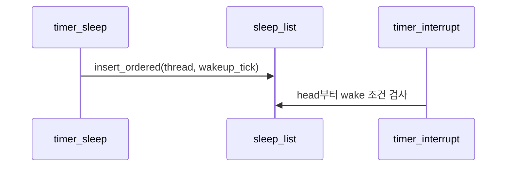

# 03 — 기능 2: 깨움 대상 관리 (Wake-up Target Management)

## 1. 구현 목적 및 필요성
### 이 기능이 무엇인가
sleep 중인 스레드들의 wake-up 시점을 자료구조(`sleep_list`)로 관리해, 어떤 스레드를 먼저 깨울지 결정 가능한 상태를 유지하는 기능입니다.

### 왜 이걸 하는가 (문제 맥락)
언제 깨울지를 저장하는 구조가 불안정하면 sleep/wake 정확성이 깨집니다. 이 기능은 "누가 먼저 깨어나야 하는가"를 데이터 구조로 보장합니다.

### 무엇을 연결하는가 (기술 맥락)
`timer_sleep()`에서 등록한 스레드를 `sleep_list`에 정렬 상태로 유지해 `timer_interrupt()`가 head부터 안전하게 소비하게 만듭니다.

### 완성의 의미 (결과 관점)
정렬 불변식이 유지되면 wake 대상 탐색 비용이 낮고 동시 wake에서도 누락이 줄어듭니다.

## 2. 가능한 구현 방식 비교
- 방식 A: 정렬 리스트
  - 장점: 구현 단순, head 검사 효율적
  - 단점: 삽입 시 정렬 비용 존재
- 방식 B: 매 tick 전체 순회
  - 장점: 삽입 단순
  - 단점: interrupt 경로 비효율
- 방식 C: 힙
  - 장점: 이론상 효율 우수
  - 단점: 과제 대비 구현 부담 큼
- 선택: A

## 3. 시퀀스와 단계별 흐름

시퀀스를 단계로 읽으면 다음과 같습니다.

1. 비교 기준을 `wakeup_tick`으로 고정
2. 삽입 시 정렬 유지
3. head가 최소 tick임을 전제로 wake 루프 동작

## 4. 구현 주석 (구현 필요 함수 전체)

### 4.1 `thread_compare_wakeup()` 구현 주석
- 위치: `pintos/devices/timer.c`
- 규칙 1: 비교 기준은 `wakeup_tick` 하나로 고정한다.
- 규칙 2: 더 이른 tick이 리스트 앞에 오도록 true/false를 반환한다.
- 규칙 3: 비교 함수는 side effect 없이 순수 비교만 수행한다.

### 4.2 `timer_sleep()`의 정렬 삽입 구현 주석
- 위치: `pintos/devices/timer.c`
- 규칙 1: sleep 진입 시 현재 스레드를 `sleep_list`에 정렬 삽입한다.
- 규칙 2: 삽입 기준은 반드시 `thread_compare_wakeup()`을 사용한다.
- 규칙 3: 삽입 이후에도 `sleep_list` head가 최소 `wakeup_tick`을 유지해야 한다.

### 4.3 `timer_interrupt()`의 head 소비 전제 구현 주석
- 위치: `pintos/devices/timer.c`
- 규칙 1: wake 판단은 `sleep_list` head부터 시작한다.
- 규칙 2: head가 아직 깰 시점이 아니면 이후 원소도 검사하지 않는다.

## 5. 테스팅 방법
- `alarm-wait` (`multiple`): wake 순서 검증
- `alarm-simultaneous`: 동일 tick 다중 wake 검증
