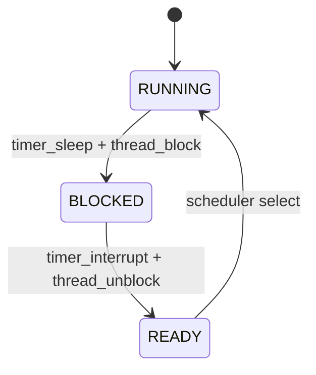

# 04 — 기능 3: 스케줄러 연계 (Scheduler Integration)

## 1. 구현 목적 및 필요성
### 이 기능이 무엇인가
Alarm이 깨운 스레드를 scheduler 규칙과 충돌 없이 실행 가능한 상태로 넘기기 위한 연계 기능입니다.

### 왜 이걸 하는가 (문제 맥락)
Alarm은 스레드를 깨우는 기능이지만, 실제 실행 순서를 잘못 다루면 priority 테스트에서 쉽게 깨집니다.

### 무엇을 연결하는가 (기술 맥락)
`thread_block/unblock`의 상태 전이와 scheduler의 ready queue 선택 규칙을 일관되게 맞춥니다.

### 완성의 의미 (결과 관점)
Alarm은 READY 전이까지만 담당하고, 실행 순서 결정은 scheduler가 담당하는 경계가 명확해집니다.

## 2. 가능한 구현 방식 비교
- 방식 A: Alarm 코드가 실행 순서까지 직접 개입
  - 장점: 당장 동작을 맞추기 쉬워 보임
  - 단점: 결합도 증가, 회귀 위험 큼
- 방식 B: Alarm은 상태 전이만, 스케줄러는 선택만 담당
  - 장점: 책임 분리 명확, 유지보수 용이
  - 단점: 초기 이해에 약간 시간 필요
- 선택: B

## 3. 시퀀스와 단계별 흐름

시퀀스를 단계로 읽으면 다음과 같습니다.

1. sleep 시 `BLOCKED` 전이
2. wake 시 `READY` 전이
3. 실행 결정은 ready queue 정책에 위임

## 4. 구현 주석 (구현 필요 함수 전체)

### 4.1 `thread_block()` 구현 주석
- 위치: `pintos/threads/thread.c`
- 역할: sleep 진입 스레드를 실행 경로에서 제외하고 `BLOCKED` 상태로 전이한다.
- 규칙 1: sleep 진입 스레드는 `RUNNING -> BLOCKED` 상태 전이가 보장되어야 한다.
- 규칙 2: block된 스레드는 ready queue에서 즉시 제외되어야 한다.

### 4.2 `thread_unblock()` 구현 주석
- 위치: `pintos/threads/thread.c`
- 역할: wake 대상 스레드를 `READY`로 되돌려 scheduler 선택 대상에 다시 포함시킨다.
- 규칙 1: wake 대상 스레드는 `BLOCKED -> READY` 전이가 보장되어야 한다.
- 규칙 2: READY 전이 시 우선순위 규칙을 깨지 않는 큐 삽입 정책을 따라야 한다.

### 4.3 Alarm-스케줄러 경계 규칙
- 위치: `pintos/devices/timer.c` + `pintos/threads/thread.c`
- 역할: Alarm과 scheduler의 책임 경계를 분리해 우선순위 회귀를 방지한다.
- 규칙 1: Alarm은 wake 조건 판단과 unblock까지만 수행한다.
- 규칙 2: 실제 실행 스레드 선택은 scheduler가 담당한다.
- 규칙 3: "깨움"과 "즉시 실행"을 동일 개념으로 다루지 않는다.

## 5. 테스팅 방법
- `alarm-priority`: READY 전이 이후 priority 반영 검증
- `alarm-simultaneous`: 다중 READY 전이 상황 정합성 검증
