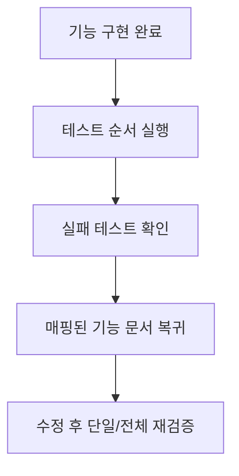

# 07 — Feature Validation by Tests

## 1. 구현 목적 및 필요성
### 이 기능이 무엇인가
기능 구현 완료 후 테스트로 검증을 닫는 순서와 복귀 기준을 고정하는 문서입니다.

### 왜 이걸 하는가 (문제 맥락)
테스트를 무작위로 돌리면 실패 원인 추적이 느려집니다. 검증 순서와 매핑을 고정해야 수정 루프가 짧아집니다.

### 무엇을 연결하는가 (기술 맥락)
`1. feature/02~06`의 구현 규칙과 `2. testing/01~05` 테스트 문서를 1:1로 연결합니다.

### 완성의 의미 (결과 관점)
실패 테스트가 곧바로 수정 함수로 연결되고, 검증 종료 기준이 명확해집니다.

## 2. 가능한 검증 방식 비교
- 방식 A: 테스트 무순서 실행
  - 장점: 시작이 빠름
  - 단점: 실패 해석이 느림
- 방식 B: 난도 순서 + 매핑 기반 실행
  - 장점: 실패 지점 식별이 빠름
  - 단점: 순서 규율 필요
- 선택: B

## 3. 시퀀스와 단계별 흐름

시퀀스를 단계로 읽으면 다음과 같습니다.
1. 권장 순서로 테스트를 실행한다.
2. 실패 테스트를 확인한다.
3. 매핑된 기능 문서로 돌아가 수정한다.
4. 실패 테스트 단일 통과 후 전체를 재검증한다.

## 4. 구현 주석 (검증 연결 규칙)
### 4.1 검증 순서 규칙
- 위치: `2. testing/00-README.md`
- 규칙 1: `zero -> negative -> wait -> simultaneous -> priority` 순서로 실행한다.
- 규칙 2: 앞 테스트가 깨지면 뒤 테스트 해석을 미룬다.

### 4.2 기능-테스트 매핑 규칙
- 위치: `1. feature/02~06`, `2. testing/01~05`
- 규칙 1: Sleep Entry(`02`) <-> `01`, `02`, `03`
- 규칙 2: Target Management(`03`) <-> `03`, `04`
- 규칙 3: Wakeup Execution(`04`) <-> `03`, `04`
- 규칙 4: Scheduler Integration(`05`) <-> `05`
- 규칙 5: Failure Patterns(`06`)은 실패 원인 라벨링 기준으로 사용한다.

## 5. 테스팅 방법
1. `2. testing/01-alarm-zero.md`
2. `2. testing/02-alarm-negative.md`
3. `2. testing/03-alarm-wait.md`
4. `2. testing/04-alarm-simultaneous.md`
5. `2. testing/05-alarm-priority.md`
