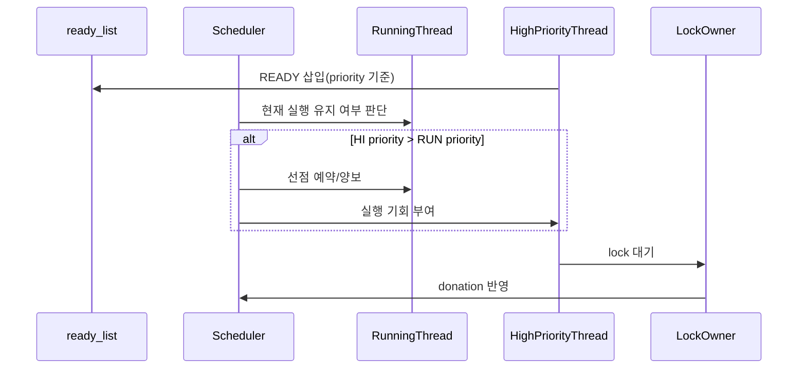

# 01 — Priority Scheduling 전체 개념과 동작 흐름

이 문서는 Priority Scheduling을 처음 볼 때 필요한 큰 그림을 잡기 위한 개요 문서입니다.  
우선순위 기반 실행, 선점, 기부(donation)가 어떻게 연결되는지 한 번에 이해하도록 구성했습니다.

---

## 1) Priority Scheduling을 한 문장으로 설명하면

**"READY 집합에서 가장 높은 우선순위 스레드를 먼저 실행하고, 필요한 경우 즉시 선점하는 정책"**입니다.

핵심은 단순 정렬이 아니라, 락 대기 상황에서 priority inversion을 막는 보정(donation)까지 포함하는 것입니다.

---

## 2) 왜 필요한가 (문제의식)

라운드로빈만 사용하면 중요 작업(고우선순위)이 낮은 우선순위 작업 뒤에 밀릴 수 있습니다.  
또한 락을 잡은 저우선순위 스레드 때문에 고우선순위 스레드가 오래 대기하는 inversion 문제가 발생합니다.

Priority Scheduling은 이 문제를 해결하기 위해:
- ready queue를 priority 기준으로 유지하고
- 더 높은 priority가 준비되면 선점하고
- lock 대기에서는 donation으로 inversion을 완화합니다.

---

## 3) 동작 시퀀스와 단계별 흐름

시퀀스를 단계로 읽으면 다음과 같습니다.

1. 고우선순위 스레드가 READY 상태로 들어온다.
2. 스케줄러는 현재 실행 스레드와 priority를 비교한다.
3. 필요하면 선점 경로를 통해 실행 스레드를 교체한다.
4. 락 대기가 발생하면 donation을 적용해 inversion을 줄인다.

---

## 4) 반드시 분리해서 이해할 개념

- **정책 계층**: priority 비교, 선점 조건, donation 규칙
- **구조 계층**: ready_list 삽입/제거, lock waiters 정렬

정책과 구조를 섞어서 수정하면 회귀가 크게 발생합니다.

---

## 5) 이 기능에서 자주 틀리는 지점

- `thread_unblock()`은 정렬 삽입했는데 `thread_yield()`는 push_back으로 남겨둔 경우
- 인터럽트 컨텍스트에서 `thread_yield()`를 직접 호출하는 경우
- `thread_set_priority()`에서 즉시 재평가/양보를 누락한 경우
- donation 체인을 한 단계만 처리하고 끝내는 경우

---

## 6) 학습 순서 (추천)

1. `02-feature-ready-queue-ordering.md` — ready queue 정렬 삽입 정책
2. `03-feature-preemption-triggers.md` — 선점이 언제, 어디서 트리거되는가
3. `04-feature-donation-and-sync-boundary.md` — donation과 동기화 경계

---

## 7) 구현 전에 스스로 체크할 질문

- 모든 READY 삽입 경로가 priority 정렬 규칙을 공유하는가?
- 선점 경로가 인터럽트/스레드 컨텍스트 제약을 지키는가?
- donation 적용/해제가 lock 수명주기와 일치하는가?
- priority 테스트 실패 시 수정 지점을 함수 단위로 좁힐 수 있는가?
