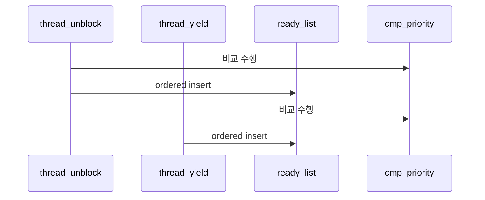

# 02 — 기능 1: ready queue 우선순위 정렬 (Ready Queue Ordering)

## 1. 구현 목적 및 필요성

### 이 기능이 무엇인가

`ready_list`에 들어오는 스레드를 priority 기준으로 정렬 유지해, 스케줄러가 항상 최고 priority 후보를 먼저 선택하게 만드는 기능입니다.

### 왜 이걸 하는가 (문제 맥락)

삽입 경로마다 정책이 다르면 테스트마다 실행 순서가 흔들립니다. 정렬 불변식을 공통 규칙으로 고정해야 합니다.

### 무엇을 연결하는가 (기술 맥락)

`cmp_priority()` 비교 함수와 `thread_unblock()`, `thread_yield()`, `thread_create()` 경로를 연결해 READY 삽입 정책을 단일화합니다.

### 완성의 의미 (결과 관점)

READY 집합의 head가 항상 최고 priority 후보가 되며, preemption 판단의 기준이 안정됩니다.

## 2. 가능한 구현 방식 비교

- 방식 A: `list_push_back` 유지 + 선택 시 선형 탐색
  - 장점: 삽입 단순
  - 단점: 선택/검증 비용 증가, 경로별 불일치 위험
- 방식 B: 삽입 시 `list_insert_ordered` 유지
  - 장점: head 의미가 명확, preemption 연계 단순
  - 단점: 삽입 시 비교 함수 품질에 의존
- 선택: B

## 3. 시퀀스와 단계별 흐름

시퀀스를 단계로 읽으면 다음과 같습니다.

1. READY 삽입 경로를 식별한다.
2. 각 경로에서 동일 비교 함수(`cmp_priority`)를 사용한다.
3. 삽입 후 head가 최고 priority인지 확인한다.

## 4. 구현 주석 (구현 필요 함수 전체)

### 4.1 `cmp_priority()` 구현 주석

- 위치: `pintos/threads/thread.c` (static helper)
- 역할: ready queue 정렬에서 높은 priority가 앞에 오도록 비교 기준을 제공한다.
- 규칙 1: 비교 기준은 `thread.priority`로 고정한다.
- 규칙 2: 동점 처리 정책(기본 FIFO 유지 여부)을 문서와 코드에서 일치시킨다.
- 금지 1: 비교 함수에서 `priority` 외 다른 상태(예: tick, 이름)를 정렬 기준으로 섞지 않는다.

구현 체크 순서:

1. 두 `list_elem`을 `struct thread`로 안전하게 변환한다.
2. `ta->priority > tb->priority` 기준으로 반환값을 구성한다.
3. 동점 시 기존 삽입 순서가 유지되는지(`priority-fifo`)로 검증한다.

### 4.2 `thread_unblock()` 구현 주석

- 위치: `pintos/threads/thread.c`
- 역할: `BLOCKED -> READY` 전이 시 priority 정렬을 유지한 채 삽입한다.
- 규칙 1: `ready_list` 삽입은 `list_insert_ordered(..., cmp_priority, ...)`를 사용한다.
- 규칙 2: 상태 전이(`THREAD_READY`)와 삽입은 인터럽트 비활성 구간에서 원자적으로 처리한다.
- 금지 1: `list_push_back` 등 비정렬 삽입을 사용하지 않는다.

구현 체크 순서:

1. 인터럽트를 비활성화하고 `THREAD_BLOCKED` 상태를 확인한다.
2. `list_insert_ordered(..., cmp_priority, ...)`로 ready queue에 삽입한다.
3. `t->status = THREAD_READY` 전이를 수행한다.
4. 인터럽트 레벨을 원래 값으로 복원한다.

### 4.3 `thread_yield()` 구현 주석

- 위치: `pintos/threads/thread.c`
- 역할: 실행 중 스레드가 양보할 때도 ready queue 정렬 불변식을 유지한다.
- 규칙 1: idle thread를 제외한 현재 스레드는 정렬 삽입 경로를 사용한다.
- 규칙 2: `thread_unblock()`과 동일한 비교 함수(`cmp_priority`)를 재사용한다.
- 금지 1: 양보 경로에서만 별도 정렬 정책을 두지 않는다.

구현 체크 순서:

1. `curr != idle_thread` 조건을 먼저 확인한다.
2. 현재 스레드를 `list_insert_ordered(..., cmp_priority, ...)`로 되돌린다.
3. `do_schedule(THREAD_READY)` 호출로 스케줄러에 제어를 넘긴다.

### 4.4 `thread_create()` 연계 메모

- 위치: `pintos/threads/thread.c`
- 역할: 신규 스레드 READY 진입도 결국 `thread_unblock()` 정책을 따르게 한다.
- 규칙 1: 생성 경로에서 삽입 정책을 중복 구현하지 않고 `thread_unblock()`으로 위임한다.
- 금지 1: `thread_create()` 안에서 `ready_list` 직접 삽입 로직을 중복 작성하지 않는다.

구현 체크 순서:

1. 새 스레드 초기화 이후 READY 삽입은 `thread_unblock()`으로 위임한다.
2. 삽입/정렬 관련 정책은 `thread_unblock()` 한 곳에서만 관리한다.
3. 생성 경로 회귀는 `priority-fifo`, `priority-change`로 함께 확인한다.

## 5. 테스팅 방법

- `priority-change`: 현재 스레드 priority 변경 후 순서 재평가 확인
- `priority-fifo`: 동점 priority 스레드의 순서 정책 확인
- `priority-sema`: unblock 경로에서 정렬 유지 확인

