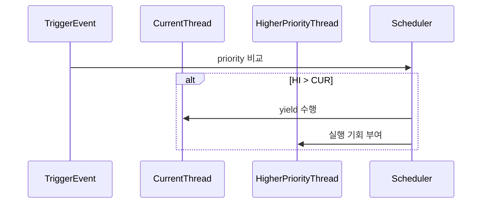

# 03 — 기능 2: 선점 트리거 경로 (Preemption Triggers)

## 1. 구현 목적 및 필요성

### 이 기능이 무엇인가

더 높은 priority 스레드가 준비되었을 때, 현재 실행 스레드를 적절한 시점에 양보시키는 선점 트리거 경로를 구성하는 기능입니다.

### 왜 이걸 하는가 (문제 맥락)

ready queue 정렬만으로는 즉시 실행 전환이 보장되지 않습니다. 트리거가 없으면 고우선순위 스레드가 불필요하게 지연됩니다.

### 무엇을 연결하는가 (기술 맥락)

`thread_unblock()`, `thread_set_priority()`, `thread_create()` 경로를 연결합니다.

### 완성의 의미 (결과 관점)

고우선순위 스레드는 조건 만족 직후 가장 이른 안전 시점에 CPU 실행 기회를 얻습니다.

## 2. 가능한 구현 방식 비교

- 방식 A: 정렬만 유지하고 타임슬라이스에만 의존
  - 장점: 구현 단순
  - 단점: preempt 테스트에서 지연/실패 가능
- 방식 B: 이벤트 기반 선점 트리거 추가
  - 장점: 우선순위 반응성 우수
  - 단점: 컨텍스트별 호출 제약 고려 필요
- 선택: B

## 3. 시퀀스와 단계별 흐름

시퀀스를 단계로 읽으면 다음과 같습니다.

1. 선점 후보 이벤트(생성/unblock/priority 변경)를 감지한다.
2. 현재 실행 스레드와 새 READY 후보의 priority를 비교한다.
3. 컨텍스트 제약에 맞는 양보 경로를 선택한다.

## 4. 기능별 가이드 (개념/흐름 + 구현 주석 위치)

### 4.1 `pintos/threads/thread.c`

#### `try_preempt_current()` 헬퍼 구현 주석 (어디를 보면 되는가)

- 위치: `pintos/threads/thread.c` (static helper, `cmp_priority()` 근처 권장)
- 역할: 선점 판단/호출 정책을 공통 함수로 일원화한다.
- 구현 포인트: 상세 규칙/금지/체크 순서는 `5.1`을 기준으로 구현한다.

#### `thread_unblock()` 구현 주석 (경계 정리, 어디를 보면 되는가)

- 위치: `pintos/threads/thread.c`
- 역할: `BLOCKED -> READY` 전이와 정렬 삽입 책임을 유지한다.
- 구현 포인트: 상세 규칙/금지/체크 순서는 `5.2`를 기준으로 구현한다.

#### `thread_set_priority()` 구현 주석 (어디를 보면 되는가)

- 위치: `pintos/threads/thread.c`
- 역할: priority 변경 직후 선점 재평가를 연결한다.
- 구현 포인트: 상세 규칙/금지/체크 순서는 `5.3`을 기준으로 구현한다.

#### `thread_create()` 연계 구현 주석 (어디를 보면 되는가)

- 위치: `pintos/threads/thread.c`
- 역할: 생성 직후 선점 가능성을 공통 helper 경로로 연결한다.
- 구현 포인트: 상세 규칙/금지/체크 순서는 `5.4`를 기준으로 구현한다.

### 4.2 `pintos/threads/synch.c`, `pintos/devices/timer.c`

#### `sema_up()` / `cond_signal()` / `timer_interrupt()` 연계 메모 (어디를 보면 되는가)

- 위치: `pintos/threads/synch.c`, `pintos/devices/timer.c`
- 역할: unblock 이벤트 경로별 선점 연결 지점을 정리한다.
- 구현 포인트: 상세 규칙/금지/체크 순서는 `5.5`를 기준으로 구현한다.

## 5. 구현 주석 (위치별 정리)

### 5.1 `try_preempt_current()` 공통 헬퍼
- 위치: `pintos/threads/thread.c` (static helper)
- 역할: "더 높은 READY 후보가 있으면 선점" 판단과 컨텍스트별 양보 경로를 통일한다.
- 규칙 1: `ready_list`가 비어있으면 즉시 반환한다.
- 규칙 2: READY head와 현재 스레드 priority를 비교해 선점 여부를 결정한다.
- 규칙 3: 인터럽트 컨텍스트면 `intr_yield_on_return()`, 스레드 컨텍스트면 `thread_yield()`를 사용한다.
- 금지 1: 각 호출 경로에 비교 로직을 복붙하지 않는다.

구현 체크 순서:
1. helper 시그니처를 고정한다(`static void try_preempt_current(void)`).
2. READY head 비교 후 higher-priority 조건에서만 양보/예약한다.
3. 인터럽트/스레드 컨텍스트 분기 규칙을 지킨다.

### 5.2 `thread_unblock()` 경계
- 위치: `pintos/threads/thread.c`
- 역할: `BLOCKED -> READY` 전이와 정렬 삽입만 담당한다.
- 규칙 1: READY 삽입과 상태 전이를 인터럽트 비활성 구간에서 원자적으로 처리한다.
- 규칙 2: 선점 트리거 호출은 별도 경로(helper 호출 지점)에서 처리한다.
- 금지 1: `thread_unblock()` 내부에 선점 분기 코드를 직접 넣지 않는다.

구현 체크 순서:
1. `list_insert_ordered(..., cmp_priority, ...)`로 삽입한다.
2. `THREAD_READY` 전이 후 인터럽트 레벨을 복원한다.
3. 선점 트리거 책임이 분리되어 있는지 확인한다.

### 5.3 `thread_set_priority()` 선점 재평가
- 위치: `pintos/threads/thread.c`
- 역할: base priority 변경 직후 실행 자격을 재평가한다.
- 규칙 1: base priority 갱신 후 helper를 호출한다.
- 규칙 2: `list_front` 비교 로직을 함수 내부에 중복 구현하지 않는다.

구현 체크 순서:
1. base priority를 갱신한다.
2. `try_preempt_current()`를 호출한다.

### 5.4 `thread_create()` 생성 직후 선점 연계
- 위치: `pintos/threads/thread.c`
- 역할: 생성된 고우선순위 스레드가 불필요하게 지연되지 않도록 한다.
- 규칙 1: `thread_unblock(t)` 직후 helper를 호출한다.
- 규칙 2: READY 삽입 정책은 `thread_unblock()` 경로를 재사용한다.
- 금지 1: 생성 경로에서 삽입/선점 로직을 중복 구현하지 않는다.

구현 체크 순서:
1. `thread_unblock(t)` 호출로 READY 삽입을 위임한다.
2. 이어서 `try_preempt_current()`를 호출한다.
3. 동일 이벤트에서 중복 양보가 없는지 확인한다.

### 5.5 `sema_up()` / `cond_signal()` / `timer_interrupt()` 연계
- 위치: `pintos/threads/synch.c`, `pintos/devices/timer.c`
- 역할: unblock 이벤트 생성 경로에서 선점 트리거를 일관되게 연결한다.
- 규칙 1: 스레드 컨텍스트 경로(`sema_up`, `cond_signal`)는 `thread_unblock()` 이후 helper를 호출한다.
- 규칙 2: 인터럽트 컨텍스트 경로(`timer_interrupt`)는 `intr_yield_on_return()` 예약 정책을 사용한다.
- 금지 1: 인터럽트 경로에서 `thread_yield()`를 직접 호출하지 않는다.

구현 체크 순서:
1. 경로별 컨텍스트를 구분한다(스레드 vs 인터럽트).
2. 스레드 경로는 helper, 인터럽트 경로는 yield_on_return 예약으로 연결한다.
3. `priority-preempt`/`alarm-priority`류 실행 순서 회귀를 점검한다.

## 6. 테스팅 방법

- `priority-preempt`: 고우선순위 READY 직후 선점 반영 확인
- `priority-change`: priority 변경 후 즉시 재평가 확인

