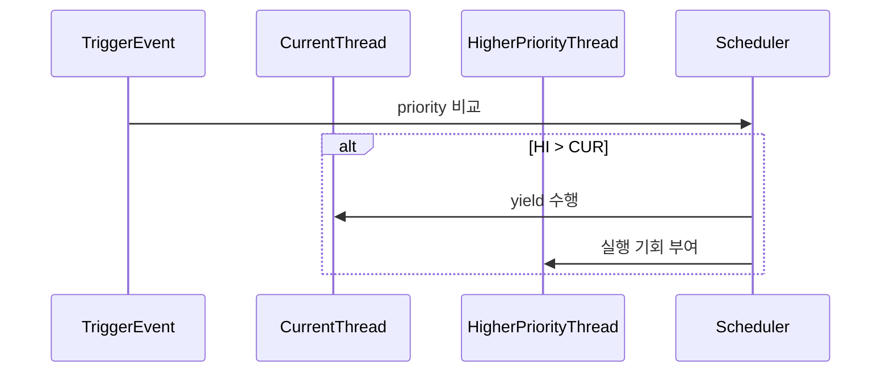

# 03 — 기능 2: 선점 트리거 경로 (Preemption Triggers)

## 1. 구현 목적 및 필요성
### 이 기능이 무엇인가
더 높은 priority 스레드가 준비되었을 때, 현재 실행 스레드를 적절한 시점에 양보시키는 선점 트리거 경로를 구성하는 기능입니다.

### 왜 이걸 하는가 (문제 맥락)
ready queue 정렬만으로는 즉시 실행 전환이 보장되지 않습니다. 트리거가 없으면 고우선순위 스레드가 불필요하게 지연됩니다.

### 무엇을 연결하는가 (기술 맥락)
`thread_unblock()`, `thread_set_priority()`, `thread_create()` 경로를 연결합니다.

### 완성의 의미 (결과 관점)
고우선순위 스레드는 조건 만족 직후 가장 이른 안전 시점에 CPU 실행 기회를 얻습니다.

## 2. 가능한 구현 방식 비교
- 방식 A: 정렬만 유지하고 타임슬라이스에만 의존
  - 장점: 구현 단순
  - 단점: preempt 테스트에서 지연/실패 가능
- 방식 B: 이벤트 기반 선점 트리거 추가
  - 장점: 우선순위 반응성 우수
  - 단점: 컨텍스트별 호출 제약 고려 필요
- 선택: B

## 3. 시퀀스와 단계별 흐름

시퀀스를 단계로 읽으면 다음과 같습니다.

1. 선점 후보 이벤트(생성/unblock/priority 변경)를 감지한다.
2. 현재 실행 스레드와 새 READY 후보의 priority를 비교한다.
3. 컨텍스트 제약에 맞는 양보 경로를 선택한다.

## 4. 구현 주석 (구현 필요 함수 전체)

### 4.1 `try_preempt_current()` 헬퍼 구현 주석
- 위치: `pintos/threads/thread.c` (static helper, `cmp_priority()` 근처 권장)
- 역할: "현재 스레드보다 높은 READY 후보가 있으면 선점" 규칙을 공통 함수로 제공한다.
- 규칙 1: `ready_list`가 비어있으면 즉시 반환한다.
- 규칙 2: `list_front(&ready_list)`의 priority와 현재 스레드 priority를 비교해 선점 여부를 결정한다.
- 규칙 3: 인터럽트 컨텍스트면 `intr_yield_on_return()`, 스레드 컨텍스트면 `thread_yield()`를 사용한다.
- 금지 1: 각 호출 경로에서 선점 비교 로직을 중복 구현하지 않는다.
- 금지 2: 인터럽트 컨텍스트에서 `thread_yield()`를 직접 호출하지 않는다.

구현 체크 순서:
1. helper 함수 시그니처를 `static void try_preempt_current(void)`로 선언한다.
2. READY head와 현재 스레드 priority를 비교한다.
3. 더 높은 후보가 있을 때만 컨텍스트 분기 후 양보/예약을 수행한다.
4. 중복 양보를 피하기 위해 모든 경로는 helper만 호출하도록 통일한다.

### 4.2 `thread_unblock()` 구현 주석 (경계 정리)
- 위치: `pintos/threads/thread.c`
- 역할: `BLOCKED -> READY` 전이와 정렬 삽입만 담당한다.
- 규칙 1: `list_insert_ordered(..., cmp_priority, ...)`와 상태 전이(`THREAD_READY`)를 원자적으로 처리한다.
- 규칙 2: 선점 트리거 로직은 helper(`try_preempt_current`) 호출 경로에서 처리한다.
- 금지 1: `thread_unblock()` 내부에 선점 분기 코드를 직접 중복 구현하지 않는다.

구현 체크 순서:
1. 인터럽트 비활성 구간에서 READY 삽입/상태 전이를 완료한다.
2. 함수 책임을 READY 전이로 한정했는지 확인한다.
3. 선점 트리거는 별도 helper 호출 위치에서만 수행하도록 정리한다.

### 4.3 `thread_set_priority()` 구현 주석
- 위치: `pintos/threads/thread.c`
- 역할: 현재 스레드 priority 변경 직후 실행 자격을 재평가한다.
- 규칙 1: base priority 갱신 직후 helper(`try_preempt_current`)를 호출해 선점 여부를 통일 판단한다.
- 규칙 2: 직접 `list_front` 비교 코드를 복붙하지 않는다.

구현 체크 순서:
1. base priority를 갱신한다.
2. `try_preempt_current()`를 호출한다.

### 4.4 `thread_create()` 연계 구현 주석
- 위치: `pintos/threads/thread.c`
- 역할: 새로 생성된 고우선순위 스레드가 불필요하게 지연되지 않도록 한다.
- 규칙 1: `thread_unblock(t)` 직후 helper(`try_preempt_current`)를 호출한다.
- 규칙 2: 삽입 정책은 중복 구현하지 않고 `thread_unblock()` 경로를 그대로 사용한다.
- 규칙 3: 선점 판단은 helper 1곳으로만 유지한다.

구현 체크 순서:
1. `thread_unblock(t)`로 READY 삽입을 위임한다.
2. 바로 이어서 `try_preempt_current()`를 호출한다.
3. 같은 이벤트에서 양보가 2회 발생하지 않는지 로그로 확인한다.

### 4.5 `sema_up()` / `cond_signal()` / `timer_interrupt()` 연계 메모
- 위치: `pintos/threads/synch.c`, `pintos/devices/timer.c`
- 역할: unblock 이벤트를 만드는 경로에서 helper 호출 위치를 명확히 한다.
- 규칙 1: 스레드 컨텍스트에서 호출되는 `sema_up()`/`cond_signal()` 경로는 `thread_unblock()` 이후 `try_preempt_current()`를 호출한다.
- 규칙 2: 인터럽트 컨텍스트인 `timer_interrupt()` wake 루프 경로는 helper 대신 `intr_yield_on_return()` 예약 정책을 사용한다.
- 금지 1: interrupt 경로에서 helper가 `thread_yield()`를 타지 않도록 호출 지점을 잘못 두지 않는다.

## 5. 테스팅 방법
- `priority-preempt`: 고우선순위 READY 직후 선점 반영 확인
- `priority-change`: priority 변경 후 즉시 재평가 확인
