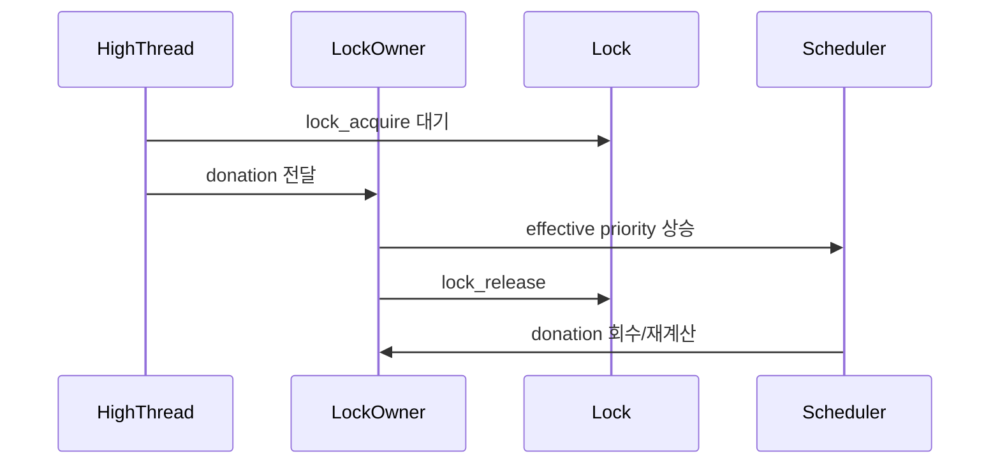
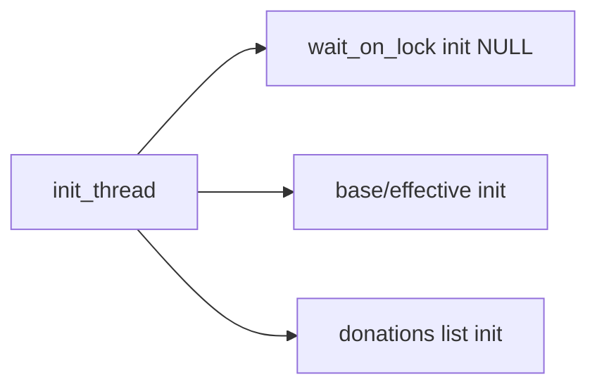
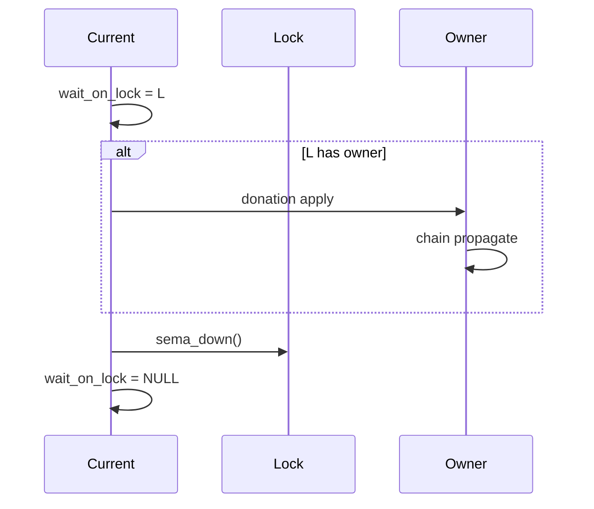
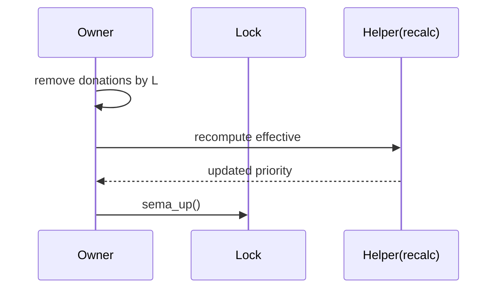
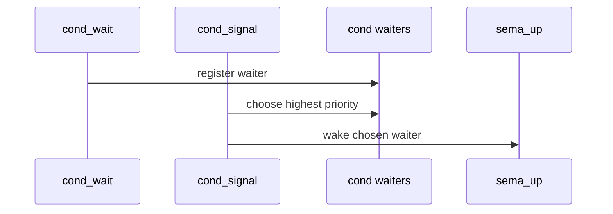

# 04 — 기능 3: Donation과 동기화 경계 (Donation and Sync Boundary)

## 1. 구현 목적 및 필요성
### 이 기능이 무엇인가
락 대기 중 발생하는 priority inversion을 완화하기 위해 donation을 적용하고, lock/scheduler 경계를 일관되게 유지하는 기능입니다.

### 왜 이걸 하는가 (문제 맥락)
고우선순위 스레드가 낮은 우선순위 lock owner를 기다리면 시스템 반응성이 크게 떨어집니다. donation이 없으면 priority-donate 계열 테스트가 실패합니다.

### 무엇을 연결하는가 (기술 맥락)
`lock_acquire()`, `lock_release()`, `sema_up()`, `thread_set_priority()`의 상태/우선순위 갱신 경로를 연결합니다.

### 완성의 의미 (결과 관점)
락 대기 체인에서도 effective priority가 일관되게 전파/회수되어 inversion이 제한됩니다.

## 2. 가능한 구현 방식 비교
- 방식 A: donation 미적용
  - 장점: 구현 단순
  - 단점: inversion 방치, donate 테스트 실패
- 방식 B: 단일 단계 donation
  - 장점: 기본 inversion 완화
  - 단점: 중첩 체인(donate-chain)에서 부족
- 방식 C: 체인 donation + release 시 재계산
  - 장점: 테스트 범위 대응 가능
  - 단점: 상태 관리 복잡
- 선택: C

## 3. 시퀀스와 단계별 흐름

시퀀스를 단계로 읽으면 다음과 같습니다.

1. 고우선순위 스레드가 lock을 기다린다.
2. 대기 대상 owner에게 donation을 전달한다.
3. owner가 lock을 해제하면 donation을 회수하고 priority를 재계산한다.

## 4. 기능별 가이드 (개념/흐름 + 구현 주석 위치)

### 4.1 기능 A: donation 상태 데이터 준비
#### 개념 설명
donation 전파/회수는 스레드 상태를 기반으로 동작하므로, `struct thread`에 base/effective 우선순위와 대기 lock 정보를 먼저 준비해야 합니다.

#### 시퀀스 및 흐름

1. 스레드 생성/초기화 시 donation 관련 필드를 초기화한다.
2. lock 대기 진입 시 `wait_on_lock`을 설정한다.
3. lock 획득 완료 시 `wait_on_lock`을 해제한다.
4. 우선순위 변경/lock 해제 시 `thread_recalculate_priority()`를 재사용한다.

#### 구현 주석 (보면 되는 함수/구조체)
- 위치: `pintos/threads/thread.h`의 `struct thread`
- 위치: `pintos/threads/thread.c`의 `init_thread()`
- 위치: `pintos/threads/thread.c`의 `thread_recalculate_priority()`

### 4.2 기능 B: `lock_acquire()`에서 donation 전파
#### 개념 설명
고우선순위 스레드가 lock에서 막히는 순간 owner priority를 올려야 inversion을 줄일 수 있습니다. owner가 또 다른 lock을 기다리면 체인으로 전파합니다.

#### 시퀀스 및 흐름

1. 대기 진입 전 `current->wait_on_lock = lock` 기록.
2. owner 존재 시 priority 비교 후 donation 적용.
3. owner가 다른 lock 대기면 상위 owner로 반복 전파.
4. `sema_down()`으로 실제 대기/획득.
5. 획득 완료 후 `wait_on_lock = NULL` 복구.

#### 구현 주석 (보면 되는 함수)
- 위치: `pintos/threads/synch.c`의 `lock_acquire()`

### 4.3 기능 C: `lock_release()`에서 donation 회수/재계산
#### 개념 설명
lock을 해제할 때는 해당 lock 때문에 들어온 donation만 제거하고, 남은 donation 기준으로 effective priority를 재계산해야 합니다.

#### 시퀀스 및 흐름

1. 현재 lock 관련 donation 항목을 제거.
2. `thread_recalculate_priority()`로 effective priority 업데이트.
3. 남은 donation이 없으면 base priority 복원.
4. 이후 `sema_up()`으로 다음 waiter 깨움.

#### 구현 주석 (보면 되는 함수)
- 위치: `pintos/threads/synch.c`의 `lock_release()`
- 위치: `pintos/threads/thread.c`의 `thread_recalculate_priority()`

### 4.4 기능 D: `sema_up()` waiter 우선순위 선택
#### 개념 설명
세마포어 대기열에서 highest priority waiter를 먼저 깨워야 `priority-sema` 및 donation 연계 테스트가 통과합니다.

#### 시퀀스 및 흐름

1. waiters에서 highest priority waiter 선택.
2. `thread_unblock()`으로 READY 전이.
3. 필요 시 preemption 경로 연계.

#### 구현 주석 (보면 되는 함수)
- 위치: `pintos/threads/synch.c`의 `sema_up()`

### 4.5 기능 E: `cond_wait()` / `cond_signal()` 우선순위 정합
#### 개념 설명
조건변수에서도 signal 대상 선택이 priority 정책과 일치해야 `priority-condvar`가 안정적으로 통과합니다.

#### 시퀀스 및 흐름

1. `cond_wait()` 등록 구조가 waiter priority 비교 가능 상태인지 확인.
2. `cond_signal()`에서 highest priority waiter 선택.
3. 선택한 waiter를 `sema_up()`으로 깨움.

#### 구현 주석 (보면 되는 함수)
- 위치: `pintos/threads/synch.c`의 `cond_wait()`, `cond_signal()`

## 5. 구현 주석 (위치별 정리)

### 5.1 `struct thread` 필수 필드
- 위치: `pintos/include/threads/thread.h`의 `struct thread`
- 역할: donation 전파/회수에 필요한 스레드 메타데이터를 정의한다.
- 규칙 1: base priority와 effective priority를 구분할 수 있는 필드를 둔다.
- 규칙 2: 현재 기다리는 lock을 가리키는 필드(`wait_on_lock`)를 둔다.
- 규칙 3: donation 후보 집합을 관리할 리스트 헤더 필드(`donation_candidates`)를 둔다.
- 규칙 4: donation 리스트 연결용 전용 노드 필드(`donation_elem`)를 둔다.
- 규칙 5: donation 리스트 등록 상태 추적 플래그(`in_donation_list`)를 둔다.
- 금지 1: base/effective를 단일 필드로만 운영해 회수 재계산 경로를 잃지 않는다.

구현 체크 순서:
1. `struct thread`에 base/effective, `wait_on_lock`, `donation_candidates`, `donation_elem`, `in_donation_list` 필드를 추가한다.
2. 필드의 의미와 갱신 시점을 구조체 주석으로 명시한다.

### 5.2 `init_thread()` 초기화
- 위치: `pintos/threads/thread.c`
- 역할: donation 관련 필드의 초기 상태를 일관되게 보장한다.
- 규칙 1: `init_thread()`에서 base/effective, `wait_on_lock`, donation 리스트를 초기화한다.
- 규칙 2: `in_donation_list`를 `false`로 초기화한다.
- 금지 1: 포인터 필드(`wait_on_lock`)에 `list_init()`을 적용하지 않는다.

구현 체크 순서:
1. `init_thread()`에 donation 필드 초기화를 반영한다.
2. `in_donation_list = false` 초기화를 반영한다.

### 5.3 `thread_recalculate_priority()` 구현
- 위치: `pintos/threads/thread.c`의 `thread_recalculate_priority()`
- 위치: `pintos/include/threads/thread.h`의 함수 프로토타입
- 역할: effective priority 계산 규칙을 단일 함수로 고정한다.
- 규칙 1: 계산 기준은 `max(base_priority, donations 최대 priority)`로 통일한다.
- 규칙 2: 계산 결과를 스케줄 기준 필드(`priority`)에 동기화한다.
- 규칙 3: `synch.c`에서 호출할 수 있도록 헤더에 프로토타입을 선언한다.
- 규칙 4: donation 리스트 순회 시 `list_entry(e, struct thread, donation_elem)` 기준을 사용한다.
- 금지 1: `lock_release()`와 `thread_set_priority()`에 계산 로직을 각각 복붙하지 않는다.

구현 체크 순서:
1. `thread_recalculate_priority(struct thread *t)`를 정의한다.
2. `pintos/include/threads/thread.h`에 `void thread_recalculate_priority(struct thread *t);`를 선언한다.
3. donation 리스트 순회로 최대 기여 priority를 계산한다.
4. `effective_priority`와 `priority`를 동일 결과로 갱신한다.

### 5.4 `thread_recalculate_priority()` 호출 지점 통일 (`lock_release()`, `thread_set_priority()`)
- 위치: `pintos/threads/synch.c`의 `lock_release()`, `pintos/threads/thread.c`의 `thread_set_priority()`
- 역할: priority 재계산 "호출 규약"을 일원화한다.
- 규칙 1: `lock_release()`는 lock 관련 donation 제거 직후 `thread_recalculate_priority()`를 호출한다.
- 규칙 2: `thread_set_priority()`는 base priority 변경 직후 `thread_recalculate_priority()`를 호출한다.
- 규칙 3: 함수별 상세 구현(`donation 정리`, `base/effective 처리`, `선점 재평가`)은 각 함수 섹션(5.6, 5.8)에서 별도로 다룬다.
- 금지 1: 두 함수에서 서로 다른 재계산 규칙을 사용하지 않는다.

구현 체크 순서:
1. 먼저 5.6(`lock_release()`)과 5.8(`thread_set_priority()`)의 상세 구현 체크리스트를 완료한다.
2. 각 함수 구현이 끝난 뒤 호출 위치가 규약과 일치하는지 확인한다(`donation 정리 직후`, `base 갱신 직후`).
3. 최종 점검에서 두 함수가 동일한 재계산 함수(`thread_recalculate_priority()`)만 호출하는지 확인한다.

### 5.5 `lock_acquire()` donation 적용
- 위치: `pintos/threads/synch.c`
- 역할: lock 대기 진입 시 owner에게 donation을 전파한다.
- 규칙 1: 대기 진입 직전에 `current->wait_on_lock = lock`을 기록한다.
- 규칙 2: donor 등록 전 `in_donation_list`를 확인해 중복 삽입을 방지한다.
- 규칙 3: owner의 donation 리스트에는 `&current->donation_elem`로 삽입한다(`list_push_back` 또는 ordered insert 정책 중 하나로 고정).
- 규칙 4: owner보다 높은 대기자가 들어오면 owner effective priority를 갱신한다.
- 규칙 5: 체인 대기면 상위 owner로 반복 전파한다.
- 규칙 6: 실제 lock 획득은 `sema_down(&lock->semaphore)`에서 수행하고, 획득 직후 `lock->holder = current`로 소유자를 기록한다.
- 규칙 7: `sema_down()` 이후 lock 획득 완료 시 `wait_on_lock = NULL`로 정리한다.
- 금지 1: 단일 단계 donation만 적용하고 체인 전파를 생략하지 않는다.

구현 체크 순서:
1. `wait_on_lock`을 먼저 기록한 뒤 donation 전파를 수행한다.
2. owner 체인을 따라가며 priority 갱신을 반복한다.
3. `!current->in_donation_list`인 경우에만 owner의 `donation_candidates`에 donor로 등록하고, 등록 후 `in_donation_list = true`로 갱신한다.
4. `sema_down(&lock->semaphore)` 통과 후 `lock->holder = current`로 소유자를 기록한다.
5. 획득 성공 후 `wait_on_lock = NULL`로 원복한다.

### 5.6 `lock_release()` donation 회수
- 위치: `pintos/threads/synch.c`
- 역할: 해제하는 lock 관련 donation을 회수하고 effective priority를 재계산한다.
- 규칙 1: 현재 lock 기여분만 제거한 뒤 `thread_recalculate_priority()`를 호출한다.
- 규칙 2: 남은 donation이 없으면 base priority로 복원한다.
- 규칙 3: `donation_candidates`를 순회하면서 `donor->wait_on_lock == releasing_lock`인 donor만 제거한다.
- 규칙 4: donor 제거 시 `in_donation_list = false`를 함께 갱신한다.
- 금지 1: lock 해제 직후 무조건 base로 덮어쓰고 재계산을 생략하지 않는다.

구현 체크 순서:
1. `donation_candidates`를 순회해 현재 lock 기여 donor를 `list_remove(&donor->donation_elem)`로 제거하고 `donor->in_donation_list = false`로 갱신한다.
2. `thread_recalculate_priority()`로 effective priority를 갱신한다.
3. 그 뒤 `sema_up()`을 호출해 waiter를 깨운다.

### 5.7 `sema_up()` waiter 우선순위 선택
- 위치: `pintos/threads/synch.c`
- 역할: semaphore waiters 중 highest priority waiter를 먼저 깨운다.
- 규칙 1: waiters를 priority 기준으로 정렬하거나 pop 전 최대값을 선택한다.
- 규칙 2: 깨운 뒤 선점 판단 경로를 연계한다.
- 금지 1: `list_pop_front()` FIFO 고정 정책으로 두지 않는다.

구현 체크 순서:
1. waiters에서 highest priority waiter를 선택한다.
2. 선택 waiter를 `thread_unblock()`으로 READY 전이한다.
3. 필요 시 선점 트리거를 연계한다.

### 5.8 `thread_set_priority()` 경계
- 위치: `pintos/threads/thread.c`
- 역할: 사용자 요청 base priority 변경과 donation 적용 상태를 분리한다.
- 규칙 1: base priority를 먼저 업데이트한다.
- 규칙 2: donation 활성 시 effective 반영 시점을 분리하고 필요하면 선점 재평가를 수행한다.
- 금지 1: donation 적용 중 effective priority를 즉시 base로 덮어쓰지 않는다.

구현 체크 순서:
1. base priority를 갱신한다.
2. `thread_recalculate_priority()`를 호출해 effective를 정합시킨다.
3. 필요 시 preempt helper/`thread_yield`를 호출한다.

### 5.9 `cond_wait()` / `cond_signal()` 우선순위 정합
- 위치: `pintos/threads/synch.c`
- 역할: condition variable에서도 waiter 선택이 priority 정책과 일치하도록 유지한다.
- 규칙 1: `cond_wait()` 등록 구조는 waiter priority 비교 가능 상태를 유지한다.
- 규칙 2: `cond_signal()`은 highest priority waiter를 선택해 깨운다.
- 금지 1: condvar waiters를 FIFO로만 처리해 priority 정책을 무시하지 않는다.

구현 체크 순서:
1. `cond_wait()` 등록 경로가 priority 비교 가능한 구조인지 확인한다.
2. `cond_signal()`에서 highest priority waiter를 선택한다.
3. 선택 waiter를 `sema_up()`으로 깨워 wake 순서를 검증한다.

## 6. 테스팅 방법
- `priority-donate-one`, `priority-donate-multiple`, `priority-donate-nest`
- `priority-donate-chain`, `priority-donate-sema`, `priority-donate-lower`
- `priority-condvar`
- 실패 시 `lock_acquire/release`와 waiter 선택 정책부터 점검
