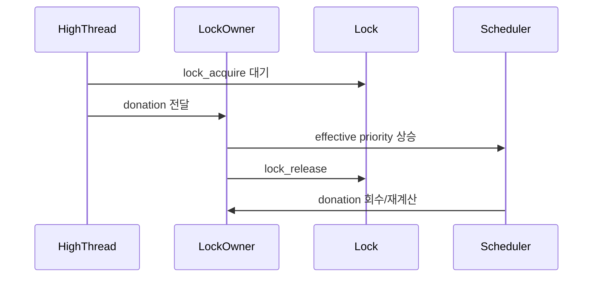

# 04 — 기능 3: Donation과 동기화 경계 (Donation and Sync Boundary)

## 1. 구현 목적 및 필요성
### 이 기능이 무엇인가
락 대기 중 발생하는 priority inversion을 완화하기 위해 donation을 적용하고, lock/scheduler 경계를 일관되게 유지하는 기능입니다.

### 왜 이걸 하는가 (문제 맥락)
고우선순위 스레드가 낮은 우선순위 lock owner를 기다리면 시스템 반응성이 크게 떨어집니다. donation이 없으면 priority-donate 계열 테스트가 실패합니다.

### 무엇을 연결하는가 (기술 맥락)
`lock_acquire()`, `lock_release()`, `sema_up()`, `thread_set_priority()`의 상태/우선순위 갱신 경로를 연결합니다.

### 완성의 의미 (결과 관점)
락 대기 체인에서도 effective priority가 일관되게 전파/회수되어 inversion이 제한됩니다.

## 2. 가능한 구현 방식 비교
- 방식 A: donation 미적용
  - 장점: 구현 단순
  - 단점: inversion 방치, donate 테스트 실패
- 방식 B: 단일 단계 donation
  - 장점: 기본 inversion 완화
  - 단점: 중첩 체인(donate-chain)에서 부족
- 방식 C: 체인 donation + release 시 재계산
  - 장점: 테스트 범위 대응 가능
  - 단점: 상태 관리 복잡
- 선택: C

## 3. 시퀀스와 단계별 흐름

시퀀스를 단계로 읽으면 다음과 같습니다.

1. 고우선순위 스레드가 lock을 기다린다.
2. 대기 대상 owner에게 donation을 전달한다.
3. owner가 lock을 해제하면 donation을 회수하고 priority를 재계산한다.

## 4. 구현 주석 (구현 필요 함수 전체)

### 4.1 `lock_acquire()` donation 적용 주석
- 위치: `pintos/threads/synch.c`
- 역할: lock 대기 시 owner에게 donation을 전파한다.
- 규칙 1: 대기 스레드가 owner보다 높으면 effective priority를 올린다.
- 규칙 2: 체인 대기 상황에서는 상위 owner로 donation을 전파한다.
- 금지 1: 단일 단계 donation만 적용하고 체인 전파를 생략하지 않는다.

구현 체크 순서:
1. 대기 대상 lock owner를 식별한다.
2. `waiter.priority > owner.priority`면 owner의 effective priority를 갱신한다.
3. owner가 다른 lock을 기다리면 상위 owner로 전파를 반복한다.

### 4.2 `lock_release()` donation 회수 주석
- 위치: `pintos/threads/synch.c`
- 역할: 해제한 lock에 연관된 donation을 제거하고 우선순위를 재계산한다.
- 규칙 1: release 후 현재 스레드의 effective priority를 남은 donation 기준으로 재평가한다.
- 규칙 2: donation이 없으면 base priority로 복원한다.
- 금지 1: lock 해제 직후 무조건 base priority로 즉시 덮어쓰지 않는다.

구현 체크 순서:
1. 해제하는 lock과 연결된 donation 기여분만 제거한다.
2. 남은 donation 후보들로 effective priority를 다시 계산한다.
3. 남은 donation이 없으면 base priority로 복원한다.

### 4.3 `sema_up()` waiter 선택 주석
- 위치: `pintos/threads/synch.c`
- 역할: semaphore waiters 중 가장 높은 priority를 먼저 깨운다.
- 규칙 1: waiters 리스트는 priority 기준으로 정렬하거나 pop 전 최대값을 선택한다.
- 규칙 2: 깨운 이후 preemption 판단 경로를 연계한다.
- 금지 1: `list_pop_front()`만으로 FIFO 깨우기를 고정하지 않는다.

구현 체크 순서:
1. waiters에서 highest priority waiter를 선택한다.
2. 선택된 waiter를 `thread_unblock()`으로 READY 전이시킨다.
3. 필요 시 선점 트리거 경로를 연계한다.

### 4.4 `thread_set_priority()` 경계 주석
- 위치: `pintos/threads/thread.c`
- 역할: 사용자 지정 base priority 변경과 donation 적용 상태를 분리한다.
- 규칙 1: donation 활성 상태에서는 base priority만 업데이트하고 effective priority 적용 시점을 구분한다.
- 금지 1: donation 적용 중 effective priority를 곧바로 base로 덮어쓰지 않는다.

구현 체크 순서:
1. 사용자 요청값을 base priority에 반영한다.
2. donation 활성 여부를 기준으로 effective priority 반영 시점을 결정한다.
3. 필요하면 실행 자격 재평가(`thread_yield`)를 수행한다.

### 4.5 `cond_signal()` / `cond_wait()` 경계 주석
- 위치: `pintos/threads/synch.c`
- 역할: condition variable waiter 선택이 priority 정책과 일치하도록 유지한다.
- 규칙 1: `cond_signal()`은 조건변수 waiters에서 우선순위가 가장 높은 대기자를 깨우는 정책을 보장한다.
- 규칙 2: condition waiter 비교 기준은 내부 semaphore 대기 스레드의 priority를 반영해야 한다.
- 금지 1: condvar waiters를 FIFO로만 깨워 우선순위 정책을 무시하지 않는다.

구현 체크 순서:
1. `cond_wait()` 등록 시 waiter 우선순위를 비교 가능한 형태로 유지한다.
2. `cond_signal()` 호출 시 highest priority waiter를 선택한다.
3. 선택한 waiter의 semaphore를 `sema_up()`으로 깨운다.

## 5. 테스팅 방법
- `priority-donate-one`, `priority-donate-multiple`, `priority-donate-nest`
- `priority-donate-chain`, `priority-donate-sema`, `priority-donate-lower`
- `priority-condvar`
- 실패 시 `lock_acquire/release`와 waiter 선택 정책부터 점검
