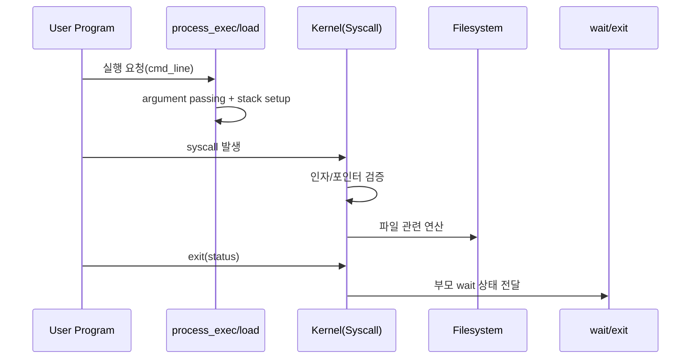

# Pintos 2주차(User Programs) 전체 흐름 정리

이 문서는 2주차(User Programs)를 시작하기 전에,
"사용자 프로그램이 어떻게 커널과 상호작용하는지"를 한 번에 연결해 이해하기 위한 개요 문서입니다.

---

## 1) 2주차를 한 문장으로 설명하면

**"커널 내부 코드만 돌던 Pintos에 사용자 프로그램 실행 경로를 열고, 시스템 콜로 사용자-커널 경계를 연결하는 주차"**입니다.

핵심은 기능 추가 자체보다 **경계(권한, 메모리, 자원 소유권) 안전성**을 보장하는 것입니다.

---

## 2) 1주차와 무엇이 달라지나

1주차에서는 커널 스레드만 대상으로 스케줄링/동기화를 다뤘습니다.  
2주차부터는 "신뢰할 수 없는 사용자 코드"가 커널에 요청을 보내는 상황을 다룹니다.

즉, 2주차의 기본 전제는:
- 사용자 포인터는 언제든 잘못될 수 있고
- 시스템 콜 인자는 악의적일 수 있으며
- 프로세스 종료 타이밍은 부모/자식 간에 엇갈릴 수 있다는 점입니다.

---

## 3) 큰 흐름: 실행부터 종료까지

단계로 보면:
1. `process_exec()`가 실행 파일 로드와 인자 전달을 준비한다.
   - 입력: 부모가 넘긴 `cmd_line` 문자열
   - 핵심 동작:
     - 실행 파일명(첫 토큰)과 인자들을 분리
     - ELF 로더로 실행 파일을 메모리에 적재
     - 사용자 스택에 문자열/`argv`/정렬/가짜 return address 배치
     - ABI 규약에 맞게 `RDI=argc`, `RSI=argv` 세팅
   - 실패 시 처리: 로드/스택 구성 실패면 해당 프로세스 시작 자체를 실패 처리
   - 다음 단계 연결: 유저 진입이 성공하면 사용자 코드가 실제로 실행되기 시작

2. 사용자 프로그램이 `syscall` 명령으로 커널 기능을 요청한다.
   - 입력: 사용자 코드에서 호출한 라이브러리 함수(`read`, `write`, `exit` 등)
   - 핵심 동작:
     - 유저 모드에서 커널 모드로 트랩 전환
     - 시스템 콜 번호(`rax`)와 인자 레지스터 값 전달
   - 실패 시 처리: 잘못된 호출 규약/잘못된 상태면 해당 호출이 실패하거나 프로세스 종료
   - 다음 단계 연결: 커널의 syscall dispatcher가 번호별 핸들러로 분기

3. 커널은 시스템 콜 번호/인자를 해석하고 안전성 검사를 수행한다.
   - 입력: `struct intr_frame`에 담긴 syscall 번호와 인자
   - 핵심 동작:
     - syscall 번호에 따라 핸들러 선택
     - 포인터 인자는 사용자 주소 범위/매핑 여부를 검증
     - fd/pid 같은 핸들 값은 현재 프로세스 컨텍스트 기준으로 유효성 확인
   - 실패 시 처리: 규약 위반/잘못된 포인터면 커널 패닉이 아니라 호출 실패 또는 해당 프로세스 종료
   - 다음 단계 연결: 검증이 끝난 요청만 실제 파일/프로세스 연산으로 진행

4. 파일/프로세스 관련 동작을 수행하고 결과를 반환한다.
   - 입력: 검증을 통과한 syscall 요청
   - 핵심 동작:
     - 파일 계열: `create/open/read/write/close`를 fd 테이블과 연결해 처리
     - 프로세스 계열: `fork/exec/wait/exit` 상태 전이와 부모-자식 관계 갱신
     - 필요 시 파일 시스템 임계 구역 보호(동기화)
   - 실패 시 처리: 파일 없음/잘못된 fd/권한 문제 등은 명세된 오류 값으로 반환
   - 다음 단계 연결: 반환값을 `rax`에 적재해 다시 사용자 모드로 복귀

5. 프로세스 종료 시 상태를 기록하고 `wait()` 경로로 회수한다.
   - 입력: `exit(status)` 호출 또는 예외로 인한 강제 종료
   - 핵심 동작:
     - 종료 코드와 종료 원인을 프로세스 상태에 기록
     - 열린 fd/관련 자원 정리
     - 부모가 `wait(pid)`로 회수할 수 있도록 종료 정보 보존/신호 전달
   - 실패 시 처리: 비자식 wait, 중복 wait 등은 즉시 `-1` 반환
   - 최종 결과: 부모는 자식 종료 상태를 정확히 한 번 회수하고, 자원은 누수 없이 정리

---

## 4) 2주차 핵심 기능 묶음

### 4-1) Argument Passing
- `cmd_line`을 토큰화해 `argc/argv`를 구성
- 사용자 스택 레이아웃과 ABI 레지스터(`RDI`, `RSI`) 세팅
- 관련 테스트: `args-*`

### 4-2) User Memory Access
- 사용자 포인터가 유효한지 확인하고 안전하게 접근
- 잘못된 포인터면 커널이 아니라 **해당 사용자 프로세스만** 종료
- 관련 테스트: `bad-read`, `bad-write`, `bad-jump` 계열

### 4-3) System Calls
- `halt`, `exit`, `fork`, `exec`, `wait`
- `create`, `remove`, `open`, `read`, `write`, `close` 등 파일 인터페이스
- 파일 시스템은 동기화가 약하므로 커널 쪽에서 임계 구역 보호 필요

### 4-4) Process Lifecycle
- `fork` 시 자원 복제와 부모-자식 동기화
- `exec` 시 현재 프로세스 이미지 교체
- `wait` 시 자식 종료 상태 회수, 중복 wait/비자식 wait 실패 처리

### 4-5) 실행 파일 쓰기 금지 (deny write)
- 실행 중인 바이너리 파일에 대한 쓰기 차단
- 프로젝트 3(VM)에서 특히 중요하지만 2주차부터 적용

### 4-6) Extra: `dup2`, stdin/stdout close
- 리눅스 유사 동작 확장
- 파일 디스크립터 공유 오프셋/상태 의미 유지

---

## 5) 반드시 분리해서 이해할 경계

- **사용자 영역 vs 커널 영역**
  - 의미: 사용자 프로그램이 넘긴 포인터는 커널이 신뢰하면 안 됩니다.
  - 핵심 규칙:
    - 포인터가 사용자 주소 범위인지 먼저 확인
    - 읽기/쓰기 길이까지 포함해 접근 범위를 검증
    - 실패 시 커널 전체가 아니라 "해당 프로세스만" 종료
  - 경계가 깨졌을 때 증상:
    - `bad-read`, `bad-write`, `bad-jump` 계열에서 커널 패닉
    - 랜덤한 페이지 폴트/assert 실패
  - 체크 질문: "이 syscall에서 사용자 포인터를 직접 역참조한 구간이 남아 있지 않은가?"

- **프로세스 경계**
  - 의미: 부모/자식은 관계는 있지만, 생명주기와 자원 회수는 독립적으로 정리돼야 합니다.
  - 핵심 규칙:
    - `wait(pid)`는 직접 자식에게만 허용
    - 같은 자식에 대한 중복 `wait`는 실패
    - 자식이 먼저 죽어도 종료 상태를 회수할 수 있어야 함
    - 부모가 먼저 죽어도 자식 자원은 누수 없이 정리
  - 경계가 깨졌을 때 증상:
    - `wait-bad-pid`, `wait-twice`, `wait-killed` 실패
    - 좀비/누수, 혹은 이미 해제된 구조체 접근(use-after-free)
  - 체크 질문: "자식 종료 상태 저장소를 누가 언제 해제하는지 1개 경로로 설명 가능한가?"

- **파일 디스크립터 경계**
  - 의미: fd는 "정수 번호"가 아니라 프로세스별 테이블에 매핑된 핸들입니다.
  - 핵심 규칙:
    - fd 테이블은 프로세스별 독립 관리
    - `fork` 시 fd는 상속되지만 번호 충돌/수명주기는 각 프로세스 규칙 유지
    - `open`은 매번 새 fd를 반환, `close`는 해당 fd에만 영향
    - 표준 입출력(0/1) 경계 정책을 일관되게 유지
  - 경계가 깨졌을 때 증상:
    - `open-twice`, `close-twice`, `read/write-bad-fd` 실패
    - 한 프로세스의 `close`가 다른 프로세스 동작까지 깨뜨림
  - 체크 질문: "fd 정수만 보고 처리하지 않고, 항상 현재 프로세스 fd 테이블을 통해 해석하는가?"

- **동기화 경계**
  - 의미: 파일 시스템 코드는 내부 동기화가 약하므로 syscall 레벨에서 임계 구역을 설계해야 합니다.
  - 핵심 규칙:
    - 파일 시스템 진입/이탈 경계를 고정
    - 락 획득 후 사용자 포인터 검증 같은 블로킹 가능 작업을 섞지 않음
    - 오류 경로에서도 락 해제 보장
  - 경계가 깨졌을 때 증상:
    - 간헐적 deadlock, 레이스, 재현 어려운 flaky 테스트
    - `syn-*`, `multi-*` 계열에서 비결정적 실패
  - 체크 질문: "이 syscall의 락 수명주기(획득-작업-해제)를 다이어그램 없이 말로 설명할 수 있는가?"

이 경계를 섞으면 테스트는 부분적으로 통과해도 회귀가 크게 발생합니다.

---

## 6) 2주차에서 자주 틀리는 지점

- `argv[argc] = NULL` 누락, 스택 정렬 누락
- 포인터 유효성 검사 없이 사용자 메모리 직접 접근
- `wait()`에서 비자식/중복 wait 조건 처리 누락
- `fork()`에서 부모가 자식 복제 성공 여부 확인 전 반환
- `write(fd=1)`를 `putbuf()`로 묶어 쓰지 않아 출력 섞임
- 실행 파일 deny-write를 열고 닫는 수명주기와 분리해 처리

---

## 7) 권장 학습/구현 순서

1. Argument Passing (`args-*` 먼저 안정화)
2. User Memory 안전 접근 경계 확립
3. 기본 syscall(`halt/exit/read/write/open/close`) 구현
4. 프로세스 계열(`fork/exec/wait`) 구현
5. deny-write 적용
6. extra(`dup2`)는 기본 전부 통과 후 진행

---

## 8) 테스트 운영 전략

- 항상 단일 테스트로 원인 좁히기 → 묶음 테스트로 확장
- 실패 로그를 기능 묶음으로 역추적:
  - `args-*` -> argument passing
  - `bad-*` -> user memory 검증
  - `wait-*`, `fork-*`, `exec-*` -> 프로세스 수명주기
  - `rox-*` -> deny-write
- 문서(`study/2. test-notes`)와 코드 수정 지점을 1:1로 매핑

---

## 짧은 결론

2주차의 본질은 "시스템 콜 구현" 자체보다  
**신뢰 경계 밖(사용자 코드)에서 들어오는 요청을 커널이 안전하게 처리하는 규칙을 세우는 것**입니다.  
이 경계를 정확히 잡으면 Project 3/4의 VM·파일시스템 확장도 훨씬 수월해집니다.
