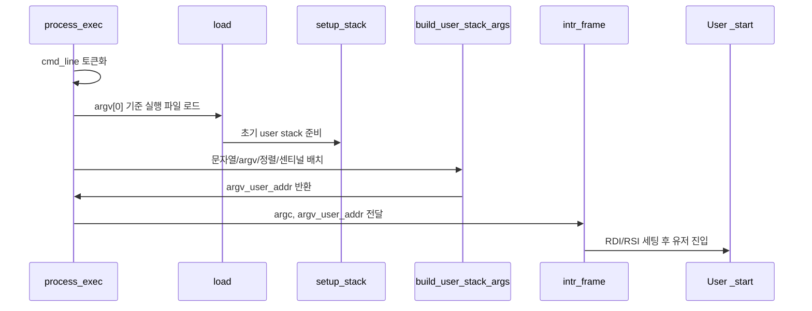

# 01 — Argument Passing 전체 개념과 동작 흐름

이 문서는 Argument Passing을 처음 볼 때 필요한 큰 그림을 잡기 위한 개요 문서입니다.  
커맨드라인 파싱, 사용자 스택 배치, 레지스터 세팅이 어떻게 한 흐름으로 연결되는지 이해하도록 구성했습니다.

---

## 1) Argument Passing을 한 문장으로 설명하면

**"`process_exec()`에서 받은 문자열을 `argc/argv`로 구성해 `_start(argc, argv)`가 그대로 읽게 만드는 초기화 절차"**입니다.

핵심은 문자열 분리 자체가 아니라, **ABI 규약에 맞는 유저 진입 상태**를 만드는 것입니다.

---

## 2) 왜 필요한가 (문제의식)

인자 전달이 없거나 틀리면 사용자 프로그램은 시작 직후 `argv`를 잘못 참조해 페이지 폴트로 종료됩니다.  
즉, Argument Passing은 "테스트 하나를 위한 옵션"이 아니라 사용자 프로그램 실행의 필수 전제입니다.

이 기능은 문제를 해결하기 위해:
- 커맨드라인을 일관된 규칙으로 토큰화하고
- 스택에 문자열/포인터를 규약대로 배치하고
- 레지스터(`RDI=argc`, `RSI=argv`)를 맞춰 유저 모드로 진입시킵니다.

---

## 3) 동작 시퀀스와 단계별 흐름

시퀀스를 단계로 읽으면 다음과 같습니다.

1. 커맨드라인을 공백 기준으로 분리한다.
2. 첫 토큰으로 실행 파일 로드 경로를 진행한다.
3. `load()`가 `setup_stack()`을 통해 빈 사용자 스택 페이지와 초기 `rsp`를 만든다.
4. `build_user_stack_args()`가 사용자 스택에 인자 문자열과 포인터 배열을 배치한다.
5. `argv[argc] = NULL`과 정렬 조건을 보장한다.
6. 스택 안의 `argv[0]` 위치를 `argv_user_addr`로 저장한다.
7. 인터럽트 프레임 레지스터를 세팅해 유저 프로그램을 시작한다.

---

## 4) 반드시 분리해서 이해할 개념

- **파싱 계층**: 토큰 개수/순서/공백 규칙
- **스택 계층**: 문자열 주소, 포인터 배열, 정렬, 센티널
- **진입 계층**: 레지스터와 유저 엔트리로의 실제 전환

이 세 계층을 섞어서 수정하면 `args-*`에서 부분 통과/부분 실패가 반복됩니다.

---

## 5) 이 기능에서 자주 틀리는 지점

- 연속 공백을 빈 토큰으로 처리해 `argc`가 틀어지는 경우
- `argv[argc] == NULL` 센티널 누락
- 8바이트 정렬을 생략해 경계 케이스에서 깨지는 경우
- 문자열 push 순서와 포인터 push 순서를 섞는 경우
- 스택은 맞는데 `RDI/RSI` 세팅이 잘못된 경우

---

## 6) 학습 순서 (추천)

1. `02-feature-parse-command-line.md` — 토큰화 규칙과 경계 조건
2. `03-feature-build-user-stack.md` — 스택 배치 불변식과 주소 관리
3. `04-feature-register-setup-and-entry.md` — ABI 레지스터 세팅과 진입 경계

---

## 7) 구현 전에 스스로 체크할 질문

- 공백 패턴이 달라도 `argc/argv` 결과가 일관적인가?
- `argv[0]`은 파일명이고 `argv[argc]`는 NULL인가?
- 스택 포인터 정렬과 사용자 주소 경계를 모두 지키는가?
- `_start()` 입장에서 `RDI/RSI`가 정확한가?
