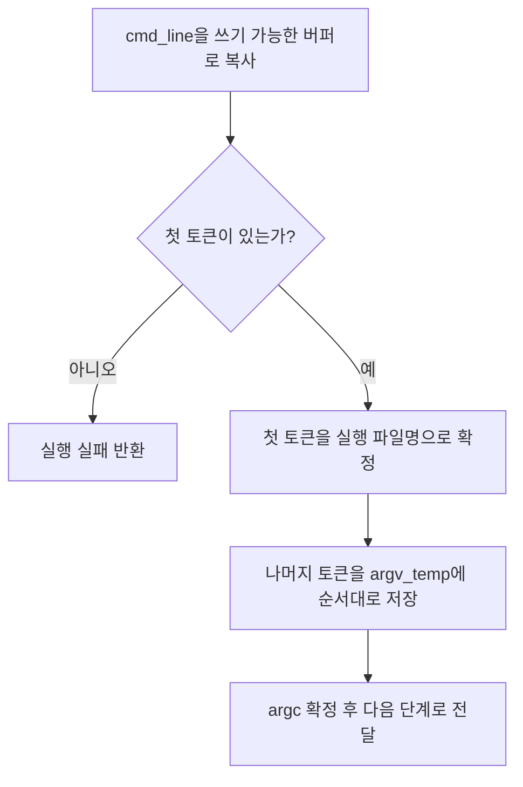

# 02 — 기능 1: 커맨드라인 파싱 (토큰화) 상세

## 1. 구현 목적 및 필요성
### 이 기능이 무엇인가
`cmd_line` 문자열을 "실행 파일명 + 인자 리스트"로 안정적으로 분리하는 기능입니다.

### 왜 이걸 하는가 (문제 맥락)
토큰화 규칙이 흔들리면 `argv`가 한 칸씩 밀리거나 `argc`가 과/소 계산되어 이후 모든 단계가 틀어집니다.

### 완성의 의미 (결과 관점)
공백 형태가 바뀌어도 동일한 토큰 시퀀스가 만들어지고, 스택 구성 단계는 파싱 결과를 그대로 소비하면 됩니다.

## 2. 가능한 구현 방식 비교
- 방식 A: `strtok_r()` 사용
  - 장점: 연속 공백 처리와 상태 유지가 간결
  - 단점: 입력 버퍼를 수정하므로 복사본 필요
- 방식 B: 수동 상태 머신
  - 장점: 세밀한 정책(인용부호 등) 확장 유리
  - 단점: 구현 복잡도 높음
- 선택: A (현재 범위는 공백 분리만 필요)

## 3. 시퀀스와 단계별 흐름

1. 원본 `cmd_line`을 쓰기 가능한 커널 버퍼로 복사한다.
2. 공백 기준으로 토큰을 추출한다.
3. 첫 토큰이 없으면 실행 실패 처리한다.
4. 첫 토큰은 실행 파일명, 나머지는 인자로 저장한다.
5. `argc`를 확정하고 다음 단계(스택 배치)로 넘긴다.

## 4. 기능별 가이드 (개념/흐름 + 구현 주석 위치)
### 4.1 기능 A: 파싱 입력 버퍼 안전화
#### 개념 설명
`strtok_r()`는 버퍼를 직접 수정하므로 원본 포인터를 바로 건드리면 위험합니다.

#### 구현 주석
- 위치: `pintos/userprog/process.c`
- 역할: `cmd_line` 복사본 생성 및 수명 관리
- 규칙 1: 복사 실패 시 즉시 실패 반환
- 규칙 2: 성공/실패 경로 모두에서 복사 버퍼 해제

### 4.2 기능 B: 토큰화 규칙 고정
#### 개념 설명
이번 범위에서는 "공백은 구분자" 한 가지 규칙만 고정하면 충분합니다.

#### 구현 주석
- 위치: `pintos/userprog/process.c`의 토큰화 루프
- 역할: 토큰 추출 및 임시 배열 저장
- 규칙 1: 연속 공백은 빈 토큰 생성 없이 건너뜀
- 규칙 2: 인자 순서 유지
- 규칙 3: 최대 토큰 수/총 길이 제한 초과 시 실패

### 4.3 기능 C: 파싱 결과의 다음 단계 계약
#### 개념 설명
파싱의 출력(`argc`, `argv_temp[]`)은 스택 빌더가 그대로 쓴다는 전제를 유지해야 합니다.

#### 구현 주석
- 위치: `pintos/userprog/process.c`의 파싱 종료 구간
- 역할: 스택 빌더 인자 전달 준비
- 규칙 1: `argv_temp[argc]`는 접근하지 않음(스택 단계에서 NULL 생성)
- 규칙 2: 파일명 토큰(`argv_temp[0]`)은 비어 있지 않음 보장

## 5. 구현 주석 (위치별 정리)
### 5.1 `process_exec()` 파싱 시작부
- 위치: `pintos/userprog/process.c`
- 역할: 입력 유효성, 복사, 파서 호출
- 규칙 1: NULL 입력 방어
- 규칙 2: 빈 문자열/공백만 있는 입력 실패

구현 체크 순서:
1. `cmd_line` NULL 여부를 먼저 검사한다.
2. 쓰기 가능한 복사 버퍼를 할당/복사한다.
3. 공백만 있는 입력인지 확인하고 실패 경로를 통일한다.
4. 성공 경로에서만 토큰화 루프로 진입한다.

### 5.2 토큰화 루프
- 위치: `pintos/userprog/process.c`
- 역할: `save_ptr` 기반 반복 토큰 추출
- 규칙 1: 추출 순서와 저장 순서 일치
- 규칙 2: 경계 초과 시 중단 + 정리
- 금지 1: `argc` 증가와 저장 인덱스 증가를 분리해서 관리하지 않음

구현 체크 순서:
1. `strtok_r()` 첫 호출로 시작 토큰을 가져온다.
2. 토큰을 `argv_temp[argc]`에 저장한 뒤 `argc`를 증가시킨다.
3. 매 반복마다 최대 토큰 수/길이 경계를 검사한다.
4. 실패 시 즉시 정리 루틴으로 이동한다.

### 5.3 파싱 결과 반환
- 위치: `pintos/userprog/process.c`
- 역할: 스택 단계로 넘길 데이터 패키징
- 규칙 1: 실패 경로에서 부분 결과 사용 금지
- 규칙 2: 성공 경로에서만 로더/스택 빌더 호출

구현 체크 순서:
1. 첫 토큰(실행 파일명) 존재 여부를 최종 확인한다.
2. 성공 시 `argc`와 `argv_temp`를 스택 빌더 입력으로 고정한다.
3. 실패 경로에서는 부분 파싱 결과를 폐기하고 버퍼를 해제한다.
4. 자원 정리 후 성공/실패 반환을 명확히 분기한다.

## 6. 테스팅 방법
- `args-none`: 최소 입력 경계
- `args-single`: 기본 단일 인자
- `args-multiple`: 순서 보존
- `args-many`: 다수 토큰 경계
- `args-dbl-space`: 연속 공백 규칙

실패 시 우선 `argc`와 토큰 문자열 배열 로그를 찍어 파싱 단계부터 확인합니다.
