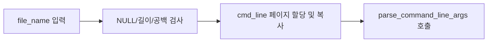

# 02 — 기능 1: 커맨드라인 파싱 (토큰화) 상세

## 1. 구현 목적 및 필요성
### 이 기능이 무엇인가
`cmd_line` 문자열을 "실행 파일명 + 인자 리스트"로 안정적으로 분리하는 기능입니다.

### 왜 이걸 하는가 (문제 맥락)
토큰화 규칙이 흔들리면 `argv`가 한 칸씩 밀리거나 `argc`가 과/소 계산되어 이후 모든 단계가 틀어집니다.

### 완성의 의미 (결과 관점)
공백 형태가 바뀌어도 동일한 토큰 시퀀스가 만들어지고, 스택 구성 단계는 파싱 결과를 그대로 소비하면 됩니다.

## 2. 가능한 구현 방식 비교
- 방식 A: `strtok_r()` 사용
  - 장점: 연속 공백 처리와 상태 유지가 간결
  - 단점: 입력 버퍼를 수정하므로 복사본 필요
- 방식 B: 수동 상태 머신
  - 장점: 세밀한 정책(인용부호 등) 확장 유리
  - 단점: 구현 복잡도 높음
- 선택: A (현재 범위는 공백 분리만 필요)

## 3. 시퀀스와 단계별 흐름


1. 원본 `cmd_line`을 쓰기 가능한 커널 버퍼로 복사한다.
2. 공백 기준으로 토큰을 추출한다.
3. 첫 토큰이 없으면 실행 실패 처리한다.
4. 첫 토큰은 실행 파일명, 나머지는 인자로 저장한다.
5. `argc`를 확정하고 다음 단계(스택 배치)로 넘긴다.

## 4. 기능별 가이드 (개념/흐름 + 구현 주석 위치)
### 4.1 기능 A: 파싱 입력 버퍼 안전화
#### 개념 설명
`strtok_r()`는 버퍼를 직접 수정하므로 원본 포인터를 바로 건드리면 위험합니다.

#### 시퀀스 및 흐름


1. `file_name`이 NULL이거나 한 페이지를 넘으면 실패 처리한다.
2. 공백만 있는 입력은 실행 파일명이 없으므로 실패 처리한다.
3. `strtok_r()`가 수정할 수 있도록 `cmd_line` 복사 페이지를 만든다.
4. 복사 성공 후에만 토큰화 함수로 넘긴다.

#### 구현 주석 (보면 되는 함수)
- 위치: `pintos/userprog/process.c`의 `process_exec()`

### 4.2 기능 B: 토큰화 규칙 고정
#### 개념 설명
이번 범위에서는 "공백은 구분자" 한 가지 규칙만 고정하면 충분합니다.

#### 시퀀스 및 흐름
```mermaid
flowchart TD
  START[strtok_r 첫 호출] --> HAS{token 존재?}
  HAS -- 아니오 --> FAIL[false 반환]
  HAS -- 예 --> STORE[argv[argc] 저장 전 ARG_MAX 검사]
  STORE --> NEXT[strtok_r 다음 호출 반복]
  NEXT --> DONE{더 이상 token 없음?}
  DONE -- 아니오 --> STORE
  DONE -- 예 --> OK[true 반환]
```

1. 첫 토큰이 없으면 실행 파일명이 없는 입력으로 보고 실패한다.
2. 토큰을 `argv[argc]`에 저장하기 전에 `ARG_MAX`를 검사한다.
3. 저장한 뒤 `argc`를 증가시켜 토큰 순서를 그대로 유지한다.
4. `strtok_r(NULL, " ", &save_ptr)`로 남은 토큰을 반복 추출한다.

#### 구현 주석 (보면 되는 함수)
- 위치: `pintos/userprog/process.c`의 `parse_command_line_args()`

### 4.3 기능 C: 파싱 결과의 다음 단계 계약
#### 개념 설명
파싱의 출력(`argc`, `argv[]`)은 스택 빌더가 그대로 쓴다는 전제를 유지해야 합니다.

#### 시퀀스 및 흐름
```mermaid
flowchart LR
  PARSED[argc/argv 파싱 완료] --> VALIDATE[finalize_parsed_args]
  VALIDATE --> LOAD[argv[0]로 load 호출]
  LOAD --> STACK[argc/argv를 stack builder에 전달]
```

1. `argv` 포인터 자체가 NULL인지 먼저 확인한다.
2. `argc <= 0`이거나 `argv[0] == NULL`이면 실패한다.
3. 성공한 경우 `argv[0]`은 로드할 파일명으로 사용한다.
4. `argv[argc]` NULL 센티널은 파싱 단계가 아니라 스택 단계에서 만든다.

#### 구현 주석 (보면 되는 함수)
- 위치: `pintos/userprog/process.c`의 `finalize_parsed_args()`

## 5. 구현 주석 (위치별 정리)
### 5.1 `process_exec()` 파싱 시작부
- 위치: `pintos/userprog/process.c`
- 역할: 입력 유효성, 복사, 파서 호출
- 규칙 1: NULL 입력 방어
- 규칙 2: 빈 문자열/공백만 있는 입력 실패

구현 체크 순서:
1. `cmd_line` NULL 여부를 먼저 검사한다.
2. `PGSIZE` 길이 초과와 공백만 있는 입력을 먼저 실패 처리한다.
3. 쓰기 가능한 복사 버퍼를 할당/복사한다.
4. 성공 경로에서만 토큰화 루프로 진입한다.

### 5.2 `parse_command_line_args()` 토큰화 루프
- 위치: `pintos/userprog/process.c`
- 역할: `save_ptr` 기반 반복 토큰 추출
- 규칙 1: 추출 순서와 저장 순서 일치
- 규칙 2: 경계 초과 시 중단 + 정리
- 금지 1: `argc` 증가와 저장 인덱스 증가를 분리해서 관리하지 않음

구현 체크 순서:
1. `strtok_r()` 첫 호출로 시작 토큰을 가져온다.
2. 토큰을 `argv[argc]`에 저장하기 전에 `ARG_MAX` 경계를 검사한다.
3. 저장한 뒤 `argc`를 증가시키고 다음 토큰을 반복 추출한다.
4. 실패 시 즉시 호출부의 정리 경로로 이동한다.

### 5.3 `finalize_parsed_args()` 파싱 결과 반환
- 위치: `pintos/userprog/process.c`
- 역할: 스택 단계로 넘길 데이터 패키징
- 규칙 1: 실패 경로에서 부분 결과 사용 금지
- 규칙 2: 성공 경로에서만 로더/스택 빌더 호출

구현 체크 순서:
1. 첫 토큰(실행 파일명) 존재 여부를 최종 확인한다.
2. 성공 시 `argc`와 `argv`를 스택 빌더 입력으로 고정한다.
3. 실패 경로에서는 부분 파싱 결과를 폐기하고 버퍼를 해제한다.
4. 자원 정리 후 성공/실패 반환을 명확히 분기한다.

## 6. 테스팅 방법
- `args-none`: 최소 입력 경계
- `args-single`: 기본 단일 인자
- `args-multiple`: 순서 보존
- `args-many`: 다수 토큰 경계
- `args-dbl-space`: 연속 공백 규칙

실패 시 우선 `argc`와 토큰 문자열 배열 로그를 찍어 파싱 단계부터 확인합니다.
