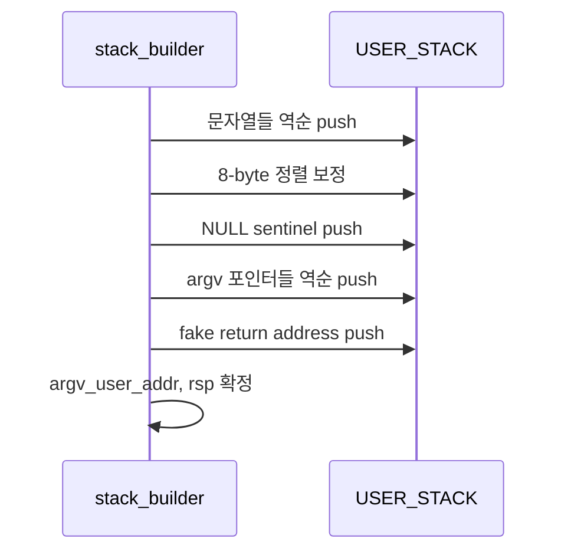

# 03 — 기능 2: 사용자 스택 레이아웃 구성 (ABI 계약)

## 1. 구현 목적 및 필요성
### 이 기능이 무엇인가
파싱된 토큰 배열을 사용자 스택에 C 호출 규약이 기대하는 구조로 배치하는 기능입니다.

### 왜 이걸 하는가 (문제 맥락)
`argv`는 값이 아니라 포인터 체인입니다. 문자열만 복사해 두면 동작하지 않고, 포인터 배열과 센티널까지 완성되어야 합니다.

### 완성의 의미 (결과 관점)
유저 진입 직후 `_start`가 `argv[0..argc-1]`를 순서대로 읽고 `argv[argc]==NULL`을 만족합니다.

## 2. 가능한 구현 방식 비교
- 방식 A: 문자열 → 정렬 → NULL → 포인터 배열 → fake return (권장)
  - 장점: 디버깅 용이, 문서/예제와 일치
- 방식 B: 포인터 테이블 선할당 후 역계산
  - 장점: 메모리 이동 감소 가능
  - 단점: 주소 계산 복잡
- 선택: A

## 3. 시퀀스와 단계별 흐름

1. `rsp = USER_STACK`에서 시작한다.
2. 문자열을 뒤에서부터 복사하고 각 시작 주소를 배열에 기록한다.
3. 포인터 push 전에 8바이트 정렬을 맞춘다.
4. `NULL` 센티널을 먼저 push한다.
5. 문자열 주소들을 역순 push해 `argv[0]`이 가장 낮은 주소에 오게 한다.
6. 포인터 배열의 시작 주소를 `argv_user_addr`로 호출부에 돌려준다.
7. 가짜 return address(0)를 push한다.
8. 최종 `rsp`를 `intr_frame`에 반영한다.

## 4. 기능별 가이드 (개념/흐름 + 구현 주석 위치)
### 4.1 기능 A: 문자열 블록 배치
#### 구현 주석
- 위치: `pintos/userprog/process.c`의 인자 스택 구성 루틴
- 역할: 각 토큰 문자열을 사용자 스택으로 복사
- 규칙 1: 문자열 끝 `\0` 포함 복사
- 규칙 2: 복사 주소를 `arg_addrs[]`에 저장
- 규칙 3: 각 push 후 사용자 영역 경계 검사

### 4.2 기능 B: 포인터 블록 배치
#### 구현 주석
- 위치: `pintos/userprog/process.c`
- 역할: `argv` 포인터 배열 생성
- 규칙 1: `argv[argc] == NULL`을 먼저 보장
- 규칙 2: 포인터는 문자열 주소 배열을 역순 순회해 push
- 규칙 3: push 완료 후 `argv_user_addr`에 포인터 배열 시작 주소 저장

### 4.3 기능 C: 정렬/프레임 마무리
#### 구현 주석
- 위치: `pintos/userprog/process.c`
- 역할: ABI 정렬과 fake return address 처리
- 규칙 1: 포인터 배열 전에 8바이트 정렬
- 규칙 2: 마지막에 fake return address 0 push
- 규칙 3: 각 push 전후로 스택 페이지 하한을 넘지 않는지 확인
- 금지 1: 정렬 없이 바로 포인터 push

## 5. 구현 주석 (위치별 정리)
### 5.1 `setup_stack()` 기본 매핑
- 위치: `pintos/userprog/process.c`
- 역할: 스택 페이지 매핑과 초기 `rsp` 설정
- 규칙 1: 매핑 실패 시 즉시 false
- 규칙 2: 성공 시에만 `build_user_stack_args()` 호출

구현 체크 순서:
1. 스택 페이지 매핑 성공 여부를 먼저 확인한다.
2. 성공 시 초기 `rsp = USER_STACK`으로 설정한다.
3. 이후 `build_user_stack_args()` 호출로 문자열/포인터 구성 단계에 진입한다.
4. 실패 시 즉시 false를 반환하고 후속 단계를 차단한다.

### 5.2 `build_user_stack_args()` 인자 배치 루프
- 위치: `pintos/userprog/process.c`
- 역할: 문자열/포인터 push 연산의 전담 스택 빌더
- 규칙 1: `sp`를 바이트 단위로 낮춘 뒤 해당 위치에 직접 값을 쓴다
- 규칙 2: 바이트 단위 경계 검사 누락 금지

구현 체크 순서:
1. 문자열을 역순으로 push하고 시작 주소를 `arg_addrs[]`에 기록한다.
2. 8바이트 정렬을 맞춘 뒤 `NULL` 센티널을 push한다.
3. `arg_addrs[]`를 역순 순회해 `argv` 포인터들을 push한다.
4. 포인터 배열 시작 주소를 `argv_user_addr`에 저장한다.
5. 마지막에 fake return address(0)를 push하고 `user_if->rsp`를 갱신한다.

### 5.3 `hex_dump()` 디버깅 관측점
- 위치: `pintos/userprog/process.c` (임시 로그)
- 역할: 실패 시 스택 레이아웃 확인
- 규칙 1: `hex_dump()`로 `rsp` 인근 덤프 확인
- 규칙 2: `argv_user_addr`, `argv[0]`, `argv[argc]` 주소/값 동시 점검

구현 체크 순서:
1. 실패 재현 시점의 최종 `rsp`를 먼저 기록한다.
2. `hex_dump()`로 문자열 블록/포인터 블록 위치를 확인한다.
3. `argv_user_addr`, `argv[0]`, `argv[argc]`를 함께 검증한다.
4. 정렬/센티널/포인터 순서 중 깨진 지점을 기준으로 루프를 역추적한다.

## 6. 테스팅 방법
- 기본 검증: `args-single`
- 포인터 개수/순서: `args-multiple`, `args-many`
- 공백 연계: `args-dbl-space`
- 진단: `hex_dump()`로 문자열/포인터/정렬 구간을 한 번에 확인
