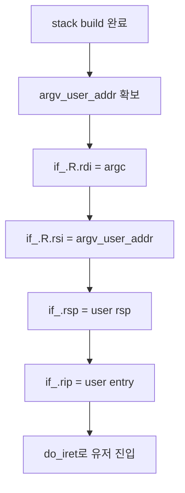
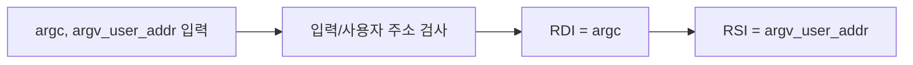
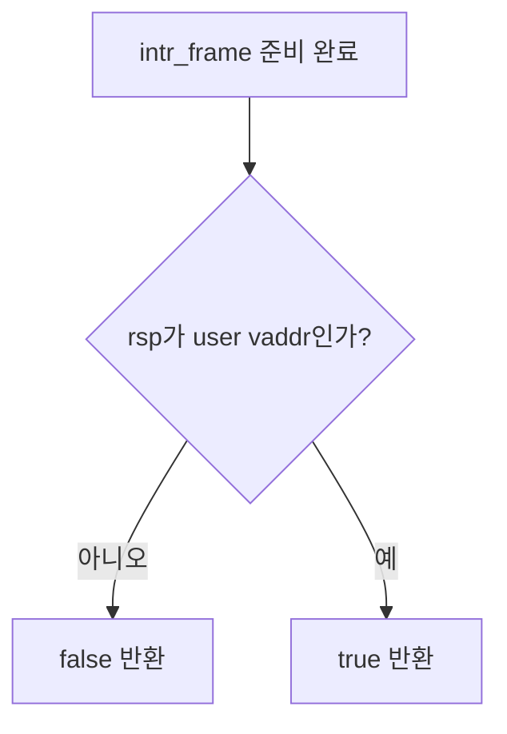
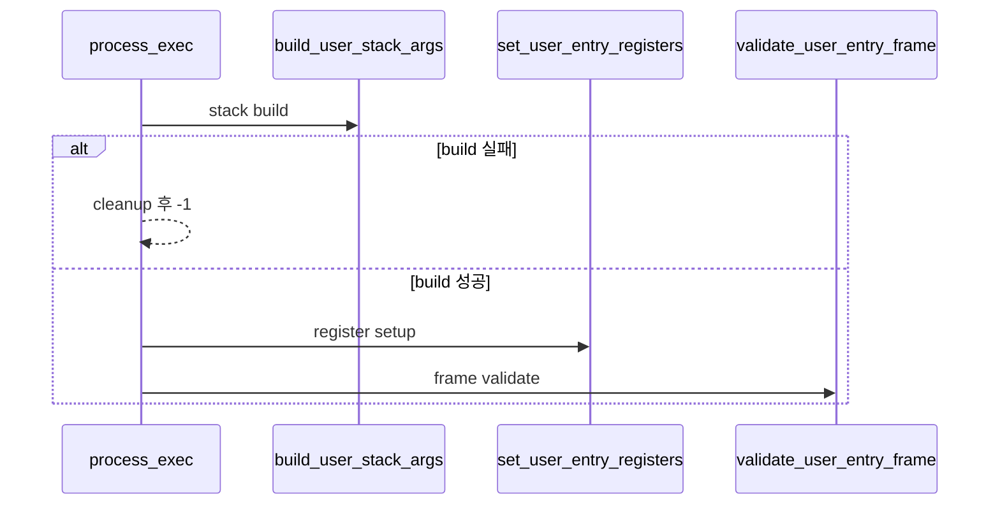

# 04 — 기능 3: 레지스터 설정과 유저 진입 경계

## 1. 구현 목적 및 필요성
### 이 기능이 무엇인가
스택에서 준비한 `argc/argv`를 실제 사용자 진입 규약(`RDI`, `RSI`, `RSP`, `RIP`)에 맞게 전달하는 기능입니다.

### 왜 이걸 하는가 (문제 맥락)
스택 데이터가 완벽해도 레지스터 매핑이 틀리면 유저 코드가 쓰레기 값을 읽습니다.

### 완성의 의미 (결과 관점)
`_start(argc, argv)`가 예상 입력으로 호출되고, `main()`까지 정상 진입합니다.

## 2. 가능한 구현 방식 비교
- 방식 A: `struct intr_frame`에 직접 세팅 (권장)
  - 장점: Pintos의 표준 유저 진입 경로와 동일
  - 단점: 프레임 필드 이해 필요
- 방식 B: 별도 중간 래퍼 경유
  - 장점: 추상화 가능
  - 단점: 디버깅 경로 길어짐
- 선택: A

## 3. 시퀀스와 단계별 흐름

1. 스택 빌더에서 최종 `rsp`, `argv_user_addr`를 받는다.
2. `argv_user_addr`가 사용자 가상 주소인지 먼저 확인한다.
3. `intr_frame`에 `rdi=argc`, `rsi=argv_user_addr`를 쓴다.
4. `rsp`를 사용자 진입에 맞게 점검한다.
5. 프레임 세팅 성공 시에만 유저 모드로 전환한다.

## 4. 기능별 가이드 (개념/흐름 + 구현 주석 위치)
### 4.1 기능 A: 인자 레지스터 세팅
#### 개념 설명
64비트 유저 프로그램 진입 규약에서는 첫 번째 인자 `argc`가 `RDI`, 두 번째 인자 `argv`가 `RSI`에 들어갑니다. 여기서 `argv`는 커널 배열 주소가 아니라 사용자 스택 안의 `argv_user_addr`여야 합니다.

#### 시퀀스 및 흐름

1. `user_if`, `argc`, `argv_user_addr`가 유효한지 확인한다.
2. `argv_user_addr`가 사용자 가상 주소인지 검사한다.
3. `user_if->R.rdi`에 `argc`를 쓴다.
4. `user_if->R.rsi`에 `argv_user_addr`를 쓴다.

#### 구현 주석 (보면 되는 함수)
- 위치: `pintos/userprog/process.c`의 `set_user_entry_registers()`

### 4.2 기능 B: 진입 프레임 무결성 점검
#### 개념 설명
스택과 레지스터 세팅이 끝났더라도 유저 모드로 넘어가기 전 마지막으로 프레임의 사용자 주소 경계를 확인해야 합니다.

#### 시퀀스 및 흐름

1. `intr_frame` 포인터가 NULL인지 확인한다.
2. `user_if->rsp`가 사용자 가상 주소인지 확인한다.
3. 실패하면 `do_iret()` 호출 전 에러 경로로 돌아간다.
4. 성공하면 유저 진입 가능한 프레임으로 본다.

#### 구현 주석 (보면 되는 함수)
- 위치: `pintos/userprog/process.c`의 `validate_user_entry_frame()`

### 4.3 기능 C: 실패 경로 일관성 유지
#### 개념 설명
파싱, 로드, 스택 빌드, 레지스터 세팅 중 하나라도 실패하면 부분적으로 준비된 프레임으로 유저 모드에 진입하면 안 됩니다.

#### 시퀀스 및 흐름

1. `load()` 실패 시 바로 정리 후 반환한다.
2. `build_user_stack_args()` 실패 시 레지스터 세팅으로 넘어가지 않는다.
3. `set_user_entry_registers()` 실패 시 `do_iret()`을 호출하지 않는다.
4. `validate_user_entry_frame()` 성공 후에만 `file_name`, `cmd_line`을 해제하고 유저 진입한다.

#### 구현 주석 (보면 되는 함수)
- 위치: `pintos/userprog/process.c`의 `process_exec()`

## 5. 구현 주석 (위치별 정리)
### 5.1 `process_exec()` 유저 진입 준비부
- 위치: `pintos/userprog/process.c`
- 역할: 파싱/로드/스택 결과를 `intr_frame`로 통합
- 규칙 1: 각 단계 성공 플래그 확인 후 다음 단계 진행
- 규칙 2: 프레임 필드 세팅 순서를 고정해 디버깅 단순화

구현 체크 순서:
1. 파싱, 로드, 스택 빌드의 성공 여부를 순서대로 확인한다.
2. 하나라도 실패하면 유저 진입 단계로 넘어가지 않는다.
3. 성공 경로에서만 `argv_user_addr` 기반 레지스터 세팅으로 진입한다.
4. 실패 경로는 자원 정리 후 단일 반환 규칙으로 통일한다.

### 5.2 `set_user_entry_registers()` `intr_frame` 인자 필드
- 위치: `pintos/userprog/process.c` (`if_.R.*`)
- 역할: ABI 인자 전달
- 규칙 1: `argc`는 정수 그대로 전달
- 규칙 2: `argv_user_addr`는 사용자 가상 주소 그대로 전달

구현 체크 순서:
1. `user_if`, `argc`, `argv_user_addr` 입력을 먼저 검증한다.
2. `argv_user_addr`가 사용자 가상 주소인지 점검한다.
3. `if_.R.rdi = argc`를 설정한다.
4. `if_.R.rsi = argv_user_addr`를 설정한다.

### 5.3 `validate_user_entry_frame()` 유저 전환 직전 점검
- 위치: `pintos/userprog/process.c`
- 역할: 마지막 방어선
- 규칙 1: `args-none` 기준 최소 입력에서도 동일 경로로 동작
- 규칙 2: 점검 실패 시 panic 대신 graceful fail

구현 체크 순서:
1. `RSP`가 사용자 스택 영역인지 확인한다.
2. 최소 입력(`args-none`)에서도 동일 점검 로직이 타는지 확인한다.
3. 점검 실패 시 `do_iret` 호출 없이 graceful fail로 종료한다.

## 6. 테스팅 방법
- 최소 경로: `args-none`
- 기본 인자: `args-single`
- 다수 인자: `args-multiple`, `args-many`
- 공백 경계: `args-dbl-space`

실패 시에는 스택 덤프 다음으로 `RDI/RSI/RSP/RIP` 값을 먼저 확인합니다.
