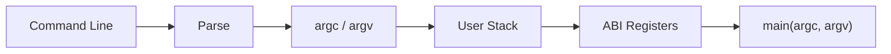
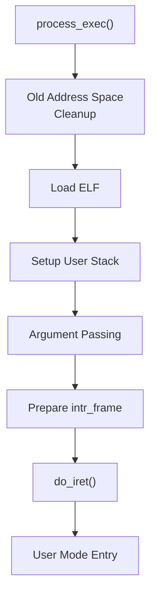

# Argument Passing 시각 자료

## 한 문장 정의 다이어그램

```mermaid
flowchart LR
    A["Command Line"]
    B["Parse"]
    C["argc / argv"]
    D["User Stack"]
    E["ABI Registers"]
    F["main(argc, argv)"]

    A --> B --> C --> D --> E --> F
```

## `process_exec()`에서 처리되는 이유

```mermaid
flowchart TD
    A["process_exec()"]
    B["Old Address Space\nCleanup"]
    C["Load ELF"]
    D["Setup User Stack"]
    E["Argument Passing"]
    F["Prepare intr_frame"]
    G["do_iret()"]
    H["User Mode Entry"]

    A --> B --> C --> D --> E --> F --> G --> H
```

