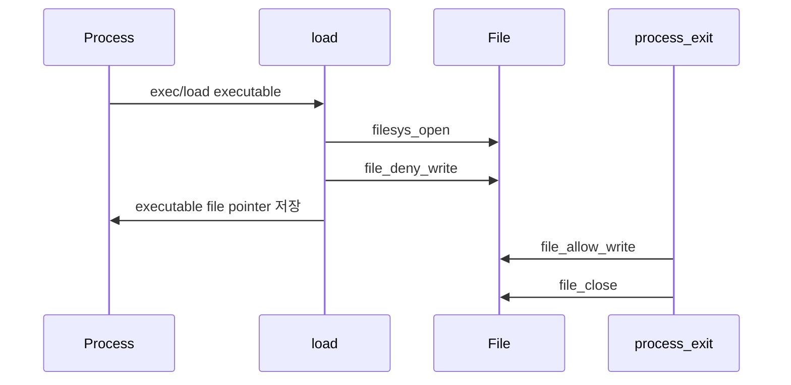

# 01 — 기능: Denying Writes to Executables

## 1. 구현 목적 및 필요성
### 이 기능이 무엇인가
현재 실행 중인 프로그램 파일에 대해 다른 프로세스 또는 같은 프로세스가 쓰지 못하게 막는 기능입니다.

### 왜 이걸 하는가 (문제 맥락)
실행 중인 코드가 디스크에서 변경되면 이후 로드되는 page나 segment 내용이 달라져 실행 결과를 예측하기 어렵습니다.

### 무엇을 연결하는가 (기술 맥락)
`load()`, `file_deny_write()`, `file_allow_write()`, `process_exit()`, fd table, fork/exec 자원 복사 경계를 연결합니다.

### 완성의 의미 (결과 관점)
프로세스가 실행 중인 동안 해당 executable file에 대한 `write`가 실패하고, 프로세스 종료 후에는 다시 쓰기가 허용됩니다.

## 2. 가능한 구현 방식 비교
- 방식 A: `write` syscall에서 파일 이름을 비교해 막기
  - 장점: 직관적으로 보인다.
  - 단점: 같은 inode를 다른 이름/handle로 연 경우를 놓치고 file 계층 정책과 어긋난다.
- 방식 B: `load()`에서 실행 파일 객체에 `file_deny_write()`를 걸고 프로세스 종료까지 보관
  - 장점: PintOS file API의 의도와 맞고 rox 테스트에 안정적이다.
  - 단점: executable file 포인터 수명 관리가 필요하다.
- 선택: B

## 3. 시퀀스와 단계별 흐름

1. `load()`가 실행 파일을 연다.
2. 열린 실행 파일에 `file_deny_write()`를 호출한다.
3. 프로세스가 종료될 때까지 file 객체를 닫지 않고 보관한다.
4. 종료 시 `file_allow_write()` 후 `file_close()`한다.

## 4. 기능별 가이드 (개념/흐름 + 구현 주석 위치)
### 4.1 실행 파일 보관과 deny-write
#### 개념 설명
`file_deny_write()`는 열린 file 객체에 적용됩니다. 따라서 deny-write가 유지되려면 그 file 객체를 프로세스가 실행되는 동안 닫지 않아야 합니다.

#### 시퀀스 및 흐름

1. `load()`가 executable file을 연다.
2. open 성공 직후 `file_deny_write()`를 호출한다.
3. current thread의 executable field에 file 포인터를 저장한다.

#### 구현 주석 (보면 되는 함수/구조체)
- 위치: `pintos/userprog/process.c`의 `load()`
- 위치: `pintos/include/threads/thread.h`의 executable file 필드

### 4.2 종료 시 write 허용 복구
#### 개념 설명
프로세스가 끝나면 실행 파일 쓰기 금지를 해제하고 file을 닫아야 합니다.

#### 시퀀스 및 흐름

1. `process_exit()` 또는 cleanup 경로에서 executable field를 확인한다.
2. non-NULL이면 allow-write 후 close한다.
3. 필드를 NULL로 정리한다.

#### 구현 주석 (보면 되는 함수/구조체)
- 위치: `pintos/userprog/process.c`의 `process_exit()`, `process_cleanup()`
- 위치: `pintos/userprog/syscall.c`의 `write` syscall

## 5. 구현 주석 (위치별 정리)
### 5.1 executable file 상태 저장

#### 5.1.1 `struct thread`의 executable file 필드
- 위치: `pintos/include/threads/thread.h`
- 역할: 현재 프로세스가 실행 중인 file 객체를 종료 시점까지 보관한다.
- 규칙 1: thread 초기화 시 NULL로 시작한다.
- 규칙 2: `load()` 성공 후 executable file 포인터를 저장한다.
- 규칙 3: cleanup 이후 NULL로 되돌린다.
- 금지 1: 실행 파일 포인터를 전역 변수로 관리하지 않는다.

구현 체크 순서:
1. `struct thread`에 executable file 포인터를 추가한다.
2. `init_thread()`에서 NULL로 초기화한다.
3. `load()` 성공 경로와 `process_exit()` 정리 경로를 연결한다.

### 5.2 `load()` 성공/실패 경로

#### 5.2.1 `load()`의 `file_deny_write()` 호출
- 위치: `pintos/userprog/process.c`의 `load()`
- 역할: 실행 파일 open 성공 직후 쓰기 금지를 설정한다.
- 규칙 1: `filesys_open()`이 NULL이 아닐 때만 `file_deny_write()`를 호출한다.
- 규칙 2: deny-write를 건 file 객체를 current thread 필드에 저장한다.
- 규칙 3: 성공 경로에서는 이 file을 load 함수 끝에서 닫지 않는다.
- 금지 1: deny-write 후 바로 `file_close()`해서 금지 상태를 풀지 않는다.

구현 체크 순서:
1. `filesys_open(file_name)` 성공 여부를 확인한다.
2. `file_deny_write(file)`를 호출한다.
3. current thread의 executable field에 file을 저장한다.
4. load 성공 시 file을 열린 채로 둔다.

#### 5.2.2 `load()` 실패 경로의 정리
- 위치: `pintos/userprog/process.c`의 `load()` 실패 라벨
- 역할: load 실패 시 deny-write와 열린 file을 남기지 않는다.
- 규칙 1: deny-write 이후 실패했다면 `file_allow_write()` 후 `file_close()`한다.
- 규칙 2: current thread executable field를 NULL로 되돌린다.
- 금지 1: 실패 경로에서 file을 중복 close하지 않는다.

구현 체크 순서:
1. load 성공 여부 flag를 확인한다.
2. 실패 시 executable field가 non-NULL인지 확인한다.
3. allow-write 후 close한다.
4. field를 NULL로 만든다.

### 5.3 `write` syscall과 file 계층 반환

#### 5.3.1 `sys_write()`의 일반 file write
- 위치: `pintos/userprog/syscall.c`
- 역할: fd table에서 찾은 file에 `file_write()`를 호출하고 결과를 반환한다.
- 규칙 1: fd 1은 stdout으로 처리하고 일반 file에는 `file_write()`를 호출한다.
- 규칙 2: deny-write 상태인 file은 file 계층의 반환값으로 실패가 드러나게 한다.
- 금지 1: 파일 이름 문자열 비교로 executable write를 직접 막지 않는다.

구현 체크 순서:
1. fd lookup으로 `struct file *`를 찾는다.
2. 일반 file이면 `file_write()`를 호출한다.
3. 반환값을 syscall RAX에 반영한다.
4. `rox-simple`로 자기 실행 파일 write 실패를 확인한다.

### 5.4 종료/fork/exec 경계

#### 5.4.1 `process_exit()`의 allow-write 및 close
- 위치: `pintos/userprog/process.c`
- 역할: 프로세스 종료 시 실행 파일 쓰기 금지를 해제하고 file을 닫는다.
- 규칙 1: executable field가 non-NULL이면 `file_allow_write()` 후 `file_close()`한다.
- 규칙 2: 정리 후 field를 NULL로 만든다.
- 금지 1: close 없이 field만 NULL로 만들지 않는다.

구현 체크 순서:
1. current thread의 executable field를 읽는다.
2. non-NULL이면 allow-write를 호출한다.
3. file을 close한다.
4. field를 NULL로 만든다.

#### 5.4.2 `__do_fork()`의 executable file 복제
- 위치: `pintos/userprog/process.c`의 `__do_fork()`
- 역할: fork 시 부모와 자식의 executable file 소유권을 분리한다.
- 규칙 1: 자식이 executable field를 가져야 한다면 `file_duplicate()`로 복제한다.
- 규칙 2: 부모와 자식 cleanup이 같은 file 객체를 중복 close하지 않게 한다.
- 금지 1: 부모 executable pointer를 얕은 복사하지 않는다.

구현 체크 순서:
1. fork 자원 복사 단계에서 executable field 정책을 정한다.
2. 복제가 필요하면 `file_duplicate()`를 호출한다.
3. 실패 경로에서 복제한 file을 정리한다.

#### 5.4.3 `process_exec()`의 기존 executable 정리
- 위치: `pintos/userprog/process.c`의 `process_exec()`
- 역할: 새 실행 파일로 교체할 때 기존 executable file을 정리한다.
- 규칙 1: 새 load 성공/실패 정책에 맞춰 기존 file 해제 시점을 정한다.
- 규칙 2: 성공 후에는 새 executable file만 field에 남는다.
- 금지 1: 기존 executable pointer를 새 pointer로 덮어써 해제를 놓치지 않는다.

구현 체크 순서:
1. exec 시작 시 기존 field 상태를 확인한다.
2. 기존 file allow/close 시점을 정한다.
3. 새 load 성공 후 field가 새 file을 가리키는지 확인한다.

## 6. 테스팅 방법
- `rox-simple`: 자기 실행 파일 쓰기 금지
- `rox-child`: 자식 실행 파일 쓰기 금지
- `rox-multichild`: 여러 자식 실행 파일 쓰기 금지
- 실패 시 executable file 보관 시점, cleanup 시점, fd write 반환값을 먼저 확인

