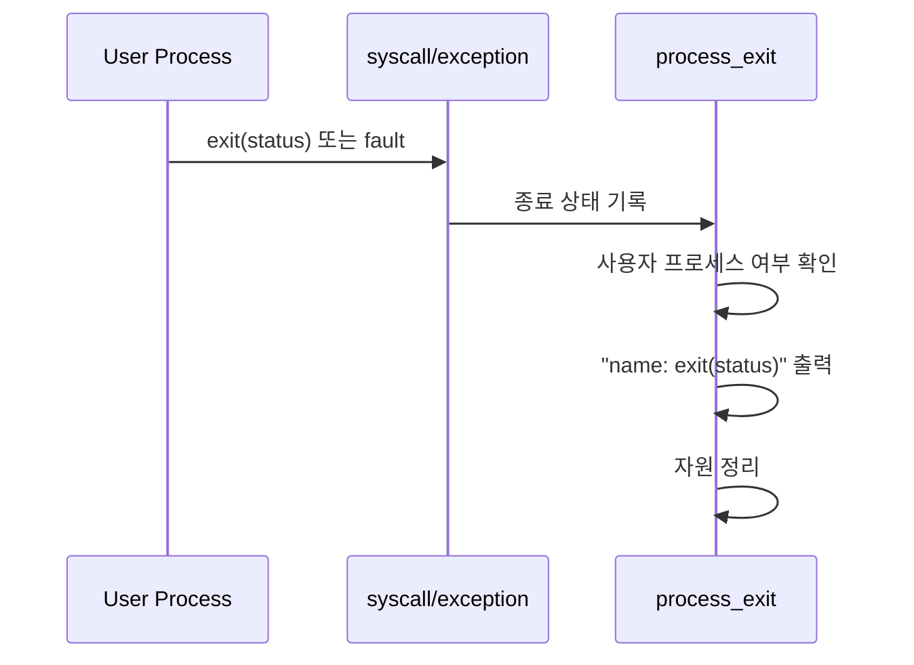
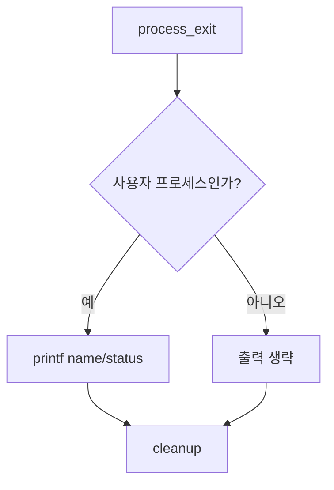

# 01 — 기능: Process Termination Messages

## 1. 구현 목적 및 필요성
### 이 기능이 무엇인가
사용자 프로세스가 종료될 때 프로세스 이름과 exit status를 정해진 형식으로 출력하는 기능입니다.

### 왜 이걸 하는가 (문제 맥락)
PintOS 테스트는 프로세스 종료를 출력 로그로도 확인합니다. 출력 형식이 다르거나 불필요한 메시지가 섞이면 기능이 맞아도 테스트가 실패할 수 있습니다.

### 무엇을 연결하는가 (기술 맥락)
`exit` syscall, page fault 등 비정상 종료 경로, `process_exit()`, `thread_exit()`를 연결합니다.

### 완성의 의미 (결과 관점)
사용자 프로세스 종료마다 정확히 한 번 `printf("%s: exit(%d)\n", name, status)` 형식의 메시지가 출력됩니다.

## 2. 가능한 구현 방식 비교
- 방식 A: `sys_exit()`에서만 출력
  - 장점: 구현이 단순
  - 단점: page fault 등 syscall이 아닌 종료 경로를 놓친다.
- 방식 B: `process_exit()`에서 사용자 프로세스 종료 공통 경로로 출력
  - 장점: 정상/비정상 종료 경로를 한 곳에서 처리한다.
  - 단점: kernel thread와 halt 경로를 구분해야 한다.
- 선택: B

## 3. 시퀀스와 단계별 흐름

1. 종료 원인에 따라 exit status를 결정한다.
2. 현재 프로세스의 종료 상태 저장 위치에 status를 기록한다.
3. 사용자 프로세스라면 정해진 형식의 메시지를 출력한다.
4. 열린 파일, 주소 공간, 부모-자식 상태를 정리한다.

## 4. 기능별 가이드 (개념/흐름 + 구현 주석 위치)
### 4.1 종료 상태 기록
#### 개념 설명
출력 메시지는 현재 프로세스의 이름과 종료 상태를 사용합니다. 따라서 `exit(status)` 인자를 먼저 현재 프로세스 상태에 저장해야 합니다.

#### 시퀀스 및 흐름

1. `SYS_EXIT`가 `status`를 읽는다.
2. `sys_exit(status)`가 현재 프로세스 상태에 저장한다.
3. `thread_exit()`를 통해 `process_exit()`로 들어간다.

#### 구현 주석 (보면 되는 함수/구조체)
- 위치: `pintos/userprog/syscall.c`의 `SYS_EXIT` 분기와 `sys_exit()`
- 위치: `pintos/include/threads/thread.h`의 exit status 필드

### 4.2 종료 메시지 출력
#### 개념 설명
종료 메시지는 사용자 프로세스에 대해서만 출력해야 하며, 커널 스레드나 halt 경로에서는 출력하지 않습니다.

#### 시퀀스 및 흐름

1. `process_exit()`에서 현재 thread가 사용자 프로세스인지 판단한다.
2. 저장된 exit status를 읽는다.
3. 정해진 printf 형식으로 한 번만 출력한다.

#### 구현 주석 (보면 되는 함수/구조체)
- 위치: `pintos/userprog/process.c`의 `process_exit()`
- 위치: `pintos/threads/thread.c`의 `thread_exit()` 호출 경로

## 5. 구현 주석 (위치별 정리)
### 5.1 exit status 저장

#### 5.1.1 `struct thread`의 exit status 필드
- 위치: `pintos/include/threads/thread.h`
- 역할: 현재 프로세스의 종료 상태를 `process_exit()`와 `process_wait()`에서 읽을 수 있게 보관한다.
- 규칙 1: 정상 종료 시 `exit(status)`의 status를 저장한다.
- 규칙 2: page fault 등 커널이 죽이는 경로는 -1을 저장한다.
- 금지 1: status 저장 없이 `thread_exit()`만 호출하지 않는다.

구현 체크 순서:
1. `struct thread`에 exit status 필드가 있는지 확인한다.
2. thread 초기화 시 기본값을 정한다.
3. `sys_exit()`와 exception kill 경로에서 같은 필드를 갱신한다.

#### 5.1.2 `sys_exit()`의 status 기록
- 위치: `pintos/userprog/syscall.c`
- 역할: syscall 인자로 받은 status를 저장하고 종료 경로로 진입한다.
- 규칙 1: `SYS_EXIT`의 첫 번째 인자는 `f->R.rdi`에서 읽는다.
- 규칙 2: status 저장 후 `thread_exit()`로 종료한다.
- 금지 1: `sys_exit()`에서 메시지를 출력하고 `process_exit()`에서도 또 출력해 중복 메시지를 만들지 않는다.

구현 체크 순서:
1. handler에서 `f->R.rdi`를 읽는다.
2. `sys_exit(status)`로 전달한다.
3. current thread의 exit status를 갱신한다.
4. `thread_exit()`를 호출한다.

### 5.2 종료 메시지 출력 경로

#### 5.2.1 `process_exit()`의 사용자 프로세스 종료 메시지
- 위치: `pintos/userprog/process.c`
- 역할: 사용자 프로세스 종료 시 정해진 형식의 메시지를 정확히 한 번 출력한다.
- 규칙 1: 출력 형식은 `printf("%s: exit(%d)\n", thread_current()->name, status)`와 같아야 한다.
- 규칙 2: 커널 스레드 종료에는 출력하지 않는다.
- 규칙 3: `halt` syscall에는 출력하지 않는다.
- 금지 1: 디버그용 추가 출력문을 남기지 않는다.

구현 체크 순서:
1. current thread가 사용자 프로세스인지 판단할 기준을 정한다.
2. 저장된 exit status를 읽는다.
3. `printf("%s: exit(%d)\n", ...)` 형식으로 출력한다.
4. 자원 cleanup은 출력 이후 또는 팀이 정한 순서로 일관되게 수행한다.

#### 5.2.2 exception kill 경로의 status -1 연결
- 위치: `pintos/userprog/exception.c`
- 역할: 사용자 프로세스가 잘못된 메모리 접근 등으로 죽을 때 exit status를 -1로 맞춘다.
- 규칙 1: 사용자 프로세스 fault는 현재 프로세스 종료로 처리한다.
- 규칙 2: 종료 메시지는 `process_exit()` 공통 경로에서 출력되게 한다.
- 금지 1: exception handler와 process_exit 양쪽에서 메시지를 중복 출력하지 않는다.

구현 체크 순서:
1. page fault가 사용자 프로세스 fault인지 판별한다.
2. exit status를 -1로 기록한다.
3. `thread_exit()`로 공통 종료 경로에 진입한다.

## 6. 테스팅 방법
- `exit`: 정상 종료 메시지 형식 확인
- `wait-killed`: 비정상 종료 status -1 확인
- `multi-*`: 여러 프로세스 종료 시 각 메시지가 한 번씩 출력되는지 확인
- 실패 시 출력 형식, 중복 출력, 불필요한 debug print부터 확인

