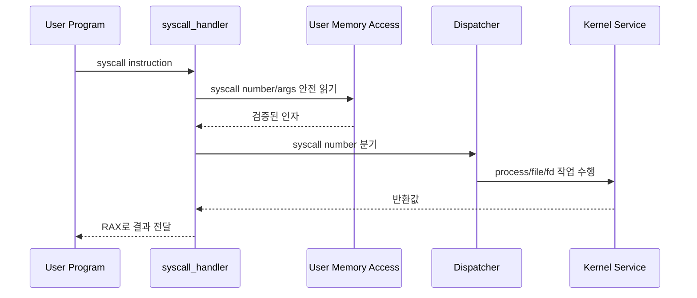

# 01 — System Calls 전체 개념과 동작 흐름

이 문서는 System Calls를 처음 볼 때 필요한 큰 그림을 잡기 위한 개요 문서입니다.  
syscall 진입, dispatch, 프로세스/파일 syscall, fd table, 종료 상태 전달이 어떻게 연결되는지 이해하도록 구성했습니다.

---

## 1) System Calls를 한 문장으로 설명하면

**"사용자 프로그램이 커널 기능을 요청하는 공식 진입점이며, 검증된 인자를 커널 정책에 따라 처리하고 결과를 반환하는 인터페이스"**입니다.

핵심은 포인터 검증 자체가 아니라, 검증된 syscall 요청을 **정확한 커널 동작과 반환값**으로 연결하는 것입니다.

---

## 2) 왜 필요한가 (문제의식)

사용자 프로그램은 파일 생성/열기/읽기/쓰기, 프로세스 실행/대기/종료를 직접 수행할 수 없습니다.  
커널은 syscall을 통해 요청을 받고, 프로세스별 상태와 파일 시스템 상태를 안전하게 갱신해야 합니다.

System Calls는 문제를 해결하기 위해:
- syscall number와 인자를 dispatch하고
- process/file/fd 정책을 일관되게 수행하고
- 실패 시 테스트가 기대하는 반환값 또는 종료 상태를 보장합니다.

---

## 3) 동작 시퀀스와 단계별 흐름

시퀀스를 단계로 읽으면 다음과 같습니다.

1. 사용자 프로그램이 syscall instruction으로 커널에 진입한다.
2. User Memory Access 계층이 syscall number와 인자를 안전하게 읽는다.
3. dispatcher가 syscall number에 맞는 구현으로 분기한다.
4. syscall 구현은 프로세스 상태, fd table, 파일 시스템을 갱신한다.
5. 결과값은 `RAX`에 담겨 사용자 프로그램으로 돌아간다.

---

## 4) 반드시 분리해서 이해할 개념

- **진입/dispatch 계층**: syscall number와 인자 개수, 반환 레지스터
- **User Memory Access 계층**: 포인터 검증과 안전 복사
- **프로세스 계층**: `exit`, `fork`, `exec`, `wait`
- **파일 계층**: `create`, `remove`, `open`, `read`, `write`, `close`
- **fd table 계층**: 프로세스별 fd 번호와 file 객체 수명

User Memory Access와 System Calls를 섞으면 bad pointer 테스트와 정상 syscall 정책 테스트가 서로 헷갈립니다.

---

## 5) 이 기능에서 자주 틀리는 지점

- syscall 인자 검증과 syscall 본래 정책을 한 함수에 뒤섞는 경우
- `RAX` 반환값을 누락하거나 실패 반환값을 잘못 주는 경우
- fd table을 전역으로 관리해 프로세스 간 fd가 섞이는 경우
- `read`/`write`에서 stdin/stdout과 일반 파일을 구분하지 않는 경우
- `exec`/`wait` 동기화가 없어 부모가 잘못된 상태를 관측하는 경우
- 실행 중인 파일에 deny-write를 적용하지 않는 경우

---

## 6) 학습 순서 (추천)

1. `02-feature-syscall-dispatch-and-args.md` — syscall 진입/dispatch/반환값
2. `03-feature-process-syscalls.md` — `halt`, `exit`, `fork`, `exec`, `wait`
3. `04-feature-file-syscalls-and-fd-table.md` — 파일 syscall과 fd table
4. `05-feature-executable-write-deny.md` — 실행 파일 쓰기 금지와 rox 테스트

---

## 7) 구현 전에 스스로 체크할 질문

- syscall number별 인자 개수와 반환값을 정리했는가?
- bad pointer 처리는 User Memory Access helper에 위임되는가?
- fd table은 현재 프로세스 기준으로만 조회되는가?
- `exec` 성공/실패를 부모가 정확히 알 수 있는가?
- `wait`가 자식/비자식/중복 wait를 구분하는가?
- 실행 파일이 열려 있는 동안 write가 거부되는가?
