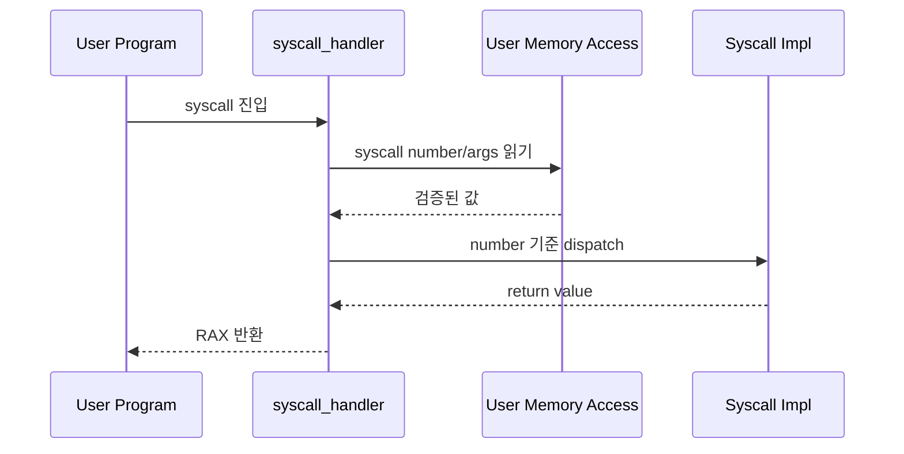
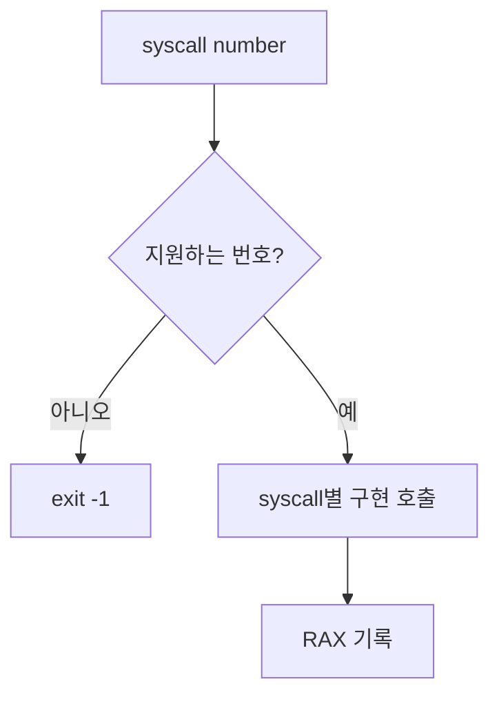
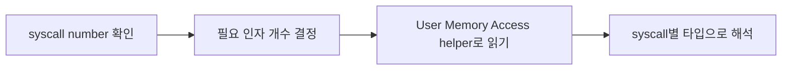
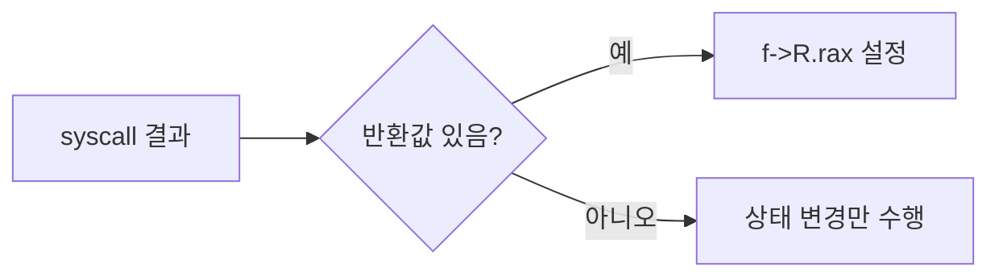

# 02 — 기능 1: Syscall Dispatch와 인자/반환값 경계

## 1. 구현 목적 및 필요성
### 이 기능이 무엇인가
사용자 프로그램이 요청한 syscall number를 읽고, 해당 syscall 구현으로 분기하며, 결과를 사용자에게 반환하는 기능입니다.

### 왜 이걸 하는가 (문제 맥락)
syscall handler가 번호/인자/반환값을 일관되게 처리하지 않으면 정상 syscall도 잘못된 함수로 분기하거나 사용자 프로그램이 잘못된 결과를 읽습니다.

### 무엇을 연결하는가 (기술 맥락)
`syscall_handler()`, `struct intr_frame`, User Memory Access helper, syscall별 구현 함수, `RAX` 반환 레지스터를 연결합니다.

### 완성의 의미 (결과 관점)
모든 syscall이 같은 진입 규칙을 통해 dispatch되고, 성공/실패 결과가 `f->R.rax`로 일관되게 반환됩니다.

## 2. 가능한 구현 방식 비교
- 방식 A: `syscall_handler()` 안에 모든 로직 직접 작성
  - 장점: 초반 구현이 빠름
  - 단점: 함수가 커지고 실패 정책이 섞임
- 방식 B: handler는 dispatch만 하고 syscall별 helper로 분리
  - 장점: syscall별 정책과 검증 경계가 명확
  - 단점: helper 함수 목록을 관리해야 함
- 선택: B

## 3. 시퀀스와 단계별 흐름

1. syscall 진입 시 `intr_frame`에서 사용자 컨텍스트를 확인한다.
2. User Memory Access helper로 syscall number와 필요한 인자를 읽는다.
3. syscall number에 따라 구현 함수로 분기한다.
4. 반환값이 있는 syscall은 `f->R.rax`에 결과를 기록한다.

## 4. 기능별 가이드 (개념/흐름 + 구현 주석 위치)
### 4.1 기능 A: syscall number dispatch
#### 개념 설명
syscall number는 사용자 요청의 종류를 결정하는 값입니다. dispatch는 단순한 switch가 아니라 인자 개수, 반환값, 실패 정책을 연결하는 중심입니다.

#### 시퀀스 및 흐름

1. syscall number를 안전하게 읽는다.
2. 지원하지 않는 번호는 실패 경로로 보낸다.
3. 지원하는 번호는 syscall별 구현 함수로 분기한다.
4. 결과값은 `RAX`에 기록한다.

#### 구현 주석 (보면 되는 함수/구조체)
- 위치: `pintos/userprog/syscall.c`의 `syscall_handler()`
- 위치: `pintos/include/lib/syscall-nr.h`

### 4.2 기능 B: syscall 인자 추출 계약
#### 개념 설명
인자 검증 자체는 User Memory Access의 책임이지만, System Calls는 syscall별로 몇 개의 인자가 필요한지 알고 올바른 타입으로 해석해야 합니다.

#### 시퀀스 및 흐름

1. syscall number별 필요한 인자 수를 결정한다.
2. 사용자 스택의 인자 위치를 직접 역참조하지 않는다.
3. User Memory Access helper가 읽어준 값을 syscall별 타입으로 해석한다.

#### 구현 주석 (보면 되는 함수/구조체)
- 위치: `pintos/userprog/syscall.c`의 syscall 인자 읽기 helper
- 위치: `pintos/doc/taejung_files/2. week2/study/2. test-notes/user_memory_access`

### 4.3 기능 C: 반환값과 실패 정책
#### 개념 설명
syscall마다 성공/실패 반환값이 다릅니다. 반환값을 명확히 하지 않으면 테스트는 동작했는데 사용자 프로그램이 실패로 판단할 수 있습니다.

#### 시퀀스 및 흐름

1. 반환값이 있는 syscall은 반드시 `f->R.rax`를 설정한다.
2. 실패 시 테스트 기대값에 맞는 값을 반환한다.
3. 치명적 오류는 반환이 아니라 `exit(-1)`로 처리한다.

#### 구현 주석 (보면 되는 함수/구조체)
- 위치: `pintos/userprog/syscall.c`의 syscall별 구현 함수
- 위치: `pintos/include/threads/interrupt.h`의 `struct intr_frame`

## 5. 구현 주석 (위치별 정리)
### 5.1 `syscall_handler()`의 syscall number 읽기
- 위치: `pintos/userprog/syscall.c`
- 역할: syscall 진입점에서 `f->R.rax`의 syscall number를 읽고 분기한다.
- 규칙 1: x86-64 syscall 경로에서는 syscall number를 사용자 스택이 아니라 `struct intr_frame *f`의 `RAX`에서 읽는다.
- 규칙 2: `f == NULL`인 경로는 정상 syscall 진입이 아니므로 방어하거나 도달하지 않는다고 가정한다.
- 규칙 3: 지원하지 않는 syscall 번호는 팀 계약대로 `exit(-1)` 또는 실패 반환으로 통일한다.
- 금지 1: syscall number를 얻기 위해 사용자 주소를 직접 역참조하지 않는다.

구현 체크 순서:
1. `uint64_t syscall_no = f->R.rax` 형태로 번호를 읽는다.
2. `switch (syscall_no)` 또는 dispatch table을 구성한다.
3. 각 case에서 필요한 레지스터 인자만 꺼낸다.
4. 반환값이 있는 case는 `f->R.rax`에 결과를 기록한다.
5. default case의 실패 정책을 고정한다.

### 5.2 `struct intr_frame` 레지스터 인자 매핑
- 위치: `pintos/include/threads/interrupt.h`의 `struct intr_frame`, `pintos/userprog/syscall.c`
- 역할: syscall별 인자를 x86-64 호출 규약에 맞게 레지스터에서 읽는다.
- 규칙 1: 1번째 인자는 `f->R.rdi`, 2번째는 `f->R.rsi`, 3번째는 `f->R.rdx`에서 읽는다.
- 규칙 2: 4번째 이후 인자가 필요한 syscall은 PintOS에서 제공한 syscall ABI 문서와 레지스터 필드를 확인해 추가한다.
- 규칙 3: 정수 인자는 필요한 C 타입으로 명시 캐스팅하고, 포인터 인자는 사용 전 User Memory Access helper로 검증한다.
- 금지 1: Project 2 x86-64 코드에서 32-bit PintOS처럼 사용자 스택에서 syscall 인자를 꺼내지 않는다.

구현 체크 순서:
1. syscall 번호별 인자 개수와 타입을 표로 정리한다.
2. 각 case에서 `rdi/rsi/rdx`를 해당 타입으로 변환한다.
3. 포인터 의미를 가진 인자는 syscall 구현 함수 안에서 검증하도록 넘긴다.

### 5.3 포인터 인자 검증 연결
- 위치: `pintos/userprog/syscall.c`
- 역할: syscall handler에서 받은 포인터 인자를 실제 사용 전에 User Memory Access 정책으로 통과시킨다.
- 규칙 1: `buffer`, `file`, `cmd_line` 등 사용자 포인터는 커널이 읽거나 쓰기 전에 검증한다.
- 규칙 2: 문자열 인자는 문자열 검증 helper, 버퍼 인자는 크기 기반 버퍼 검증 helper를 사용한다.
- 규칙 3: 검증 실패는 해당 helper의 계약대로 `exit(-1)` 등 공통 실패 경로로 연결한다.
- 금지 1: handler에서 레지스터 값을 포인터로 캐스팅한 직후 바로 `strlen`, `memcpy`, `filesys_*`에 넘기지 않는다.
- 금지 2: bad pointer 처리 본문을 syscall마다 복붙하지 않는다.

구현 체크 순서:
1. 포인터 인자를 받는 syscall 목록을 표시한다.
2. 각 syscall 구현 함수 첫 부분에서 검증 helper를 호출한다.
3. 검증 이후에만 파일 시스템 함수나 `putbuf`/`file_read` 같은 실제 사용 경로로 진입한다.

### 5.4 syscall 구현 함수와 `RAX` 반환 기록
- 위치: `pintos/include/threads/interrupt.h`의 `struct intr_frame`, `pintos/userprog/syscall.c`의 syscall 완료 지점
- 역할: 반환값이 있는 syscall은 사용자가 보는 `f->R.rax`를 항상 일관되게 갱신한다.
- 규칙 1: `read`, `write`, `open`, `filesize`, `tell`, `wait`, `fork`, `exec`처럼 반환값이 있는 syscall은 handler case에서 `f->R.rax = result`를 수행한다.
- 규칙 2: `exit`처럼 프로세스를 종료하는 syscall은 정상 반환하지 않으므로 RAX 설정에 의존하지 않는다.
- 규칙 3: `halt`처럼 돌아오지 않는 syscall은 shutdown 경로로 바로 연결한다.
- 금지 1: syscall 구현이 return했는데 handler가 RAX를 설정하지 않아 임의 값이 남는 경우를 두지 않는다.

구현 체크 순서:
1. syscall별 “RAX 설정 필요 여부”를 표로 만든다.
2. handler 마지막에 공통으로 RAX를 다룰지, 각 syscall이 직접 쓸지 팀 규칙을 고정한다.
3. `read`/`write` 반환 바이트 수 등 테스트 민감 syscall부터 확인한다.

### 5.5 unsupported syscall default 경로
- 위치: `pintos/userprog/syscall.c`의 `syscall_handler()` default case
- 역할: 구현하지 않은 syscall 번호를 만났을 때 커널 panic이나 임의 반환 없이 정해진 실패 경로로 보낸다.
- 규칙 1: 테스트 정책이 “비정상 syscall은 프로세스 종료”라면 `sys_exit(-1)` 또는 공통 kill helper를 호출한다.
- 규칙 2: 실패 반환을 택한 syscall만 `f->R.rax = -1`로 처리하고, unknown syscall과 섞지 않는다.
- 금지 1: default case를 비워 두어 사용자 프로그램이 계속 실행되게 하지 않는다.

구현 체크 순서:
1. `switch`의 default case를 만든다.
2. unknown syscall의 종료/반환 정책을 하나로 고정한다.
3. 디버깅용 출력이 테스트 출력을 오염시키지 않는지 확인한다.

## 6. 테스팅 방법
- `halt`, `exit`: 최소 syscall dispatch 확인
- `create-normal`, `open-normal`: 파일 syscall dispatch 확인
- `read-normal`, `write-normal`: 반환값과 fd 분기 확인
- 실패 시 syscall number/인자 개수/RAX 기록 순서부터 확인
