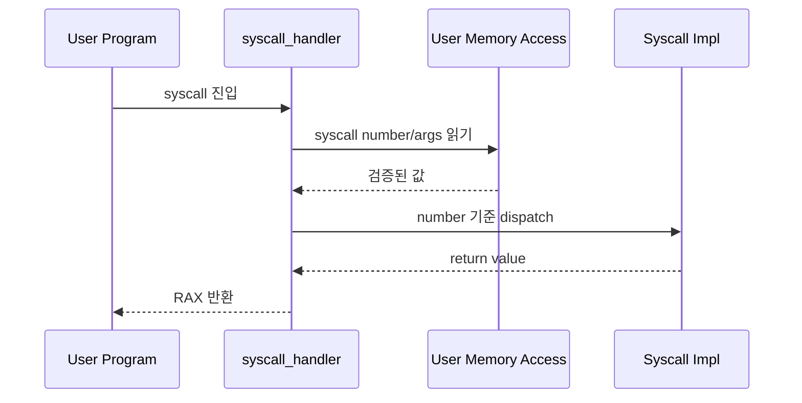
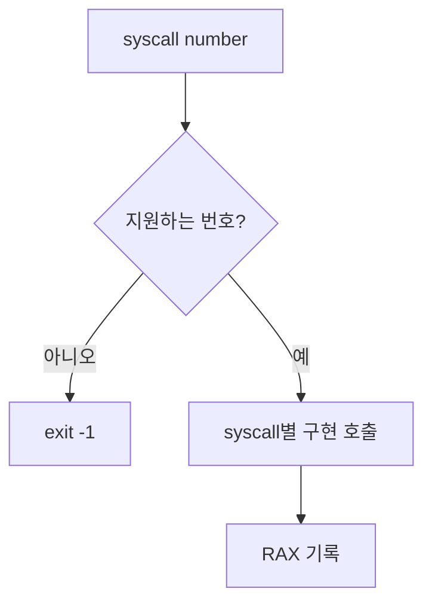
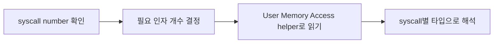
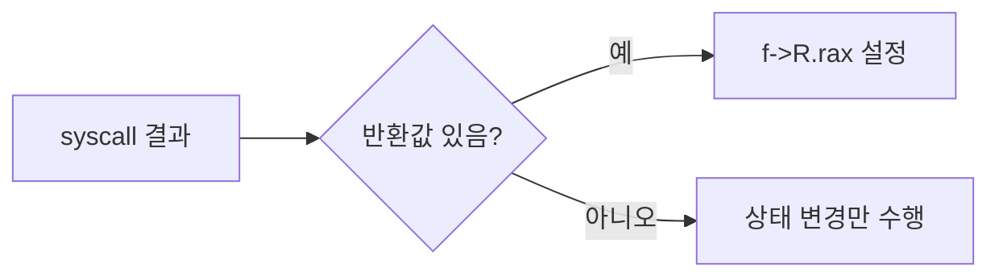

# 02 — 기능 1: Syscall Dispatch와 인자/반환값 경계

## 1. 구현 목적 및 필요성
### 이 기능이 무엇인가
사용자 프로그램이 요청한 syscall number를 읽고, 해당 syscall 구현으로 분기하며, 결과를 사용자에게 반환하는 기능입니다.

### 왜 이걸 하는가 (문제 맥락)
syscall handler가 번호/인자/반환값을 일관되게 처리하지 않으면 정상 syscall도 잘못된 함수로 분기하거나 사용자 프로그램이 잘못된 결과를 읽습니다.

### 무엇을 연결하는가 (기술 맥락)
`syscall_handler()`, `struct intr_frame`, User Memory Access helper, syscall별 구현 함수, `RAX` 반환 레지스터를 연결합니다.

### 완성의 의미 (결과 관점)
모든 syscall이 같은 진입 규칙을 통해 dispatch되고, 성공/실패 결과가 `f->R.rax`로 일관되게 반환됩니다.

## 2. 가능한 구현 방식 비교
- 방식 A: `syscall_handler()` 안에 모든 로직 직접 작성
  - 장점: 초반 구현이 빠름
  - 단점: 함수가 커지고 실패 정책이 섞임
- 방식 B: handler는 dispatch만 하고 syscall별 helper로 분리
  - 장점: syscall별 정책과 검증 경계가 명확
  - 단점: helper 함수 목록을 관리해야 함
- 선택: B

## 3. 시퀀스와 단계별 흐름

1. syscall 진입 시 `intr_frame`에서 사용자 컨텍스트를 확인한다.
2. User Memory Access helper로 syscall number와 필요한 인자를 읽는다.
3. syscall number에 따라 구현 함수로 분기한다.
4. 반환값이 있는 syscall은 `f->R.rax`에 결과를 기록한다.

## 4. 기능별 가이드 (개념/흐름 + 구현 주석 위치)
### 4.1 기능 A: syscall number dispatch
#### 개념 설명
syscall number는 사용자 요청의 종류를 결정하는 값입니다. dispatch는 단순한 switch가 아니라 인자 개수, 반환값, 실패 정책을 연결하는 중심입니다.

#### 시퀀스 및 흐름

1. syscall number를 안전하게 읽는다.
2. 지원하지 않는 번호는 실패 경로로 보낸다.
3. 지원하는 번호는 syscall별 구현 함수로 분기한다.
4. 결과값은 `RAX`에 기록한다.

#### 구현 주석 (보면 되는 함수/구조체)
- 위치: `pintos/userprog/syscall.c`의 `syscall_handler()`
- 위치: `pintos/include/lib/syscall-nr.h`

### 4.2 기능 B: syscall 인자 추출 계약
#### 개념 설명
인자 검증 자체는 User Memory Access의 책임이지만, System Calls는 syscall별로 몇 개의 인자가 필요한지 알고 올바른 타입으로 해석해야 합니다.

#### 시퀀스 및 흐름

1. syscall number별 필요한 인자 수를 결정한다.
2. 사용자 스택의 인자 위치를 직접 역참조하지 않는다.
3. User Memory Access helper가 읽어준 값을 syscall별 타입으로 해석한다.

#### 구현 주석 (보면 되는 함수/구조체)
- 위치: `pintos/userprog/syscall.c`의 syscall 인자 읽기 helper
- 위치: `pintos/doc/taejung_files/2. week2/study/2. test-notes/user_memory_access`

### 4.3 기능 C: 반환값과 실패 정책
#### 개념 설명
syscall마다 성공/실패 반환값이 다릅니다. 반환값을 명확히 하지 않으면 테스트는 동작했는데 사용자 프로그램이 실패로 판단할 수 있습니다.

#### 시퀀스 및 흐름

1. 반환값이 있는 syscall은 반드시 `f->R.rax`를 설정한다.
2. 실패 시 테스트 기대값에 맞는 값을 반환한다.
3. 치명적 오류는 반환이 아니라 `exit(-1)`로 처리한다.

#### 구현 주석 (보면 되는 함수/구조체)
- 위치: `pintos/userprog/syscall.c`의 syscall별 구현 함수
- 위치: `pintos/include/threads/interrupt.h`의 `struct intr_frame`

## 5. 구현 주석 (위치별 정리)
### 5.1 `syscall_handler()`
- 위치: `pintos/userprog/syscall.c`
- 역할: syscall 진입점에서 number를 읽고 dispatch한다.
- 규칙 1: syscall number를 User Memory Access helper로 안전하게 읽는다.
- 규칙 2: 지원하지 않는 syscall은 프로세스 종료로 처리한다.
- 규칙 3: 반환값이 있는 syscall은 `f->R.rax`에 기록한다.
- 금지 1: 사용자 스택을 검증 없이 직접 역참조하지 않는다.

구현 체크 순서:
1. syscall number 읽기 경로를 정리한다.
2. syscall number switch/case를 구성한다.
3. syscall별 인자 읽기와 구현 호출을 연결한다.
4. 반환값 기록 또는 종료 정책을 명확히 한다.

### 5.2 syscall별 인자 helper
- 위치: `pintos/userprog/syscall.c`
- 역할: syscall별 인자 개수와 타입 해석을 일관되게 관리한다.
- 규칙 1: 인자 주소 검증은 User Memory Access helper에 위임한다.
- 규칙 2: syscall별 인자 개수만큼만 읽는다.
- 규칙 3: 포인터 인자는 안전 복사 후 syscall 구현에 전달한다.
- 금지 1: bad pointer 처리 설명을 syscall 정책 문서에 중복 구현하지 않는다.

구현 체크 순서:
1. syscall별 인자 개수를 표로 정리한다.
2. 인자 읽기 helper를 통해 값을 얻는다.
3. 포인터 인자는 검증/복사된 커널 값을 사용한다.

## 6. 테스팅 방법
- `halt`, `exit`: 최소 syscall dispatch 확인
- `create-normal`, `open-normal`: 파일 syscall dispatch 확인
- `read-normal`, `write-normal`: 반환값과 fd 분기 확인
- 실패 시 syscall number/인자 개수/RAX 기록 순서부터 확인
