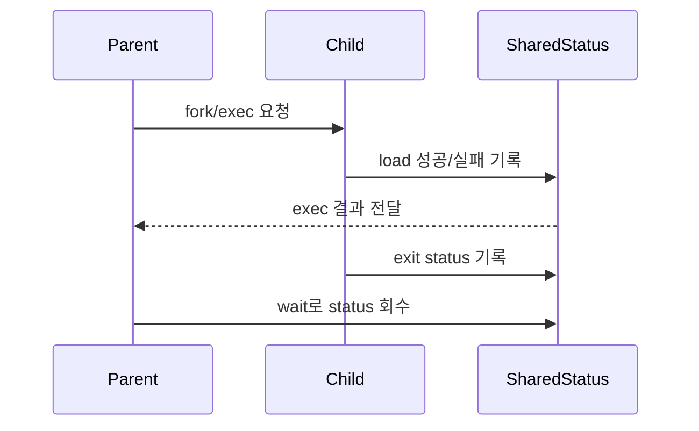
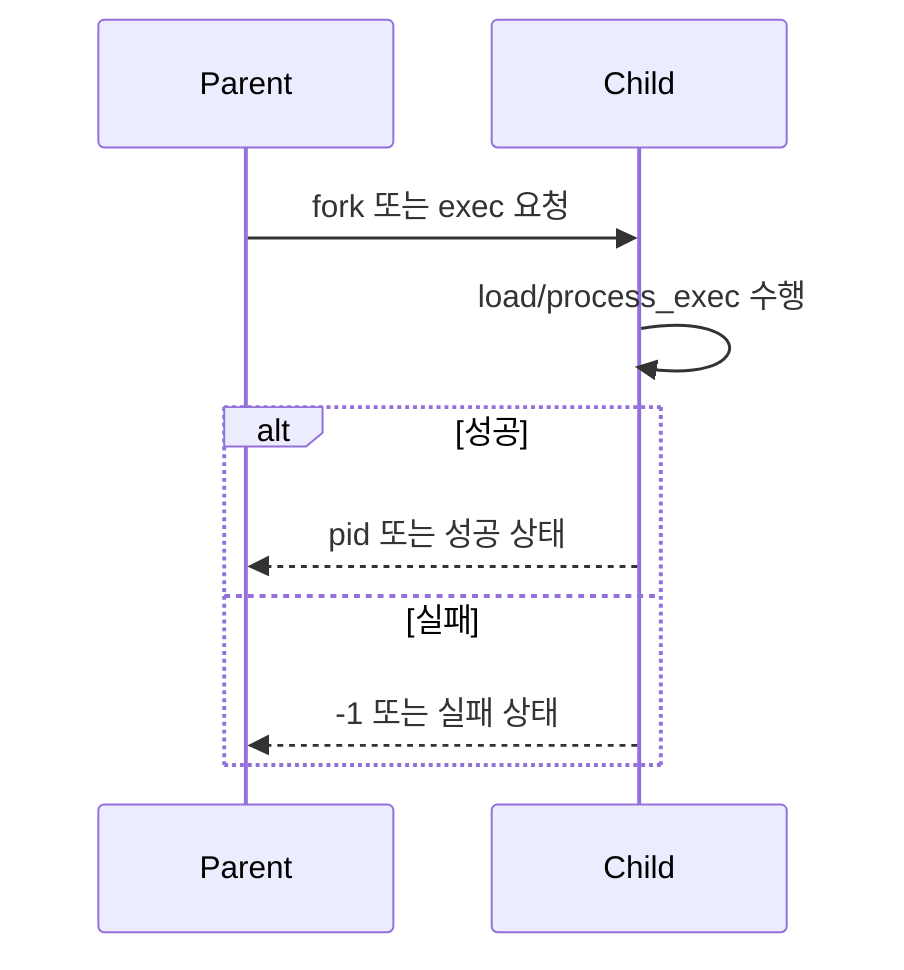
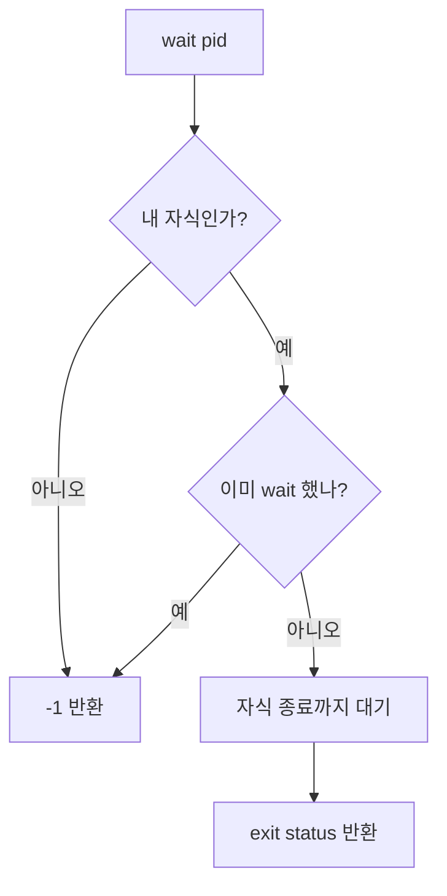

# 03 — 기능 2: 프로세스 관련 System Calls

## 1. 구현 목적 및 필요성
### 이 기능이 무엇인가
`halt`, `exit`, `fork`, `exec`, `wait`처럼 프로세스 생명주기를 제어하는 syscall을 구현하는 기능입니다.

### 왜 이걸 하는가 (문제 맥락)
프로세스 생성/교체/대기/종료 상태가 꼬이면 부모-자식 동기화, exit status, 자원 회수가 모두 깨집니다.

### 무엇을 연결하는가 (기술 맥락)
`syscall_handler()`, `process_fork()`, `process_exec()`, `process_wait()`, `thread_exit()`, 부모-자식 상태 구조를 연결합니다.

### 완성의 의미 (결과 관점)
부모는 자식의 exec 성공/실패와 종료 상태를 정확히 관측하고, 중복 wait나 비자식 wait는 실패합니다.

## 2. 가능한 구현 방식 비교
- 방식 A: thread id만 반환하고 상태 공유 생략
  - 장점: 구현이 짧음
  - 단점: wait/exec 동기화 테스트 실패
- 방식 B: 부모-자식 공유 상태를 두고 동기화
  - 장점: exit status와 wait 규칙을 안정적으로 유지
  - 단점: 자료구조와 semaphore/lock 관리 필요
- 선택: B

## 3. 시퀀스와 단계별 흐름

1. 부모가 `fork` 또는 `exec` 요청을 syscall로 전달한다.
2. 자식은 load 성공/실패를 부모가 알 수 있게 기록한다.
3. 자식 종료 시 exit status를 공유 상태에 남긴다.
4. 부모는 `wait`를 통해 한 번만 상태를 회수한다.

## 4. 기능별 가이드 (개념/흐름 + 구현 주석 위치)
### 4.1 기능 A: `exit()` 상태 기록
#### 개념 설명
`exit(status)`는 단순히 스레드를 종료하는 것이 아니라, 부모가 나중에 관측할 수 있는 종료 상태를 남겨야 합니다.

#### 시퀀스 및 흐름

1. 현재 프로세스의 exit status를 저장한다.
2. 테스트가 기대하는 exit 메시지 형식을 맞춘다.
3. 열린 파일과 실행 파일 상태를 정리한다.
4. thread exit 경로로 진입한다.

#### 구현 주석 (보면 되는 함수/구조체)
- 위치: `pintos/userprog/syscall.c`의 `exit` syscall 구현
- 위치: `pintos/threads/thread.h`의 프로세스 상태 필드

### 4.2 기능 B: `fork()` / `exec()` 실행 경계
#### 개념 설명
`fork()`는 현재 프로세스 상태를 복제하고, `exec()`는 현재 프로세스 이미지를 새 실행 파일로 교체합니다. 특히 `exec()` 실패는 부모에게 정확히 알려야 합니다.

#### 시퀀스 및 흐름

1. 명령 문자열은 User Memory Access에서 안전하게 복사된 값을 사용한다.
2. `fork()`는 부모의 실행 컨텍스트와 필요한 자원을 복제한다.
3. `exec()`는 load 성공 여부를 부모가 알 수 있게 동기화한다.
4. 실패 시 잘못된 pid나 성공 상태를 반환하지 않는다.

#### 구현 주석 (보면 되는 함수/구조체)
- 위치: `pintos/userprog/process.c`의 `process_fork()`, `process_exec()`
- 위치: `pintos/userprog/syscall.c`의 `fork`, `exec` syscall 구현

### 4.3 기능 C: `wait()` 회수 규칙
#### 개념 설명
`wait(pid)`는 자식 프로세스 하나의 종료 상태를 정확히 한 번 회수하는 syscall입니다. 비자식 pid나 이미 wait한 pid는 실패해야 합니다.

#### 시퀀스 및 흐름

1. pid가 현재 프로세스의 자식인지 확인한다.
2. 이미 회수한 자식이면 `-1`을 반환한다.
3. 아직 실행 중이면 자식 종료까지 대기한다.
4. 종료 상태를 반환하고 공유 상태를 정리한다.

#### 구현 주석 (보면 되는 함수/구조체)
- 위치: `pintos/userprog/process.c`의 `process_wait()`
- 위치: `pintos/userprog/syscall.c`의 `wait` syscall 구현

## 5. 구현 주석 (위치별 정리)
### 5.1 `exit` syscall
- 위치: `pintos/userprog/syscall.c`
- 역할: 현재 프로세스의 종료 상태를 기록하고 종료한다.
- 규칙 1: exit status를 부모가 읽을 수 있는 위치에 저장한다.
- 규칙 2: 열린 파일과 실행 파일 deny-write 상태를 정리한다.
- 규칙 3: 종료 메시지 형식을 테스트 기대와 맞춘다.
- 금지 1: status 기록 없이 `thread_exit()`만 호출하지 않는다.

구현 체크 순서:
1. status를 현재 프로세스 상태에 기록한다.
2. 부모 대기자가 있다면 깨울 수 있게 동기화한다.
3. 열린 자원을 정리한다.
4. thread 종료 경로로 진입한다.

### 5.2 `process_wait()`
- 위치: `pintos/userprog/process.c`
- 역할: 자식 종료 상태를 한 번만 회수한다.
- 규칙 1: 비자식 pid는 `-1` 반환
- 규칙 2: 중복 wait는 `-1` 반환
- 규칙 3: 자식이 아직 살아 있으면 종료까지 대기
- 금지 1: 모든 tid에 대해 무조건 대기하지 않는다.

구현 체크 순서:
1. child list에서 pid를 찾는다.
2. 이미 wait했는지 확인한다.
3. 필요 시 semaphore로 자식 종료를 기다린다.
4. exit status를 반환하고 child 상태를 정리한다.

## 6. 테스팅 방법
- `halt`, `exit`: 기본 프로세스 syscall 진입 확인
- `fork-once`, `fork-multiple`, `fork-recursive`: fork 동작 확인
- `exec-once`, `exec-arg`, `exec-missing`: exec 성공/실패 확인
- `wait-simple`, `wait-twice`, `wait-bad-pid`, `wait-killed`: wait 규칙 확인
