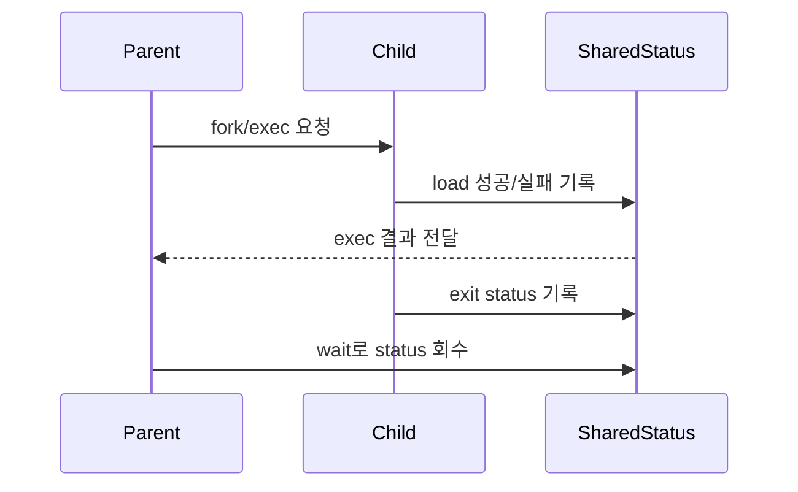
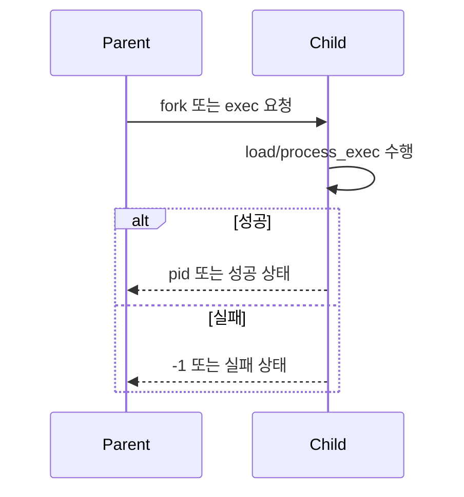
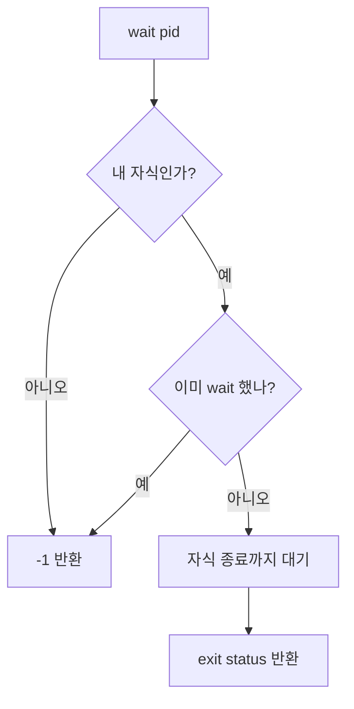

# 03 — 기능 2: 프로세스 관련 System Calls

## 1. 구현 목적 및 필요성
### 이 기능이 무엇인가
`halt`, `exit`, `fork`, `exec`, `wait`처럼 프로세스 생명주기를 제어하는 syscall을 구현하는 기능입니다.

### 왜 이걸 하는가 (문제 맥락)
프로세스 생성/교체/대기/종료 상태가 꼬이면 부모-자식 동기화, exit status, 자원 회수가 모두 깨집니다.

### 무엇을 연결하는가 (기술 맥락)
`syscall_handler()`, `process_fork()`, `process_exec()`, `process_wait()`, `thread_exit()`, 부모-자식 상태 구조를 연결합니다.

### 완성의 의미 (결과 관점)
부모는 자식의 exec 성공/실패와 종료 상태를 정확히 관측하고, 중복 wait나 비자식 wait는 실패합니다.

## 2. 가능한 구현 방식 비교
- 방식 A: thread id만 반환하고 상태 공유 생략
  - 장점: 구현이 짧음
  - 단점: wait/exec 동기화 테스트 실패
- 방식 B: 부모-자식 공유 상태를 두고 동기화
  - 장점: exit status와 wait 규칙을 안정적으로 유지
  - 단점: 자료구조와 semaphore/lock 관리 필요
- 선택: B

## 3. 시퀀스와 단계별 흐름

1. 부모가 `fork` 또는 `exec` 요청을 syscall로 전달한다.
2. 자식은 load 성공/실패를 부모가 알 수 있게 기록한다.
3. 자식 종료 시 exit status를 공유 상태에 남긴다.
4. 부모는 `wait`를 통해 한 번만 상태를 회수한다.

## 4. 기능별 가이드 (개념/흐름 + 구현 주석 위치)
### 4.1 기능 A: `exit()` 상태 기록
#### 개념 설명
`exit(status)`는 단순히 스레드를 종료하는 것이 아니라, 부모가 나중에 관측할 수 있는 종료 상태를 남겨야 합니다.

#### 시퀀스 및 흐름

1. 현재 프로세스의 exit status를 저장한다.
2. 테스트가 기대하는 exit 메시지 형식을 맞춘다.
3. 열린 파일과 실행 파일 상태를 정리한다.
4. thread exit 경로로 진입한다.

#### 구현 주석 (보면 되는 함수/구조체)
- 위치: `pintos/userprog/syscall.c`의 `exit` syscall 구현
- 위치: `pintos/include/threads/thread.h`의 프로세스 상태 필드

### 4.2 기능 B: `fork()` / `exec()` 실행 경계
#### 개념 설명
`fork()`는 현재 프로세스 상태를 복제하고, `exec()`는 현재 프로세스 이미지를 새 실행 파일로 교체합니다. 특히 `exec()` 실패는 부모에게 정확히 알려야 합니다.

#### 시퀀스 및 흐름

1. 명령 문자열은 User Memory Access에서 안전하게 복사된 값을 사용한다.
2. `fork()`는 부모의 실행 컨텍스트와 필요한 자원을 복제한다.
3. `exec()`는 load 성공 여부를 부모가 알 수 있게 동기화한다.
4. 실패 시 잘못된 pid나 성공 상태를 반환하지 않는다.

#### 구현 주석 (보면 되는 함수/구조체)
- 위치: `pintos/userprog/process.c`의 `process_fork()`, `process_exec()`
- 위치: `pintos/userprog/syscall.c`의 `fork`, `exec` syscall 구현

### 4.3 기능 C: `wait()` 회수 규칙
#### 개념 설명
`wait(pid)`는 자식 프로세스 하나의 종료 상태를 정확히 한 번 회수하는 syscall입니다. 비자식 pid나 이미 wait한 pid는 실패해야 합니다.

#### 시퀀스 및 흐름

1. pid가 현재 프로세스의 자식인지 확인한다.
2. 이미 회수한 자식이면 `-1`을 반환한다.
3. 아직 실행 중이면 자식 종료까지 대기한다.
4. 종료 상태를 반환하고 공유 상태를 정리한다.

#### 구현 주석 (보면 되는 함수/구조체)
- 위치: `pintos/userprog/process.c`의 `process_wait()`
- 위치: `pintos/userprog/syscall.c`의 `wait` syscall 구현

## 5. 구현 주석 (위치별 정리)
### 5.1 `halt` syscall
- 위치: `pintos/userprog/syscall.c`
- 역할: 사용자 `halt` 요청을 커널 전원 종료 경로로 연결한다.
- 규칙 1: 테스트가 기대하는 shutdown API를 호출한다(예: 전원/시뮬레이터 종료 루틴).
- 규칙 2: 이 syscall은 사용자에게 의미 있는 `RAX` 반환을 기대하지 않는다.
- 금지 1: 아무 동작 없이 return만 해서 시스템이 계속 돌아가게 두지 않는다.

구현 체크 순서:
1. dispatch에서 halt 번호를 식별한다.
2. 문서/제공 코드에 맞는 shutdown 함수를 호출한다.
3. 호출 이후 실행이 도달하지 않음을 인지한다.

### 5.2 `exit` syscall
#### 5.2.1 `syscall_handler()`의 `SYS_EXIT` 분기
- 위치: `pintos/userprog/syscall.c`
- 역할: `f->R.rdi`의 status를 읽어 exit 구현으로 넘긴다.
- 규칙 1: `exit(status)`의 첫 번째 인자는 `f->R.rdi`에서 읽는다.
- 규칙 2: exit syscall은 정상 반환하지 않으므로 `f->R.rax` 설정에 의존하지 않는다.
- 금지 1: status를 무시하고 항상 0 또는 -1로 종료하지 않는다.

구현 체크 순서:
1. `SYS_EXIT` case를 추가한다.
2. `status = f->R.rdi`를 읽는다.
3. `sys_exit(status)` 또는 팀 exit helper를 호출한다.

#### 5.2.2 `sys_exit()` / `process_exit()`의 상태 기록
- 위치: `pintos/userprog/syscall.c`의 exit helper, `pintos/userprog/process.c`의 `process_exit()`
- 역할: 현재 프로세스의 종료 상태를 부모가 wait에서 읽을 수 있는 곳에 저장한다.
- 규칙 1: exit status를 current thread 또는 부모-자식 shared status 구조체에 기록한다.
- 규칙 2: page fault 등 커널이 강제 종료시키는 경로는 status를 -1로 맞춘다.
- 규칙 3: 종료 메시지 형식은 테스트 기대와 일치시킨다.
- 금지 1: status 기록 없이 `thread_exit()`만 호출하지 않는다.

구현 체크 순서:
1. current thread의 exit status 필드 또는 shared status를 찾는다.
2. status 값을 기록한다.
3. 종료 메시지를 출력한다.
4. 자원 정리 후 `thread_exit()` 또는 process 종료 경로로 진입한다.

#### 5.2.3 exit 자원 정리와 부모 깨우기
- 위치: `pintos/userprog/process.c`의 `process_exit()` / `process_cleanup()`
- 역할: 열린 파일, 실행 파일 deny-write, 주소 공간을 정리하고 wait 중인 부모를 깨운다.
- 규칙 1: fd table에 남은 열린 파일을 모두 close한다.
- 규칙 2: 실행 파일 deny-write는 `05-feature-executable-write-deny.md` 5장의 순서대로 해제한다.
- 규칙 3: wait 중인 부모가 있다면 종료 semaphore를 올린다.
- 금지 1: 부모가 기다리는 shared status를 자식 exit에서 먼저 free하지 않는다.

구현 체크 순서:
1. fd table을 순회하며 열린 file을 닫는다.
2. executable file allow/close를 수행한다.
3. exit status를 저장한 뒤 부모 대기 semaphore를 올린다.
4. page table cleanup을 수행한다.

### 5.3 `fork` syscall 및 `process_fork()`
#### 5.3.1 `syscall_handler()`의 `SYS_FORK` 분기
- 위치: `pintos/userprog/syscall.c`
- 역할: 현재 syscall 진입 프레임 `struct intr_frame *f`를 `process_fork()`에 전달한다.
- 규칙 1: `fork`는 사용자 인자를 추가로 읽지 않는다.
- 규칙 2: 부모의 반환값은 `process_fork(thread_current()->name, f)`의 결과를 `f->R.rax`에 넣는다.
- 규칙 3: `process_fork()`가 실패하면 `f->R.rax`에 `TID_ERROR` 또는 팀이 정한 실패값을 넣는다.
- 금지 1: `process_fork()`에 `NULL` 프레임을 넘기거나, `thread_current()->tf`를 부모 유저 프레임처럼 사용하지 않는다.

구현 체크 순서:
1. `SYS_FORK` case를 추가한다.
2. 현재 syscall 프레임 `f`를 그대로 `process_fork()` 두 번째 인자로 넘긴다.
3. 반환 tid를 `f->R.rax`에 저장한다.

#### 5.3.2 `process_fork()`의 aux 생성과 부모 대기
- 위치: `pintos/userprog/process.c`의 `process_fork(const char *name, struct intr_frame *if_)`
- 역할: 자식 커널 스레드를 만들되, `__do_fork()`가 부모 상태를 복제할 수 있도록 필요한 정보를 안전하게 넘긴다.
- 규칙 1: `if_`를 `UNUSED`로 버리지 않는다. 부모의 syscall/user register frame을 aux 구조체 안에 값 복사한다.
- 규칙 2: aux에는 최소한 `parent thread`, `parent intr_frame copy`, `fork 성공 여부`, `자식 초기화 완료 semaphore`가 필요하다.
- 규칙 3: `thread_create()` 성공 후 부모는 semaphore로 자식의 복사 완료를 기다린 뒤 성공이면 child tid, 실패면 `TID_ERROR`를 반환한다.
- 금지 1: `__do_fork()`에 `thread_current()`만 넘기지 않는다. 그러면 `parent_if`를 알 수 없다.
- 금지 2: 부모가 자식의 주소 공간/파일 복사가 끝나기 전에 먼저 fork 성공을 반환하지 않는다.

구현 체크 순서:
1. `struct fork_aux` 같은 전달 구조체를 정의한다.
2. `fork_aux.parent = thread_current()`로 부모를 저장한다.
3. `memcpy(&fork_aux.parent_if, if_, sizeof *if_)`로 부모 유저 프레임을 저장한다.
4. `sema_init(&fork_aux.load_sema, 0)`처럼 완료 대기용 semaphore를 초기화한다.
5. `thread_create(name, PRI_DEFAULT, __do_fork, &fork_aux)`를 호출한다.
6. 부모는 `sema_down()`으로 자식의 복제 성공/실패 기록을 기다린다.
7. 성공이면 child tid, 실패면 `TID_ERROR`를 반환한다.

#### 5.3.3 `__do_fork()`의 부모 프레임 복사
- 위치: `pintos/userprog/process.c`의 `__do_fork(void *aux)`
- 역할: 자식이 사용자 모드로 돌아갈 때 사용할 interrupt frame을 부모의 syscall 시점과 같게 만든다.
- 규칙 1: `aux`를 `struct fork_aux *`로 해석한다.
- 규칙 2: `memcpy(&if_, &aux->parent_if, sizeof if_)`로 부모의 사용자 프레임을 복사한다.
- 규칙 3: 자식의 fork 반환값은 0이어야 하므로 `if_.R.rax = 0`을 설정한다.
- 금지 1: 초기화되지 않은 `struct intr_frame *parent_if`를 `memcpy()`에 사용하지 않는다.
- 금지 2: `parent->tf`를 복사하지 않는다. 이 값은 사용자 syscall 프레임이 아니라 스케줄링용 커널 프레임이다.

구현 체크 순서:
1. aux에서 parent와 parent_if를 꺼낸다.
2. local `if_`에 parent_if를 값 복사한다.
3. child 관점의 반환값인 `if_.R.rax = 0`을 설정한다.

#### 5.3.4 `duplicate_pte()`의 주소 공간 복사
- 위치: `pintos/userprog/process.c`의 `duplicate_pte(uint64_t *pte, void *va, void *aux)`
- 역할: 부모의 user page 하나를 자식의 새 user page 하나로 깊은 복사한다.
- 규칙 1: `va`가 사용자 가상 주소가 아니면 복사하지 않고 `true`를 반환한다.
- 규칙 2: `parent_page = pml4_get_page(parent->pml4, va)`로 부모 물리 페이지를 얻는다.
- 규칙 3: `newpage = palloc_get_page(PAL_USER)`로 자식용 새 페이지를 할당한다.
- 규칙 4: `memcpy(newpage, parent_page, PGSIZE)`로 페이지 내용을 복사한다.
- 규칙 5: `pte`의 writable bit를 읽어 `pml4_set_page(current->pml4, va, newpage, writable)`에 반영한다.
- 금지 1: 부모 물리 페이지 포인터를 자식 pml4에 그대로 매핑하지 않는다.
- 금지 2: `pml4_set_page()` 실패 시 할당한 `newpage`를 누수하지 않는다.

구현 체크 순서:
1. kernel address mapping이면 skip한다.
2. 부모 페이지를 조회한다.
3. 자식 페이지를 새로 할당한다.
4. 페이지 내용을 복사한다.
5. writable 권한을 계산한다.
6. 자식 pml4에 매핑하고, 실패 시 새 페이지를 해제한 뒤 `false`를 반환한다.

#### 5.3.5 `__do_fork()`의 자원 복사와 부모 깨우기
- 위치: `pintos/userprog/process.c`의 `__do_fork(void *aux)`
- 역할: 주소 공간 복사 이후 fd table, 실행 파일 포인터, 부모-자식 상태 등 프로세스 자원을 복제하고 결과를 부모에게 알린다.
- 규칙 1: `current->pml4 = pml4_create()` 후 `process_activate(current)`를 호출하고, 그 다음 주소 공간 복사를 수행한다.
- 규칙 2: fd table을 구현했다면 각 열린 파일은 `file_duplicate()`로 복제한다.
- 규칙 3: 부모-자식 wait 상태 구조를 구현했다면 child list와 exit/wait semaphore 연결을 이 시점에 맞춘다.
- 규칙 4: 모든 복사가 성공한 뒤 aux의 성공 플래그를 true로 기록하고 부모 semaphore를 `sema_up()`한다.
- 규칙 5: 실패 경로에서는 aux의 성공 플래그를 false로 기록하고 부모를 깨운 뒤 `thread_exit()`로 정리한다.
- 금지 1: fd table 배열만 얕은 복사해서 부모와 자식이 같은 `struct file *`를 공유하게 두지 않는다.
- 금지 2: 실패했는데 부모가 child tid를 성공값으로 반환하게 두지 않는다.

구현 체크 순서:
1. child pml4를 생성하고 활성화한다.
2. `pml4_for_each(parent->pml4, duplicate_pte, parent)`로 주소 공간을 복사한다.
3. fd table과 실행 파일 관련 필드를 복제한다.
4. wait/exit 공유 상태를 연결한다.
5. 성공/실패를 aux에 기록하고 부모 semaphore를 올린다.
6. 성공이면 `do_iret(&if_)`로 자식을 사용자 모드에 진입시킨다.
7. 실패이면 자원을 정리하고 `thread_exit()`한다.

#### 5.3.6 `struct thread`에 필요한 프로세스 필드
- 위치: `pintos/include/threads/thread.h`
- 역할: fork/wait/exit/file syscall이 공유하는 프로세스별 상태를 저장한다.
- 규칙 1: fd table을 구현했다면 현재 프로세스의 열린 파일 목록과 다음 fd 번호를 저장한다.
- 규칙 2: wait를 구현했다면 child list, exit status, wait 중복 여부, 종료 알림 semaphore를 저장하거나 별도 shared status 구조체로 연결한다.
- 규칙 3: exec 파일 write deny를 구현했다면 현재 실행 파일 포인터를 저장하고 fork/exit/exec에서 수명을 정리한다.
- 금지 1: fork 구현이 필요한 상태를 전역 변수 하나에 몰아넣지 않는다.
- 금지 2: 부모와 자식의 독립 상태여야 하는 필드를 같은 포인터로 공유하지 않는다.

구현 체크 순서:
1. fd table 필드가 있는지 확인한다.
2. child/wait 상태 필드 또는 shared status 구조체가 있는지 확인한다.
3. 실행 파일 deny-write용 포인터가 있는지 확인한다.
4. `init_thread()`, `process_exit()`, `__do_fork()`에서 각 필드 초기화·복사·정리를 연결한다.

### 5.4 `exec` syscall 및 `process_exec()`
#### 5.4.1 `syscall_handler()`의 `SYS_EXEC` 분기
- 위치: `pintos/userprog/syscall.c`
- 역할: `f->R.rdi`의 사용자 문자열 포인터를 검증/복사한 뒤 `process_exec()`로 넘긴다.
- 규칙 1: `cmd_line` 포인터는 User Memory Access 문자열 계약으로 검증한다.
- 규칙 2: `process_exec()`는 호출 성공 시 돌아오지 않으므로 실패 시에만 `f->R.rax = -1`을 기대한다.
- 규칙 3: `process_exec()`에 넘기는 문자열은 커널이 소유한 page/buffer여야 한다.
- 금지 1: 사용자 문자열 포인터를 그대로 `process_exec()`에 넘겨 exec 중 page table 정리 후 참조하게 만들지 않는다.

구현 체크 순서:
1. handler에서 `rdi=cmd_line`을 읽는다.
2. 문자열 포인터를 검증한다.
3. 커널 page에 command line을 복사한다.
4. `process_exec(copied_cmd)`를 호출한다.
5. 실패 반환 시 `f->R.rax = -1`을 기록한다.

#### 5.4.2 `process_exec()`의 기존 이미지 정리와 load 순서
- 위치: `pintos/userprog/process.c`의 `process_exec(void *f_name)`
- 역할: 현재 프로세스의 주소 공간을 새 실행 파일 이미지로 교체한다.
- 규칙 1: command line 파싱은 기존 주소 공간을 파괴하기 전에 완료하거나, 필요한 문자열을 커널 메모리에 복사해 둔다.
- 규칙 2: `process_cleanup()`으로 기존 pml4를 정리한 뒤 새 intr_frame과 `load()`를 준비한다.
- 규칙 3: `load()` 실패 시 반환/종료 정책을 팀 계약에 맞춘다.
- 규칙 4: `argv[ARG_MAX]`처럼 큰 임시 배열은 커널 스택에 두지 말고 page 할당으로 관리한다.
- 금지 1: 기존 주소 공간을 정리한 뒤 사용자 포인터 원본에서 다시 문자열을 읽지 않는다.
- 금지 2: `process_exec()` 호출 스택에 1KB 이상 큰 지역 배열을 여러 개 쌓아 둔 채 `load()`, `setup_stack()`, `palloc_get_page()` 경로로 들어가지 않는다.

구현 체크 순서:
1. 커널 버퍼의 command line을 파싱한다.
2. 파싱 결과 포인터 배열이 필요하면 `palloc_get_page()`로 별도 page를 할당한다.
3. 새 `struct intr_frame`을 초기화한다.
4. 기존 process context를 cleanup한다.
5. `load(argv[0], &_if)`를 호출한다.
6. 실패 시 할당한 page와 command line page를 정리하고 `-1`을 반환한다.

#### 5.4.3 exec 성공 후 인자 스택과 진입 레지스터
- 위치: `pintos/userprog/process.c`의 `build_user_stack_args()`, `set_user_entry_registers()`, `do_iret()` 호출 경로
- 역할: 새 프로그램이 `main(argc, argv)`로 시작할 수 있게 사용자 스택과 레지스터를 맞춘다.
- 규칙 1: argument passing 문서의 스택 정렬과 fake return address 규칙을 따른다.
- 규칙 2: `RDI=argc`, `RSI=argv`를 설정한다.
- 규칙 3: 성공 경로는 `do_iret(&_if)`로 사용자 모드에 진입하며 반환하지 않는다.
- 규칙 4: `build_user_stack_args()` 내부의 주소 보관 배열도 page 할당으로 빼고 성공/실패 경로에서 반드시 해제한다.
- 금지 1: exec 성공 후 커널 함수가 일반 return으로 빠져나오게 하지 않는다.
- 금지 2: `arg_addrs[ARG_MAX]` 같은 큰 배열을 지역 변수로 두어 thread kernel stack을 압박하지 않는다.

구현 체크 순서:
1. `load()` 성공 후 사용자 스택에 argv 문자열과 포인터를 배치한다.
2. entry register를 설정한다.
3. `do_iret()` 직전에 임시 커널 버퍼를 해제한다.
4. `exec-once`, `exec-arg`, `exec-missing`으로 확인한다.

#### 5.4.4 커널 스택 사용량 주의와 실제 장애 패턴
- 위치: `pintos/userprog/process.c`의 `process_exec()`, `build_user_stack_args()`
- 역할: PintOS thread page 안에서 커널 스택과 `struct thread`가 같이 쓰이는 구조를 고려해 stack overflow를 피한다.
- 규칙 1: `char *argv[ARG_MAX]`, `char *arg_addrs[ARG_MAX]`는 각각 포인터 128개라 약 1KB씩 사용한다.
- 규칙 2: wait/fork/exec 구현이 추가되면 호출 깊이와 지역 변수 사용량이 늘어 기존에 통과하던 테스트에서도 `thread_current()` magic 손상이 드러날 수 있다.
- 규칙 3: 이런 임시 포인터 배열은 `palloc_get_page(0)`로 할당하고 모든 실패 경로에서 `palloc_free_page()`로 해제한다.
- 금지 1: `thread_current(): assertion is_thread(t) failed`를 단순히 wait 로직 오류로만 판단하지 않는다. load/setup_stack/palloc 콜스택이면 커널 스택 오버플로우도 함께 의심한다.

구현 체크 순서:
1. `process_exec()`에서 command line page와 argv page를 별도로 소유한다.
2. `parse_command_line_args()`와 `build_user_stack_args()`에는 page에 있는 argv 포인터 배열을 넘긴다.
3. `build_user_stack_args()`는 내부 주소 임시 배열을 page로 할당한다.
4. 성공 경로와 실패 경로 모두에서 할당 page를 해제한다.
5. Docker에서 `write-normal`, `open-empty`, `wait-simple`, `make check` 순서로 재검증한다.

### 5.5 `wait` syscall 및 `process_wait()`
#### 5.5.1 `syscall_handler()`의 `SYS_WAIT` 분기
- 위치: `pintos/userprog/syscall.c`
- 역할: `f->R.rdi`의 child tid를 `process_wait()`에 넘기고 반환 status를 RAX에 기록한다.
- 규칙 1: wait의 첫 번째 인자는 `f->R.rdi`에서 읽는다.
- 규칙 2: `process_wait()`의 반환값을 그대로 `f->R.rax`에 기록한다.
- 금지 1: handler에서 직접 child list를 조작하지 않는다.

구현 체크 순서:
1. `SYS_WAIT` case를 추가한다.
2. `tid_t child_tid = f->R.rdi`를 읽는다.
3. `f->R.rax = process_wait(child_tid)`를 수행한다.

#### 5.5.2 `process_wait()`의 child lookup과 중복 wait 방지
- 위치: `pintos/userprog/process.c`의 `process_wait(tid_t child_tid)`
- 역할: 지정 tid가 현재 프로세스의 자식인지 확인하고 wait를 한 번만 허용한다.
- 규칙 1: current thread의 child list 또는 shared status list에서 child_tid를 찾는다.
- 규칙 2: 비자식 pid는 즉시 `-1`을 반환한다.
- 규칙 3: 이미 wait한 child는 즉시 `-1`을 반환한다.
- 금지 1: 모든 tid에 대해 무조건 대기하지 않는다.

구현 체크 순서:
1. child list에서 child_tid를 찾는다.
2. 찾지 못하면 `-1`을 반환한다.
3. wait 여부 flag를 확인한다.
4. 이미 wait했으면 `-1`을 반환한다.
5. wait flag를 설정한다.

#### 5.5.3 `process_wait()`의 종료 대기와 status 회수
- 위치: `pintos/userprog/process.c`의 `process_wait(tid_t child_tid)`, `process_exit()`
- 역할: 자식이 살아 있으면 종료까지 block하고, 종료 후 exit status를 반환한다.
- 규칙 1: 자식이 아직 종료하지 않았다면 semaphore로 기다린다.
- 규칙 2: 자식이 저장한 exit status를 반환한다.
- 규칙 3: status 회수 후 부모가 소유한 child/shared status 노드를 정리한다.
- 금지 1: 자식 thread 구조체가 이미 사라진 뒤 그 안의 필드를 직접 역참조하지 않는다. 필요한 정보는 shared status에 남긴다.

구현 체크 순서:
1. child/shared status의 종료 여부를 확인한다.
2. 미종료면 `sema_down()`으로 기다린다.
3. 깨어난 뒤 exit status를 읽는다.
4. child list에서 노드를 제거하고 필요한 refcount/free 처리를 한다.
5. `wait-simple`, `wait-twice`, `wait-bad-pid`, `wait-killed`로 규칙을 확인한다.

## 6. 테스팅 방법
- `halt`, `exit`: 기본 프로세스 syscall 진입 확인
- `fork-once`, `fork-multiple`, `fork-recursive`: fork 동작 확인
- `exec-once`, `exec-arg`, `exec-missing`: exec 성공/실패 확인
- `wait-simple`, `wait-twice`, `wait-bad-pid`, `wait-killed`: wait 규칙 확인
- stack overflow 회귀 확인: Docker에서 `write-normal`, `open-empty`, `wait-simple`을 산출물 삭제 후 단독 재실행하고, 마지막에 `make check`로 전체 확인
