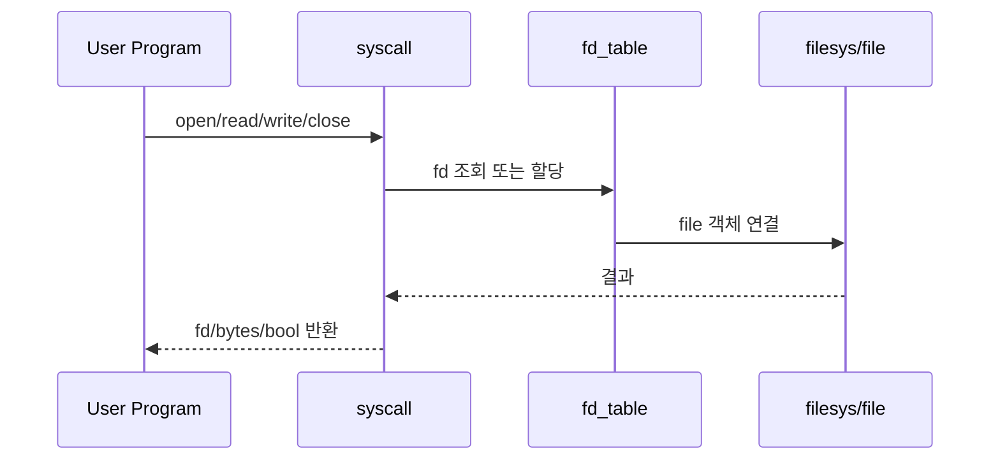
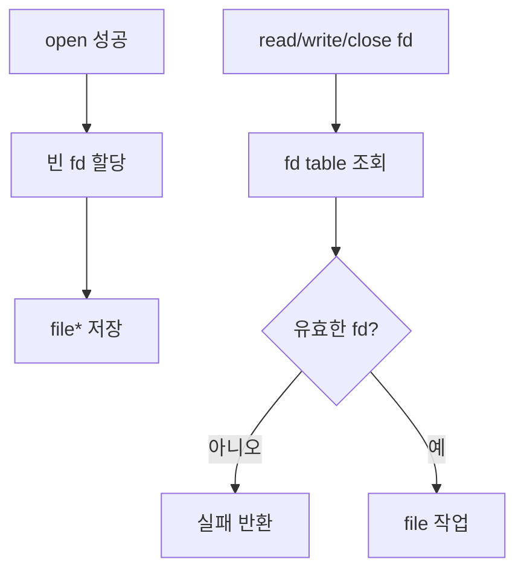
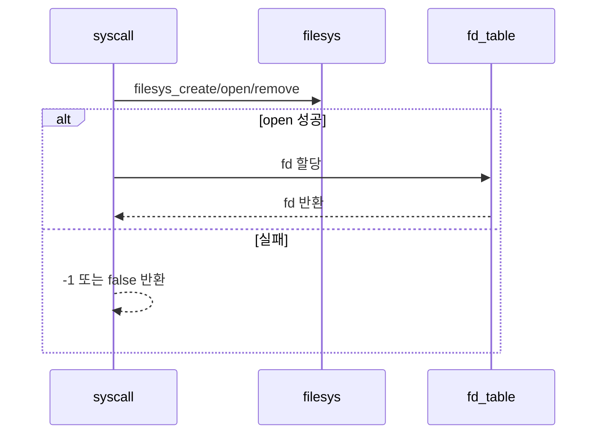
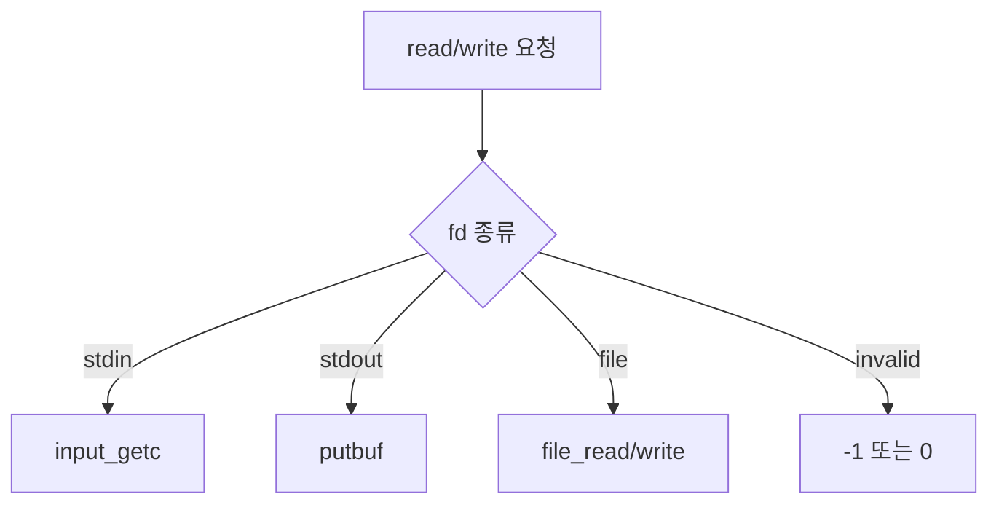

# 04 — 기능 3: 파일 System Calls와 FD Table

## 1. 구현 목적 및 필요성
### 이 기능이 무엇인가
`create`, `remove`, `open`, `filesize`, `read`, `write`, `seek`, `tell`, `close`와 프로세스별 fd table을 구현하는 기능입니다.

### 왜 이걸 하는가 (문제 맥락)
파일 syscall은 사용자 프로그램이 파일 시스템과 상호작용하는 핵심 경로입니다. fd table이 없거나 반환값 정책이 틀리면 대부분의 userprog 테스트가 실패합니다.

### 무엇을 연결하는가 (기술 맥락)
`syscall.c`, `filesys/filesys.h`, `filesys/file.h`, 프로세스별 fd table, stdin/stdout 특수 fd를 연결합니다.

### 완성의 의미 (결과 관점)
파일 syscall이 테스트 기대 반환값을 지키고, fd가 프로세스별로 독립 관리되며, close 이후 잘못된 fd 접근이 실패합니다.

## 2. 가능한 구현 방식 비교
- 방식 A: 전역 file 포인터 하나만 관리
  - 장점: 구현이 매우 단순
  - 단점: 다중 파일/다중 프로세스 테스트 실패
- 방식 B: 프로세스별 fd table 관리
  - 장점: Pintos 테스트 범위 대응 가능
  - 단점: fd 할당/해제/조회 규칙 필요
- 선택: B

## 3. 시퀀스와 단계별 흐름

1. 문자열/버퍼 인자는 User Memory Access에서 안전하게 준비한다.
2. 파일 syscall은 fd table에서 file 객체를 조회하거나 새 fd를 할당한다.
3. 실제 파일 시스템 작업은 `filesys_*`, `file_*` API로 수행한다.
4. 결과는 syscall별 기대 반환값으로 사용자에게 돌려준다.

## 4. 기능별 가이드 (개념/흐름 + 구현 주석 위치)
### 4.1 기능 A: fd table 생성/조회/해제
#### 개념 설명
fd는 사용자 프로그램이 file 객체를 간접 참조하는 번호입니다. fd table은 반드시 프로세스별로 분리되어야 합니다.

#### 시퀀스 및 흐름

1. 프로세스 생성 시 fd table을 초기화한다.
2. `open()` 성공 시 빈 fd 번호에 file 객체를 저장한다.
3. fd 기반 syscall은 먼저 fd table에서 유효성을 확인한다.
4. `close()`는 file을 닫고 fd slot을 비운다.

#### 구현 주석 (보면 되는 함수/구조체)
- 위치: `pintos/include/threads/thread.h`의 프로세스별 fd table 필드
- 위치: `pintos/userprog/syscall.c`의 fd lookup/alloc/free helper

### 4.2 기능 B: 파일 생성/열기/닫기
#### 개념 설명
`create`, `remove`, `open`, `close`는 파일 객체 수명과 fd table 수명을 연결합니다. open 실패와 close 후 fd 재사용 경계를 명확히 해야 합니다.

#### 시퀀스 및 흐름

1. 파일명은 User Memory Access에서 안전하게 복사된 문자열을 사용한다.
2. `create`/`remove`는 bool 결과를 반환한다.
3. `open` 성공 시 fd를 할당하고 실패 시 `-1`을 반환한다.
4. `close`는 유효한 fd만 닫고 fd slot을 해제한다.

#### 구현 주석 (보면 되는 함수/구조체)
- 위치: `pintos/userprog/syscall.c`의 `create`, `remove`, `open`, `close`
- 위치: `pintos/filesys/filesys.h`, `pintos/filesys/file.h`

### 4.3 기능 C: `read()` / `write()` 분기
#### 개념 설명
`read`와 `write`는 fd 종류에 따라 동작이 달라집니다. stdin/stdout과 일반 파일 fd를 구분하고, 반환 바이트 수를 정확히 맞춰야 합니다.

#### 시퀀스 및 흐름

1. `read(0, ...)`은 stdin에서 입력을 읽는다.
2. `write(1, ...)`은 stdout에 출력한다.
3. 일반 fd는 file 객체를 찾아 `file_read`/`file_write`를 호출한다.
4. 잘못된 fd 또는 방향이 맞지 않는 fd는 테스트 기대에 맞게 실패 처리한다.

#### 구현 주석 (보면 되는 함수/구조체)
- 위치: `pintos/userprog/syscall.c`의 `read`, `write`
- 위치: `pintos/devices/input.h`, `pintos/lib/kernel/stdio.h`

## 5. 구현 주석 (위치별 정리)
### 5.1 `struct thread`의 fd table 필드
- 위치: `pintos/include/threads/thread.h`
- 역할: 프로세스별 fd 번호와 `struct file *` 매핑 상태를 저장한다.
- 규칙 1: fd 0은 stdin, fd 1은 stdout으로 예약한다.
- 규칙 2: 일반 파일 fd는 2 이상에서 할당한다.
- 규칙 3: fork를 구현한다면 fd table 복사 정책은 `03-feature-process-syscalls.md`의 fork 자원 복사 규칙과 맞춘다.
- 금지 1: fd table을 전역 배열 하나로 두어 프로세스 간 fd가 섞이게 하지 않는다.

구현 체크 순서:
1. thread 구조체에 fd table 저장 필드를 추가한다.
2. 다음 할당 fd 번호 또는 빈 slot 검색 정책을 정한다.
3. `init_thread()` 또는 process 초기화 경로에서 fd table을 초기화한다.
4. `process_exit()` 또는 cleanup 경로에서 열린 fd를 모두 닫는다.

### 5.2 fd alloc/lookup/close helper
- 위치: `pintos/userprog/syscall.c`
- 역할: fd 기반 syscall이 공통으로 사용하는 fd table 조작을 한 곳에 모은다.
- 규칙 1: `fd_alloc(file)`은 성공 시 2 이상의 fd를 반환하고 실패 시 `-1`을 반환한다.
- 규칙 2: `fd_lookup(fd)`는 현재 프로세스의 table만 조회하고, stdin/stdout은 일반 file로 반환하지 않는다.
- 규칙 3: `fd_close(fd)`는 file을 닫은 뒤 slot을 비워 재사용 가능하게 만든다.
- 금지 1: syscall마다 fd table 배열을 직접 뒤져서 close 정책이 달라지게 하지 않는다.
- 금지 2: 닫힌 fd의 `struct file *`를 NULL 처리하지 않은 채 남기지 않는다.

구현 체크 순서:
1. alloc helper를 만든다.
2. lookup helper를 만든다.
3. close/free helper를 만든다.
4. open/read/write/seek/tell/filesize/close가 모두 helper를 거치게 한다.

### 5.3 `create` syscall
- 위치: `pintos/userprog/syscall.c`의 `SYS_CREATE` 분기와 `sys_create` 구현
- 역할: 사용자 파일명과 초기 크기를 받아 `filesys_create()` 결과를 반환한다.
- 규칙 1: `file` 문자열 포인터를 `validate_user_string()` 또는 팀 helper로 검증한다.
- 규칙 2: `filesys_create(file, initial_size)`의 bool 결과를 `f->R.rax`에 반영한다.
- 규칙 3: 빈 문자열, NULL, 잘못된 주소는 User Memory Access 정책으로 처리한다.
- 금지 1: 파일명 검증 전에 `filesys_create()`에 사용자 포인터를 넘기지 않는다.

구현 체크 순서:
1. handler에서 `rdi=file`, `rsi=initial_size`를 읽는다.
2. 문자열 포인터를 검증한다.
3. `filesys_create()`를 호출한다.
4. bool 반환값을 RAX에 기록한다.

### 5.4 `remove` syscall
- 위치: `pintos/userprog/syscall.c`의 `SYS_REMOVE` 분기와 `sys_remove` 구현
- 역할: 사용자 파일명을 받아 `filesys_remove()` 결과를 반환한다.
- 규칙 1: 파일명 문자열은 검증 후에만 filesys 계층으로 넘긴다.
- 규칙 2: 존재하지 않는 파일 삭제 실패는 false 반환으로 표현한다.
- 규칙 3: 열려 있는 파일 삭제 정책은 PintOS filesys 구현의 의미를 따른다.
- 금지 1: remove 실패를 프로세스 종료와 섞지 않는다. bad pointer만 종료 대상이다.

구현 체크 순서:
1. handler에서 `rdi=file`을 읽는다.
2. 문자열 포인터를 검증한다.
3. `filesys_remove()`를 호출한다.
4. bool 반환값을 RAX에 기록한다.

### 5.5 `open` syscall
- 위치: `pintos/userprog/syscall.c`의 `SYS_OPEN` 분기와 `sys_open` 구현
- 역할: 파일을 열고 성공한 file 객체를 현재 프로세스 fd table에 등록한다.
- 규칙 1: 파일명 문자열은 검증 후 `filesys_open()`에 넘긴다.
- 규칙 2: `filesys_open()`이 NULL을 반환하면 fd table을 점유하지 않고 `-1`을 반환한다.
- 규칙 3: fd table 등록 실패 시 열린 file을 닫고 `-1`을 반환한다.
- 금지 1: open 실패 후 fd slot만 예약된 상태로 남기지 않는다.

구현 체크 순서:
1. handler에서 `rdi=file`을 읽는다.
2. 문자열 포인터를 검증한다.
3. `filesys_open()`을 호출한다.
4. 성공한 file을 fd alloc helper에 넘긴다.
5. fd 또는 `-1`을 RAX에 기록한다.

### 5.6 `close` syscall
- 위치: `pintos/userprog/syscall.c`의 `SYS_CLOSE` 분기와 `sys_close` 구현
- 역할: fd table에서 fd를 제거하고 연결된 file을 닫는다.
- 규칙 1: fd 0, fd 1, 음수 fd, 범위 밖 fd는 실패 정책을 통일한다.
- 규칙 2: 이미 닫힌 fd는 다시 닫지 않고 실패 처리한다.
- 규칙 3: 일반 file fd는 `file_close()` 후 slot을 비운다.
- 금지 1: `close` 후에도 같은 fd로 file 포인터가 조회되게 두지 않는다.

구현 체크 순서:
1. handler에서 `rdi=fd`를 읽는다.
2. fd close helper를 호출한다.
3. close가 반환값 없는 syscall인지, 실패 시 종료/무시인지 팀 정책을 고정한다.
4. `close-twice`, `close-bad-fd`로 확인한다.

### 5.7 `read` syscall
- 위치: `pintos/userprog/syscall.c`
- 역할: fd 종류에 따라 stdin·일반 파일에서 읽고 읽은 바이트 수를 반환한다.
- 규칙 1: 사용자 버퍼는 쓰기 전에 User Memory Access로 쓰기 가능 범위를 검증한다.
- 규칙 2: fd 0은 `input_getc` 등 문서화된 stdin 경로로 연결한다.
- 규칙 3: 일반 파일은 `file_read` 결과를 그대로 반환 정책에 반영한다.
- 규칙 4: fd 1(stdout)에 대한 read는 실패 반환을 적용한다.
- 금지 1: 잘못된 fd에 대해 성공 0과 실패 `-1`을 혼동하지 않는다.

구현 체크 순서:
1. handler에서 `rdi=fd`, `rsi=buffer`, `rdx=size`를 읽는다.
2. `buffer` 범위를 쓰기 가능 사용자 버퍼로 검증한다.
3. `size == 0`이면 0 반환 경로를 둔다.
4. fd 0이면 stdin에서 size만큼 읽는다.
5. 일반 file fd이면 `file_read()` 결과를 반환한다.
6. 실패 fd이면 `-1`을 반환한다.

### 5.8 `write` syscall
- 위치: `pintos/userprog/syscall.c`
- 역할: fd 종류에 따라 stdout·일반 파일에 쓰고 쓴 바이트 수를 반환한다.
- 규칙 1: 사용자 버퍼는 읽기 전에 User Memory Access로 읽기 가능 범위를 검증한다.
- 규칙 2: fd 1은 `putbuf` 등 stdout 경로로 연결한다.
- 규칙 3: `file_write` 실패·deny-write는 반환값으로 드러나게 한다.
- 규칙 4: fd 0(stdin)에 대한 write는 실패 반환을 적용한다.
- 금지 1: stdout에 `file_write`를 잘못 연결하지 않는다.

구현 체크 순서:
1. handler에서 `rdi=fd`, `rsi=buffer`, `rdx=size`를 읽는다.
2. `buffer` 범위를 읽기 가능 사용자 버퍼로 검증한다.
3. `size == 0`이면 0 반환 경로를 둔다.
4. fd 1이면 `putbuf(buffer, size)` 후 size를 반환한다.
5. 일반 file fd이면 `file_write()` 결과를 반환한다.
6. 실행 파일 deny-write와 겹치면 `05-feature-executable-write-deny.md` 5장과 함께 본다.

### 5.9 `filesize` syscall
- 위치: `pintos/userprog/syscall.c`의 `SYS_FILESIZE` 분기와 `sys_filesize` 구현
- 역할: 일반 file fd의 파일 길이를 반환한다.
- 규칙 1: fd lookup 결과가 일반 file일 때만 `file_length()`를 호출한다.
- 규칙 2: stdin/stdout/잘못된 fd는 실패 반환으로 처리한다.
- 금지 1: NULL file에 대해 `file_length()`를 호출하지 않는다.

구현 체크 순서:
1. handler에서 `rdi=fd`를 읽는다.
2. fd lookup helper로 일반 file을 찾는다.
3. `file_length()` 결과 또는 실패값을 RAX에 기록한다.

### 5.10 `seek` syscall
- 위치: `pintos/userprog/syscall.c`의 `SYS_SEEK` 분기와 `sys_seek` 구현
- 역할: 일반 file fd의 현재 file position을 지정 위치로 이동한다.
- 규칙 1: fd lookup 결과가 일반 file일 때만 `file_seek(file, position)`을 호출한다.
- 규칙 2: seek는 반환값이 없는 syscall이므로 실패 fd 처리 정책을 팀 기준으로 정한다.
- 금지 1: stdin/stdout에 대해 `file_seek()`를 호출하지 않는다.

구현 체크 순서:
1. handler에서 `rdi=fd`, `rsi=position`을 읽는다.
2. fd lookup helper로 일반 file을 찾는다.
3. 유효한 file이면 `file_seek()`를 호출한다.

### 5.11 `tell` syscall
- 위치: `pintos/userprog/syscall.c`의 `SYS_TELL` 분기와 `sys_tell` 구현
- 역할: 일반 file fd의 현재 file position을 반환한다.
- 규칙 1: fd lookup 결과가 일반 file일 때만 `file_tell()`을 호출한다.
- 규칙 2: 잘못된 fd는 실패 반환으로 처리한다.
- 금지 1: 닫힌 fd나 NULL file에 대해 `file_tell()`을 호출하지 않는다.

구현 체크 순서:
1. handler에서 `rdi=fd`를 읽는다.
2. fd lookup helper로 일반 file을 찾는다.
3. `file_tell()` 결과 또는 실패값을 RAX에 기록한다.

## 6. 테스팅 방법
- `create-normal`, `create-empty`, `create-long`, `create-exists`
- `open-normal`, `open-missing`, `open-empty`, `open-twice`
- `close-normal`, `close-twice`, `close-bad-fd`
- `read-normal`, `read-zero`, `read-stdout`, `read-bad-fd`
- `write-normal`, `write-zero`, `write-stdin`, `write-bad-fd`
