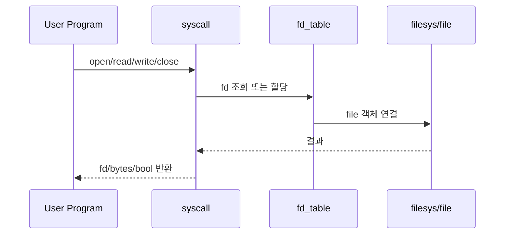
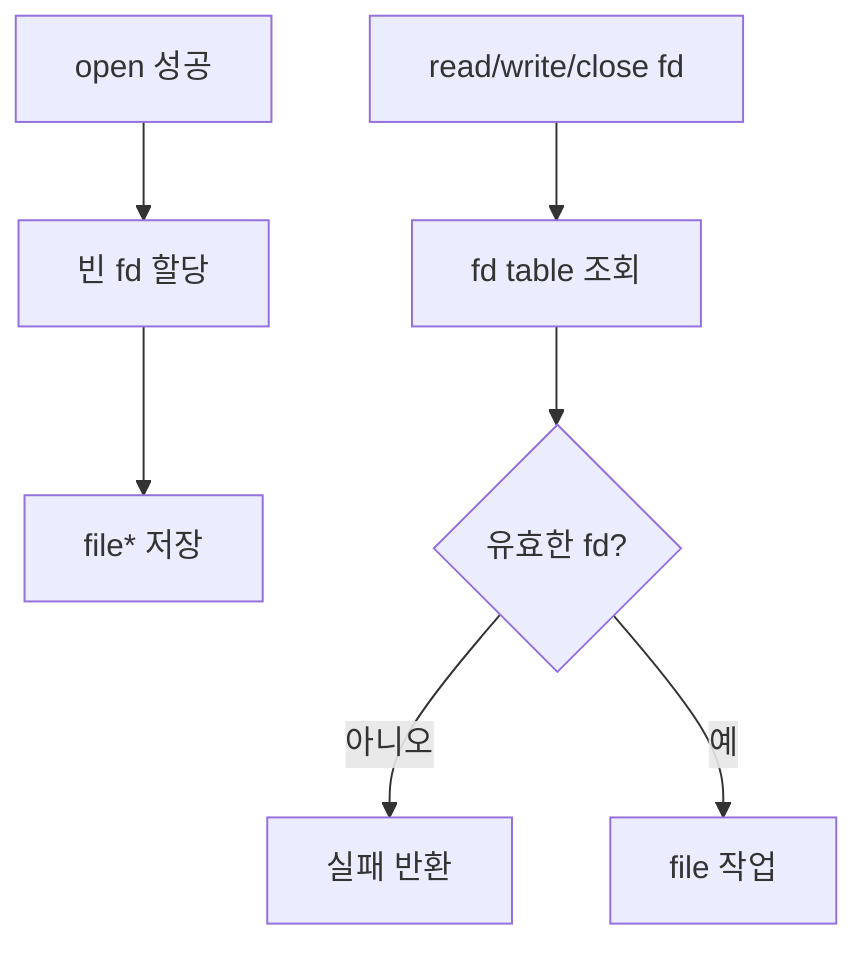
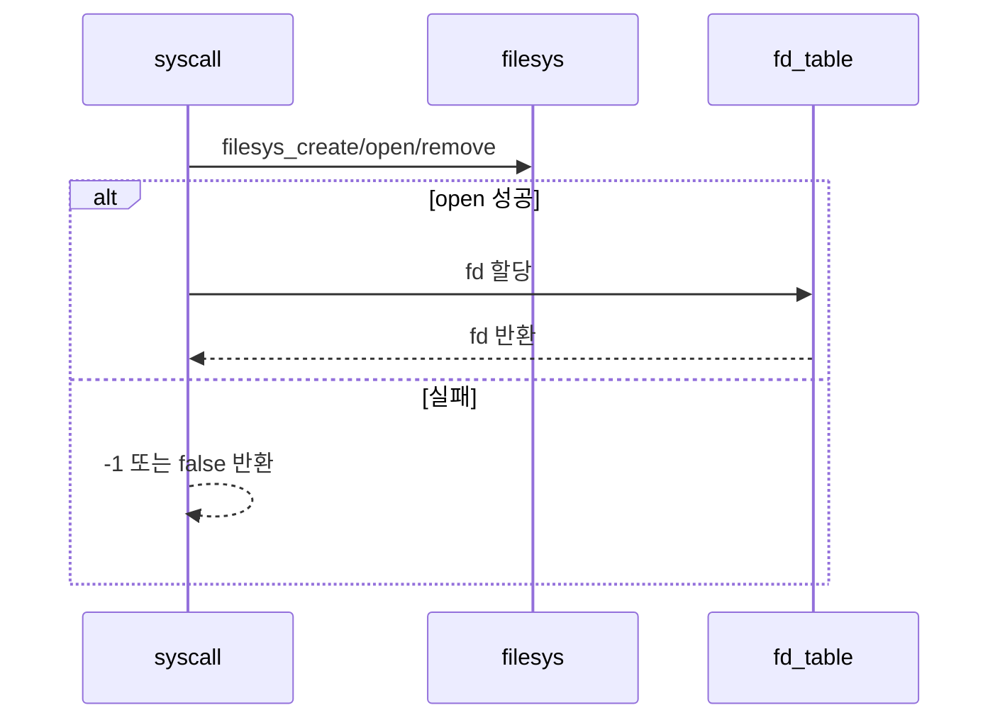
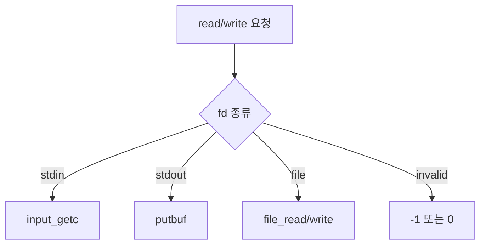

# 04 — 기능 3: 파일 System Calls와 FD Table

## 1. 구현 목적 및 필요성
### 이 기능이 무엇인가
`create`, `remove`, `open`, `filesize`, `read`, `write`, `seek`, `tell`, `close`와 프로세스별 fd table을 구현하는 기능입니다.

### 왜 이걸 하는가 (문제 맥락)
파일 syscall은 사용자 프로그램이 파일 시스템과 상호작용하는 핵심 경로입니다. fd table이 없거나 반환값 정책이 틀리면 대부분의 userprog 테스트가 실패합니다.

### 무엇을 연결하는가 (기술 맥락)
`syscall.c`, `filesys/filesys.h`, `filesys/file.h`, 프로세스별 fd table, stdin/stdout 특수 fd를 연결합니다.

### 완성의 의미 (결과 관점)
파일 syscall이 테스트 기대 반환값을 지키고, fd가 프로세스별로 독립 관리되며, close 이후 잘못된 fd 접근이 실패합니다.

## 2. 가능한 구현 방식 비교
- 방식 A: 전역 file 포인터 하나만 관리
  - 장점: 구현이 매우 단순
  - 단점: 다중 파일/다중 프로세스 테스트 실패
- 방식 B: 프로세스별 fd table 관리
  - 장점: Pintos 테스트 범위 대응 가능
  - 단점: fd 할당/해제/조회 규칙 필요
- 선택: B

## 3. 시퀀스와 단계별 흐름

1. 문자열/버퍼 인자는 User Memory Access에서 안전하게 준비한다.
2. 파일 syscall은 fd table에서 file 객체를 조회하거나 새 fd를 할당한다.
3. 실제 파일 시스템 작업은 `filesys_*`, `file_*` API로 수행한다.
4. 결과는 syscall별 기대 반환값으로 사용자에게 돌려준다.

## 4. 기능별 가이드 (개념/흐름 + 구현 주석 위치)
### 4.1 기능 A: fd table 생성/조회/해제
#### 개념 설명
fd는 사용자 프로그램이 file 객체를 간접 참조하는 번호입니다. fd table은 반드시 프로세스별로 분리되어야 합니다.

#### 시퀀스 및 흐름

1. 프로세스 생성 시 fd table을 초기화한다.
2. `open()` 성공 시 빈 fd 번호에 file 객체를 저장한다.
3. fd 기반 syscall은 먼저 fd table에서 유효성을 확인한다.
4. `close()`는 file을 닫고 fd slot을 비운다.

#### 구현 주석 (보면 되는 함수/구조체)
- 위치: `pintos/threads/thread.h`의 프로세스별 fd table 필드
- 위치: `pintos/userprog/syscall.c`의 fd lookup/alloc/free helper

### 4.2 기능 B: 파일 생성/열기/닫기
#### 개념 설명
`create`, `remove`, `open`, `close`는 파일 객체 수명과 fd table 수명을 연결합니다. open 실패와 close 후 fd 재사용 경계를 명확히 해야 합니다.

#### 시퀀스 및 흐름

1. 파일명은 User Memory Access에서 안전하게 복사된 문자열을 사용한다.
2. `create`/`remove`는 bool 결과를 반환한다.
3. `open` 성공 시 fd를 할당하고 실패 시 `-1`을 반환한다.
4. `close`는 유효한 fd만 닫고 fd slot을 해제한다.

#### 구현 주석 (보면 되는 함수/구조체)
- 위치: `pintos/userprog/syscall.c`의 `create`, `remove`, `open`, `close`
- 위치: `pintos/filesys/filesys.h`, `pintos/filesys/file.h`

### 4.3 기능 C: `read()` / `write()` 분기
#### 개념 설명
`read`와 `write`는 fd 종류에 따라 동작이 달라집니다. stdin/stdout과 일반 파일 fd를 구분하고, 반환 바이트 수를 정확히 맞춰야 합니다.

#### 시퀀스 및 흐름

1. `read(0, ...)`은 stdin에서 입력을 읽는다.
2. `write(1, ...)`은 stdout에 출력한다.
3. 일반 fd는 file 객체를 찾아 `file_read`/`file_write`를 호출한다.
4. 잘못된 fd 또는 방향이 맞지 않는 fd는 테스트 기대에 맞게 실패 처리한다.

#### 구현 주석 (보면 되는 함수/구조체)
- 위치: `pintos/userprog/syscall.c`의 `read`, `write`
- 위치: `pintos/devices/input.h`, `pintos/lib/kernel/stdio.h`

## 5. 구현 주석 (위치별 정리)
### 5.1 fd table helper
- 위치: `pintos/userprog/syscall.c`, `pintos/threads/thread.h`
- 역할: fd 번호와 file 객체의 프로세스별 매핑을 관리한다.
- 규칙 1: fd 0은 stdin, fd 1은 stdout으로 예약한다.
- 규칙 2: 일반 파일 fd는 2 이상에서 할당한다.
- 규칙 3: close 후 fd slot을 재사용 가능 상태로 만든다.
- 금지 1: 다른 프로세스의 fd table을 조회하지 않는다.

구현 체크 순서:
1. thread/process 구조에 fd table을 둔다.
2. fd alloc/lookup/close helper를 만든다.
3. 모든 fd 기반 syscall이 helper를 거치게 한다.

### 5.2 파일 syscall 구현
- 위치: `pintos/userprog/syscall.c`
- 역할: filesys/file API를 syscall 반환 정책과 연결한다.
- 규칙 1: filesys 작업은 필요 시 전역 파일 시스템 락으로 보호한다.
- 규칙 2: 실패 반환값을 syscall별로 구분한다.
- 규칙 3: 닫힌 fd 또는 잘못된 fd는 실패 처리한다.
- 금지 1: file 포인터를 fd 검증 없이 직접 사용하지 않는다.

구현 체크 순서:
1. create/remove/open/close 기본 반환값을 맞춘다.
2. read/write의 fd 0/1 특수 처리를 구현한다.
3. 일반 file fd에 대해 file API를 호출한다.
4. 실패 케이스의 반환값을 테스트별로 확인한다.

## 6. 테스팅 방법
- `create-normal`, `create-empty`, `create-long`, `create-exists`
- `open-normal`, `open-missing`, `open-empty`, `open-twice`
- `close-normal`, `close-twice`, `close-bad-fd`
- `read-normal`, `read-zero`, `read-stdout`, `read-bad-fd`
- `write-normal`, `write-zero`, `write-stdin`, `write-bad-fd`
