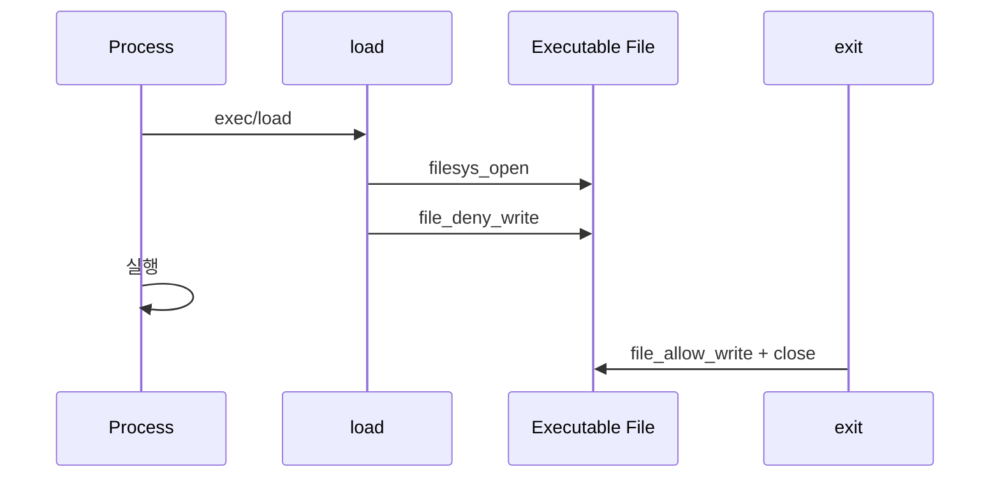
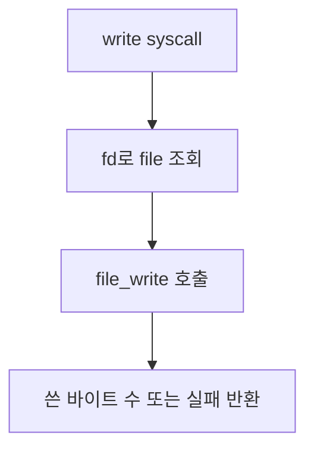
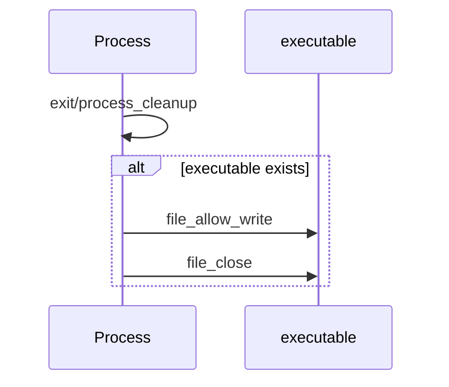

# 05 — 기능 4: 실행 파일 쓰기 금지 (Executable Write Deny)

## 1. 구현 목적 및 필요성
### 이 기능이 무엇인가
프로세스가 실행 중인 파일에 대해 다른 프로세스나 자기 자신이 쓰지 못하도록 deny-write 상태를 유지하는 기능입니다.

### 왜 이걸 하는가 (문제 맥락)
실행 중인 바이너리가 수정되면 현재 실행 이미지와 파일 시스템 상태가 어긋납니다. `rox-*` 테스트는 이 경계를 검증합니다.

### 무엇을 연결하는가 (기술 맥락)
`load()`, executable file 포인터 보관, `file_deny_write()`, `file_allow_write()`, 프로세스 종료 정리 경로를 연결합니다.

### 완성의 의미 (결과 관점)
프로세스가 실행 중인 동안 해당 executable에 대한 write가 거부되고, 프로세스 종료 시 deny 상태가 해제됩니다.

## 2. 가능한 구현 방식 비교
- 방식 A: 실행 파일 open 후 즉시 close
  - 장점: 기존 load 흐름 유지
  - 단점: 실행 중 write 방어 불가
- 방식 B: 실행 파일 file 포인터를 프로세스에 보관하고 deny-write 유지
  - 장점: rox 테스트 대응 가능
  - 단점: 종료 시 정리 필요
- 선택: B

## 3. 시퀀스와 단계별 흐름

1. `load()`가 실행 파일을 연다.
2. load 성공 후 해당 file에 `file_deny_write()`를 적용한다.
3. file 포인터를 현재 프로세스에 보관한다.
4. 프로세스 종료 시 `file_allow_write()`와 close를 수행한다.

## 4. 기능별 가이드 (개념/흐름 + 구현 주석 위치)
### 4.1 기능 A: 실행 파일 포인터 보관
#### 개념 설명
deny-write는 file 객체에 걸리는 상태이므로, 실행 중인 동안 file 포인터를 닫지 않고 프로세스 상태에 보관해야 합니다.

#### 시퀀스 및 흐름

1. 실행 파일 open 성공 후 file 포인터를 확보한다.
2. load 성공 시 deny-write를 적용한다.
3. 현재 thread/process 구조에 실행 파일 포인터를 저장한다.

#### 구현 주석 (보면 되는 함수/구조체)
- 위치: `pintos/userprog/process.c`의 `load()`
- 위치: `pintos/include/threads/thread.h`의 executable file 필드

### 4.2 기능 B: write syscall과 deny-write 효과
#### 개념 설명
write syscall은 일반 file API를 호출하지만, 대상 file이 deny-write 상태라면 쓰기가 거부되어야 합니다. System Calls는 file layer의 결과를 반환값으로 반영합니다.

#### 시퀀스 및 흐름

1. write syscall은 fd table에서 file 객체를 찾는다.
2. `file_write()` 결과를 그대로 반환 정책에 반영한다.
3. deny-write 대상이면 쓰기 결과가 테스트 기대와 맞는지 확인한다.

#### 구현 주석 (보면 되는 함수/구조체)
- 위치: `pintos/userprog/syscall.c`의 `write`
- 위치: `pintos/filesys/file.c`의 deny-write 관련 API

### 4.3 기능 C: 종료 시 deny-write 해제
#### 개념 설명
프로세스가 끝났는데 실행 파일 deny-write가 남아 있으면 이후 테스트와 파일 작업에 영향을 줍니다. 종료 경로에서 반드시 해제해야 합니다.

#### 시퀀스 및 흐름

1. exit 또는 process cleanup 경로에서 executable file 포인터를 확인한다.
2. 존재하면 `file_allow_write()`를 먼저 호출한다.
3. 그 뒤 file을 닫고 포인터를 NULL로 정리한다.

#### 구현 주석 (보면 되는 함수/구조체)
- 위치: `pintos/userprog/process.c`의 `process_cleanup()`
- 위치: `pintos/userprog/syscall.c`의 `exit` 정리 경로

## 5. 구현 주석 (위치별 정리)
### 5.1 `struct thread`의 executable file 상태 필드
- 위치: `pintos/include/threads/thread.h`
- 역할: 현재 실행 중인 파일 객체를 프로세스 수명 동안 보관한다.
- 규칙 1: 필드 이름은 `running_file`, `exec_file`, `executable` 등 팀에서 하나로 고정한다.
- 규칙 2: load 성공 후에만 이 필드가 non-NULL이 된다.
- 규칙 3: exec 실패 시 새 실행 파일 포인터를 필드에 남기지 않는다.
- 규칙 4: 종료 시 이 필드를 기준으로 `file_allow_write()`와 `file_close()`를 수행한다.
- 금지 1: load 직후 실행 파일을 닫아 deny-write 상태를 잃지 않는다.
- 금지 2: 부모와 자식이 같은 executable file 포인터를 소유권 구분 없이 공유하지 않는다.

구현 체크 순서:
1. thread/process 구조에 executable file 포인터를 추가한다.
2. thread 초기화 경로에서 NULL로 초기화한다.
3. load 성공 시 file 포인터를 저장한다.
4. 종료/cleanup에서 allow-write와 close를 수행한다.

### 5.2 `load()`의 open 성공 직후 deny-write
- 위치: `pintos/userprog/process.c`의 `load()`
- 역할: 실행 파일을 연 뒤 해당 file 객체에 쓰기 금지를 건다.
- 규칙 1: `file = filesys_open(file_name)` 성공을 확인한 직후 `file_deny_write(file)`를 호출한다.
- 규칙 2: deny-write를 건 file 객체는 프로세스 종료 전까지 닫지 않고 5.1 필드에 보관한다.
- 규칙 3: `load()`가 파일 헤더 검증·segment load를 진행하기 전에 deny-write 시점이 명확해야 한다.
- 금지 1: `file_deny_write()` 전에 실행 파일을 닫거나 다른 file 객체로 바꿔치기하지 않는다.

구현 체크 순서:
1. `filesys_open()` 성공 여부를 확인한다.
2. 성공 직후 `file_deny_write(file)`를 호출한다.
3. 같은 file 포인터를 현재 thread의 executable 필드에 저장한다.
4. 이후 load 단계가 실패하면 5.3 실패 정리 규칙으로 이동한다.

### 5.3 `load()` 실패 경로의 deny-write 해제
- 위치: `pintos/userprog/process.c`의 `load()` 실패 라벨 또는 실패 반환 직전
- 역할: load가 완전히 성공하지 못한 경우 열어 둔 실행 파일을 깨끗하게 되돌린다.
- 규칙 1: `file_deny_write()` 이후 실패한다면 `file_allow_write(file)` 후 `file_close(file)`를 수행한다.
- 규칙 2: current thread의 executable 필드는 NULL로 되돌린다.
- 규칙 3: 실패 라벨이 여러 개라면 한 정리 블록으로 모아 중복 close를 막는다.
- 금지 1: load 실패 후 deny-write가 남아 같은 파일을 다른 프로세스가 쓰지 못하게 만들지 않는다.
- 금지 2: 실패 경로에서 file을 두 번 close하지 않는다.

구현 체크 순서:
1. load 성공 여부를 나타내는 flag를 확인한다.
2. 실패 경로에서 executable 필드가 설정되어 있으면 allow-write 후 close한다.
3. 필드를 NULL로 만든다.
4. `exec-missing`, `rox-simple` 실패 변형에서 write deny가 남지 않는지 확인한다.

### 5.4 `process_exec()`의 기존 실행 파일 정리
- 위치: `pintos/userprog/process.c`의 `process_exec()`
- 역할: exec로 새 이미지를 올릴 때 기존 실행 파일 deny-write 상태를 잃거나 중복 close하지 않게 한다.
- 규칙 1: 기존 주소 공간을 정리하기 전/후 중 팀이 정한 한 지점에서 기존 executable file을 해제한다.
- 규칙 2: 새 `load()`가 성공하면 새 executable file만 current thread 필드에 남는다.
- 규칙 3: 새 `load()`가 실패하면 기존 프로세스 이미지 유지 여부와 자원 정리 정책을 문서/팀 계약과 맞춘다.
- 금지 1: 기존 executable file 포인터를 새 실행 파일 포인터로 덮어써서 기존 deny-write 해제를 놓치지 않는다.

구현 체크 순서:
1. exec 시작 시 기존 executable 필드 상태를 확인한다.
2. 기존 실행 파일 해제 시점을 한 곳으로 정한다.
3. 새 load 성공/실패에 따라 executable 필드가 정확히 하나의 file만 가리키는지 확인한다.

### 5.5 `write` syscall과 deny-write
- 위치: `pintos/userprog/syscall.c`의 `write`
- 역할: fd로 조회한 file에 대해 `file_write()` 결과를 반환하며, deny-write는 file 계층 결과로 드러나게 한다.
- 규칙 1: 별도의 “실행 파일이면 무조건 거부” 분기보다 file API 반환을 신뢰하는 쪽이 일관되다.
- 규칙 2: 쓰기 거부 시 테스트가 기대하는 바이트 수 또는 실패값을 맞춘다.
- 규칙 3: 자기 실행 파일 fd와 일반 파일 fd를 fd table lookup으로 구분한다.
- 금지 1: deny-write를 syscall에서 우회하는 특수 경로를 두지 않는다.
- 금지 2: 실행 파일 이름 문자열 비교로 write를 막지 않는다. 같은 inode/file 상태는 file 계층이 담당한다.

구현 체크 순서:
1. fd lookup으로 일반 file 객체를 얻는다.
2. `file_write(file, buffer, size)` 결과를 그대로 반환 정책에 반영한다.
3. rox-simple에서 자기 실행 파일에 대한 write 결과를 확인한다.

### 5.6 `process_cleanup()` / `process_exit()`의 allow-write 및 close
- 위치: `pintos/userprog/process.c`의 `process_cleanup()`, `process_exit()`
- 역할: 프로세스 종료 시 실행 파일 deny를 해제하고 file을 닫는다.
- 규칙 1: `file_allow_write()` 후 `file_close()` 순서를 고정한다.
- 규칙 2: current thread의 executable 필드가 NULL이면 아무 작업도 하지 않는다.
- 규칙 3: 종료 후 같은 파일에 대해 다른 프로세스의 write가 정상 복구되는지 확인한다.
- 규칙 4: 정리 후 executable 필드를 NULL로 만든다.
- 금지 1: allow 없이 close만 하거나, close 없이 필드만 NULL로 두지 않는다.
- 금지 2: 부모의 executable file을 자식 cleanup에서 닫지 않는다.

구현 체크 순서:
1. current thread의 executable 필드를 읽는다.
2. non-NULL이면 `file_allow_write()`를 호출한다.
3. 이어서 `file_close()`를 호출한다.
4. 필드를 NULL로 만든다.
5. rox-child에서 부모·자식 각각의 cleanup이 실행 파일을 중복 해제하지 않는지 확인한다.

### 5.7 fork와 executable file 소유권
- 위치: `pintos/userprog/process.c`의 `__do_fork()`
- 역할: fork된 자식이 실행 파일 deny-write 상태를 유지하되, 부모의 file 객체 소유권을 망가뜨리지 않게 한다.
- 규칙 1: executable file 필드를 fork에서 복사해야 한다면 `file_duplicate()`로 별도 file 객체를 만든다.
- 규칙 2: 자식 cleanup은 자식이 보관한 executable file만 allow/close한다.
- 규칙 3: 부모 cleanup은 부모가 보관한 executable file만 allow/close한다.
- 금지 1: 부모 executable 포인터를 자식에게 얕은 복사해 두 프로세스가 같은 file 객체를 중복 close하지 않는다.

구현 체크 순서:
1. `__do_fork()` 자원 복사 단계에서 executable 필드 정책을 확인한다.
2. 복사가 필요하면 `file_duplicate()`를 사용한다.
3. 자식 실패 경로에서는 복제한 executable file을 정리한다.
4. rox-multichild에서 여러 자식 종료 후 파일 상태가 꼬이지 않는지 확인한다.

## 6. 테스팅 방법
- `rox-simple`: 자기 실행 파일 쓰기 금지
- `rox-child`: 자식 실행 파일 쓰기 금지
- `rox-multichild`: 다중 자식 실행 파일 쓰기 금지
- 실패 시 executable file 포인터 보관/해제 시점을 먼저 확인
