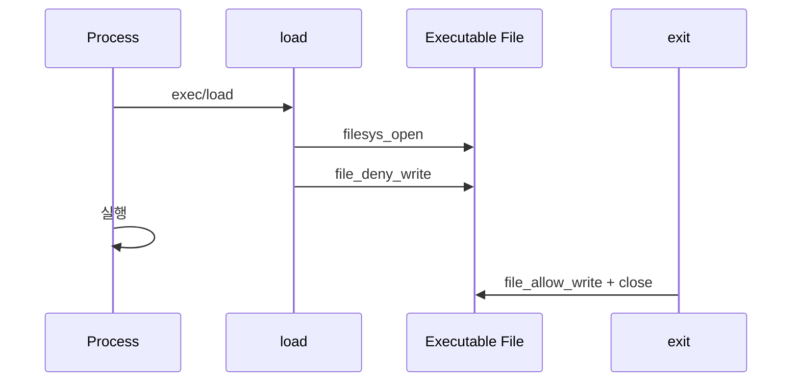
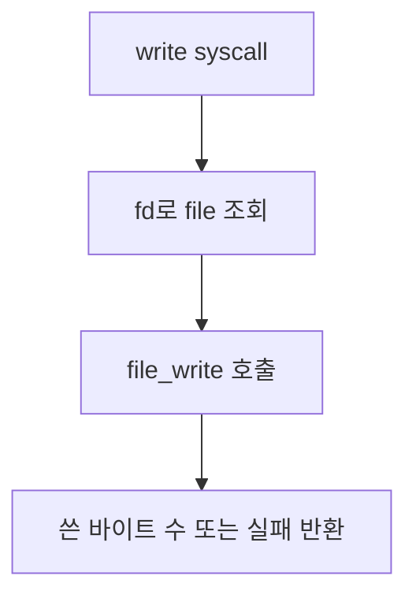
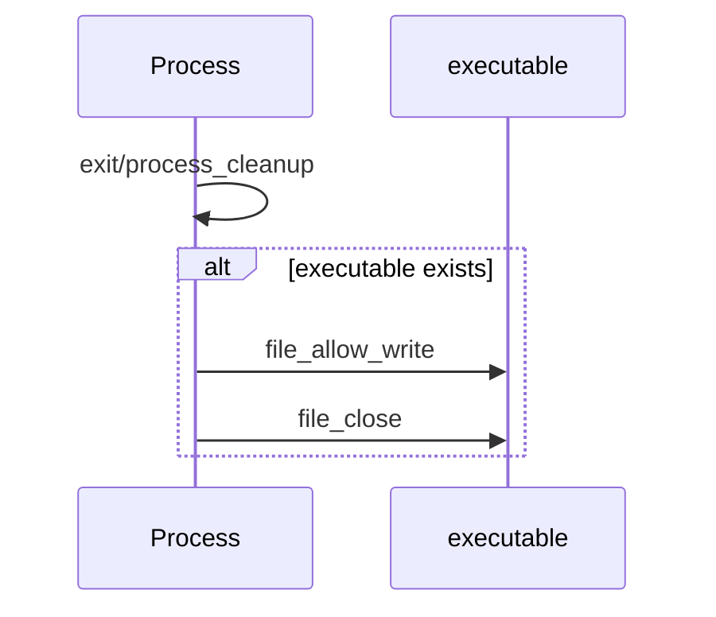

# 05 — 기능 4: 실행 파일 쓰기 금지 (Executable Write Deny)

## 1. 구현 목적 및 필요성
### 이 기능이 무엇인가
프로세스가 실행 중인 파일에 대해 다른 프로세스나 자기 자신이 쓰지 못하도록 deny-write 상태를 유지하는 기능입니다.

### 왜 이걸 하는가 (문제 맥락)
실행 중인 바이너리가 수정되면 현재 실행 이미지와 파일 시스템 상태가 어긋납니다. `rox-*` 테스트는 이 경계를 검증합니다.

### 무엇을 연결하는가 (기술 맥락)
`load()`, executable file 포인터 보관, `file_deny_write()`, `file_allow_write()`, 프로세스 종료 정리 경로를 연결합니다.

### 완성의 의미 (결과 관점)
프로세스가 실행 중인 동안 해당 executable에 대한 write가 거부되고, 프로세스 종료 시 deny 상태가 해제됩니다.

## 2. 가능한 구현 방식 비교
- 방식 A: 실행 파일 open 후 즉시 close
  - 장점: 기존 load 흐름 유지
  - 단점: 실행 중 write 방어 불가
- 방식 B: 실행 파일 file 포인터를 프로세스에 보관하고 deny-write 유지
  - 장점: rox 테스트 대응 가능
  - 단점: 종료 시 정리 필요
- 선택: B

## 3. 시퀀스와 단계별 흐름

1. `load()`가 실행 파일을 연다.
2. load 성공 후 해당 file에 `file_deny_write()`를 적용한다.
3. file 포인터를 현재 프로세스에 보관한다.
4. 프로세스 종료 시 `file_allow_write()`와 close를 수행한다.

## 4. 기능별 가이드 (개념/흐름 + 구현 주석 위치)
### 4.1 기능 A: 실행 파일 포인터 보관
#### 개념 설명
deny-write는 file 객체에 걸리는 상태이므로, 실행 중인 동안 file 포인터를 닫지 않고 프로세스 상태에 보관해야 합니다.

#### 시퀀스 및 흐름

1. 실행 파일 open 성공 후 file 포인터를 확보한다.
2. load 성공 시 deny-write를 적용한다.
3. 현재 thread/process 구조에 실행 파일 포인터를 저장한다.

#### 구현 주석 (보면 되는 함수/구조체)
- 위치: `pintos/userprog/process.c`의 `load()`
- 위치: `pintos/threads/thread.h`의 executable file 필드

### 4.2 기능 B: write syscall과 deny-write 효과
#### 개념 설명
write syscall은 일반 file API를 호출하지만, 대상 file이 deny-write 상태라면 쓰기가 거부되어야 합니다. System Calls는 file layer의 결과를 반환값으로 반영합니다.

#### 시퀀스 및 흐름

1. write syscall은 fd table에서 file 객체를 찾는다.
2. `file_write()` 결과를 그대로 반환 정책에 반영한다.
3. deny-write 대상이면 쓰기 결과가 테스트 기대와 맞는지 확인한다.

#### 구현 주석 (보면 되는 함수/구조체)
- 위치: `pintos/userprog/syscall.c`의 `write`
- 위치: `pintos/filesys/file.c`의 deny-write 관련 API

### 4.3 기능 C: 종료 시 deny-write 해제
#### 개념 설명
프로세스가 끝났는데 실행 파일 deny-write가 남아 있으면 이후 테스트와 파일 작업에 영향을 줍니다. 종료 경로에서 반드시 해제해야 합니다.

#### 시퀀스 및 흐름

1. exit 또는 process cleanup 경로에서 executable file 포인터를 확인한다.
2. 존재하면 `file_allow_write()`를 먼저 호출한다.
3. 그 뒤 file을 닫고 포인터를 NULL로 정리한다.

#### 구현 주석 (보면 되는 함수/구조체)
- 위치: `pintos/userprog/process.c`의 `process_cleanup()`
- 위치: `pintos/userprog/syscall.c`의 `exit` 정리 경로

## 5. 구현 주석 (위치별 정리)
### 5.1 executable file 상태 필드
- 위치: `pintos/threads/thread.h`
- 역할: 현재 실행 중인 파일 객체를 프로세스 수명 동안 보관한다.
- 규칙 1: load 성공 후에만 필드를 설정한다.
- 규칙 2: exec 실패 시 file을 닫고 필드를 남기지 않는다.
- 규칙 3: 종료 시 allow-write 후 close한다.
- 금지 1: load 직후 실행 파일을 닫아 deny-write 상태를 잃지 않는다.

구현 체크 순서:
1. thread/process 구조에 executable file 포인터를 추가한다.
2. load 성공 시 file 포인터를 저장한다.
3. 종료/cleanup에서 allow-write와 close를 수행한다.

### 5.2 rox 테스트 확인 경로
- 위치: `pintos/userprog/syscall.c`, `pintos/userprog/process.c`
- 역할: 실행 중인 파일 쓰기 금지 정책을 write/exec/exit 흐름에서 유지한다.
- 규칙 1: 실행 중인 파일에 대한 write가 실패해야 한다.
- 규칙 2: 자식 프로세스 실행 중에도 deny-write 상태가 유지되어야 한다.
- 규칙 3: 종료 후에는 파일이 정상 정리되어야 한다.
- 금지 1: deny-write를 전역 플래그처럼 관리하지 않는다.

구현 체크 순서:
1. rox-simple에서 자기 실행 파일 write가 거부되는지 확인한다.
2. rox-child에서 자식 실행 중 쓰기 금지가 유지되는지 확인한다.
3. rox-multichild에서 여러 자식의 실행 파일 상태가 꼬이지 않는지 확인한다.

## 6. 테스팅 방법
- `rox-simple`: 자기 실행 파일 쓰기 금지
- `rox-child`: 자식 실행 파일 쓰기 금지
- `rox-multichild`: 다중 자식 실행 파일 쓰기 금지
- 실패 시 executable file 포인터 보관/해제 시점을 먼저 확인
