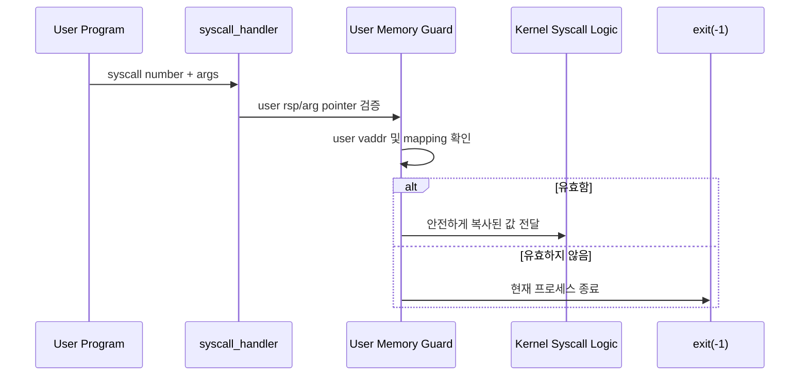

# 01 — User Memory Access 전체 개념과 동작 흐름

이 문서는 User Memory Access를 처음 볼 때 필요한 큰 그림을 잡기 위한 개요 문서입니다.  
사용자 포인터 검증, 안전한 복사, 예외 처리 경계가 어떻게 한 흐름으로 연결되는지 이해하도록 구성했습니다.

---

## 1) User Memory Access를 한 문장으로 설명하면

**"사용자 프로그램이 넘긴 주소를 커널이 신뢰하지 않고, 안전하게 읽고 쓰며, 잘못된 접근은 해당 프로세스만 종료시키는 방어 계층"**입니다.

핵심은 syscall 구현 전에 **사용자 주소 범위와 실제 매핑 여부**를 끝까지 확인하는 것입니다.

---

## 2) 왜 필요한가 (문제의식)

사용자 프로그램은 syscall 인자로 임의의 포인터를 넘길 수 있습니다.  
커널이 이 포인터를 그대로 역참조하면 잘못된 주소, 커널 주소, unmapped page 접근 때문에 커널 전체가 panic 날 수 있습니다.

이 기능은 문제를 해결하기 위해:
- syscall 인자로 받은 포인터가 사용자 주소인지 확인하고
- 문자열/버퍼 전체 범위를 안전하게 복사하고
- 실패 시 커널이 아니라 현재 사용자 프로세스만 종료시킵니다.

---

## 3) 동작 시퀀스와 단계별 흐름

시퀀스를 단계로 읽으면 다음과 같습니다.

1. syscall 진입 시 사용자 스택의 syscall number와 인자를 읽는다.
2. 읽기 전에 주소가 사용자 영역인지 확인한다.
3. 문자열/버퍼 인자는 길이 전체 또는 NUL 종료까지 검증한다.
4. 검증된 데이터만 커널 로직에 넘긴다.
5. 검증 실패나 page fault는 현재 프로세스 종료로 처리한다.

---

## 4) 반드시 분리해서 이해할 개념

- **주소 범위 계층**: `is_user_vaddr()`로 커널 주소 전달을 차단
- **페이지 매핑 계층**: 해당 사용자 주소가 실제로 매핑되어 있는지 확인
- **복사 계층**: 문자열/버퍼를 한 바이트 또는 구간 단위로 안전하게 복사
- **실패 처리 계층**: 잘못된 접근 시 커널 panic이 아니라 프로세스 종료

이 네 계층을 섞으면 `bad-*`와 `*-boundary` 계열에서 부분 통과/부분 실패가 반복됩니다.

---

## 5) 이 기능에서 자주 틀리는 지점

- 사용자 포인터를 검증 전에 직접 역참조하는 경우
- 시작 주소만 검사하고 버퍼 길이 전체를 검사하지 않는 경우
- page boundary를 넘어가는 문자열/버퍼를 한 페이지만 보고 통과시키는 경우
- 커널 주소를 user pointer로 받아도 차단하지 않는 경우
- 잘못된 접근을 프로세스 종료가 아니라 kernel panic으로 처리하는 경우

---

## 6) 학습 순서 (추천)

1. `02-feature-user-pointer-validation.md` — 사용자 포인터 범위와 매핑 검증
2. `03-feature-safe-copy-in-out.md` — 문자열/버퍼 안전 복사
3. `04-feature-page-fault-and-process-kill.md` — fault 발생 시 프로세스 종료 경계

---

## 7) 구현 전에 스스로 체크할 질문

- syscall 인자를 읽는 순간 사용자 주소 검증이 먼저 일어나는가?
- 문자열 인자는 NUL 종료까지 안전하게 확인하는가?
- 버퍼 인자는 시작 주소뿐 아니라 길이 전체를 확인하는가?
- `bad-read`, `bad-write`, `bad-jump`가 커널을 죽이지 않는가?
- `open-boundary`, `read-boundary`, `write-boundary` 같은 page boundary 입력을 처리하는가?
