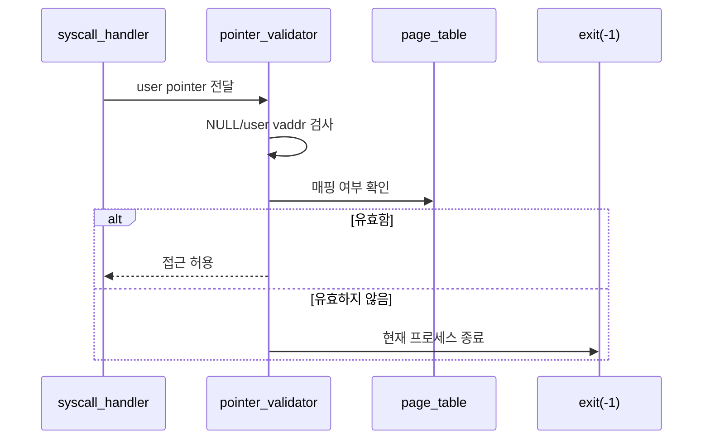
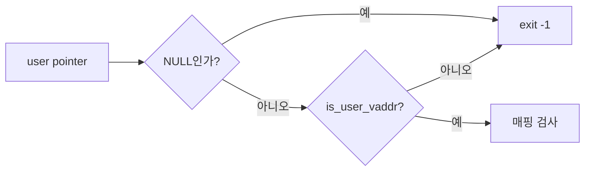
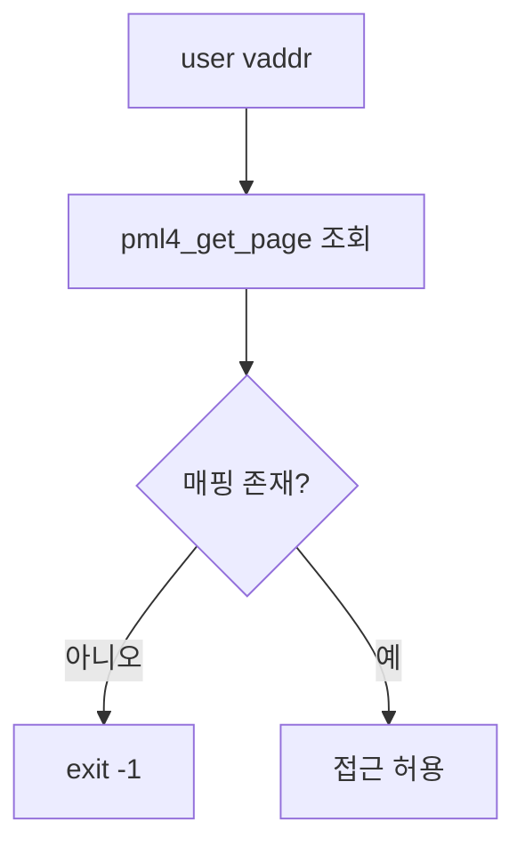
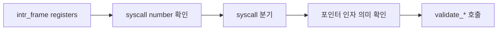

# 02 — 기능 1: 사용자 포인터 검증 (User Pointer Validation)

## 1. 구현 목적 및 필요성
### 이 기능이 무엇인가
syscall 인자로 들어온 주소가 사용자 영역이며 실제로 접근 가능한지 확인하는 기능입니다.

### 왜 이걸 하는가 (문제 맥락)
사용자 프로그램은 NULL, 커널 주소, unmapped 주소를 syscall 인자로 넘길 수 있습니다. 이를 그대로 역참조하면 커널이 page fault나 panic으로 무너집니다.

### 무엇을 연결하는가 (기술 맥락)
`syscall_handler()`, syscall 인자 추출 함수, `is_user_vaddr()`, 현재 프로세스의 page table 조회 경로를 연결합니다.

### 완성의 의미 (결과 관점)
잘못된 사용자 주소가 들어오면 syscall 처리를 계속하지 않고 해당 프로세스만 `exit(-1)` 경로로 종료합니다.

## 2. 가능한 구현 방식 비교
- 방식 A: syscall별로 직접 주소 검사
  - 장점: 처음 구현이 단순
  - 단점: 검사 누락/중복 가능성 높음
- 방식 B: 공통 validator/helper로 검사
  - 장점: syscall별 정책을 일관되게 유지
  - 단점: helper 경계를 먼저 설계해야 함
- 선택: B

## 3. 시퀀스와 단계별 흐름

1. syscall handler가 사용자 스택 또는 syscall 인자 포인터를 읽기 전에 validator를 호출한다.
2. validator는 NULL과 커널 주소를 먼저 차단한다.
3. 주소가 현재 프로세스 주소 공간에 매핑되어 있는지 확인한다.
4. 실패 시 syscall 로직으로 들어가지 않고 프로세스 종료 경로로 보낸다.

## 4. 기능별 가이드 (개념/흐름 + 구현 주석 위치)
### 4.1 기능 A: 사용자 주소 범위 검사
#### 개념 설명
사용자 포인터는 반드시 사용자 가상 주소 범위 안에 있어야 합니다. 커널 영역 주소가 들어오면 그 주소가 실제로 존재하더라도 사용자 입력으로는 거부해야 합니다.

#### 시퀀스 및 흐름

1. 포인터가 NULL이면 즉시 실패 처리한다.
2. `is_user_vaddr()`로 커널 영역 주소를 차단한다.
3. 범위 검사를 통과한 주소만 page table 조회로 넘긴다.

#### 구현 주석 (보면 되는 함수)
- `is_valid_user_ptr()` 사용자 주소 판별
- `validate_user_ptr()` 단일 포인터 검증
- `fail_invalid_user_memory()` 실패 종료 경로

### 4.2 기능 B: 페이지 매핑 검사
#### 개념 설명
사용자 주소 범위 안에 있더라도 실제 page table에 매핑되어 있지 않으면 접근할 수 없습니다. 범위 검사와 매핑 검사는 별개의 단계입니다.

#### 시퀀스 및 흐름

1. 현재 thread의 page table을 기준으로 사용자 주소를 조회한다.
2. 매핑 결과가 NULL이면 잘못된 포인터로 처리한다.
3. 매핑된 주소만 실제 읽기/쓰기 대상으로 사용한다.

#### 구현 주석 (보면 되는 함수)
- `is_valid_user_ptr()` page table 매핑 확인
- `validate_user_ptr()` 매핑 실패 시 종료 처리
- `pml4_get_page()` 사용자 주소 매핑 조회

### 4.3 기능 C: syscall 인자 추출 경계
#### 개념 설명
x86-64 syscall 경로에서는 syscall number와 인자가 `struct intr_frame`의 레지스터 값으로 전달됩니다. 이 중 포인터 의미를 가진 인자는 개별 syscall 구현 함수가 사용하기 전에 User Memory Access 정책을 적용해야 합니다.

#### 시퀀스 및 흐름

1. `f->R.rax`로 syscall number를 확인한다.
2. `f->R.rdi`, `f->R.rsi`, `f->R.rdx` 등 레지스터 인자를 syscall 구현 함수에 전달한다.
3. `buffer`, `file`, `cmd_line`처럼 포인터 의미를 가진 인자는 해당 syscall 구현 함수 안에서 검증한다.
4. 검증된 인자만 커널 로직에 사용한다.

#### 구현 주석 (보면 되는 함수/구조체)
- `syscall_handler()` syscall 번호와 레지스터 인자 분기
- `sys_write()` 사용자 버퍼 검증 호출 지점
- `struct intr_frame` syscall 인자 레지스터 확인

## 5. 구현 주석 (함수 기준 정리)
### 5.1 `is_valid_user_ptr()` 사용자 주소 판별
- 위치: `pintos/userprog/syscall.c`
- 역할: syscall에서 받은 user pointer가 접근 가능한 사용자 주소인지 판별한다.
- 규칙 1: NULL 포인터를 실패 처리한다.
- 규칙 2: `is_user_vaddr()`로 커널 주소를 차단한다.
- 규칙 3: 현재 thread의 page table에서 매핑 여부를 확인한다.
- 금지 1: 이 함수 안에서 user pointer를 직접 역참조하지 않는다.

구현 체크 순서:
1. 포인터 NULL 여부를 확인한다.
2. 사용자 가상 주소 범위인지 확인한다.
3. `pml4_get_page()`로 page table 매핑 여부를 확인한다.
4. 결과만 `bool`로 반환하고 종료 처리는 호출자에게 맡긴다.

### 5.2 `validate_user_ptr()` 단일 포인터 검증
- 위치: `pintos/userprog/syscall.c`
- 역할: 사용자 주소 하나를 검증하고 실패 시 공통 종료 경로로 보낸다.
- 규칙 1: 내부 판별은 `is_valid_user_ptr()`에 위임한다.
- 규칙 2: 실패 시 `fail_invalid_user_memory()`를 호출한다.
- 규칙 3: syscall 구현부가 포인터 하나를 직접 쓰기 전에 호출한다.
- 금지 1: 실패를 syscall별 반환값으로 바꾸지 않는다.

구현 체크 순서:
1. syscall 구현 함수 입구에서 사용자 포인터 인자를 확인한다.
2. 포인터 하나만 필요한 경우 `validate_user_ptr(ptr)`를 호출한다.
3. 실패하면 syscall 본문으로 돌아오지 않게 한다.
4. 성공한 포인터만 이후 커널 로직에 넘긴다.

### 5.3 `fail_invalid_user_memory()` 실패 종료 경로
- 위치: `pintos/userprog/syscall.c`
- 역할: User Memory Access 실패 정책을 한 곳으로 모은다.
- 규칙 1: 잘못된 사용자 메모리는 현재 프로세스를 `exit(-1)`로 종료한다.
- 규칙 2: `validate_*()` 계열 helper의 공통 실패 경로로 사용한다.
- 규칙 3: 호출 이후 정상 syscall 반환값을 만들지 않는다.
- 금지 1: bad pointer를 조용히 무시하거나 성공값으로 처리하지 않는다.

구현 체크 순서:
1. 실패 정책을 `exit(-1)`로 통일한다.
2. `validate_user_ptr()`에서 이 함수로 실패를 모은다.
3. 이후 `validate_user_buffer()`, `validate_user_string()`도 같은 경로를 사용한다.

### 5.4 `syscall_handler()` syscall 인자 분기
- 위치: `pintos/userprog/syscall.c`
- 역할: syscall 번호를 확인하고 레지스터 인자를 syscall 구현 함수에 전달한다.
- 규칙 1: x86-64 syscall 인자는 `f->R.rdi`, `f->R.rsi`, `f->R.rdx` 등에서 온다.
- 규칙 2: 포인터 의미를 아는 개별 syscall 구현 함수에서 `validate_*()`를 호출한다.
- 규칙 3: 잘못된 syscall 또는 검증 실패가 정상 dispatch로 이어지지 않게 한다.
- 금지 1: 사용자 포인터 인자를 검증 없이 역참조하지 않는다.

구현 체크 순서:
1. syscall 번호를 기준으로 분기한다.
2. 레지스터 인자를 `sys_write()`, `sys_read()` 같은 구현 함수에 넘긴다.
3. 구현 함수 안에서 포인터 종류에 맞는 helper를 호출한다.

## 6. 테스팅 방법
- `bad-read`, `bad-write`: 잘못된 사용자 주소 직접 접근 방어
- `read-bad-ptr`, `write-bad-ptr`: syscall 인자 포인터 검증
- `create-bad-ptr`, `open-bad-ptr`, `exec-bad-ptr`: 문자열 포인터 검증
- 실패 시 user pointer 직접 역참조가 남아 있는지 먼저 확인
