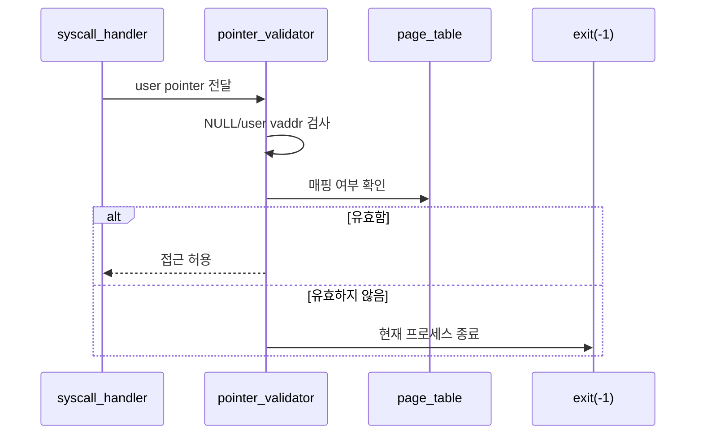
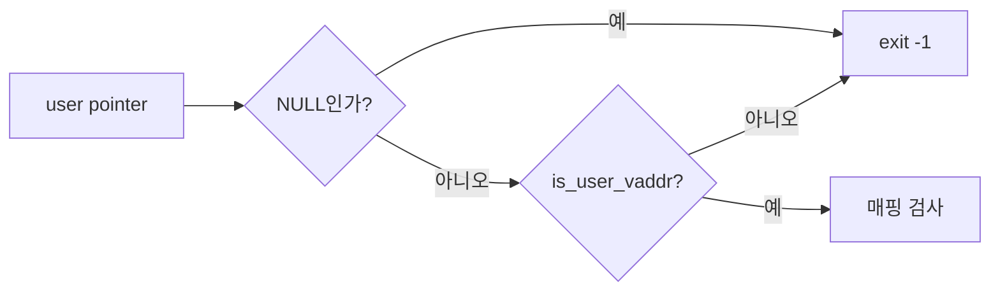
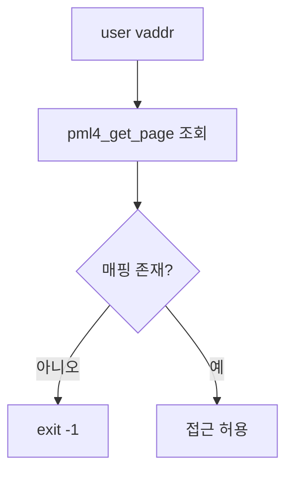

# 02 — 기능 1: 사용자 포인터 검증 (User Pointer Validation)

## 1. 구현 목적 및 필요성
### 이 기능이 무엇인가
syscall 인자로 들어온 주소가 사용자 영역이며 실제로 접근 가능한지 확인하는 기능입니다.

### 왜 이걸 하는가 (문제 맥락)
사용자 프로그램은 NULL, 커널 주소, unmapped 주소를 syscall 인자로 넘길 수 있습니다. 이를 그대로 역참조하면 커널이 page fault나 panic으로 무너집니다.

### 무엇을 연결하는가 (기술 맥락)
`syscall_handler()`, syscall 인자 추출 함수, `is_user_vaddr()`, 현재 프로세스의 page table 조회 경로를 연결합니다.

### 완성의 의미 (결과 관점)
잘못된 사용자 주소가 들어오면 syscall 처리를 계속하지 않고 해당 프로세스만 `exit(-1)` 경로로 종료합니다.

## 2. 가능한 구현 방식 비교
- 방식 A: syscall별로 직접 주소 검사
  - 장점: 처음 구현이 단순
  - 단점: 검사 누락/중복 가능성 높음
- 방식 B: 공통 validator/helper로 검사
  - 장점: syscall별 정책을 일관되게 유지
  - 단점: helper 경계를 먼저 설계해야 함
- 선택: B

## 3. 시퀀스와 단계별 흐름

1. syscall handler가 사용자 스택 또는 syscall 인자 포인터를 읽기 전에 validator를 호출한다.
2. validator는 NULL과 커널 주소를 먼저 차단한다.
3. 주소가 현재 프로세스 주소 공간에 매핑되어 있는지 확인한다.
4. 실패 시 syscall 로직으로 들어가지 않고 프로세스 종료 경로로 보낸다.

## 4. 기능별 가이드 (개념/흐름 + 구현 주석 위치)
### 4.1 기능 A: 사용자 주소 범위 검사
#### 개념 설명
사용자 포인터는 반드시 사용자 가상 주소 범위 안에 있어야 합니다. 커널 영역 주소가 들어오면 그 주소가 실제로 존재하더라도 사용자 입력으로는 거부해야 합니다.

#### 시퀀스 및 흐름

1. 포인터가 NULL이면 즉시 실패 처리한다.
2. `is_user_vaddr()`로 커널 영역 주소를 차단한다.
3. 범위 검사를 통과한 주소만 page table 조회로 넘긴다.

#### 구현 주석 (보면 되는 함수/구조체)
- 위치: `pintos/userprog/syscall.c`의 syscall 인자 검증 helper
- 위치: `pintos/include/threads/vaddr.h`의 `is_user_vaddr()`

### 4.2 기능 B: 페이지 매핑 검사
#### 개념 설명
사용자 주소 범위 안에 있더라도 실제 page table에 매핑되어 있지 않으면 접근할 수 없습니다. 범위 검사와 매핑 검사는 별개의 단계입니다.

#### 시퀀스 및 흐름

1. 현재 thread의 page table을 기준으로 사용자 주소를 조회한다.
2. 매핑 결과가 NULL이면 잘못된 포인터로 처리한다.
3. 매핑된 주소만 실제 읽기/쓰기 대상으로 사용한다.

#### 구현 주석 (보면 되는 함수/구조체)
- 위치: `pintos/userprog/syscall.c`의 사용자 주소 검증 helper
- 위치: `pintos/threads/mmu.c`의 `pml4_get_page()`

### 4.3 기능 C: syscall 인자 추출 경계
#### 개념 설명
syscall number와 인자는 사용자 스택에 있으므로, 인자를 읽는 순간부터 User Memory Access 정책이 적용되어야 합니다.

#### 시퀀스 및 흐름

1. 사용자 `rsp` 자체를 먼저 검증한다.
2. syscall number 위치를 읽기 전에 해당 주소를 검증한다.
3. 필요한 인자 개수만큼 각 인자 주소를 검증한다.
4. 검증된 인자만 syscall 분기 로직으로 전달한다.

#### 구현 주석 (보면 되는 함수/구조체)
- 위치: `pintos/userprog/syscall.c`의 `syscall_handler()`
- 위치: `pintos/include/threads/interrupt.h`의 `struct intr_frame`

## 5. 구현 주석 (위치별 정리)
### 5.1 사용자 포인터 검증 helper
- 위치: `pintos/userprog/syscall.c`
- 역할: syscall에서 받은 user pointer를 공통 규칙으로 검증한다.
- 규칙 1: NULL 포인터를 실패 처리한다.
- 규칙 2: `is_user_vaddr()` 실패 시 종료한다.
- 규칙 3: 현재 page table에서 매핑되지 않은 주소를 실패 처리한다.
- 금지 1: 검증 전 user pointer를 직접 역참조하지 않는다.

구현 체크 순서:
1. 포인터 NULL 여부를 확인한다.
2. 사용자 가상 주소 범위인지 확인한다.
3. page table 매핑 여부를 확인한다.
4. 실패 시 현재 프로세스를 `exit(-1)` 경로로 보낸다.

### 5.2 syscall 인자 읽기 경로
- 위치: `pintos/userprog/syscall.c`의 `syscall_handler()`
- 역할: 사용자 스택에서 syscall number와 인자를 안전하게 읽는다.
- 규칙 1: `f->rsp`부터 검증한다.
- 규칙 2: syscall number와 각 인자 주소를 읽기 전에 검증한다.
- 규칙 3: 검증 실패 시 syscall dispatch에 진입하지 않는다.
- 금지 1: `*(uint64_t *) f->rsp` 같은 직접 역참조를 검증 없이 수행하지 않는다.

구현 체크 순서:
1. syscall 진입 시 `rsp` 주소를 검증한다.
2. syscall number 위치를 안전하게 읽는다.
3. syscall별 인자 개수만큼 추가 주소를 검증한다.
4. 검증된 값으로만 syscall switch/case에 진입한다.

## 6. 테스팅 방법
- `bad-read`, `bad-write`: 잘못된 사용자 주소 직접 접근 방어
- `read-bad-ptr`, `write-bad-ptr`: syscall 인자 포인터 검증
- `create-bad-ptr`, `open-bad-ptr`, `exec-bad-ptr`: 문자열 포인터 검증
- 실패 시 user pointer 직접 역참조가 남아 있는지 먼저 확인
