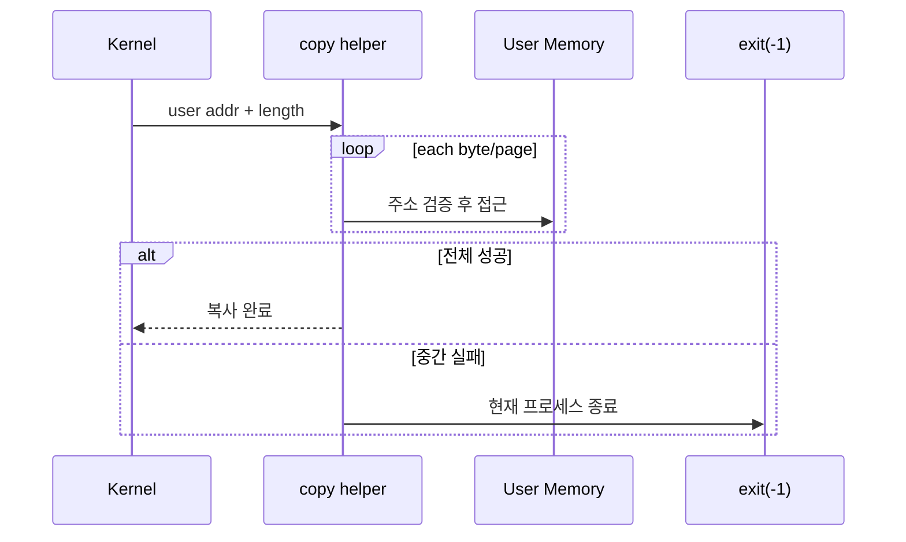
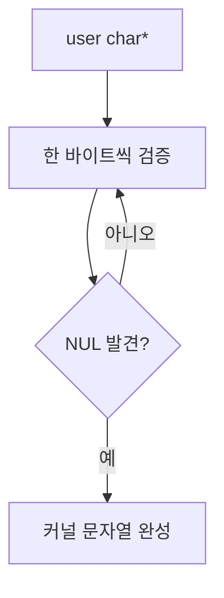
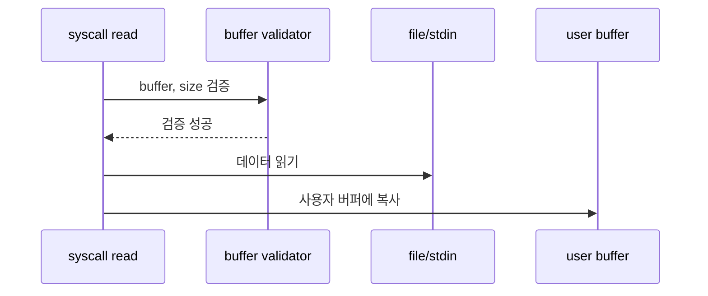

# 03 — 기능 2: 안전한 사용자 메모리 복사 (Safe Copy In/Out)

## 1. 구현 목적 및 필요성
### 이 기능이 무엇인가
사용자 주소에서 커널로 값을 읽거나, 커널 데이터를 사용자 버퍼에 쓸 때 전체 범위를 안전하게 복사하는 기능입니다.

### 왜 이걸 하는가 (문제 맥락)
시작 주소만 유효해도 버퍼 중간이 page boundary를 넘어 unmapped page에 걸릴 수 있습니다. 문자열은 NUL 종료를 찾기 전까지 여러 페이지를 건널 수 있습니다.

### 무엇을 연결하는가 (기술 맥락)
파일 syscall의 문자열 인자, `read()`/`write()` 버퍼, page boundary 테스트, 사용자 주소 검증 helper를 연결합니다.

### 완성의 의미 (결과 관점)
커널은 사용자 메모리 전체 범위를 검증하면서 필요한 데이터를 복사하고, 중간에 실패하면 현재 프로세스만 종료합니다.

## 2. 가능한 구현 방식 비교
- 방식 A: 시작 주소만 검사하고 한 번에 memcpy
  - 장점: 구현이 짧음
  - 단점: boundary 테스트에서 실패
- 방식 B: 바이트/페이지 단위로 검증하면서 복사
  - 장점: page boundary와 bad pointer에 강함
  - 단점: helper 구현이 필요
- 선택: B

## 3. 시퀀스와 단계별 흐름

1. syscall 구현은 user pointer를 직접 사용하지 않고 copy helper를 호출한다.
2. helper는 접근할 전체 범위를 순회한다.
3. 각 주소가 사용자 영역이고 매핑되어 있는지 확인한다.
4. 모든 검증을 통과한 경우에만 커널 버퍼 또는 사용자 버퍼로 복사한다.

## 4. 기능별 가이드 (개념/흐름 + 구현 주석 위치)
### 4.1 기능 A: 사용자 문자열 읽기
#### 개념 설명
파일명, 프로그램명 같은 문자열 인자는 NUL 종료까지 읽어야 합니다. 문자열 시작 주소만 검사하면 boundary를 넘는 순간 깨질 수 있습니다.

#### 시퀀스 및 흐름

1. 문자열 시작 주소를 검증한다.
2. 한 바이트씩 읽으며 매 위치를 검증한다.
3. NUL 문자를 만나면 문자열 복사를 종료한다.
4. 중간에 잘못된 주소가 나오면 현재 프로세스를 종료한다.

#### 구현 주석 (보면 되는 함수/구조체)
- 위치: `pintos/userprog/syscall.c`의 문자열 복사 helper
- 위치: `pintos/tests/userprog/open-boundary.c`

### 4.2 기능 B: 사용자 버퍼 읽기
#### 개념 설명
`write(fd, buffer, size)`처럼 커널이 사용자 버퍼를 읽는 syscall은 `buffer`부터 `buffer + size - 1`까지 모두 안전해야 합니다.

#### 시퀀스 및 흐름

1. size가 0이면 복사 없이 성공 가능한 경계로 처리한다.
2. size가 0보다 크면 시작 주소부터 마지막 바이트까지 검증한다.
3. page boundary를 넘는 경우 다음 페이지 매핑도 확인한다.
4. 검증 완료 후 파일/콘솔 출력 로직에 넘긴다.

#### 구현 주석 (보면 되는 함수/구조체)
- 위치: `pintos/userprog/syscall.c`의 `write()` 처리 경로
- 위치: `pintos/tests/userprog/write-boundary.c`

### 4.3 기능 C: 사용자 버퍼 쓰기
#### 개념 설명
`read(fd, buffer, size)`처럼 커널이 사용자 버퍼에 쓰는 syscall은 사용자 버퍼가 쓰기 가능한 범위인지 확인해야 합니다.

#### 시퀀스 및 흐름

1. 사용자 버퍼 전체 범위를 검증한다.
2. 입력 데이터를 커널 임시 버퍼로 받거나, 검증된 사용자 버퍼로 복사한다.
3. 복사 중 fault 가능성을 고려해 실패 시 프로세스를 종료한다.
4. 성공 시 실제 읽은 바이트 수를 반환한다.

#### 구현 주석 (보면 되는 함수/구조체)
- 위치: `pintos/userprog/syscall.c`의 `read()` 처리 경로
- 위치: `pintos/tests/userprog/read-boundary.c`

## 5. 구현 주석 (위치별 정리)
### 5.1 문자열 복사 helper
- 위치: `pintos/userprog/syscall.c`
- 역할: 사용자 문자열을 NUL 종료까지 안전하게 읽는다.
- 규칙 1: 시작 주소뿐 아니라 각 문자 위치를 검증한다.
- 규칙 2: NUL 종료를 발견하면 복사를 종료한다.
- 규칙 3: boundary를 넘어가는 문자열을 허용하되, 다음 페이지가 유효해야 한다.
- 금지 1: `strlen(user_ptr)`를 검증 없이 호출하지 않는다.

구현 체크 순서:
1. 사용자 문자열 시작 주소를 검증한다.
2. 문자 단위로 주소 검증과 읽기를 반복한다.
3. NUL 발견 시 커널 문자열을 완성한다.
4. 중간 실패 시 현재 프로세스를 종료한다.

### 5.2 버퍼 범위 검증 helper
- 위치: `pintos/userprog/syscall.c`
- 역할: 사용자 버퍼의 전체 `[buffer, buffer + size)` 범위를 검증한다.
- 규칙 1: `size == 0`은 빈 범위로 처리한다.
- 규칙 2: 시작 주소와 마지막 바이트 주소를 모두 고려한다.
- 규칙 3: page boundary를 넘으면 각 페이지 매핑을 확인한다.
- 금지 1: 시작 주소 하나만 보고 전체 버퍼를 통과시키지 않는다.

구현 체크 순서:
1. size가 0인지 먼저 분기한다.
2. 시작 주소가 사용자 주소인지 확인한다.
3. 마지막 바이트까지 범위를 순회하거나 페이지 단위로 검사한다.
4. 검증된 버퍼만 `read()`/`write()` 로직으로 넘긴다.

## 6. 테스팅 방법
- `open-boundary`, `exec-boundary`: 문자열 boundary 검증
- `read-boundary`, `write-boundary`: 버퍼 boundary 검증
- `read-bad-ptr`, `write-bad-ptr`: 잘못된 버퍼 포인터 차단
- 실패 시 시작 주소만 검사하는 shortcut이 남아 있는지 먼저 확인
