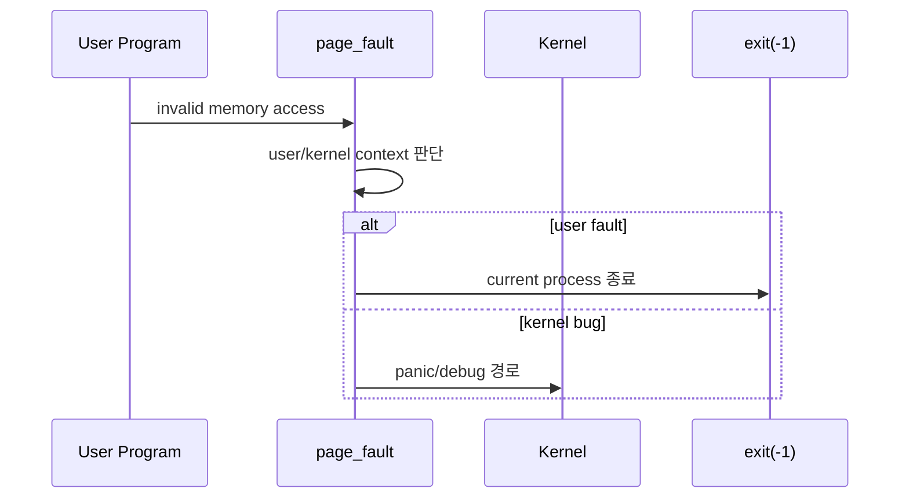
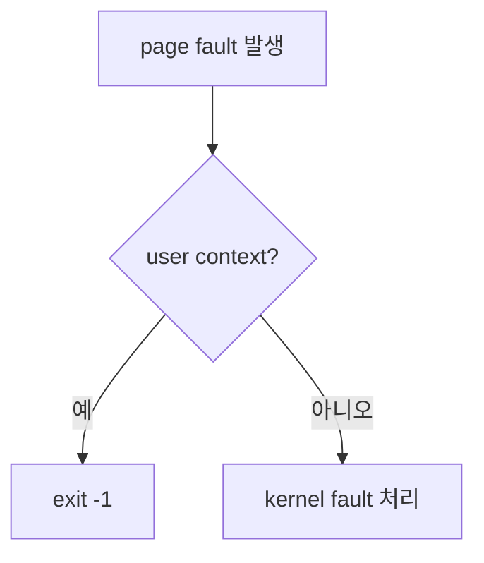
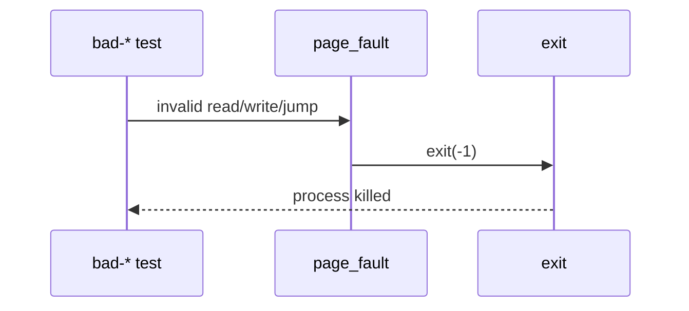
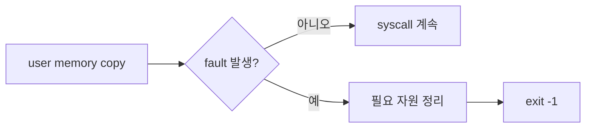

# 04 — 기능 3: Page Fault와 프로세스 종료 경계

## 1. 구현 목적 및 필요성
### 이 기능이 무엇인가
사용자 메모리 접근 중 page fault가 발생했을 때 커널을 중단하지 않고, 잘못된 접근을 한 사용자 프로세스만 종료시키는 경계입니다.

### 왜 이걸 하는가 (문제 맥락)
사용자 프로그램은 의도적으로 잘못된 주소를 읽거나 쓰거나 점프할 수 있습니다. 이때 커널 panic이 나면 robustness 테스트가 실패합니다.

### 무엇을 연결하는가 (기술 맥락)
`exception.c`의 `page_fault()`, syscall 사용자 메모리 접근 helper, `exit(-1)` 처리, `bad-read/write/jump` 테스트를 연결합니다.

### 완성의 의미 (결과 관점)
잘못된 사용자 접근은 `exit(-1)`로 정리되고, 커널은 다음 테스트를 계속 실행할 수 있습니다.

## 2. 가능한 구현 방식 비교
- 방식 A: 모든 fault를 panic 처리
  - 장점: 디버깅 초반에는 원인 파악이 쉬움
  - 단점: 사용자 오류가 커널 전체 실패가 됨
- 방식 B: user mode fault와 kernel mode fault를 구분
  - 장점: 사용자 프로그램 오류만 격리 가능
  - 단점: fault 원인과 컨텍스트 판단 필요
- 선택: B

## 3. 시퀀스와 단계별 흐름

1. 잘못된 사용자 접근이 page fault를 발생시킨다.
2. page fault handler는 fault가 사용자 컨텍스트에서 온 것인지 확인한다.
3. 사용자 접근 실패면 현재 프로세스를 종료한다.
4. 커널 내부 버그라면 숨기지 않고 디버깅 가능한 실패로 둔다.

## 4. 기능별 가이드 (개념/흐름 + 구현 주석 위치)
### 4.1 기능 A: user fault와 kernel fault 구분
#### 개념 설명
사용자 프로그램의 잘못된 주소 접근은 정상적인 방어 대상이지만, 커널 코드의 잘못된 접근은 구현 버그입니다. 두 경우를 같은 방식으로 처리하면 원인을 놓칩니다.

#### 시퀀스 및 흐름

1. fault 발생 시 현재 실행 컨텍스트를 확인한다.
2. 사용자 모드에서 발생한 fault는 프로세스 종료로 처리한다.
3. 커널 모드 fault는 사용자 입력 때문인지, 커널 버그인지 추가 판단한다.

#### 구현 주석 (보면 되는 함수/구조체)
- 위치: `pintos/userprog/exception.c`의 `page_fault()`
- 위치: `pintos/include/threads/interrupt.h`의 `struct intr_frame`

### 4.2 기능 B: bad-read/write/jump 격리
#### 개념 설명
`bad-read`, `bad-write`, `bad-jump` 계열은 사용자 프로그램이 직접 잘못된 주소를 접근하는 테스트입니다. 이 실패는 커널 전체 실패가 아니라 해당 프로세스 종료여야 합니다.

#### 시퀀스 및 흐름

1. 테스트가 의도적으로 invalid address를 접근한다.
2. page fault handler가 사용자 접근 실패로 분류한다.
3. 현재 프로세스의 exit status를 실패로 정리한다.
4. 커널은 panic 없이 다음 테스트를 계속 수행한다.

#### 구현 주석 (보면 되는 함수/구조체)
- 위치: `pintos/userprog/exception.c`의 `page_fault()`
- 위치: `pintos/tests/userprog/bad-read.c`, `bad-write.c`, `bad-jump.c`

### 4.3 기능 C: syscall 중 fault와 정리 경로
#### 개념 설명
syscall 처리 중 사용자 포인터를 복사하다 fault가 날 수도 있습니다. 이 경우 파일 락, 임시 버퍼, 프로세스 상태 정리가 꼬이지 않도록 실패 경로가 일관되어야 합니다.

#### 시퀀스 및 흐름

1. syscall 내부의 사용자 메모리 접근은 helper를 통해 수행한다.
2. helper가 실패를 감지하면 syscall 성공 경로로 돌아가지 않는다.
3. 필요한 커널 자원을 정리한 뒤 프로세스 종료 경로로 이동한다.
4. 종료 경로는 `wait-killed` 같은 프로세스 생명주기 테스트와도 일치해야 한다.

#### 구현 주석 (보면 되는 함수/구조체)
- 위치: `pintos/userprog/syscall.c`의 사용자 메모리 복사 helper
- 위치: `pintos/userprog/process.c`의 종료/정리 경로

## 5. 구현 주석 (위치별 정리)
### 5.1 `page_fault()`
- 위치: `pintos/userprog/exception.c`
- 역할: 잘못된 사용자 메모리 접근을 프로세스 종료로 격리한다.
- 규칙 1: 사용자 모드 fault는 현재 프로세스를 `exit(-1)` 처리한다.
- 규칙 2: fault 주소와 컨텍스트를 구분해 커널 버그를 숨기지 않는다.
- 규칙 3: user memory helper 실패와 동일한 종료 정책을 유지한다.
- 금지 1: 사용자 프로그램의 bad pointer 때문에 kernel panic을 내지 않는다.

구현 체크 순서:
1. fault가 사용자 접근에서 발생했는지 판단한다.
2. 사용자 fault면 현재 프로세스 종료 경로를 호출한다.
3. 커널 fault면 디버깅 가능한 경로로 남긴다.

### 5.2 syscall 실패 정리 경로
- 위치: `pintos/userprog/syscall.c`
- 역할: 사용자 메모리 접근 실패 시 syscall을 중단하고 정리한다.
- 규칙 1: 실패 후 정상 반환값을 만들지 않는다.
- 규칙 2: 잡고 있는 락이나 임시 자원이 있다면 종료 전에 정리한다.
- 규칙 3: exit status는 `-1`로 관측되도록 한다.
- 금지 1: 실패를 무시하고 syscall 본래 로직을 계속 진행하지 않는다.

구현 체크 순서:
1. helper 실패 시 즉시 실패 경로로 분기한다.
2. 필요한 커널 자원을 정리한다.
3. 현재 프로세스를 `exit(-1)` 처리한다.

## 6. 테스팅 방법
- `bad-read`, `bad-read2`: invalid read가 커널 panic 없이 종료되는지 확인
- `bad-write`, `bad-write2`: invalid write가 프로세스 종료로 격리되는지 확인
- `bad-jump`, `bad-jump2`: invalid instruction pointer 접근 처리 확인
- `wait-killed`: 비정상 종료 상태가 부모에게 관측되는지 확인
