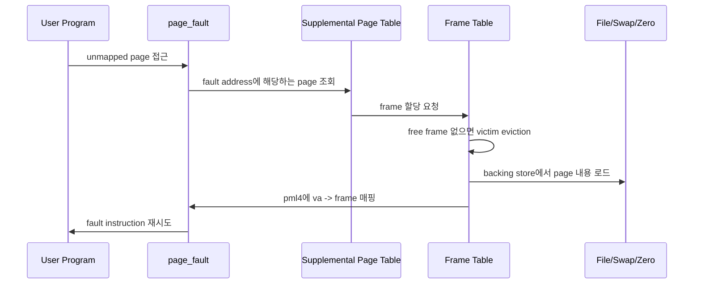

# Pintos 3주차(Virtual Memory) 전체 흐름 정리

이 문서는 3주차(Virtual Memory)를 시작하기 전에,
"페이지 폴트가 어떻게 실제 메모리 할당/로드/스왑/파일 매핑으로 이어지는지"를 한 번에 연결해 이해하기 위한 개요 문서입니다.

---

## 1) 3주차를 한 문장으로 설명하면

**"프로세스의 가상 주소 공간을 supplemental page table로 설명하고, 필요한 순간에만 실제 프레임을 연결하는 주차"**입니다.

핵심은 단순히 page fault를 없애는 것이 아니라 **가상 페이지, 물리 프레임, backing store의 소유권과 수명**을 일관되게 관리하는 것입니다.

---

## 2) 2주차와 무엇이 달라지나

2주차에서는 사용자 포인터가 유효한지 검사하고, 이미 로드된 사용자 메모리에 안전하게 접근하는 것이 중심이었습니다.  
3주차부터는 "지금은 매핑되어 있지 않지만, 접근이 합법이면 그 순간에 페이지를 준비해야 하는 상황"을 다룹니다.

즉, 3주차의 기본 전제는:
- 페이지 폴트가 항상 에러는 아니고
- executable/file/swap/zero page 중 어디서 데이터를 가져올지 구분해야 하며
- 물리 프레임이 부족하면 eviction과 swap이 발생할 수 있다는 점입니다.

---

## 3) 큰 흐름: fault부터 복구까지

단계로 보면:

1. 사용자 프로그램이 아직 실제 프레임이 연결되지 않은 가상 주소에 접근한다.
   - 입력: fault address, 접근 종류(read/write), user/kernel 모드 여부
   - 핵심 동작:
     - 주소가 사용자 영역인지 확인
     - stack growth 가능 주소인지 확인
     - SPT에 등록된 lazy page인지 확인
   - 실패 시 처리: 합법적인 페이지가 아니면 해당 프로세스 종료
   - 다음 단계 연결: 합법적인 fault면 `vm_try_handle_fault()` 경로로 진행

2. supplemental page table에서 가상 페이지의 메타데이터를 찾는다.
   - 입력: page-aligned virtual address
   - 핵심 동작:
     - `struct page` 조회
     - anonymous/file-backed/uninit page 타입 확인
     - writable 여부와 실제 접근 권한 비교
   - 실패 시 처리: SPT에 없고 stack growth도 아니면 fault 처리 실패
   - 다음 단계 연결: page claim 또는 stack page 생성으로 진행

3. 프레임을 확보하고 page와 frame을 연결한다.
   - 입력: claim할 `struct page`
   - 핵심 동작:
     - user pool에서 frame 할당
     - frame table에 등록
     - free frame이 없으면 eviction 대상 선정
     - victim page의 dirty/accessed 상태를 확인해 swap 또는 file write-back 판단
   - 실패 시 처리: frame 확보 실패 또는 swap 실패면 fault 처리 실패
   - 다음 단계 연결: page type별 swap-in/load 경로로 진행

4. backing store에서 페이지 내용을 채운다.
   - 입력: anonymous/file-backed/uninit page 정보
   - 핵심 동작:
     - uninit page는 initializer를 통해 anonymous 또는 file page로 변환
     - executable lazy load는 file offset/read_bytes/zero_bytes에 맞춰 로드
     - anonymous page는 swap slot 또는 zero page에서 복구
     - mmap page는 파일 내용과 page offset 기준으로 로드
   - 실패 시 처리: file read 실패, swap read 실패, 권한 불일치면 fault 처리 실패
   - 다음 단계 연결: pml4에 user virtual address와 frame kva를 매핑

5. fault instruction이 재시도되고 사용자 프로그램 실행이 이어진다.
   - 입력: 성공적으로 매핑된 page
   - 핵심 동작:
     - pml4 매핑 완료
     - accessed/dirty bit는 이후 eviction 판단에 사용
     - process exit 또는 munmap에서 page cleanup 수행
   - 최종 결과: 프로세스는 필요한 페이지만 물리 메모리에 올리며 실행된다.

---

## 4) 3주차 핵심 기능 묶음

### 4-1) Supplemental Page Table
- 프로세스별 가상 페이지 메타데이터 관리
- page lookup/insert/remove/copy/destroy 구현
- 관련 참고: `Page Table.md`, `Hash Table.md`

### 4-2) Lazy Loading / Anonymous Page
- executable segment를 즉시 로드하지 않고 page fault 시 로드
- anonymous page를 초기화하고 swap in/out 대상으로 관리
- 관련 참고: `2. Anonymous Page.md`

### 4-3) Stack Growth
- 합법적인 stack 접근이면 새 anonymous page를 생성
- user stack limit과 fault address/rsp 기준을 일관되게 적용
- 관련 참고: `3. Stack Growth.md`

### 4-4) Frame Management / Eviction
- user frame table을 관리하고 frame-page 역참조를 유지
- accessed bit 기반 victim 선정
- dirty page는 backing store에 반영
- 관련 참고: `1. Memory Management.md`, `Page Table.md`

### 4-5) Swap In/Out
- anonymous page를 swap disk slot에 저장/복구
- swap slot bitmap과 page 상태를 동기화
- 관련 참고: `5. Swap In&Out.md`

### 4-6) Memory Mapped Files
- `mmap`으로 파일을 가상 주소 범위에 lazy file page로 등록
- `munmap`/process exit에서 dirty page write-back 및 cleanup
- 관련 참고: `4. Memory Mapped Files.md`

### 4-7) Extra: Copy-on-write
- fork 시 page 복사를 지연하고 write fault에서 실제 복사
- 기본 VM이 안정화된 뒤 진행
- 관련 참고: `6. Copy-on-write (Extra).md`

---

## 5) 반드시 분리해서 이해할 경계

- **SPT entry vs pml4 mapping**
  - 의미: SPT는 "이 주소에 어떤 페이지가 있어야 하는가"를 설명하고, pml4는 "지금 실제 프레임에 매핑되어 있는가"를 나타냅니다.
  - 핵심 규칙:
    - lazy page는 SPT에는 있지만 pml4에는 없을 수 있음
    - page fault에서 SPT를 보고 합법성을 판단
    - claim 성공 뒤에만 pml4 매핑 생성
  - 경계가 깨졌을 때 증상:
    - lazy load 테스트 실패
    - 이미 매핑된 주소 중복 insert/assert 실패
  - 체크 질문: "이 가상 주소는 SPT와 pml4 각각에서 어떤 상태인가?"

- **page vs frame**
  - 의미: page는 가상 페이지의 소유권/타입을 담고, frame은 실제 물리 메모리 한 칸입니다.
  - 핵심 규칙:
    - page는 프로세스 주소 공간에 속함
    - frame은 전역 자원이며 eviction 대상
    - frame->page, page->frame 연결은 claim/evict 시점에 일관되게 갱신
  - 경계가 깨졌을 때 증상:
    - use-after-free, double free, victim page가 잘못된 프로세스를 가리킴
  - 체크 질문: "이 frame을 빼앗으면 어느 page의 pml4 mapping을 지워야 하는가?"

- **anonymous vs file-backed**
  - 의미: anonymous page는 swap이 backing store이고, file-backed page는 파일과 offset이 backing store입니다.
  - 핵심 규칙:
    - anonymous dirty page는 swap out
    - mmap dirty page는 file write-back
    - executable page의 write-back 정책은 writable 여부와 mapping 종류를 구분
  - 경계가 깨졌을 때 증상:
    - swap 테스트 또는 mmap write 테스트 실패
    - 실행 파일 내용이 잘못 변경됨
  - 체크 질문: "이 page가 evict될 때 데이터는 어디에 보존되는가?"

- **fault 처리 vs 프로세스 종료**
  - 의미: 모든 page fault가 kill 대상은 아닙니다. 합법적인 lazy load/stack growth/swap in이면 복구해야 합니다.
  - 핵심 규칙:
    - user address 여부와 접근 권한을 먼저 확인
    - write fault는 writable page인지 확인
    - 합법적인 fault만 frame claim으로 이어짐
  - 경계가 깨졌을 때 증상:
    - 정상 lazy load가 `exit(-1)`로 종료
    - 잘못된 주소 접근이 커널 패닉
  - 체크 질문: "이 fault는 복구 가능한 fault인가, 즉시 종료할 fault인가?"

---

## 6) 3주차에서 자주 틀리는 지점

- SPT에는 넣었지만 page fault에서 lookup 주소를 page align하지 않음
- frame과 page의 양방향 연결을 eviction/cleanup에서 같이 끊지 않음
- `PAL_USER` 없이 kernel pool에서 frame을 할당함
- stack growth 조건을 너무 넓게 잡아 잘못된 주소까지 허용
- dirty/accessed bit를 pml4에서 읽고 초기화하는 시점을 놓침
- mmap page를 `munmap` 또는 process exit에서 write-back하지 않음
- swap slot 할당/해제 상태가 page 상태와 어긋남

---

## 7) 권장 학습/구현 순서

1. SPT 자료구조와 page lifecycle 정리
2. lazy loading으로 executable page fault 처리
3. anonymous page와 stack growth 구현
4. frame table과 eviction 구현
5. swap in/out 구현
6. mmap/munmap 구현
7. extra copy-on-write는 기본 테스트 안정화 후 진행

---

## 8) 테스트 운영 전략

- 항상 단일 테스트로 원인 좁히기 -> 묶음 테스트로 확장
- 실패 로그를 기능 묶음으로 역추적:
  - `page-*`, `pt-*` -> SPT/page table/lazy load
  - `stack-*` -> stack growth 조건
  - `mmap-*`, `munmap-*` -> file-backed page/write-back
  - `swap-*`, `page-merge-*` -> eviction/swap
  - `fork-*` -> SPT copy, page ownership, COW 여부
- 문서(`study/3. test-notes`)와 코드 수정 지점을 1:1로 매핑

---

## 짧은 결론

3주차의 본질은 "페이지 폴트 처리" 자체보다  
**가상 주소 하나가 SPT, frame table, swap/file backing store 사이에서 어떤 상태인지 끝까지 추적하는 것**입니다.  
이 상태 전이를 정확히 잡으면 mmap, swap, fork 확장도 훨씬 덜 흔들립니다.
