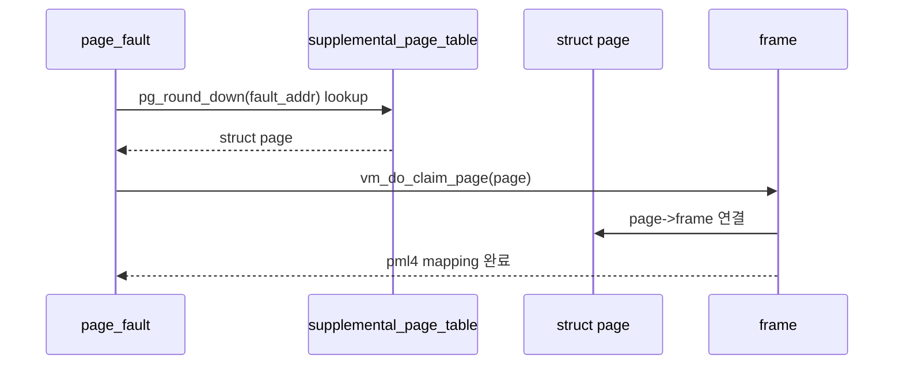

# 01 — Supplemental Page Table 전체 개념과 동작 흐름

이 문서는 Supplemental Page Table을 처음 볼 때 필요한 큰 그림을 잡기 위한 개요 문서입니다.

---

## 1) SPT를 한 문장으로 설명하면

**"프로세스별 가상 페이지가 어떤 타입이고, 어디서 내용을 가져와야 하며, 현재 프레임에 올라와 있는지를 설명하는 메타데이터 테이블"**입니다.

핵심은 SPT가 실제 매핑 테이블이 아니라, page fault를 복구하기 위한 설명서라는 점입니다.

---

## 2) 왜 필요한가

Project 2까지는 유저 페이지가 이미 pml4에 매핑되어 있다고 가정하는 경우가 많았습니다.  
Project 3에서는 lazy loading, stack growth, swap, mmap 때문에 "아직 매핑되지 않았지만 합법적인 페이지"가 생깁니다.

SPT는 이 문제를 해결하기 위해:
- fault address가 합법적인 페이지인지 판정하고
- page type별 initializer와 backing store 정보를 보관하고
- process exit/fork에서 주소 공간 단위 cleanup/copy를 가능하게 합니다.

---

## 3) 동작 시퀀스

1. page fault가 fault address를 page align한다.
2. 현재 thread의 SPT에서 `struct page`를 찾는다.
3. page가 writable/access 조건을 만족하면 claim한다.
4. frame을 확보하고 page type별 load를 수행한다.
5. pml4에 실제 mapping을 만든다.

---

## 4) 반드시 분리해서 이해할 개념

- **SPT entry**: 가상 페이지의 정책과 backing store 정보
- **pml4 mapping**: 현재 실제 frame에 연결되어 있는지
- **struct page**: anonymous/file/uninit 등 타입별 page 객체
- **struct frame**: 실제 user pool 물리 메모리

SPT와 pml4를 섞으면 lazy page를 "없는 페이지"로 오판하거나 이미 mapping된 페이지를 중복 등록하게 됩니다.

---

## 5) 자주 틀리는 지점

- fault address를 align하지 않고 hash key로 사용
- page insert 성공/실패 반환값을 무시
- SPT destroy에서 page type별 destroy hook을 부르지 않음
- fork에서 SPT만 복사하고 실제 writable/initializer 정보를 잃어버림

---

## 6) 학습 순서

1. `02-feature-page-structure-and-hash-key.md`
2. `03-feature-spt-insert-find-remove.md`
3. `04-feature-spt-copy-and-destroy.md`

---

## 7) 구현 전 체크 질문

- 이 주소는 page-aligned upage인가?
- SPT에는 있는데 pml4에는 없는 상태를 설명할 수 있는가?
- page의 타입별 aux/backing 정보가 fault 시점까지 살아 있는가?
- process exit에서 모든 SPT entry가 한 번씩만 정리되는가?
