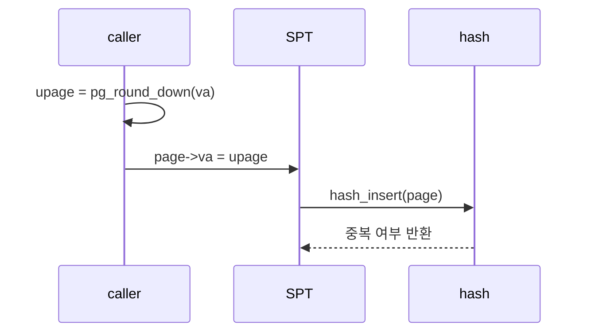
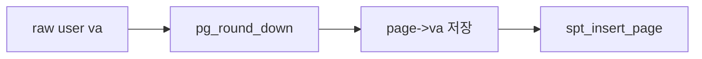
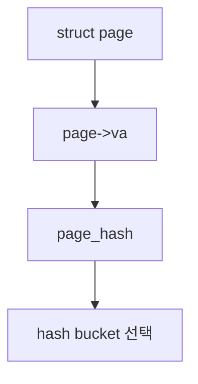
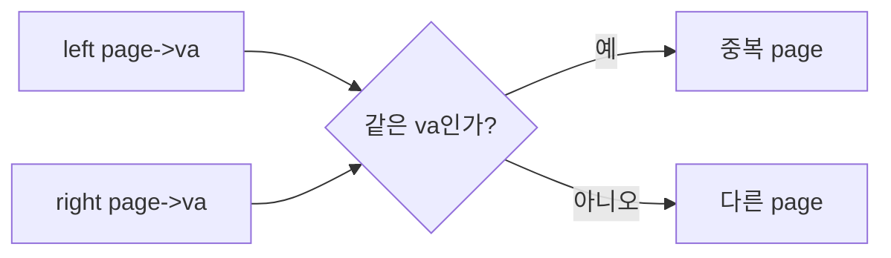

# 02 — 기능 1: Page Structure와 Hash Key

## 1. 구현 목적 및 필요성

### 이 기능이 무엇인가
`struct page`를 SPT에 넣기 위한 기준 주소와 hash/equal 규칙을 정하는 기능입니다.

### 왜 이걸 하는가
page fault는 byte 단위 주소로 들어오지만, VM은 page 단위로 관리됩니다. 같은 페이지 내부 주소들이 모두 같은 SPT entry를 찾아야 합니다.

### 무엇을 연결하는가
`struct page`, `struct supplemental_page_table`, Pintos hash table, `pg_round_down()`을 연결합니다.

### 완성의 의미
같은 page 안의 어떤 주소로 fault가 나도 동일한 SPT entry를 찾고, 다른 page는 구분합니다.

## 2. 가능한 구현 방식 비교

- 방식 A: `struct page.va`를 page-aligned upage로 저장
  - 장점: lookup/equal이 단순하고 안정적
  - 단점: insert 전에 항상 align 규칙을 지켜야 함
- 방식 B: 원본 주소를 저장하고 비교 때 align
  - 장점: 호출자가 조금 편함
  - 단점: 중복 page insert 버그가 숨어들기 쉬움
- 선택: 방식 A

## 3. 시퀀스와 단계별 흐름

1. caller가 page 단위 주소를 계산한다.
2. `page->va`에는 page-aligned 주소만 저장한다.
3. hash/equal 함수는 `page->va`만 기준으로 삼는다.

## 4. 기능별 가이드 (개념/흐름 + 구현 주석 위치)

### 4.1 기능 A: page 주소 기준 정규화
#### 개념 설명
SPT는 byte 주소가 아니라 page 단위 주소를 key로 사용합니다. 따라서 fault address, mmap address, stack growth address가 어디에서 오든 `page->va`에는 같은 page-aligned upage가 들어가야 합니다.

#### 시퀀스 및 흐름

1. page 생성 전에 user virtual address를 page boundary로 내린다.
2. 정규화한 주소만 `struct page.va`에 저장한다.
3. 이후 lookup, hash, equal은 모두 같은 정규화 기준을 전제로 동작한다.

#### 구현 주석 (보면 되는 함수/구조체)
- 위치: `vm/vm.c`의 `vm_alloc_page_with_initializer()`
- 위치: `vm/uninit.c`의 `uninit_new()`
- 위치: `include/vm/vm.h`의 `struct page`

### 4.2 기능 B: SPT hash key 고정
#### 개념 설명
hash table에서 어떤 값을 key로 삼을지 흔들리면 같은 page가 중복 등록되거나, fault가 났을 때 기존 page를 찾지 못합니다. SPT hash key는 오직 `page->va`여야 합니다.

#### 시퀀스 및 흐름

1. hash element에서 `struct page`를 꺼낸다.
2. `page->va`만 사용해 hash 값을 만든다.
3. frame 주소, file offset, page type은 hash key에 섞지 않는다.

#### 구현 주석 (보면 되는 함수/구조체)
- 위치: `vm/vm.c`의 SPT hash helper
- 위치: `lib/kernel/hash.c`의 hash table 호출 규약

### 4.3 기능 C: SPT equality 기준
#### 개념 설명
같은 process의 SPT 안에서는 같은 upage를 가리키는 entry가 둘 이상 존재하면 안 됩니다. page type이 다르더라도 `page->va`가 같으면 같은 page로 취급해야 합니다.

#### 시퀀스 및 흐름

1. 비교 함수는 양쪽 hash element에서 `struct page`를 꺼낸다.
2. ordering은 `page->va` 주소 순서만 사용한다.
3. equality는 `page->va` 동일성만 사용한다.

#### 구현 주석 (보면 되는 함수/구조체)
- 위치: `vm/vm.c`의 SPT comparison helper
- 위치: `vm/vm.c`의 `spt_insert_page()`, `spt_find_page()`

## 5. 구현 주석

### 5.1 Page address 저장 경로

#### 5.1.1 `vm_alloc_page_with_initializer()`에서 `page->va` 기준 주소 정규화
- 수정 위치: `vm/vm.c`의 `vm_alloc_page_with_initializer()`
- 역할: SPT key로 쓰이는 user virtual page address
- 규칙 1: 항상 page-aligned 주소를 저장한다.
- 규칙 2: kernel address를 SPT key로 넣지 않는다.
- 금지 1: fault address 원본을 그대로 저장하지 않는다.

구현 체크 순서:
1. page 생성 지점에서 `pg_round_down()`을 적용한다.
2. ASSERT로 page align 조건을 잡을 수 있는지 확인한다.
3. lookup helper도 같은 기준으로 주소를 정규화한다.

#### 5.1.2 `uninit_new()`에서 `struct page.va`에 정규화된 upage 저장
- 수정 위치: `vm/uninit.c`의 `uninit_new()`, `include/vm/vm.h`의 `struct page`
- 역할: lazy page가 fault 시점까지 같은 SPT key를 유지하게 한다.
- 규칙 1: caller가 넘긴 page-aligned upage를 `page->va`에 저장한다.
- 금지 1: `kva`나 fault 원본 주소를 `page->va`에 저장하지 않는다.

구현 체크 순서:
1. `uninit_new()` 호출자가 넘기는 `va`가 page-aligned인지 확인한다.
2. `struct page` 초기화에서 `.va = va`가 유지되는지 확인한다.
3. 이후 `spt_insert_page()`와 `spt_find_page()`가 같은 `page->va` 기준을 쓰는지 확인한다.

### 5.2 SPT hash/equal helper

#### 5.2.1 `page_hash()`에서 `page->va`를 hash key로 사용
- 수정 위치: `vm/vm.c`의 SPT hash helper
- 역할: `page->va`를 hash 값으로 변환한다.
- 규칙 1: 주소값 전체가 아니라 page-aligned va를 기준으로 한다.
- 금지 1: frame 주소나 file offset을 key에 섞지 않는다.

구현 체크 순서:
1. hash element에서 `struct page`를 꺼내는 코드를 작성한다.
2. `page->va`가 page-aligned 주소인지 전제로 hash 값을 만든다.
3. `spt_find_page()`에서 만드는 임시 key와 같은 기준인지 확인한다.

#### 5.2.2 `page_less()`에서 `page->va` 순서만 비교
- 수정 위치: `vm/vm.c`의 SPT comparison helper
- 역할: hash bucket 안에서 page entry 정렬/탐색 기준을 제공한다.
- 규칙 1: `page->va`의 주소 순서만 비교한다.
- 금지 1: page type이 다르다는 이유로 같은 va 중복 entry를 허용하지 않는다.

구현 체크 순서:
1. 두 hash element에서 각각 `struct page`를 꺼낸다.
2. `left->va < right->va` 형태로 비교 기준을 고정한다.
3. hash table insert/find가 같은 less helper를 쓰는지 확인한다.

#### 5.2.3 `page_equal()`에서 `page->va` 동일성만 비교
- 수정 위치: `vm/vm.c`의 SPT equality helper
- 역할: 두 page가 같은 upage인지 판단한다.
- 규칙 1: 같은 process의 SPT 안에서 `va`가 같으면 같은 page다.
- 금지 1: frame 주소, file offset, page type을 equality 기준에 섞지 않는다.

구현 체크 순서:
1. 두 `struct page`의 `va`를 꺼낸다.
2. `left->va == right->va`만 equality 조건으로 둔다.
3. 같은 va 중복 insert가 실패하는지 `spt_insert_page()`와 함께 확인한다.

## 6. 테스팅 방법

- lazy load가 첫 fault에서 SPT entry를 찾는지 확인
- boundary 접근에서 같은 page lookup이 되는지 확인
- 중복 mmap/stack page insert가 실패하는지 확인
