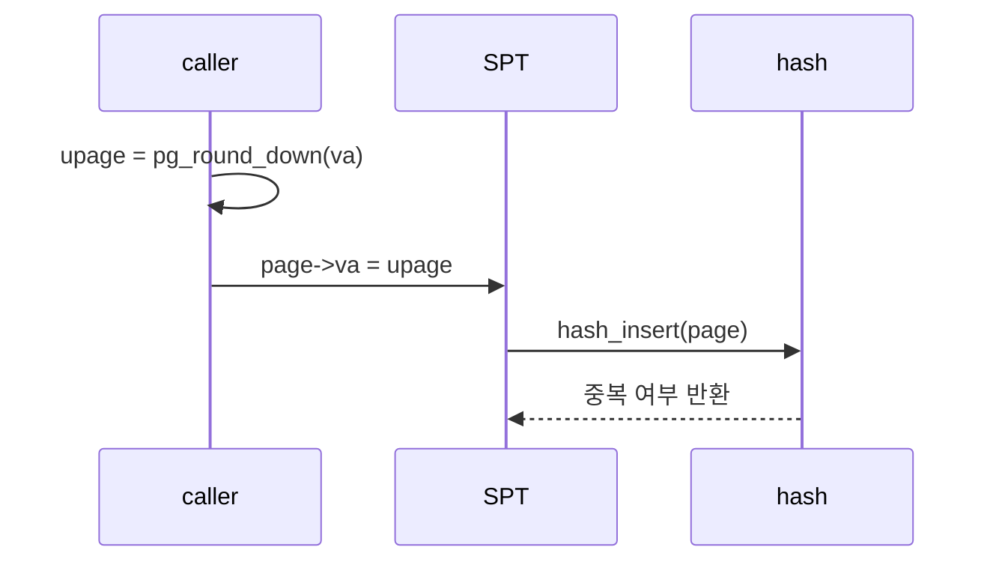

# 02 — 기능 1: Page Structure와 Hash Key

## 1. 구현 목적 및 필요성

### 이 기능이 무엇인가
`struct page`를 SPT에 넣기 위한 기준 주소와 hash/equal 규칙을 정하는 기능입니다.

### 왜 이걸 하는가
page fault는 byte 단위 주소로 들어오지만, VM은 page 단위로 관리됩니다. 같은 페이지 내부 주소들이 모두 같은 SPT entry를 찾아야 합니다.

### 무엇을 연결하는가
`struct page`, `struct supplemental_page_table`, Pintos hash table, `pg_round_down()`을 연결합니다.

### 완성의 의미
같은 page 안의 어떤 주소로 fault가 나도 동일한 SPT entry를 찾고, 다른 page는 구분합니다.

## 2. 가능한 구현 방식 비교

- 방식 A: `struct page.va`를 page-aligned upage로 저장
  - 장점: lookup/equal이 단순하고 안정적
  - 단점: insert 전에 항상 align 규칙을 지켜야 함
- 방식 B: 원본 주소를 저장하고 비교 때 align
  - 장점: 호출자가 조금 편함
  - 단점: 중복 page insert 버그가 숨어들기 쉬움
- 선택: 방식 A

## 3. 시퀀스와 단계별 흐름

1. caller가 page 단위 주소를 계산한다.
2. `page->va`에는 page-aligned 주소만 저장한다.
3. hash/equal 함수는 `page->va`만 기준으로 삼는다.

## 4. 기능별 가이드

### 4.1 `struct page`

#### 개념 설명
page는 가상 주소 공간의 한 페이지를 나타냅니다. 현재 frame에 올라와 있지 않아도 존재할 수 있습니다.

#### 구현 주석
- 위치: `include/vm/vm.h`
- 확인 대상: `struct page`, `struct supplemental_page_table`

### 4.2 Hash key

#### 개념 설명
SPT의 key는 프로세스 내부에서 유일한 page-aligned user virtual address입니다.

#### 구현 주석
- 위치: `vm/vm.c`
- 확인 대상: SPT hash/equal helper

## 5. 구현 주석

### 5.1 `struct page`의 주소 필드

#### 5.1.1 `struct page`의 `va`
- 위치: `include/vm/vm.h`
- 역할: SPT key로 쓰이는 user virtual page address
- 규칙 1: 항상 page-aligned 주소를 저장한다.
- 규칙 2: kernel address를 SPT key로 넣지 않는다.
- 금지 1: fault address 원본을 그대로 저장하지 않는다.

구현 체크 순서:
1. page 생성 지점에서 `pg_round_down()`을 적용한다.
2. ASSERT로 page align 조건을 잡을 수 있는지 확인한다.
3. lookup helper도 같은 기준으로 주소를 정규화한다.

### 5.2 SPT hash/equal

#### 5.2.1 hash 함수
- 위치: `vm/vm.c`
- 역할: `page->va`를 hash 값으로 변환한다.
- 규칙 1: 주소값 전체가 아니라 page-aligned va를 기준으로 한다.
- 금지 1: frame 주소나 file offset을 key에 섞지 않는다.

#### 5.2.2 less/equal 함수
- 위치: `vm/vm.c`
- 역할: 두 page가 같은 upage인지 비교한다.
- 규칙 1: 같은 process의 SPT 안에서 `va`가 같으면 같은 page다.
- 금지 1: page type이 다르다는 이유로 같은 va 중복 entry를 허용하지 않는다.

## 6. 테스팅 방법

- lazy load가 첫 fault에서 SPT entry를 찾는지 확인
- boundary 접근에서 같은 page lookup이 되는지 확인
- 중복 mmap/stack page insert가 실패하는지 확인
