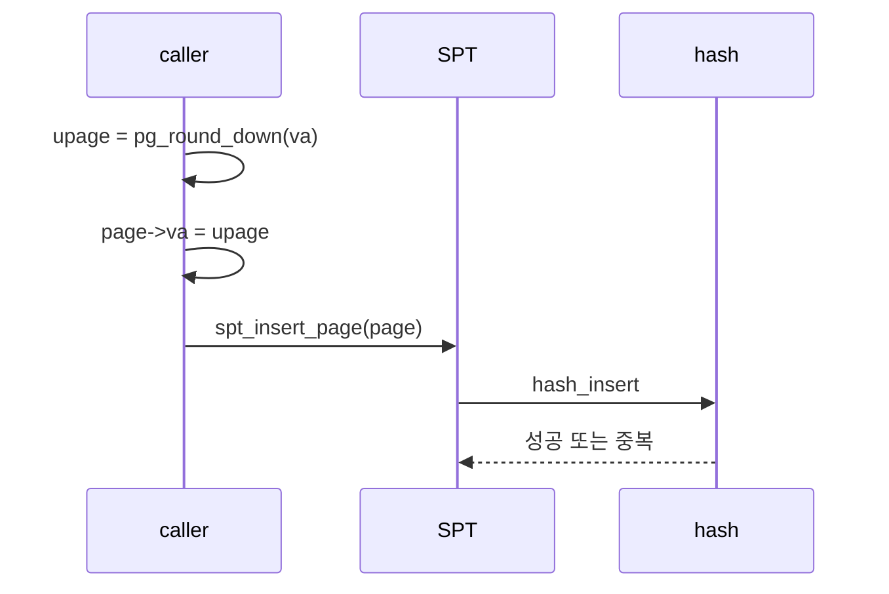
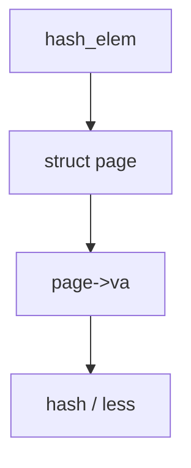
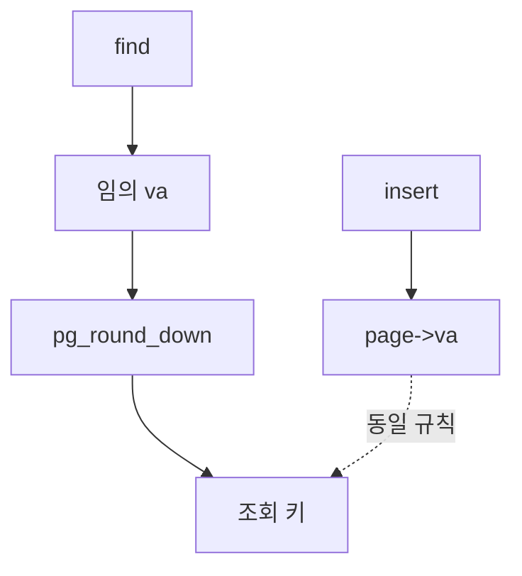

# 02 — 기능 1: Page Structure와 Hash Key

## 1. 구현 목적 및 필요성

### 이 기능이 무엇인가

`struct page`의 `va`를 SPT의 유일한 논리 키로 두고, hash 테이블 보조 함수가 오직 그 키만 사용하도록 고정하는 기능입니다.

### 왜 이걸 하는가 (문제 맥락)

fault 주소는 페이지 내부 바이트 단위로 들어옵니다. 정규화 규칙과 hash key가 흔들리면 같은 페이지를 못 찾거나 중복 등록되어 VM 테스트가 연쇄 실패합니다.

### 무엇을 연결하는가 (기술 맥락)

`pintos/vm/vm.c`, `pintos/vm/uninit.c`, `pintos/include/vm/vm.h`, `pintos/threads/vaddr.h`의 `pg_round_down`/`pg_ofs`/`is_user_vaddr`, `pintos/lib/kernel/hash.c` API를 연결합니다.

### 완성의 의미 (결과 관점)

`page->va`는 항상 page-aligned 사용자 VA이고, `spt_find_page`/`spt_insert_page`/hash helper는 모두 그 기준과 일치합니다. 같은 유저 페이지는 SPT에 한 번만 등록됩니다.

## 2. 가능한 구현 방식 비교

- 방식 A: `struct page.va`에 page-aligned upage만 저장하고 hash도 `va`만 사용
  - 장점: lookup/equal이 단순하고 중복 방지에 유리
  - 단점: 모든 호출 경로에서 align 규칙을 통일해야 함
- 방식 B: 원본 주소 저장 후 비교 시에만 align
  - 장점: 호출자 부담이 작아 보임
  - 단점: insert/find 불일치 버그가 잘 숨음
- 선택: A

## 3. 시퀀스와 단계별 흐름

1. page를 만들거나 찾기 전에 `va`를 `pg_round_down`으로 페이지 시작 주소로 맞춘다.
2. `uninit_new`까지 넘어가는 `va` 인자와 `page->va`에는 그 정규화 값만 둔다.
3. `page_hash`/`page_less`(및 검색 패턴)는 `page->va`만 본다.
4. 중복 삽입은 `hash_insert` 실패 등으로 거절하고 caller가 페이지 객체를 정리한다.

## 4. 기능별 가이드 (개념/흐름 + 구현 주석 위치)

### 4.1 기능 A: 주소 정규화와 `page->va`

#### 개념 설명

SPT entry는 페이지 하나당 하나입니다. 어떤 경로(load, mmap, stack growth, fault)에서 오든 동일 페이지는 동일한 `page->va`를 가져야 합니다.

#### 시퀀스 및 흐름

1. 사용자 VA가 들어오면 먼저 `pg_round_down`한다.
2. `ASSERT(pg_ofs(upage)==0)`로 align을 검증할 수 있다.
3. 커널 VA나 fault 원본(오프셋 포함)을 `page->va`로 넣지 않는다.

#### 구현 주석 (보면 되는 함수/구조체)

- 위치: `pintos/vm/vm.c`의 `vm_alloc_page_with_initializer()`
- 위치: `pintos/vm/uninit.c`의 `uninit_new()`
- 위치: `pintos/include/vm/vm.h`의 `struct page`

### 4.2 기능 B: hash key를 `va`로 고정

#### 개념 설명

hash 값과 순서 비교에 frame 주소나 파일 정보를 넣으면 같은 페이지가 다른 bucket으로 갈거나 중복 허용이 깨집니다.

#### 시퀀스 및 흐름

1. `hash_elem`에서 `hash_entry`로 `struct page`를 복구한다.
2. `page_hash`는 `page->va`만으로 unsigned 해시를 만든다.
3. `page_less`는 `va` 주소 순만 비교한다.

#### 구현 주석 (보면 되는 함수/구조체)

- 위치: `pintos/vm/vm.c`의 `page_hash`, `page_less`(이름은 팀 convention)
- 위치: `pintos/lib/kernel/hash.c`의 `hash_init`/`hash_insert`/`hash_find` 규약

### 4.3 기능 C: insert / find 계약

#### 개념 설명

삽입과 조회는 같은 키 공간을 써야 합니다. find 쪽은 fault 시 raw 주소가 들어올 수 있으므로 내부에서 align하거나 모든 호출부가 align된 키만 넘기도록 통일합니다.

#### 시퀀스 및 흐름

1. insert 전 `page->va`가 page-aligned인지 본다.
2. find는 `pg_round_down(va)` 후 조회한다(또는 호출 규약을 문서화한다).
3. 중복 삽입은 실패 처리한다.

#### 구현 주석 (보면 되는 함수/구조체)

- 위치: `pintos/vm/vm.c`의 `spt_insert_page()`, `spt_find_page()`
- 위치: `pintos/include/vm/vm.h`의 `struct supplemental_page_table`

## 5. 구현 주석 (위치별 정리)

### 5.1 `struct supplemental_page_table`

- 위치: `pintos/include/vm/vm.h`
- 역할: 프로세스(thread)별 SPT의 **컨테이너**로, `hash_init` 대상이 되는 `struct hash` 등 삽입/조회 상태를 담는다.
- 규칙 1: `struct thread`의 `spt` 멤버와 1:1로 쓰인다는 전제에 맞게 필드를 둔다.
- 규칙 2: 이 구조체는 **전역이 아니라** 스레드/프로세스마다 따로 존재해야 한다.
- 금지 1: 모든 프로세스가 같은 SPT 상태를 공유하는 전역 테이블로 구현하지 않는다.

구현 체크 순서:

1. `struct hash`(및 필요 시 보조 필드) 이름과 배치를 정한다.
2. `supplemental_page_table_kill` 등과 짝으로 해제·정리 경로를 맞춘다(`03-feature-spt-insert-find-remove.md`).

### 5.2 `struct page`의 hash 연동 필드

- 위치: `pintos/include/vm/vm.h`
- 역할: 각 page를 hash 테이블 **노드**로 연결한다. `hash_insert`/`hash_find`에 넘기는 `struct hash_elem`을 담는다.
- 규칙 1: `hash_entry(…, struct page, <멤버명>)`로 `struct page `*를 복구할 수 있게 멤버를 둔다.
- 규칙 2: 멤버 이름은 `page_hash`/`page_less`에서 쓰는 `hash_entry`와 일치해야 한다.
- 금지 1: `hash_elem` 없이 `struct page *`만으로 `lib/kernel/hash` API를 쓰려 하지 않는다(스타터 패턴과 맞지 않음).

구현 체크 순서:

1. `struct hash_elem` 멤버를 추가하고 스타터가 금지한 기존 멤버는 건드리지 않는다.
2. `offsetof`/`hash_entry`가 컴파일되는지 확인한다.
3. `5.1`의 `struct hash`와 짝이 맞는지 본다.

### 5.3 `supplemental_page_table_init()`

- 위치: `pintos/vm/vm.c`
- 역할: 스레드(프로세스) 시작 시 해당 `spt`의 hash를 `hash_init`으로 초기화한다.
- 규칙 1: `hash_init(&spt->hash, page_hash, page_less, aux)` 패턴으로 보조 함수 포인터를 넘긴다.
- 규칙 2: 한 스레드에서 중복 초기화·reuse 없이 깨끗한 상태로 시작한다.
- 금지 1: `page_hash`/`page_less` 포인터를 insert와 다른 값으로 교체한다.

구현 체크 순서:

1. `hash_init` 호출 위치를 `thread` 생성/`process` 초기화 경로와 맞춘다.
2. `supplemental_page_table_kill` 등과 짝을 맞춘다(`03-feature-spt-insert-find-remove.md`).

### 5.4 `vm_alloc_page_with_initializer()`

- 위치: `pintos/vm/vm.c`
- 역할: lazy `struct page`를 할당·초기화하고 SPT에 넣어 중복 없이 등록한다.
- 규칙 1: SPT key는 항상 page-aligned user VA여야 한다.
- 규칙 2: 같은 `va`는 한 번만 등록되고, 중복 등록은 실패해야 한다.
- 규칙 3: 타입별 initializer 선택 결과는 `uninit_new`까지 일관되게 전달되어야 한다.
- 규칙 4: 실패 경로에서 page 할당 누수가 없어야 한다.
- 금지 1: 정규화 전 주소로 `spt_find_page`를 호출한다.
- 금지 2: fault 시점 raw 주소를 `uninit_new`의 `va`로 넘긴다.

구현 체크 순서:

1. 입력 `upage`를 user VA 정책으로 검증하고 `pg_round_down`으로 정규화한다.
2. 정규화된 `upage`로 `spt_find_page`를 호출해 중복이면 즉시 `false`를 반환한다.
3. `malloc`으로 `struct page`를 할당하고, `type`에 맞는 `page_initializer`를 고른다.
4. `uninit_new(page, upage, init, type, aux, initializer)`로 page metadata를 채운다.
5. `spt_insert_page` 성공 시 `true`, 실패 시 `free(page)` 후 `false`를 반환한다.
6. `vm_alloc_page` 매크로 호출 경로(`init/aux=NULL`)에서도 동일 동작인지 확인한다.

### 5.5 `uninit_new()`

- 위치: `pintos/vm/uninit.c`
- 역할: UNINIT `struct page`를 스타터가 정의한 전체 필드로 채우고 `.va`에 caller가 준 페이지 시작 VA를 넣는다.
- 규칙 1: `page->va`는 caller가 전달한 정규화된 upage와 동일해야 한다.
- 규칙 2: UNINIT 상태에서 필요한 초기화 필드(operations, frame, uninit.*)는 누락 없이 유지되어야 한다.
- 규칙 3: `va`는 page-aligned 사용자 VA여야 한다.

- 금지 1: `va`에 `kva`(프레임 커널 주소)를 넣는다.

구현 체크 순서:

1. 함수 시작에서 `page` 유효성을 확인한다(`ASSERT(page != NULL)`).
2. 스타터가 요구한 초기화 블록(operations, frame, uninit.init/type/aux/page_initializer)을 그대로 채운다.
3. 동일 블록에서 `.va = va`를 기록한다.
4. 필요 시 `pg_ofs(va)==0` assert를 추가해 호출 계약을 확인한다.
5. caller(`vm_alloc_page_with_initializer`)의 전달 값이 정규화된 upage인지 교차 확인한다.

### 5.6 `page_hash()` (보통 `vm.c` 내 `static`)

- 위치: `pintos/vm/vm.c`
- 역할: `hash_elem`에서 `struct page`를 얻어 해시 버킷을 고른다.
- 규칙 1: hash key는 오직 `page->va`만 사용한다.
- 규칙 2: 같은 `va`는 항상 같은 hash 입력으로 처리되어야 한다.
- 금지 1: `frame`, file offset, `VM_ANON|VM_FILE` 비트를 해시에 섞는다.

구현 체크 순서:

1. `hash_entry`로 `hash_elem -> struct page` 역참조가 맞는지 확인한다.
2. 반환값 계산에 `page->va`만 사용하도록 구현한다.
3. `hash_init`에서 insert/find가 같은 hash 함수 포인터를 쓰는지 확인한다.

### 5.7 `page_less()` (보통 `vm.c` 내 `static`)

- 위치: `pintos/vm/vm.c`
- 역할: 같은 bucket 내 순서 관계를 `page->va` 주소 순으로 제공한다.
- 규칙 1: 비교 기준은 `page->va`의 주소 순서 하나로 고정되어야 한다.
- 규칙 2: 같은 `va` 쌍은 less 양쪽이 false가 되도록 일관돼야 한다.
- 금지 1: page type 때문에 같은 `va`를 다른 entry처럼 취급한다.

구현 체크 순서:

1. 두 `hash_elem`에서 `struct page`를 복구한다.
2. `pa->va < pb->va` 형태로 반환식을 구현한다.
3. `hash_init`에서 insert/find가 같은 less 함수를 쓰는지 확인한다.
4. 같은 `va` 중복 삽입이 거절되는지 테스트로 확인한다.

### 5.8 `spt_insert_page()`

- 위치: `pintos/vm/vm.c`
- 역할: 주어진 `page`를 현재 프로세스 SPT hash에 등록한다.
- 규칙 1: 삽입 대상 key(`page->va`)는 page-aligned여야 한다.
- 규칙 2: 같은 key가 이미 있으면 삽입은 실패해야 한다.
- 규칙 3: 반환값만으로 caller가 성공/실패를 판별할 수 있어야 한다.
- 금지 1: 기존 동일 키 entry를 묵인하고 덮어쓴다.

구현 체크 순서:

1. 함수 진입에서 `page`/`page->va` 유효성을 검사한다.
2. `hash_insert`를 호출해 중복 여부를 결과로 받는다.
3. 중복이면 `false`, 삽입 성공이면 `true`를 반환한다.
4. 실패 반환 시 caller가 rollback/free 하도록 계약을 맞춘다(`5.4`).

### 5.9 `spt_find_page()`

- 위치: `pintos/vm/vm.c`
- 역할: 임의 사용자 `va`(fault 주소 포함)로 해당 `struct page`를 찾는다.
- 규칙 1: 입력 주소는 조회 전에 page key로 정규화되어야 한다.
- 규칙 2: 조회 기준은 insert와 동일한 `page->va` 규약이어야 한다.
- 규칙 3: 미존재는 `NULL`로 명확히 표현되어야 한다.
- 금지 1: 정규화 없이 raw 주소로 bucket만 추정한다.

구현 체크 순서:

1. 입력 `va`를 `pg_round_down`으로 정규화한다.
2. 정규화한 key를 담은 임시 page/hash_elem를 만든다.
3. `hash_find`로 조회하고 있으면 `struct page `*, 없으면 `NULL`을 반환한다.
4. `vm_alloc`/fault 경로가 동일 key 규약을 쓰는지 교차 검증한다.

## 6. 테스팅 방법

- 페이지 경계에서 서로 다른 오프셋으로 접근했을 때 동일 SPT 항목이 조회되는지 확인한다.
- 동일(upage 후보) 재등록이 `hash_insert` 실패·`false`로 막히는지 확인한다.
- `vm/pt-grow-stk-sc` 등 스택 페이지가 lazy 등록되는 경로와 연계해 조회된다면 통합 테스트로 본다(스택별 노트 참고).

