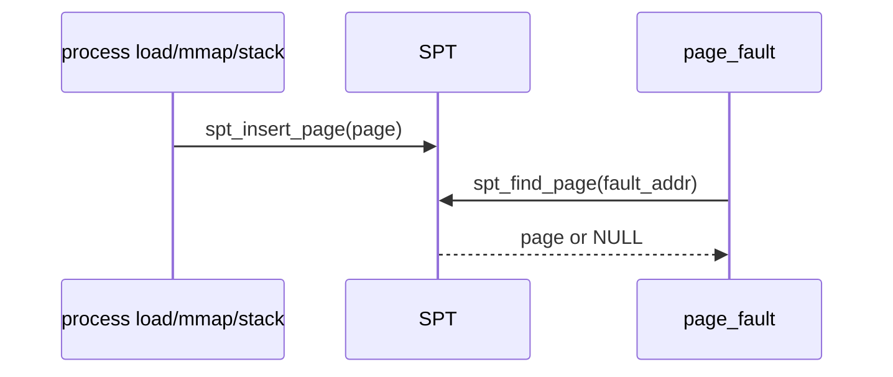
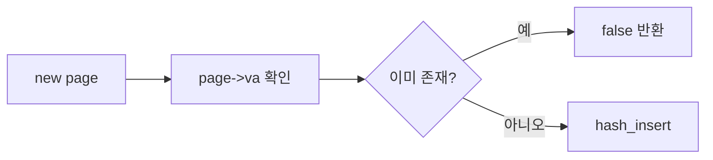
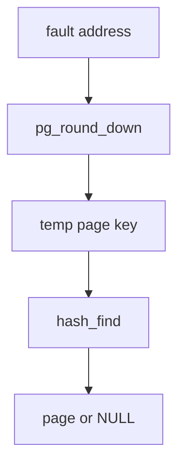
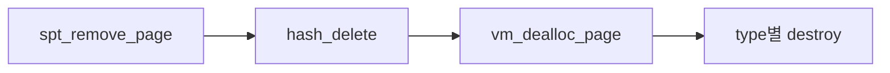

# 03 — 기능 2: SPT Insert/Find/Remove

## 1. 구현 목적 및 필요성
### 이 기능이 무엇인가
SPT에 page를 등록하고, fault address로 page를 찾고, cleanup 시 제거하는 기본 조작입니다.
### 왜 이걸 하는가 (문제 맥락)
VM의 모든 기능은 “이 주소가 어떤 page인가”를 찾는 데서 시작합니다. insert/find/remove 경계가 흔들리면 fault 복구·중복 등록·누수가 동시에 터집니다.
### 무엇을 연결하는가 (기술 맥락)
`pintos/vm/vm.c`의 `vm_alloc_page_with_initializer()`, `spt_find_page()`, `spt_insert_page()`, `spt_remove_page()`, `vm_dealloc_page()`, `vm_try_handle_fault()`와 `threads/vaddr.h`의 `pg_round_down()`을 연결합니다.

### 이 문서(03) 단계 vs 뒤 단계 (구현 순서)
- **03에서 끝내야 할 것**: SPT **insert / find / remove**와 `pg_round_down` 기준 조회, 중복 방지, 제거 시 `vm_dealloc_page`까지의 수명 규칙. 시퀀스상 **fault가 `spt_find_page`로 page를 찾는다**는 **맥락**은 여기서 고정한다.
- **`vm_try_handle_fault`**: 위 맥락에서 **폴트 진입점 이름**으로만 같이 적어 둔다. **폴트 종류 판별·`vm_claim_page` 위임 등 본문 로직**은 이 시점에 필수가 아니며, **`06-feature-frame-allocation-and-claim.md`의 `vm_claim_page()` / `vm_do_claim_page()`** 가 갖춰진 뒤 한꺼번에 연결하는 것이 자연스럽다.
- **검증·상세 시나리오**: `2. testing/01-spt-basic-and-page-fault.md`를 본다.

### 완성의 의미 (결과 관점)
합법적인 lazy page는 fault에서 발견되고, 이미 사용 중인 주소는 중복 등록되지 않으며, remove는 hash 제거 후 destroy hook까지 한 번만 탄다.

## 2. 가능한 구현 방식 비교
- 방식 A: SPT helper 내부에서 주소 align
  - 장점: caller 실수를 줄임
  - 단점: page 생성 시 align 규칙도 함께 관리해야 함
- 방식 B: caller가 항상 align
  - 장점: helper 단순
  - 단점: 호출 지점이 늘면 실수 위험
- 선택: helper에서도 align하고, page 생성 지점에서도 align을 보장한다.

## 3. 시퀀스와 단계별 흐름

1. load/mmap/stack growth가 page metadata를 만든다.
2. SPT insert가 중복 va를 검사한다.
3. fault path가 page-aligned 주소로 find한다.
4. 실패하면 stack growth 또는 kill 판단으로 넘어간다.

## 4. 기능별 가이드 (개념/흐름 + 구현 주석 위치)
### 4.1 기능 A: SPT page 등록
#### 개념 설명
SPT insert는 새 page metadata를 현재 process 주소 공간에 등록하는 단계입니다. 같은 upage가 이미 있으면 기존 page를 덮어쓰지 말고 실패해야 이후 fault 처리와 cleanup 경로가 예측 가능합니다.
#### 시퀀스 및 흐름

1. `page->va`가 page-aligned 상태인지 확인한다.
2. hash table에 같은 key가 있는지 insert 결과로 판단한다.
3. 실패하면 caller가 page와 aux를 정리할 수 있도록 false를 반환한다.
#### 구현 주석 (보면 되는 함수/구조체)
- 위치: `pintos/vm/vm.c`의 `spt_insert_page()`
- 위치: `pintos/include/vm/vm.h`의 `struct supplemental_page_table`

### 4.2 기능 B: fault address 기반 조회
#### 개념 설명
page fault는 page 내부의 임의 byte 주소에서 발생할 수 있습니다. SPT lookup은 이 주소를 page boundary로 내린 뒤 같은 page entry를 찾아야 합니다.
#### 시퀀스 및 흐름

1. 조회 대상 주소를 `pg_round_down()`으로 정규화한다.
2. hash table이 이해할 수 있는 임시 key를 만든다.
3. entry가 없으면 NULL을 반환해 stack growth 또는 kill 판단으로 넘긴다.
#### 구현 주석 (보면 되는 함수/구조체)
- 위치: `pintos/vm/vm.c`의 `spt_find_page()`
- 위치: `pintos/threads/vaddr.h`의 `pg_round_down()`
- 연계: 페이지 폴트 처리 시 같은 조회 규약으로 `vm_try_handle_fault()`가 `spt_find_page` 또는 `vm_claim_page`까지 이어진다. **폴트 본문 구현 목록은 `06-feature-frame-allocation-and-claim.md` §4.4·§5.4** 를 본다.

### 4.3 기능 C: page 제거와 destroy 경계
#### 개념 설명
SPT remove는 hash entry 제거와 page 자원 해제를 연결하는 경계입니다. page type별 cleanup은 destroy hook에서 처리하고, remove는 같은 page가 두 번 정리되지 않도록 호출 순서를 명확히 해야 합니다.
#### 시퀀스 및 흐름

1. 제거 대상 page가 실제 SPT에 들어 있는지 확인한다.
2. hash entry를 제거한 뒤 page destroy 경로를 호출한다.
3. munmap, process exit, fork 실패 cleanup이 같은 page를 중복 제거하지 않게 한다.
#### 구현 주석 (보면 되는 함수/구조체)
- 위치: `pintos/vm/vm.c`의 `spt_remove_page()`, `vm_dealloc_page()`

## 5. 구현 주석 (위치별 정리)
### 5.1 `spt_insert_page()`
- 위치: `pintos/vm/vm.c`의 `spt_insert_page()`
- 역할: 현재 process SPT에 새 page를 등록한다.
- 규칙 1: `page->va`가 이미 있으면 실패한다.
- 규칙 2: 성공/실패를 caller가 확인할 수 있게 bool로 반환한다.
- 금지 1: 중복 entry를 덮어쓰지 않는다.

구현 체크 순서:
1. 함수 진입에서 `page`와 `page->va` 유효성을 검사한다.
2. `hash_insert`를 호출해 중복 키 여부를 받는다.
3. 중복이면 `false`, 성공이면 `true`를 반환한다.
4. 실패 반환 시 caller가 page/aux를 정리하도록 계약을 맞춘다(`02-feature-page-structure-and-hash-key.md`의 `vm_alloc_page_with_initializer`와 짝).

### 5.2 `spt_find_page()`
- 위치: `pintos/vm/vm.c`의 `spt_find_page()`
- 역할: 임의의 user va를 SPT key로 정규화해 page를 찾는다.
- 규칙 1: 조회 key는 항상 page 단위로 정규화되어야 한다.
- 규칙 2: 없으면 NULL을 반환한다.
- 금지 1: NULL 반환을 곧바로 kernel panic으로 처리하지 않는다(stack growth 등 caller 분기).

구현 체크 순서:
1. 입력 `va`를 `pg_round_down`으로 정규화한다.
2. 정규화한 key로 임시 page/hash_elem를 만들어 `hash_find`를 호출한다.
3. 찾으면 `struct page *`, 없으면 `NULL`을 반환한다.
4. caller가 `NULL`을 stack growth 또는 kill 분기로 사용하도록 계약을 맞춘다.

### 5.3 `spt_remove_page()`
- 위치: `pintos/vm/vm.c`의 `spt_remove_page()`
- 역할: SPT에서 page entry를 빼고 `vm_dealloc_page()`로 이어 진다.
- 규칙 1: `hash_delete` 등으로 노드 제거 후 `destroy` 호출 순서가 중복 없이 고정된다.
- 금지 1: hash만 지우고 `free(page)`까지 하지 않는 경로와 이중 호출 경로가 공존하지 않도록 한다.

구현 체크 순서:
1. 제거 대상 page의 hash 노드를 `hash_delete`로 먼저 제거한다.
2. 제거된 page를 `vm_dealloc_page()`로 넘겨 destroy/free를 수행한다.
3. munmap/process_exit 경로에서 같은 page를 중복 제거하지 않게 호출 책임을 맞춘다.

### 5.4 `vm_try_handle_fault()` (03 DoD 바깥, 위치만)
- 위치: `pintos/vm/vm.c`의 `vm_try_handle_fault()`
- 역할 요약: fault 시 SPT/find·claim과 맞물리는 진입점(§1 「뒤 단계」 참고).
- 완결 문서: `06-feature-frame-allocation-and-claim.md` **§4.4 기능 D**, **§5.4**.

## 6. 테스팅 방법
- lazy load 관련 단일 테스트
- mmap overlap 테스트
- stack growth가 SPT에 새 page를 넣는 경로
