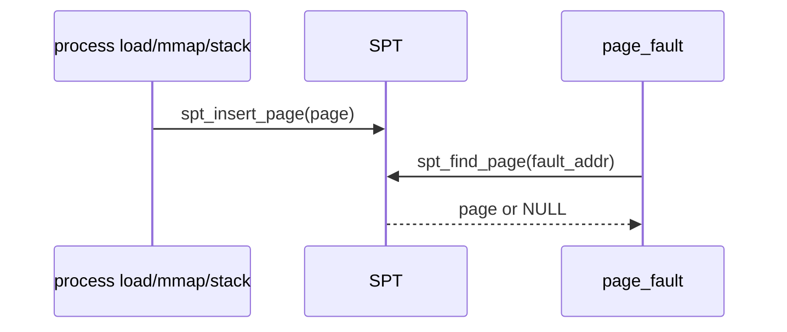

# 03 — 기능 2: SPT Insert/Find/Remove

## 1. 구현 목적 및 필요성

### 이 기능이 무엇인가
SPT에 page를 등록하고, fault address로 page를 찾고, cleanup 시 제거하는 기본 조작입니다.

### 왜 이걸 하는가
VM의 모든 기능은 "이 주소가 어떤 page인가"를 찾는 데서 시작합니다.

### 무엇을 연결하는가
`vm_alloc_page_with_initializer()`, `spt_find_page()`, `spt_insert_page()`, `vm_try_handle_fault()`를 연결합니다.

### 완성의 의미
합법적인 lazy page는 fault에서 발견되고, 이미 사용 중인 주소는 중복 등록되지 않습니다.

## 2. 가능한 구현 방식 비교

- 방식 A: SPT helper 내부에서 주소 align
  - 장점: caller 실수를 줄임
  - 단점: page 생성 시 align 규칙도 함께 관리해야 함
- 방식 B: caller가 항상 align
  - 장점: helper 단순
  - 단점: 호출 지점이 늘면 실수 위험
- 선택: helper에서도 align하고, page 생성 지점에서도 align을 보장한다.

## 3. 시퀀스와 단계별 흐름

1. load/mmap/stack growth가 page metadata를 만든다.
2. SPT insert가 중복 va를 검사한다.
3. fault path가 page-aligned 주소로 find한다.
4. 실패하면 stack growth 또는 kill 판단으로 넘어간다.

## 4. 기능별 가이드

### 4.1 Insert
- 위치: `vm/vm.c`
- 중복 entry가 있으면 실패해야 합니다.

### 4.2 Find
- 위치: `vm/vm.c`
- fault address를 page align한 뒤 lookup해야 합니다.

### 4.3 Remove
- 위치: `vm/vm.c`
- 일반적으로 destroy 경로와 함께 쓰며, page type별 cleanup과 순서를 섞지 않습니다.

## 5. 구현 주석

### 5.1 `spt_insert_page()`

#### 5.1.1 page 등록
- 위치: `vm/vm.c`
- 역할: 현재 process SPT에 새 page를 등록한다.
- 규칙 1: `page->va`가 이미 있으면 실패한다.
- 규칙 2: 성공/실패를 caller가 확인할 수 있게 bool로 반환한다.
- 금지 1: 중복 entry를 덮어쓰지 않는다.

구현 체크 순서:
1. `page->va` align 상태를 확인한다.
2. hash insert의 이전 element 반환을 확인한다.
3. insert 실패 시 page/aux 정리 책임을 caller와 맞춘다.

### 5.2 `spt_find_page()`

#### 5.2.1 fault address 조회
- 위치: `vm/vm.c`
- 역할: 임의의 user va를 SPT key로 정규화해 page를 찾는다.
- 규칙 1: `pg_round_down(va)`로 key를 만든다.
- 규칙 2: 없으면 NULL을 반환한다.
- 금지 1: NULL 반환을 곧바로 kernel panic으로 처리하지 않는다.

구현 체크 순서:
1. stack 위/아래 주소로 lookup해 page align 동작을 확인한다.
2. SPT에 없는 주소에서 NULL이 나오는지 확인한다.
3. caller가 NULL을 stack growth 또는 kill로 분기하는지 확인한다.

## 6. 테스팅 방법

- lazy load 관련 단일 테스트
- mmap overlap 테스트
- stack growth가 SPT에 새 page를 넣는 경로
