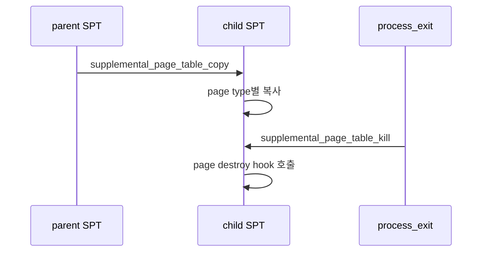
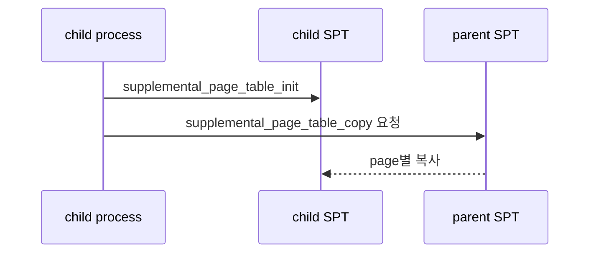
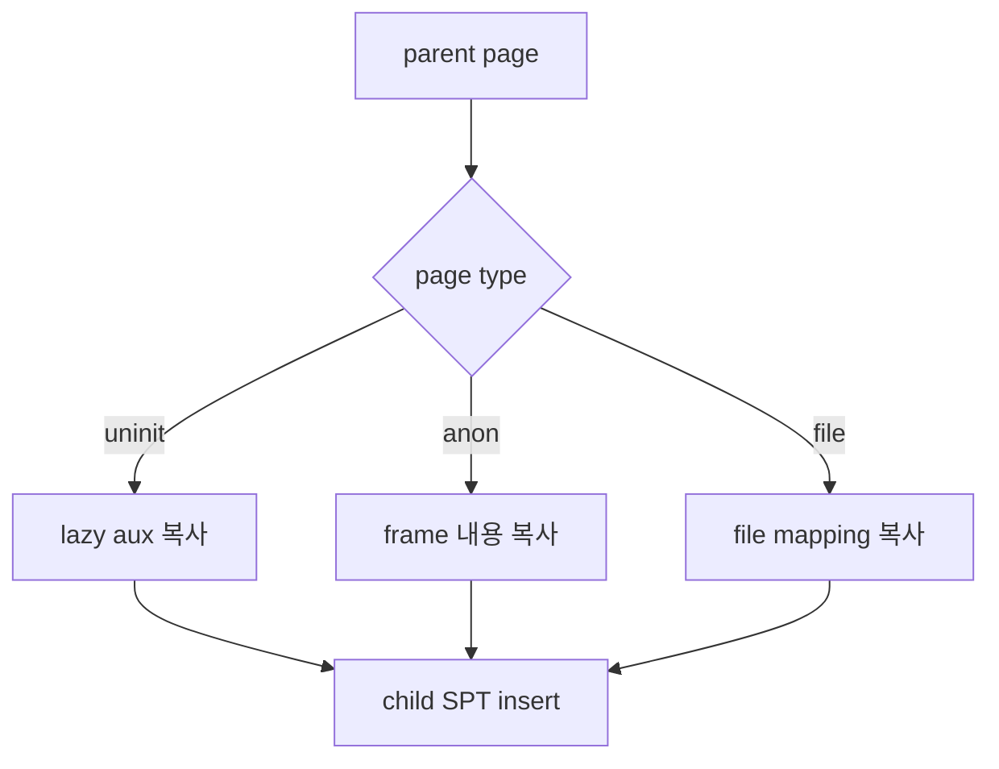

# 04 — 기능 3: SPT Copy and Destroy

## 1. 구현 목적 및 필요성
### 이 기능이 무엇인가
fork 시 부모 주소 공간의 SPT를 자식에게 복사하고, process exit 시 SPT의 모든 page를 정리하는 기능입니다.
### 왜 이걸 하는가 (문제 맥락)
VM에서는 주소 공간 정보가 pml4뿐 아니라 SPT에도 들어 있습니다. fork/exit에서 SPT를 빼먹으면 page fault 복구와 자원 정리가 모두 깨집니다.
### 무엇을 연결하는가 (기술 맥락)
`pintos/vm/vm.c`의 `supplemental_page_table_copy()`, `supplemental_page_table_kill()`, `supplemental_page_table_init()`, `pintos/userprog/process.c`의 `process_fork()`/`process_exit()`, page type별 initializer/destroy hook을 연결합니다.
### 완성의 의미 (결과 관점)
최종적으로는 자식이 부모와 같은 유저 메모리를 관측하고 fork/exit가 VM 메타데이터와 자원까지 일관되게 동작해야 합니다. 그중 **이 문서(04)가 담당하는 전제**는 SPT copy/kill 파이프라인과 타입별 page 수명입니다. **실제 같은 물리/가상 매핑(loaded 페이지 내용까지 동일 관측)** 은 **`06-feature-frame-allocation-and-claim.md`(frame·`vm_do_claim_page`·`pml4_set_page`)가 핵심**이고, **`05-feature-overview-frame-table.md`는 프레임/eviction 개요**, 자식 주소 공간 PTE는 **`process_fork` 등 `userprog/process.c` 경로**까지 포함한 이후 목표입니다(아래 「04 범위 vs 다음 단계」).

### 이 문서(04) 범위 vs 다음 단계 (중요)

- **04에서 우선 완료할 것**: `supplemental_page_table_init/copy/kill`, 부모 SPT 순회·타입별 새 `struct page` 생성(UNINIT/metadata 복사 포함)·복사 실패 롤백·`kill` 경로에서 type별 destroy hook까지 **SPT/해시/수명**이 일관되게 동작하게 만드는 것.
- **04 직후(다음 문서·코드 레이어)에서 할 것**: 이미 로드된(loaded) 페이지에 대해 **물리 프레임을 공유(COW)·복사하여 자식 사용자 주소 공간에서도 같은 내용이 관측**되도록 하려면, **`pml4`/PTE, 프레임 테이블, `vm_do_claim_page`, page fault 처리, fork 시 자식 페이지 테이블 구성**이 필요합니다. 문서·코드 기준으로는 **`06-feature-frame-allocation-and-claim.md`**에서 claim·`pml4_set_page`까지를 집중적으로 보고, **`05-feature-overview-frame-table.md`**는 같은 주제의 **개요(프레임 테이블·eviction 큰 그림)** 로 앞에 두면 된다. fork 직후 자식 주소 공간에 PTE가 어떻게 깔리는지는 **`pintos/userprog/process.c`의 `process_fork()`·주소 공간 복제**와 맞춘다.
- 따라서 **`anon.c`/`file.c`의 fork용 duplicate 헬퍼** 등에서 **`frame`/PTE를 비워 두거나 TODO로 두는 것**은 04 단계 목표와 **모순되지 않으며**, “규칙 2(loaded 내용 동일)”의 **메모리·매핑 쪽 채우기는 명시적으로 다음 단계 과제**로 둔다.

## 2. 가능한 구현 방식 비교
- 방식 A: fork에서 모든 page를 즉시 claim/copy
  - 장점: 구현이 직관적
  - 단점: 메모리 사용량이 큼
- 방식 B: uninit/lazy 정보는 lazy 상태로 복사
  - 장점: lazy loading 의도를 유지
  - 단점: aux 복사 수명 관리가 어려움
- 선택: 기본 구현은 타입별로 명확히 복사하고, COW는 extra에서 분리한다.

## 3. 시퀀스와 단계별 흐름

1. fork에서 자식 SPT를 초기화한다.
2. 부모 SPT를 순회하며 page별 복사 정책을 적용한다.
3. exit에서 SPT를 순회하며 page type별 cleanup을 수행한다.

## 4. 기능별 가이드 (개념/흐름 + 구현 주석 위치)
### 4.1 기능 A: fork 전 자식 SPT 초기화
#### 개념 설명
fork에서 자식 주소 공간을 만들 때 pml4만 복사해서는 VM metadata가 따라오지 않습니다. 자식 SPT를 먼저 초기화한 뒤 부모 SPT의 page들을 같은 주소 기준으로 재구성해야 합니다.
#### 시퀀스 및 흐름

1. `process_fork()`에서 자식 SPT가 빈 hash table로 초기화되는지 확인한다.
2. 부모 SPT 순회 전에 자식 pml4와 SPT 상태가 준비되어 있어야 한다.
3. copy 실패 시 자식에 이미 들어간 page를 정리할 수 있어야 한다.
#### 구현 주석 (보면 되는 함수/구조체)
- 위치: `pintos/userprog/process.c`의 `process_fork()` 경로
- 위치: `pintos/vm/vm.c`의 `supplemental_page_table_init()`

### 4.2 기능 B: page type별 SPT 복사
#### 개념 설명
SPT copy는 단순 포인터 복사가 아닙니다. uninit page는 lazy 정보를, anonymous page는 메모리 내용을, file-backed page는 file mapping 정보를 각각의 정책에 맞게 새 page로 만들어야 합니다.
#### 시퀀스 및 흐름

1. 부모 SPT의 hash entry를 순회한다.
2. page type에 따라 새 page를 생성하고 필요한 metadata를 복사한다.
3. loaded page가 **실제 사용자 주소 공간에서** 자식에게도 동일 내용으로 보이게 하려면 **06(claim·PTE)**·**`process_fork`/주소 공간**·page fault까지 연결해야 한다(05는 프레임/eviction 개요). 04에서는 SPT/metadata 쪽까지를 기본 범위로 둔다.
#### 구현 주석 (보면 되는 함수/구조체)
- 위치: `pintos/vm/vm.c`의 `supplemental_page_table_copy()`
- 위치: `pintos/vm/uninit.c`, `pintos/vm/anon.c`, `pintos/vm/file.c`의 type별 initializer

### 4.3 기능 C: SPT destroy와 page 자원 해제
#### 개념 설명
process exit에서는 SPT에 남은 모든 page를 정리해야 합니다. hash element만 삭제하면 frame, swap slot, file mapping이 남을 수 있으므로 반드시 page type별 destroy hook까지 이어져야 합니다.
#### 시퀀스 및 흐름

1. process 종료 경로에서 SPT kill이 한 번 호출되는지 확인한다.
2. hash destroy callback 또는 순회 로직에서 모든 page를 방문한다.
3. loaded, swapped, mmap page가 각자의 backing resource를 정리하도록 연결한다.
#### 구현 주석 (보면 되는 함수/구조체)
- 위치: `pintos/vm/vm.c`의 `supplemental_page_table_kill()`
- 위치: `pintos/userprog/process.c`의 `process_exit()`

## 5. 구현 주석 (위치별 정리)
### 5.1 `supplemental_page_table_copy()`
- 위치: `pintos/vm/vm.c`의 `supplemental_page_table_copy()`
- 역할: 부모 SPT의 모든 page를 자식 SPT에 재구성한다.
- 규칙 1: writable, type, va 정보를 보존한다.
- 규칙 2 (분할): 최종 과제에서는 이미 loaded된 page에 대해 물리 내용까지 동일하게(COW 또는 복사). **단, 04 문서 단계의 DoD에서는 SPT/metadata 복제와 헬퍼 골격까지만 필수로 하고**, 프레임 공유·`memcpy`/자식 `pml4` 매핑은 **06(핵심)·`process_fork`·page fault** 등에서 완결한다고 본다(05는 개요).
- 금지 1: 부모 `struct page` 포인터를 자식 SPT에 그대로 넣지 않는다.

구현 체크 순서:
1. 자식 SPT init이 먼저 호출되는지 확인한다.
2. page type별 복사 helper를 나눈다.
3. 중간 실패 시 이미 복사한 page를 정리한다.

### 5.2 `supplemental_page_table_kill()`
- 위치: `pintos/vm/vm.c`의 `supplemental_page_table_kill()`
- 역할: process 종료 시 SPT의 모든 page를 해제한다.
- 규칙 1: page type별 destroy hook을 호출한다.
- 규칙 2: frame mapping, swap slot, file mapping cleanup과 연결한다.
- 금지 1: hash element만 지우고 page 자원을 방치하지 않는다.

구현 체크 순서:
1. process exit에서 호출되는지 확인한다.
2. loaded page와 swapped page 모두 cleanup되는지 확인한다.
3. munmap과 중복 cleanup되지 않는지 확인한다.

## 6. 테스팅 방법
- fork 관련 VM 테스트
- process exit 후 mmap/swap 자원 누수 점검
- SPT destroy 중 page/frame double free 여부 확인
