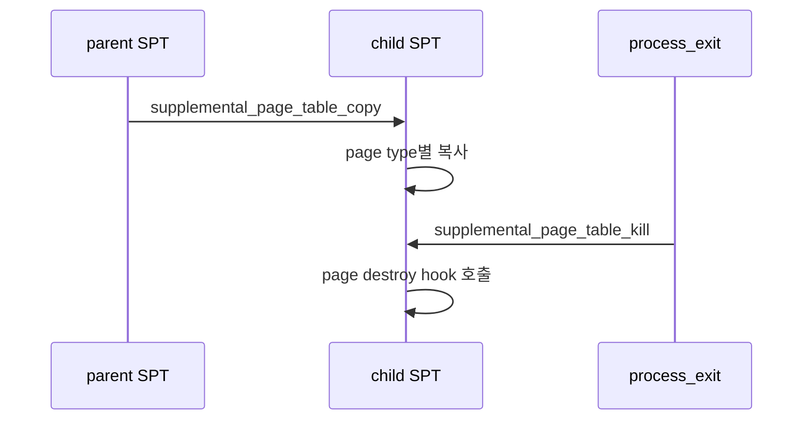

# 04 — 기능 3: SPT Copy and Destroy

## 1. 구현 목적 및 필요성

### 이 기능이 무엇인가
fork 시 부모 주소 공간의 SPT를 자식에게 복사하고, process exit 시 SPT의 모든 page를 정리하는 기능입니다.

### 왜 이걸 하는가
VM에서는 주소 공간 정보가 pml4뿐 아니라 SPT에도 들어 있습니다. fork/exit에서 SPT를 빼먹으면 page fault 복구와 자원 정리가 모두 깨집니다.

### 무엇을 연결하는가
`supplemental_page_table_copy()`, `supplemental_page_table_kill()`, page type별 initializer/destroy hook, `process_fork()`, `process_exit()`를 연결합니다.

### 완성의 의미
자식은 부모와 같은 유저 주소 공간을 관측하고, 종료 시 page/frame/swap/file 자원이 한 번씩만 정리됩니다.

## 2. 가능한 구현 방식 비교

- 방식 A: fork에서 모든 page를 즉시 claim/copy
  - 장점: 구현이 직관적
  - 단점: 메모리 사용량이 큼
- 방식 B: uninit/lazy 정보는 lazy 상태로 복사
  - 장점: lazy loading 의도를 유지
  - 단점: aux 복사 수명 관리가 어려움
- 선택: 기본 구현은 타입별로 명확히 복사하고, COW는 extra에서 분리한다.

## 3. 시퀀스와 단계별 흐름

1. fork에서 자식 SPT를 초기화한다.
2. 부모 SPT를 순회하며 page별 복사 정책을 적용한다.
3. exit에서 SPT를 순회하며 page type별 cleanup을 수행한다.

## 4. 기능별 가이드

### 4.1 SPT copy
- 위치: `vm/vm.c`, `userprog/process.c`
- uninit, anonymous, file page별 복사 전략을 구분합니다.

### 4.2 SPT destroy
- 위치: `vm/vm.c`
- hash destroy callback에서 page destroy를 호출합니다.

## 5. 구현 주석

### 5.1 `supplemental_page_table_copy()`

#### 5.1.1 부모 page 순회
- 위치: `vm/vm.c`
- 역할: 부모 SPT의 모든 page를 자식 SPT에 재구성한다.
- 규칙 1: writable, type, va 정보를 보존한다.
- 규칙 2: 이미 loaded된 page는 내용도 복사하거나 COW 정책을 적용한다.
- 금지 1: 부모 `struct page` 포인터를 자식 SPT에 그대로 넣지 않는다.

구현 체크 순서:
1. 자식 SPT init이 먼저 호출되는지 확인한다.
2. page type별 복사 helper를 나눈다.
3. 중간 실패 시 이미 복사한 page를 정리한다.

### 5.2 `supplemental_page_table_kill()`

#### 5.2.1 page destroy 순회
- 위치: `vm/vm.c`
- 역할: process 종료 시 SPT의 모든 page를 해제한다.
- 규칙 1: page type별 destroy hook을 호출한다.
- 규칙 2: frame mapping, swap slot, file mapping cleanup과 연결한다.
- 금지 1: hash element만 지우고 page 자원을 방치하지 않는다.

구현 체크 순서:
1. process exit에서 호출되는지 확인한다.
2. loaded page와 swapped page 모두 cleanup되는지 확인한다.
3. munmap과 중복 cleanup되지 않는지 확인한다.

## 6. 테스팅 방법

- fork 관련 VM 테스트
- process exit 후 mmap/swap 자원 누수 점검
- SPT destroy 중 page/frame double free 여부 확인
